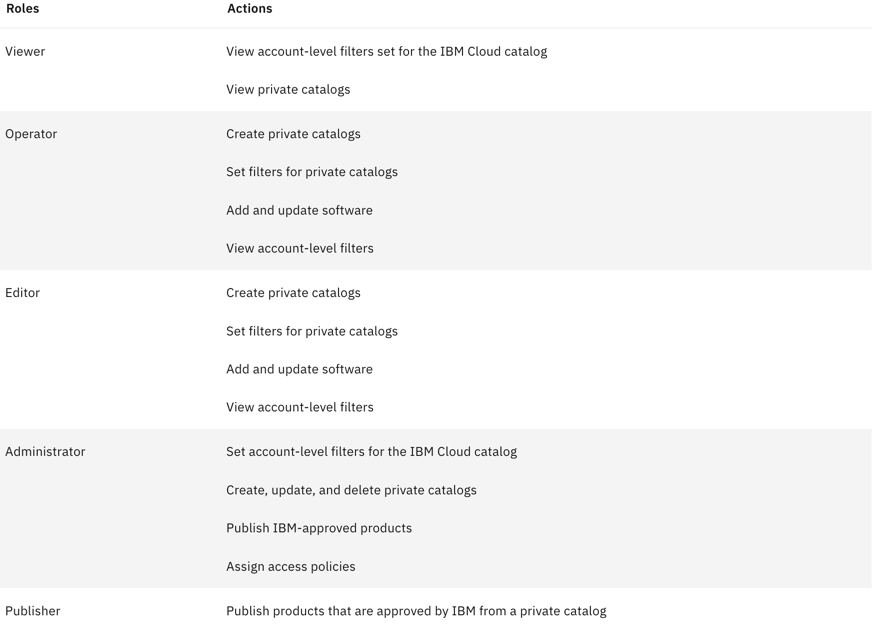
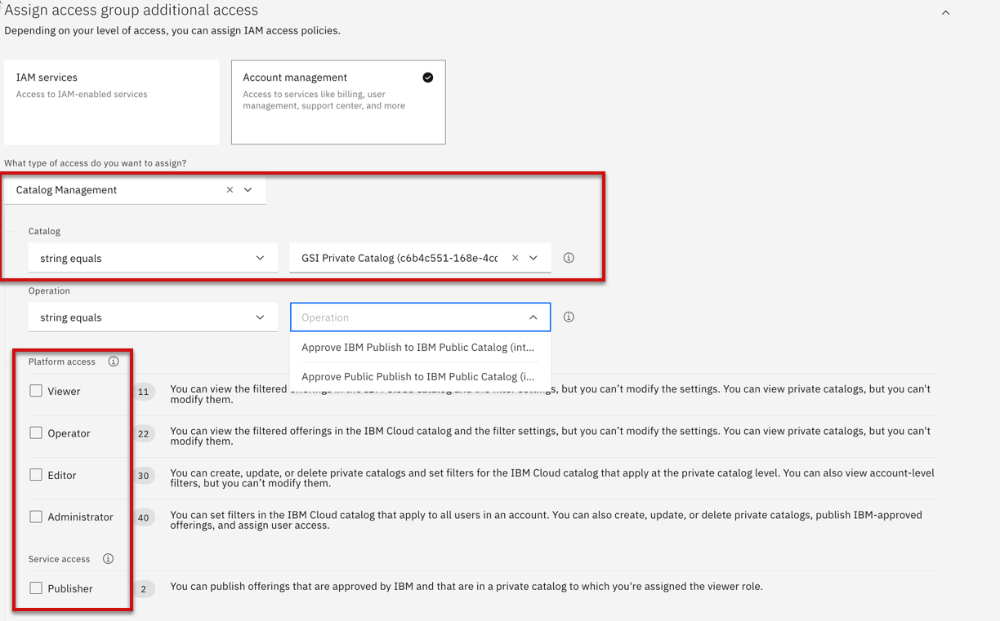
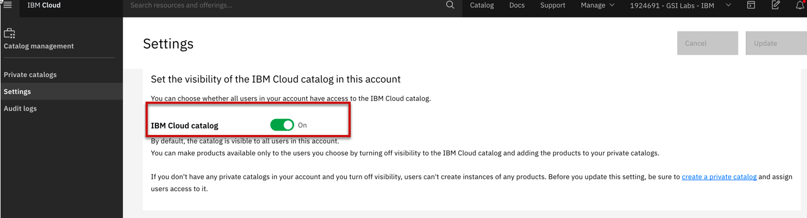

import Globals from 'gatsby-theme-carbon/src/templates/Globals';

<PageDescription>

</PageDescription>

## Authorizing access to private catalogs

To authorize users to work with the products in your private catalogs, assign them the viewer role on the catalog management service. 

**Catalog management**

You can give users access to view private catalogs and catalog filters, create private catalogs, add software to private catalogs, and set catalog filters. 

As the account owner, you assign users specific catalog management access depending on what tasks they are performing. To streamline the process of assigning access, you can use access groups to organize a set of users into a single entity. That way, you can assign a single policy to the group one time, and then add or remove users from the group as needed. 

**Catalog Visibility**

- Click Catalogs in the breadcrumb at the top of the page.
- Click Settings.
- Set IBM Cloud catalog to On.
- Confirm that your filters and settings are correctly applied by going to the public catalog, and expanding the catalog switcher. Only the private catalogs in your account should be displayed in the list.

