import Globals from 'gatsby-theme-carbon/src/templates/Globals';


The below IAM objects are recommented for any Sandboxes that are created in IBM Cloud.

```
    Resource Group
    Access Group
    Assign Users to Access Group
    Assign Access Policies to Access Group
```

This project provides the below private catalog tiles which would create the required IAM objects for the Sandboxes.

```
    Resource Group
    Access Group and Access Policies
    Assign Users to Access Group
```

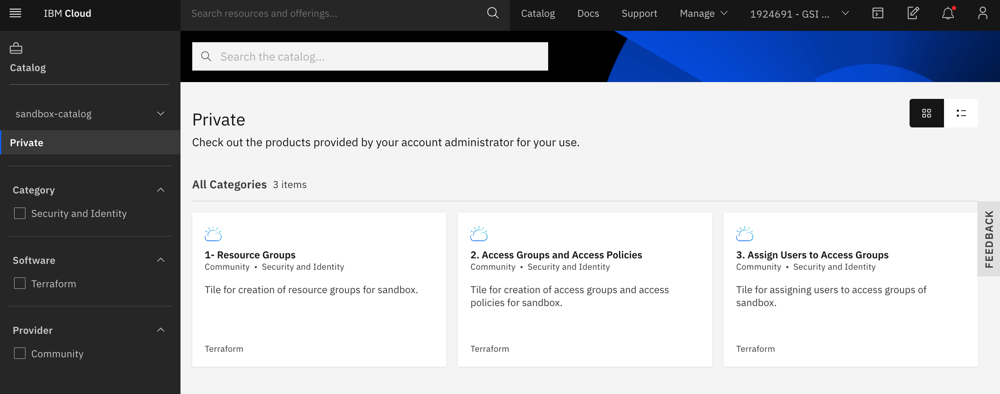

## 1. View Private Catalog Tiles. 

Here are the steps to view the Private Catalog tiles.

1. Click on `Catalog` in ibm cloud web console.

2. Choose the `Sandbox-Catalog` menu. 

3. It shows the 3 tiles that we created.

Note: To know how to create private catalog, you can refer https://github.ibm.com/gsi-labs/ibm-gsi-learning-private-catalog


## 2. Run Tiles

Here are the steps to run the tiles.

### 1. Run Tile - Resource Group

1. Click on `Resource Group` tile listed in the `Sandbox-Catalog` private catalog 

2. It shows the tile details page. Default values are displayed. You can modify the values. 

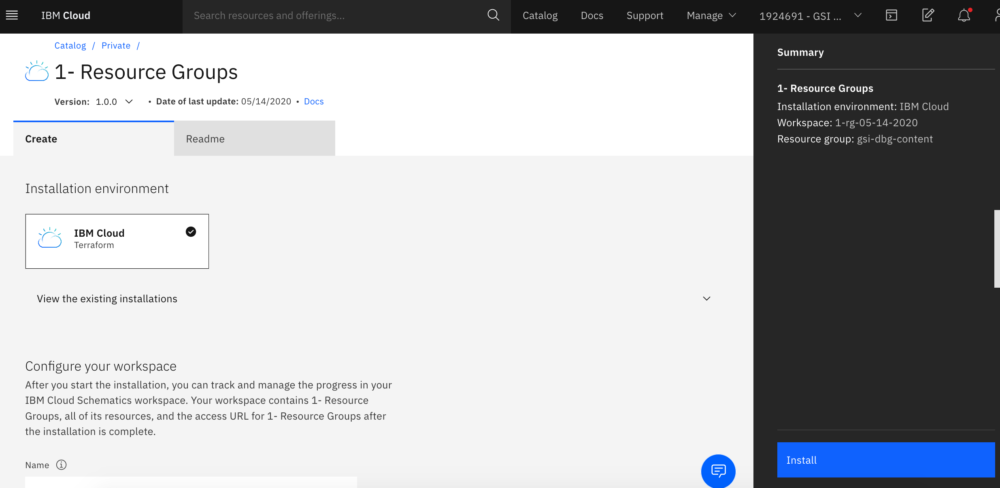

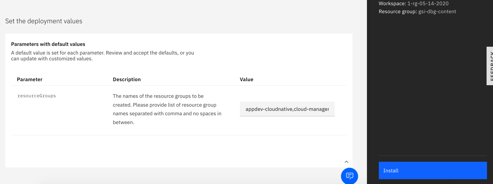


3. Click on `Install` link. 

It creates the resource groups.

### 2. Install your clusters.

Install the required clusters.

### 3. Run Tile - Access Group and Access Policies

1. Click on `Access Group and Access Policies` tile listed in the `Sandbox-Catalog` private catalog 

2. It shows the tile details page. Default values are displayed. You can modify the values. 

Make sure you give same Resource-Groups that you have entered in the previous step.

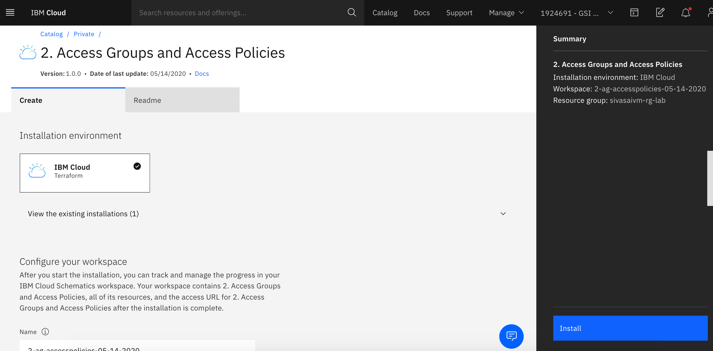

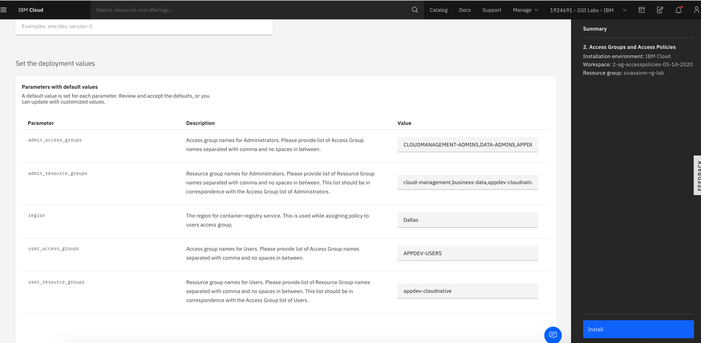

3. Click on `Install` link. 

It creates the access groups and assign access polcies.

### 4. Run Tile - Assign User to Access Group

1. Click on `Assign User to Access Group` tile listed in the `Sandbox-Catalog` private catalog 

2. It shows the tile details page. Default values are displayed. You can modify the values. 

Make sure you give same Access-Groups that you have entered in the previous step.

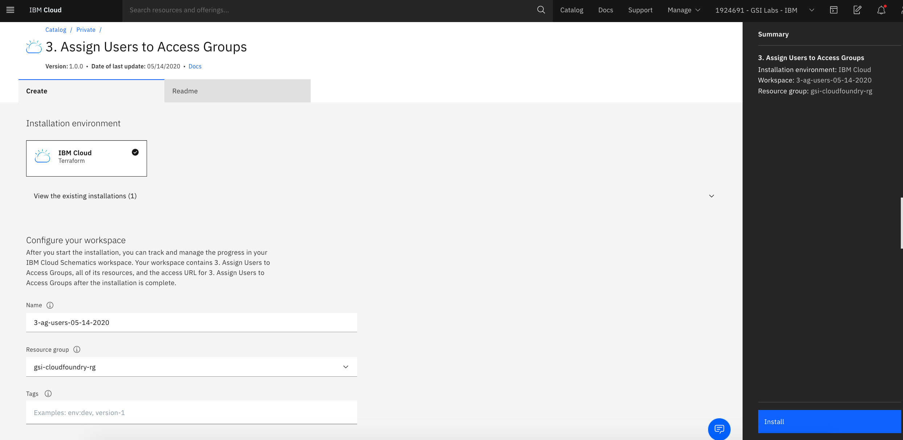

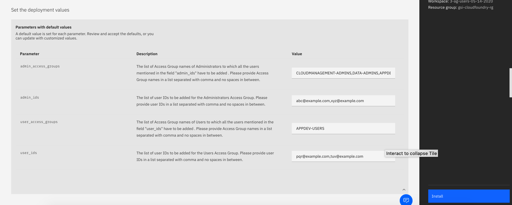

3. Click on `Install` link. 

It assigns users to the access groups.


# 3. IAM Objects

The below diagram describes the various objects created by these tiles.

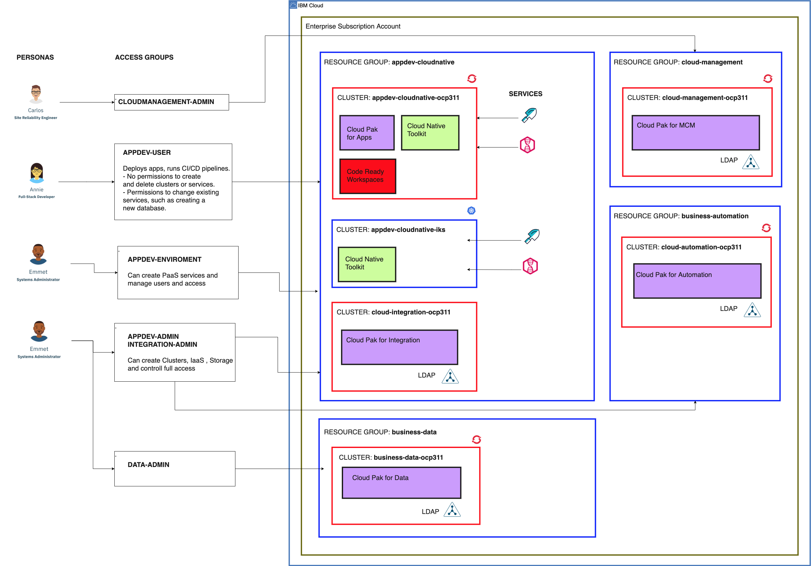


Here is the list of objects created by default.

### Resource Groups

The below resource groups are cretaed. 

```
    appdev-cloudnative
    cloud-management
    business-data
    business-automation
```

IBM Cloud IAM screen with the created resource groups

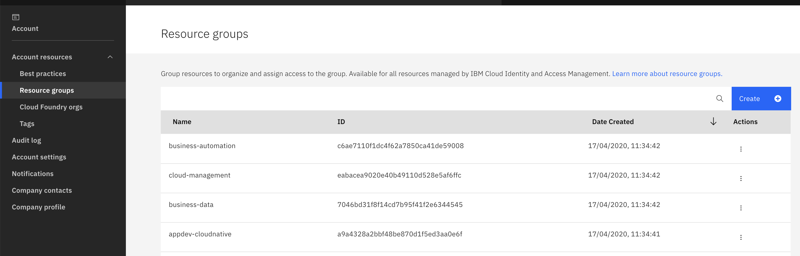

### Access Groups

The below access Groups are cretaed. 

```
    CLOUDMANAGEMENT-ADMINS
    APPDEV-ADMINS
    APPDEV-ENVIRONMENT-ADMINS
    APPDEV-USERS
    INTEGRATION-ADMINS
    DATA-ADMINS
    AUTOMATION-ADMINS
```

IBM Cloud IAM screen with the created access groups

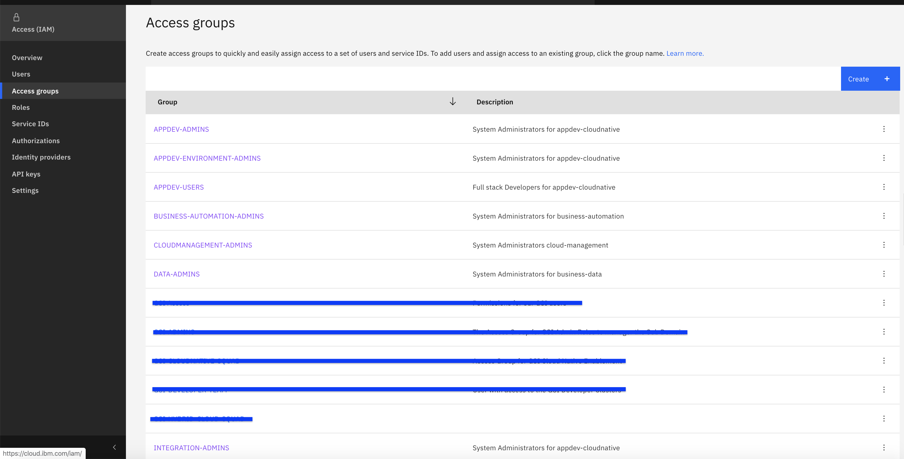

### Access Policies

The below access Policies are cretaed. 

For all ADMIN groups 

```
-   Resource Group  - 40
-   Resource Group  - 10
-   Kubernetes - 45
-   Container Registery - 64
```

For all USERS groups

```
-   Resource Group - 32
-   Resource Group - 10
-   Kubernetes - 73
-   Kubernetes - 73 with IKS instance
-   Kubernetes - 73 with OCP instance
-   Container Registery - 41
-   Cloudant - 94
-   COS - 197
-   SysDig - 37
-   LogDNA - 69
-   AppID - 259
```
IBM Cloud IAM screen with the created access Policies

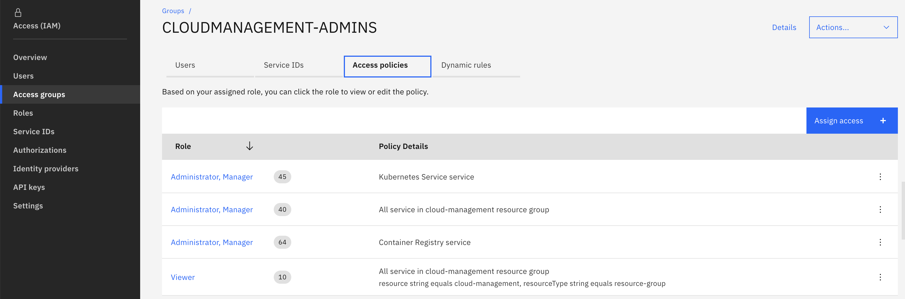

The figures above shows the default access policies added to the access group `CLOUDMANAGEMENT-ADMINS`.


The figures above shows the default access policies added to the access group `APPDEV-USERS`.

### Clusters

By default 5 clusters are installed, one for each cloud pak.
```
    Cloud Pak for Application
    Cloud Pak for Integration
    Cloud Pak for Multicloud Management
    Cloud Pak for Automation
    Cloud Pak for Data
```

</details>

# 4. References


