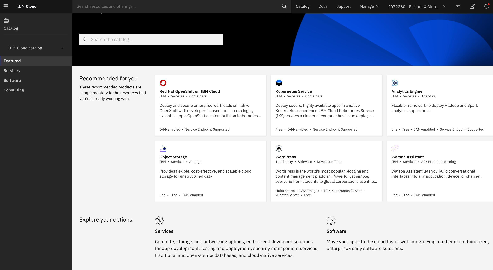

import Globals from 'gatsby-theme-carbon/src/templates/Globals';

<PageDescription>

</PageDescription>

## **Overview**

As the account owner or administrator, you can manage which products in the IBM Cloud catalog are available for your enterprise. You can choose to include all products, a set of products, or only certain products. You can also specify what level of the enterprise hierarchy the filters apply to. And, you can further restrict which products are available for a specific account group or account.

As the account owner or administrator, you can manage the settings for all catalogs across your account. Management tasks include setting the visibility of the IBM Cloud® catalog and controlling access to products in the public catalog and private catalogs for users in your account.

- You need the administrator role on the catalog management service to perform these tasks.

