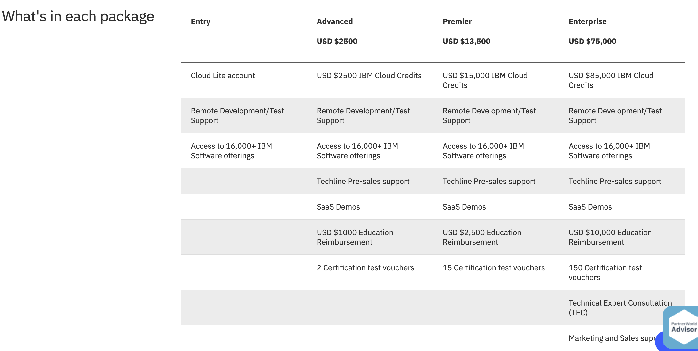

import Globals from 'gatsby-theme-carbon/src/templates/Globals';

<PageDescription>

</PageDescription>

## IBM Partner World Cloud Credits

IBM Cloud credits enable Business Partners to use, learn and build IBM Cloud infrastructure and platform skills and solutions. IBM Cloud IBM’s unified Cloud platform helps you take your ideas to production and solve real problems. IBM Cloud expands infrastructure, applications and services for enterprises to create value faster and is the leading cognitive platform with solutions and toolsets customized by industry. 

Build with access to more than 190 industry-leading Cloud services including Watson, Artificial Intelligence, Blockchain, advanced data analytics, and cyber security.

**Use IBM Cloud credits to:**

- Learn IBM Cloud technology
- Develop commercial solutions to sell to end customers
- Test your solutions
- Train your employees
- Create demonstrations

## IBM Cloud account information
An IBM Cloud PayGo account is required for PartnerWorld credits.  If you do not have an account, an account will be created for you and credits applied immediately.  A credit card will be required to cover any expenses beyond the available credits. 

An  IBM Cloud subscription account is only eligible for credits if the Enterprise Partner Package is acquired. 

## IBM Partner Packages

Multiple, tailored packages for the Cloud and Cognitive era. 

- Cloud Credit Booster Package: Regular: USD $5k for 10k credits | Enterprise: USD $150k for 165k credits (required Enterprise package)

- Certification Booster Pack: USD $1500 for 10 vouchers

- For NEW Business Partners: Sign up for PartnerWorld and receive USD $1200 Cloud Credits

Choose and purchase the package that is best for your needs

## Resources

- [IBM Cloud PartnerWorld Credits](https://www.ibm.com/partnerworld/program/benefits/cloud-credits)
- [IBM Cloud Partner Package](https://www.ibm.com/partnerworld/program/benefits/partner-package)
