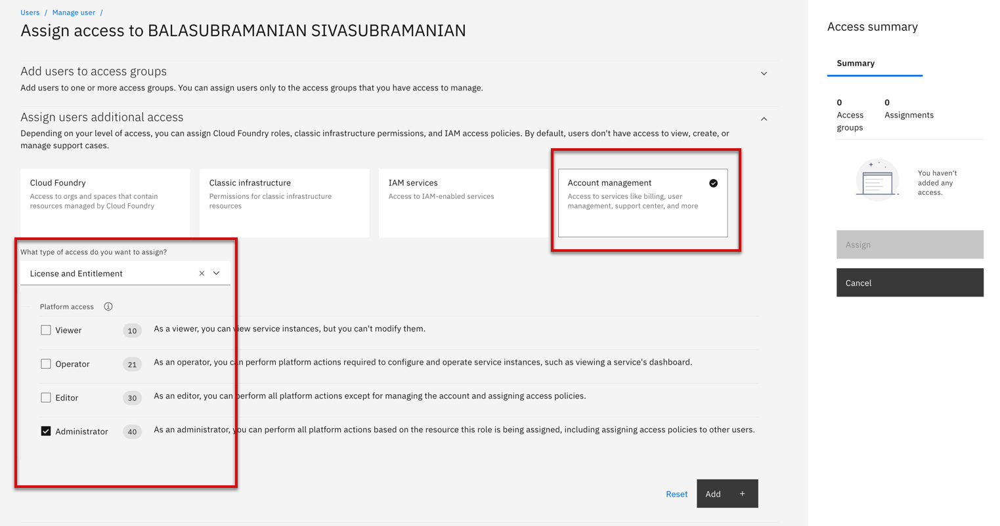
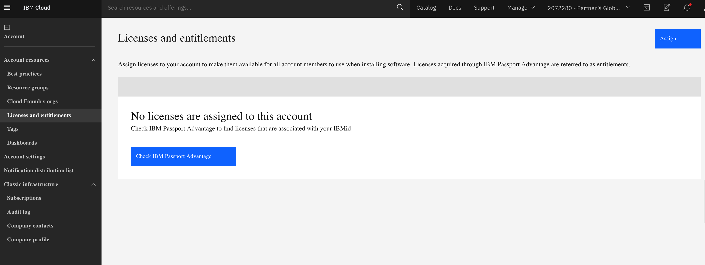
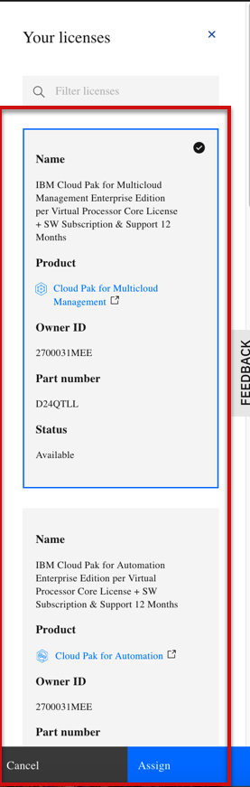

import Globals from 'gatsby-theme-carbon/src/templates/Globals';

<PageDescription>

</PageDescription>

## Passport Advantage  
To install software products in IBM Cloud, the license for the software must be assigned to your account. You're entitled to install a specific version of the software for a specific period of time, for example, one year. Licenses, which are also referred to as entitlements, are purchased and acquired through IBM® Passport Advantage.

**Acquiring a license**

In most cases, someone in a procurement or financial role in your organization works with an IBM Cloud sales representative to purchase the license through IBM Passport Advantage. A part number is associated with the license for the software product to be used in IBM Cloud. The person acquiring the license is not typically the same person who installs the software in the IBM Cloud account. After a sales representative acquires the license through the Software Quote Order tool, it must be assigned to each account that requires entitlement for use of the software in IBM Cloud.

**Assigning licenses to an account**

When you assign licenses to your account, all users with access to your account can use them to install the software to which the licenses apply. If the procurement focal is not the owner of the account to which the license must be assigned, they must be assigned the administrator role on the License and entitlement account management service.

Complete the following steps to assign a license to an account:

- Log in to the console and go to Manage > Account.
- Click Licenses.

- If you don't have any licenses assigned to the account, click Check IBM Passport Advantage to find all the licenses that are tied to your IBMid. If you have existing licenses, click Assign to assign more licenses to the account.

