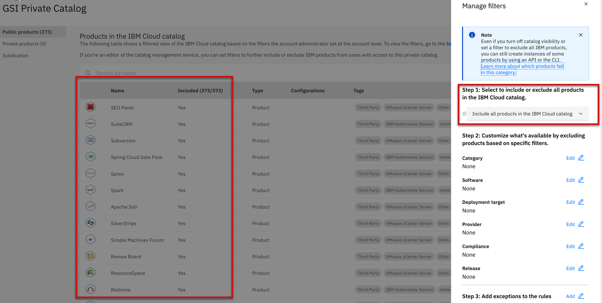
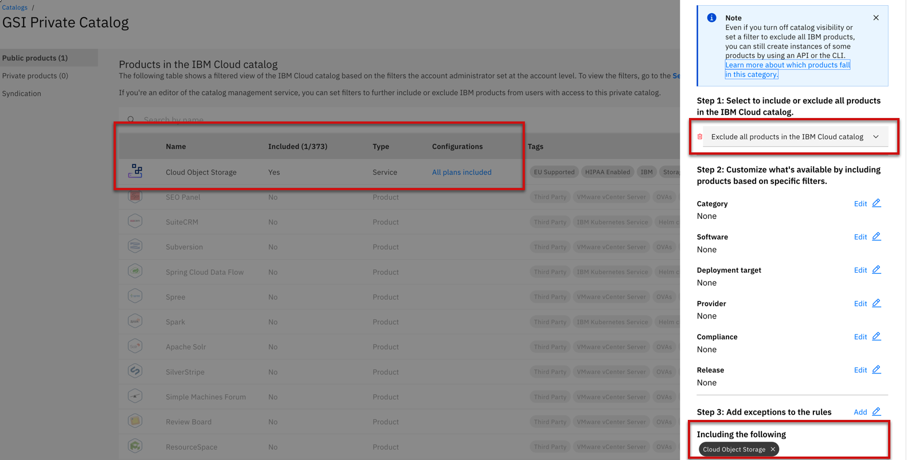
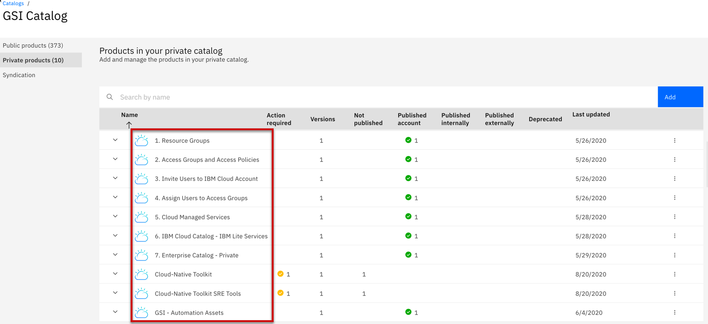

import Globals from 'gatsby-theme-carbon/src/templates/Globals';

<PageDescription>

</PageDescription>

## **Private Catalog**

Private catalogs provide a way to centrally manage access to products in the IBM Cloud catalog and your own catalogs. You can customize your private catalogs to make specific solutions available to users in your account. By doing so, you can ensure that your catalogs are relevant to your business. 

**Creating a private catalog with all products included**

Complete the following steps to create a catalog that includes all products in the IBM Cloud catalog:

- In the console, go to Manage > Catalogs, and click Create a catalog.
- Enter a name, make sure the Start with all available products in this account option is selected, and click Create. The availability is based on the filters set at the account level on the Settings page.
- Confirm that the catalog includes all products by clicking the catalog name > Manage filters. Then, check that Include all products in the IBM Cloud catalog is selected in Step 1: Select to include or exclude all products in the IBM Cloud catalog.

**Creating a private catalog with 1 product included**

- Go to Manage > Catalogs, and click Create a catalog.
- Enter a name, and click Create.
- Click the catalog name > Manage filters.
- Select Exclude all products in the IBM Cloud catalog in Step 1: Select to include or exclude all products in the IBM Cloud catalog.
- Skip step 2, and click Add in Step 3: Add exceptions to the rules.
- Make sure Include is selected as the condition, and then individually select the products you want users to access. In the case of our example project, you select Cloud Object Storage.

**Adding your software to a private catalog**

Refer the above steps for creating a private catalog. Once the private catalog is created, add your own software to that. The software is available to all users with access to the private catalog.

- Select GSI catalog from the list of private catalogs.
- Click Add product.
- Enter the repository URL or TGZ archive location for your software version, and click Add product. 
- Click the Edit icon Edit icon, update the name to 1.Resource Groups, and set at least one category, for example, Developer Tools. This category can be used by users later to filter for the software.
- Click Update to apply your changes.
- Scroll to the Configure deployment details section, and click Add deployment values.
- Select replicaCount, and click Add deployment values.
- In the Deployment values section, click the replicaCount parameter.
- Update the default value from 1 to 2, and click Update.
- Click Update.
- Click the Validate product tab.
- In the Configure the validation target section, select your cluster from the Cluster list, and enter  as the namespace.
- Click Validate to ensure that your software can be installed successfully. This step is required before you can make it available for users in your account. This action can take several minutes. In the Validation summary section, the status is displayed as Validated when the deployment is complete.
- Make sure the deployment is successful by checking the Schematics workspace 
- Return to the Validate product tab, click the Actions icon Actions icon, and select Publish to account to make your software available to all users in your account through your private catalog.

