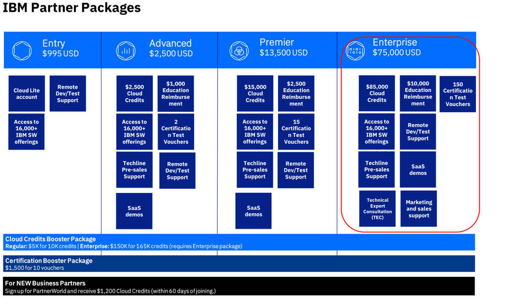
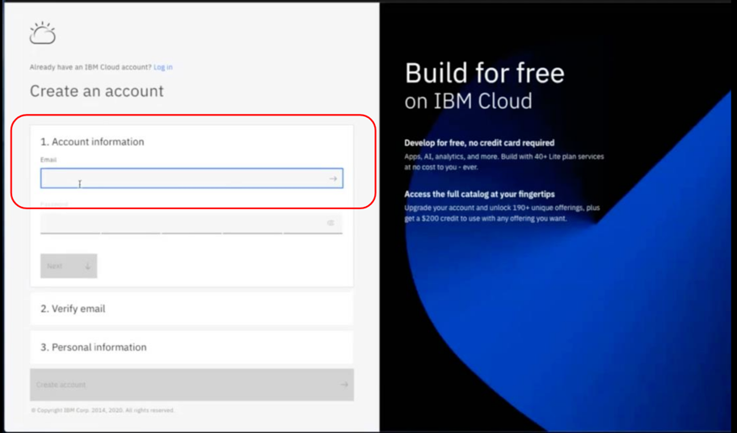
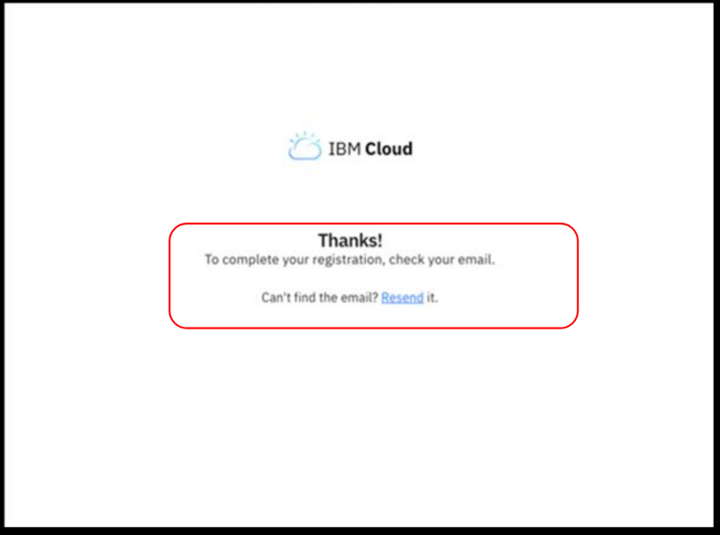

import Globals from 'gatsby-theme-carbon/src/templates/Globals';

<PageDescription>

How to setup an Enterprise Accounts ready for Subscription Credits

</PageDescription>

## Introduction

IBM Cloud has three different account types: Lite, Pay-As-You-Go, and Subscription. You get a free Lite account as soon as you sign up. Pay-As-You-Go and Subscription are billable account options and each offer different features.
Your IBM Cloud account includes many interacting components and systems for resource, user, and access management. Concepts like how certain components are connected or how access works help you in understanding how to set up your account.
  
  - IBM Partner Packages-Create 
  - IBM Cloud new Account
  - Partner World 
       Enable Enterprise Subscription Accounts
       Loading initial Cloud Credits

## IBM Partner Packages

## Account Creation Process

Create an IBM Cloud account-Use Functional ID to  create the account which can operated by anyone in your organization
  
  -Make sure the email id which you enter can be accessed immediately as you will receive the code & need to confirm registration successfully

Cloud Account Creation Successful. Check  the functional id email address to complete the registration as confirmation for IBM cloud account creation

Your email will contain the 7-digit verification code which you need to enter on the IBM Cloud registration page where you requested the code. The code is valid only for 30 min

## Resources

- [Create Enterprises Account](https://cloud.ibm.com/docs/account?topic=account-create-enterprise)
- [Tutorials](https://cloud.ibm.com/docs/account?topic=account-enterprise-tutorial)