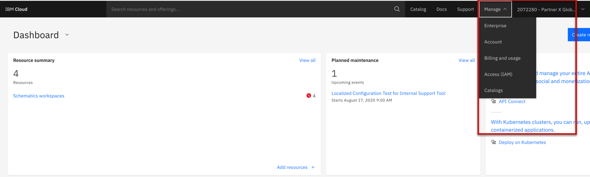
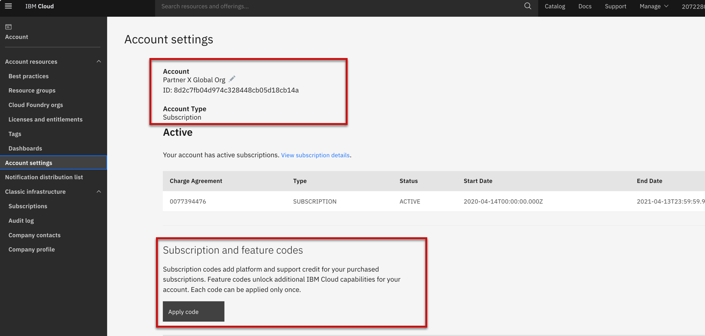
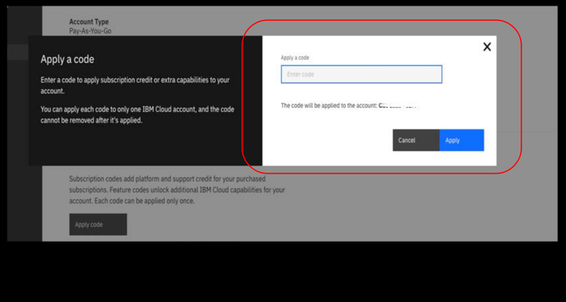
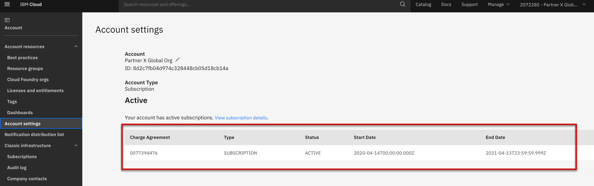

import Globals from 'gatsby-theme-carbon/src/templates/Globals';

<PageDescription>

</PageDescription>

## Introduction

If you have a Lite account, you can apply feature codes to take advantage of extra IBM Cloud® resources or capabilities. Feature codes are typically provided for online courses and certain events, such as educational sessions or conference workshops.

## Feature Code 

Login to the IBM Cloud which you have used to register the account creation earlier. Click continue

After you login successfully with your cloud id and password, you can navigate the dashboard manage section which has several sub-categories
 -Enterprise
 -Account
 -Billing and usage
 -Access (IAM)
 -Catalogs

Apply Partner World  Subscription credit code which you received via email. Subscription credit code will be reflecting the amount of 75K

Copy and paste the Subscription code which you received in the email that was used during the cloud account creation process

After applying the code successfully, you can verify the account details like Subscription status, start date & end date 
 -Account ID
 -Account Type
 -Account Status 
 -Account Code

## Resources
- [Apply Feature Code](https://cloud.ibm.com/docs/billing-usage?topic=account-codes)
