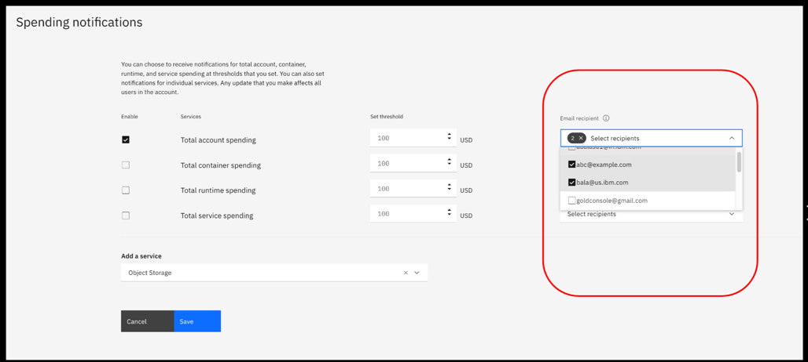
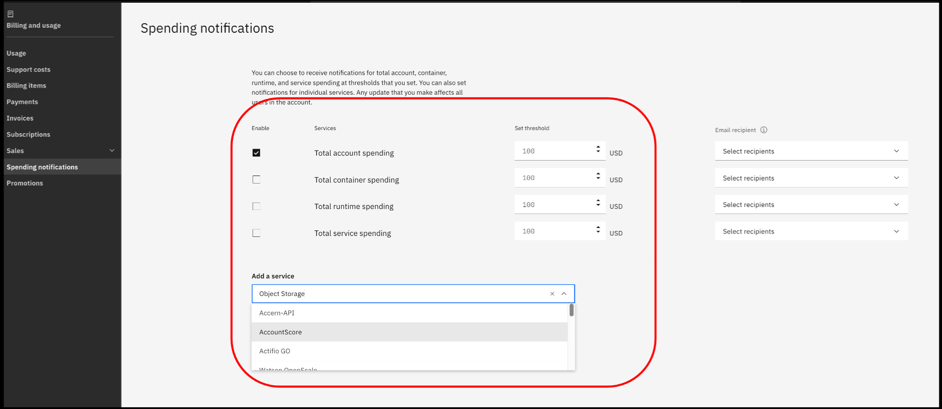

import Globals from 'gatsby-theme-carbon/src/templates/Globals';

<PageDescription>

If you have an IBM Cloud Pay-As-You-Go or Subscription account, you can set up email spending notifications. Now, in addition to account owners, any user on the account with the editor role or higher on the billing service can set spending notifications.

</PageDescription>

## Spending Notifications

-Threshold

-Notifications

-Be sure to add your lab leader cloud id to the new GSI Enterprise account with administrator access so they can help you monitor and manage usage

## Spending Notifications - email
- If you're interested, you can use the latest enhancement to select up to 10 users from your account to receive notifications
- You can select the Email receipt who are all should be notified
- Any update that you make affects all users in the account

## Spending Threshold

 - You can choose to receive notifications for total account, container, runtime, and service spending at thresholds that you set. 
 - You receive notifications when you reach 80%, 90%, and 100% of the spending thresholds that you specify. As your needs change, you can edit the spending threshold. 
 - Any update that you make affects all users in the account.

## Resources
