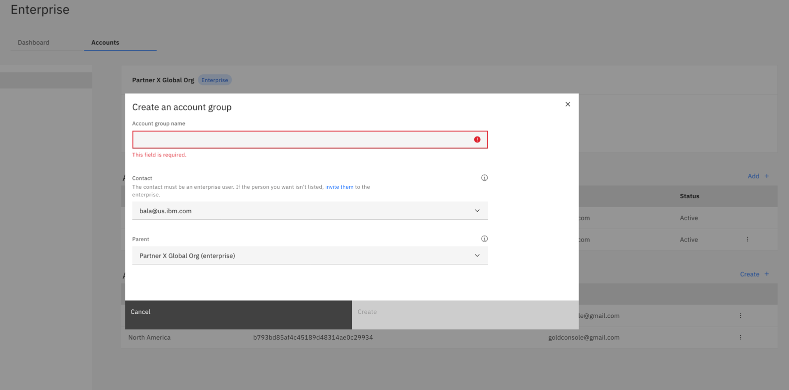

import Globals from 'gatsby-theme-carbon/src/templates/Globals';

<PageDescription>

</PageDescription>

## Introduction

Use account groups to organize related accounts in your IBM Cloud® enterprise. You can create a multitiered enterprise hierarchy by nesting account groups within an account group. If you need to, you can reorganize by moving accounts between account groups.

For example, the following diagram depicts a four-tier enterprise that you can set up by nesting account groups. First, you create two account groups that have the enterprise as the parent. Then, you can create two additional account groups that have one of those account groups as a parent. You can move accounts freely within the account groups, no matter what tier they're in. However, account groups cannot be moved.

## Creating Sub-account (Account Groups)

To create an account group, you need the Administrator or Editor role on the Enterprise service in the enterprise account.

 - From the Enterprise dashboard in the IBM Cloud console, click Accounts to view the accounts and account groups in the enterprise.

In the Account groups section, click Create.

 - Enter a name for the account group that reflects the accounts that it will contain.

 - If you want an enterprise user other than yourself to be the primary contact for the account group, select their IBMid from the Contact menu. 

 - The contact is different from an account owner in that they don't have any additional access within the account group or its accounts. The user that you select as a contact acts as a focal point for any account group issues. 
 - If you want the account group to be in a different part of your enterprise hierarchy, select a different parent.

 - Account groups can't be deleted or moved from where you create them.
        
 - Click Create.

## Resources
 - [Accounts in Enterprise Account](https://cloud.ibm.com/docs/account?topic=account-enterprise-organize)