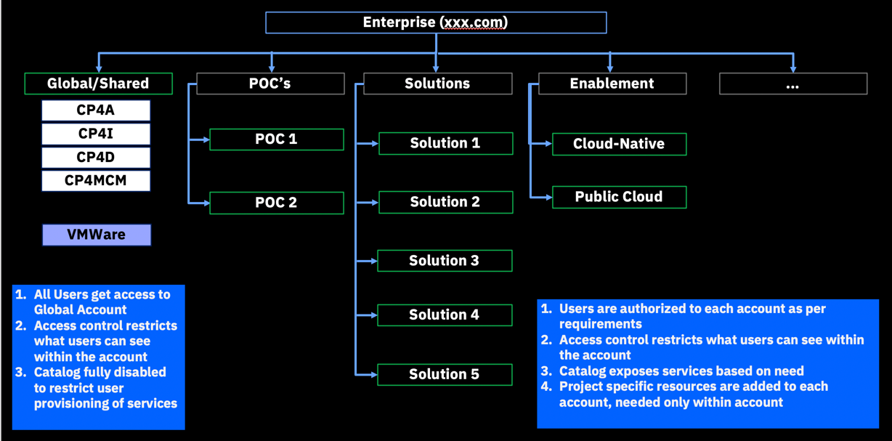

import Globals from 'gatsby-theme-carbon/src/templates/Globals';

<PageDescription>

</PageDescription>

## Introduction

Use account groups to organize related accounts in your IBM Cloud® enterprise. You can create a multitiered enterprise hierarchy by nesting account groups within an account group. If you need to, you can reorganize by moving accounts between account groups.

For example, the following diagram depicts a four-tier enterprise that you can set up by nesting account groups. First, you create two account groups that have the enterprise as the parent. Then, you can create two additional account groups that have one of those account groups as a parent. You can move accounts freely within the account groups, no matter what tier they're in. However, account groups cannot be moved.

## Resources
 - [Accounts in Enterprise Account](https://cloud.ibm.com/docs/account?topic=account-enterprise-organize)