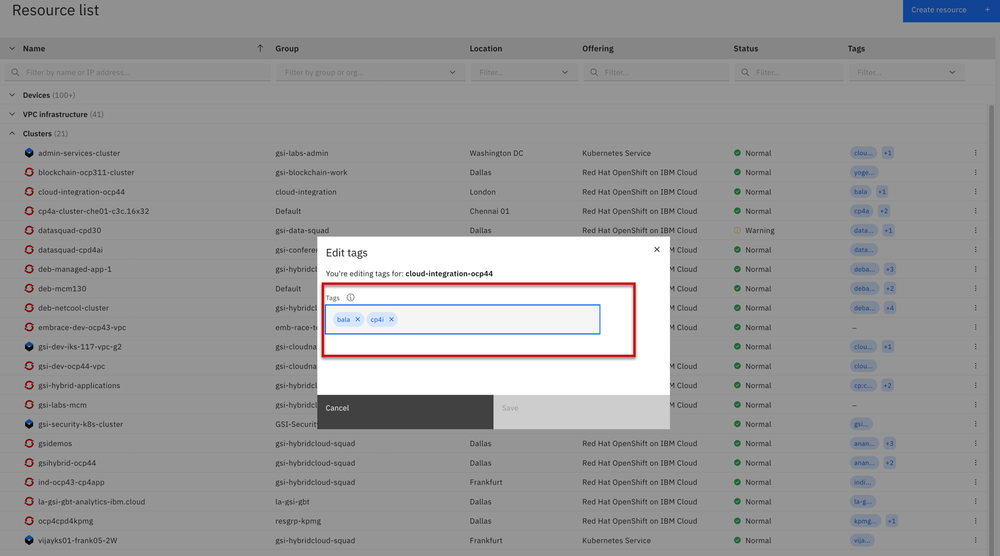
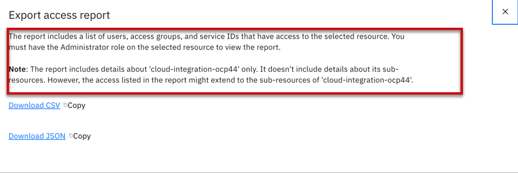

import Globals from 'gatsby-theme-carbon/src/templates/Globals';

<PageDescription>

</PageDescription>

## Introduction

Tagging can help with managing where instance-level charges are coming from for your specific resources. When you use a consistent tagging schema to identity which resources are tied to specific cost centers, data centers, projects, teams etc., you can group and filter by those tags when breaking down and analyzing costs within the usage data export.

For example, one of your projects might have a Kubernetes cluster, a couple Cloud Foundry app deployments, Cloud Object Storage buckets, Watson Assistant APIs, and Cloudant databases running around the world. Since those services can be spread across different resource groups and Cloud Foundry orgs and spaces with different access controls, using tags consistently will help you make sure the right costs are getting charged back to the right project.

  - A resource is anything that you can create from the catalog that is managed by and contained within aresource group. Some examples include apps, service instances, container clusters, storage volumes, and virtual servers. When you add a resource to your account from the catalog, you can assign the resource to a resource group.

  - A resource group is a feature that you use to organize your accountresourcesfor access control and billing purposes. If you're familiar with using Cloud Foundry spaces, think of organizing resources in resource groups similarly to the way you organized resources in spaces. 

  - A resource is anything that can be created, managed, and contained within a resource group. Users aren't added to resource groups. Only resources can be added.

Access to resources is managed by using IBM Cloud Identity and Access Management (IAM) access control. The services that support the use of IAM roles for access and organization within a resource group are referred to as IAM-enabled services.

  - TAG Resources
  - Working with Tag Resources
  - Granting Tag Resources to User

**Adding and removing tags on a resource**

**Export Tags**

Export tags within your usage data to help with cost allocation.  When users add tags to their resources within the platform, whether that’s through the Resource List, Resource Detail Pages, or Provisioning Pages, tags now appear in the usage CSV export on the usage tab.

## Resources

 - [Working with Tags](https://cloud.ibm.com/docs/resources?topic=resources-tag)
