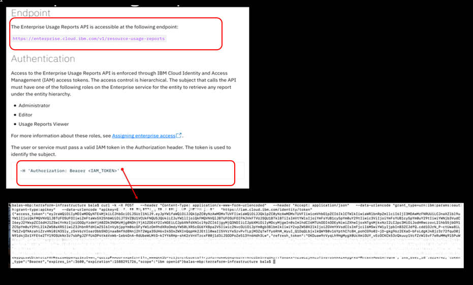
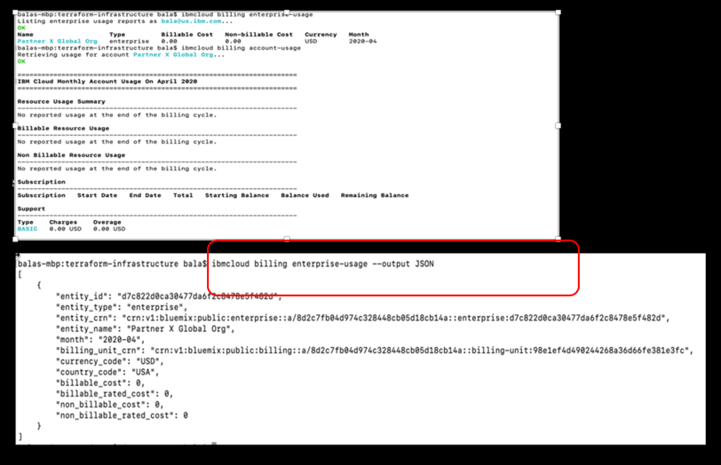

import Globals from 'gatsby-theme-carbon/src/templates/Globals';

<PageDescription>

Usage Reporting 
</PageDescription>

## Introduction

You can track resource and support costs from accounts in your IBM Cloud® enterprise by viewing their usage. The accounts and account groups that you can view usage for depends on your assigned access.

IBM Cloud enterprises enable you to centrally manage multiple IBM Cloud accounts. As an enterprise user, you can keep an eye on resource usage and the associated costs for any account in the enterprise.

## Retrieve Billing Usage 

### Retrieve Enterprise usage by API

The Enterprise Usage Reports API (Beta) provides access to the usage reports for entities that are managed by an IBM Cloud™ enterprise. Usage reports are provided for three types of entities: 
  - An enterprise, an account group, and an account. 
  - You can query for usage reports for an entity or its immediate children in the enterprise hierarchy. 

### Retrieve Enterprise usage by CLI

  - IBM Cloud CLI provides the command line interface for managing resources in IBM Cloud. When you install the standalone IBM Cloud CLI, you get only the CLI itself without any recommended plug-ins or tools.
  - You can get a report of usage for the enterprise, an account group, or a specific account.

## Resources
- [Enterprise Account Usage](https://cloud.ibm.com/docs/billing-usage?topic=billing-usage-enterprise-usage)