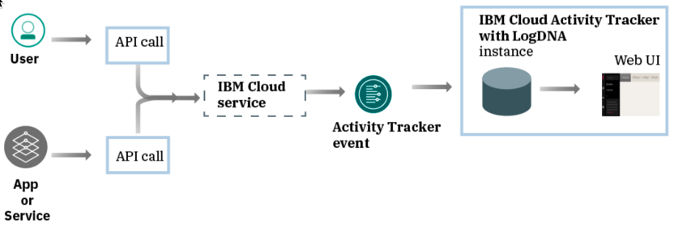
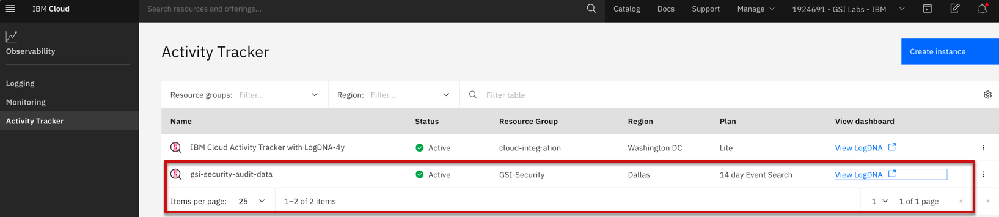
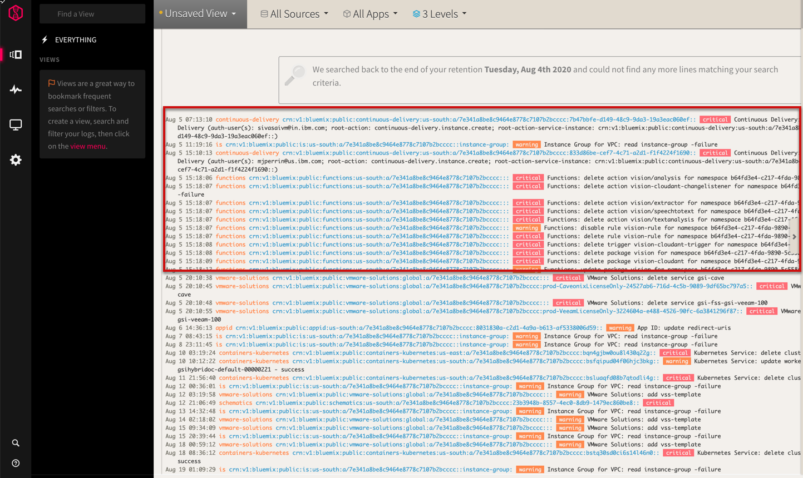

import Globals from 'gatsby-theme-carbon/src/templates/Globals';

<PageDescription>

</PageDescription>

## **Introduction**

You can use the IBM Cloud Activity Tracker with LogDNA service to track how users and applications interact with an IBM Cloud® account, the IBM Cloud catalog, private catalogs, and with IBM Cloud Identity and Access Management (IAM).

As a security officer, auditor, or manager, you can use the IBM Cloud Activity Tracker with LogDNA service to track how users and applications interact with the IBM Cloud Identity and Access Management (IAM) service in IBM Cloud.

IAM enables you to securely authenticate users for both platform services and control access to resources consistently across IBM Cloud. Learn more.

The IBM Cloud Activity Tracker with LogDNA service records user-initiated activities that change the state of a service in IBM Cloud. To get started monitoring your user's actions, see IBM Cloud Activity Tracker with LogDNA. An initiator can be a user, a service, or an application.

You can track following events with the help of IBM Cloud Activity Tracker

- Account management events
- IAM events
- Catalog management events

## **Launch the LogDNA web UI**

- Log in to your IBM Cloud account.

- After you log in with your user ID and password, the IBM Cloud dashboard opens.

- In the navigation menu, select Observability.

- Select Activity Tracker.

- The list of instances that are available on IBM Cloud is displayed.

- Select the instance that is located in city where you provisioned. Then, click View LogDNA.

- Global events, like provisioning a service, are available through the global domain instance.

## **Resources**

- [Account Management Events](https://cloud.ibm.com/docs/Activity-Tracker-with-LogDNA?topic=Activity-Tracker-with-LogDNA-at_events_acc_mgt)
- [Auditing Events](https://cloud.ibm.com/docs/account?topic=account-acct_iam_tracking)

