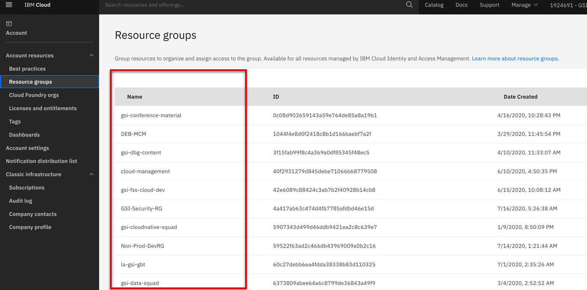
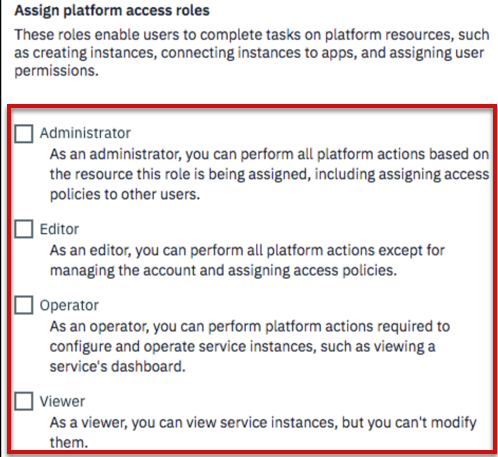
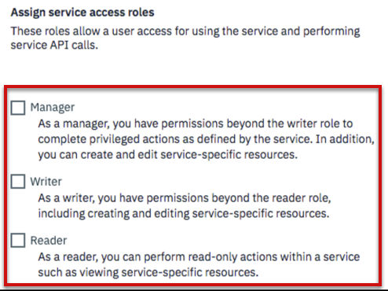
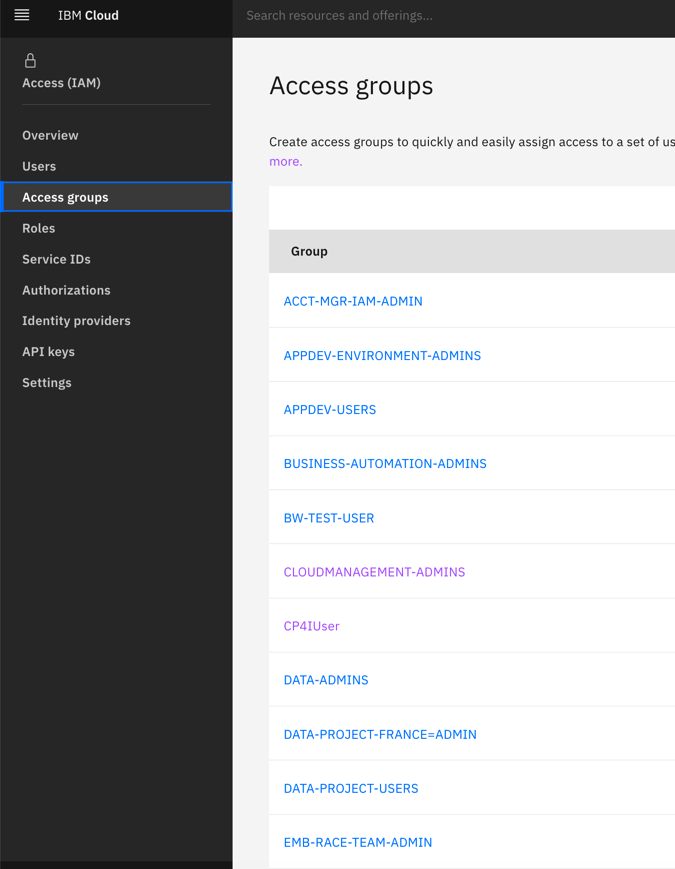
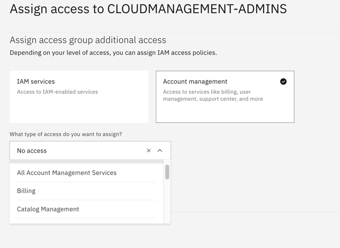

import Globals from 'gatsby-theme-carbon/src/templates/Globals';

<PageDescription>

</PageDescription>

## **Introduction**

After you set up your IBM Cloud account, you're ready to start planning how you want to organize resources and assign access to identities in your account. These best practices provide you with the basic building blocks to enable successful and secure app development in IBM Cloud. 

## **Resource groups**

Resource groups offer a way for you to organize IAM-enabled resources that are governed by IBM Cloud Identity and Access Management (IAM). You can group resources and assign access to individual service instances or entire resource groups that use IAM.

The IBM Cloud account owner can add resources to any resource group, but other users must be granted access by using an IAM access policy. There are two minimum platform management roles that users must be assigned to add resources to a resource group: viewer role or higher on the resource group and editor role or higher on the resource or service.

When you assign resources to a resource group, they can't be later moved to another resource group. Be sure to plan how you want to organize resources in your account before you assign them to a resource group.

## **Platform Roles**
Govern user’s ability to do actions at the IBM Cloud Platform level

**Why**
Customers need the ability to set platform access, but withhold service actions.

**Example**
Creating, viewing, or delete instances of a service, but not developing in the service

**4 Platform Roles**
Administrator, Editor, Operator, Viewer

## **Service Roles**
Govern user’s ability to do actions at a service level (consume/use a service)

**Example**
Developer access for service-specific actions like using a service’s UIs, CLIs, and APIs

**3 Service Roles**
Manager, Writer, Reader

## **Access Groups**
Grouping of user and service IDs to which the same IAM access can be granted.

**Why Access Groups?**
You can assign a single policy to multiple users or service IDs instead of assigning the same access multiple times per individual user or service ID.

**What is it not?**
An access group is not necessarily an Azure team or AWS role. (Predefined Access Groups in roadmap)

## **Account Management Services**

**Manage platform level access and resources**

Many of the platform level roles can be granted using an Account Management Service
- Easier way to provide platform access
- Ex: Billing Role, User Access Role, Support Focal

## **Resources**
- [Best practices for organizing resources and assigning access](https://cloud.ibm.com/docs/account?topic=account-account_setup)
