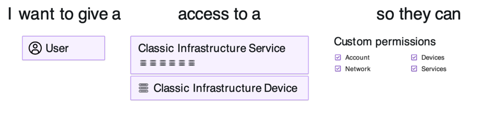
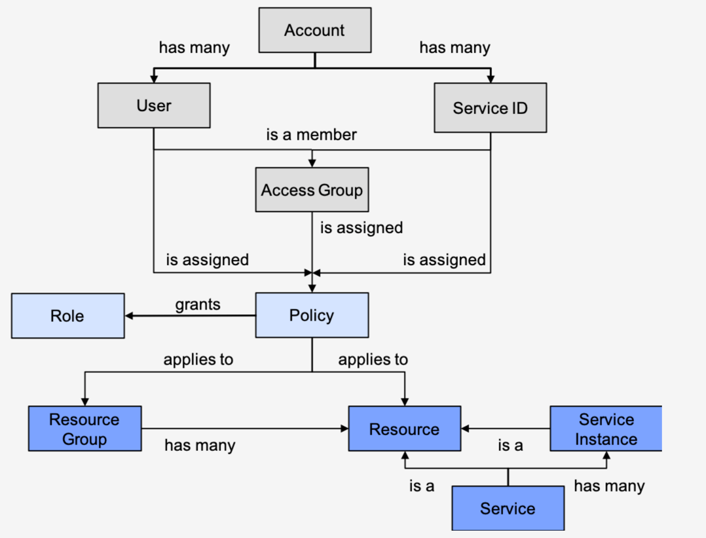
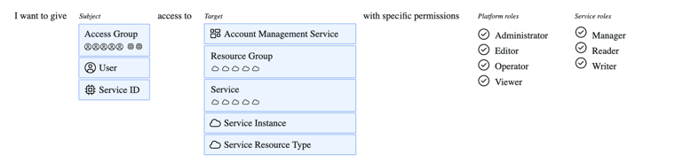
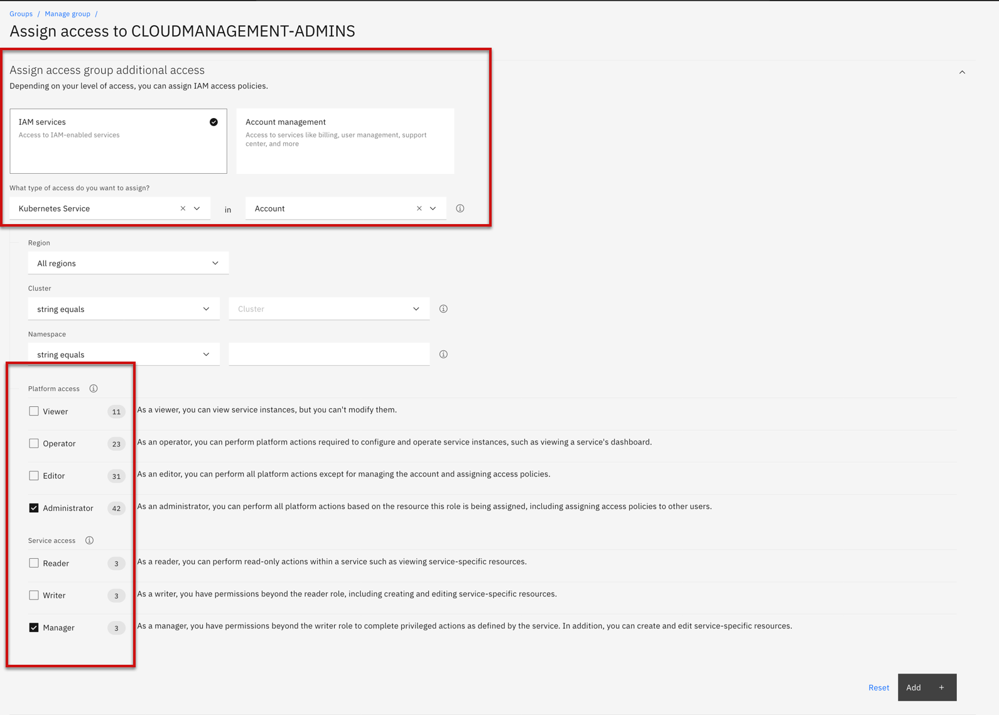
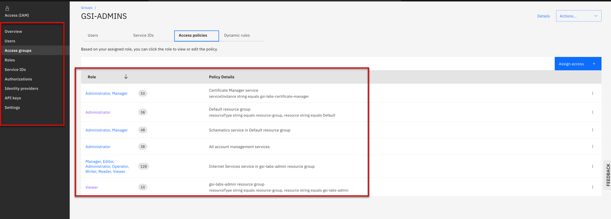

import Globals from 'gatsby-theme-carbon/src/templates/Globals';

<PageDescription>

</PageDescription>

## Introduction

An access group can be created to organize a set of users and service IDs into a single entity that makes it easy for you to assign access. You can assign a single policy to the group instead of assigning the same access multiple times per individual user or service ID.

## Classic Infrastructure Permissions
Classic infrastructure resources have its own policy model and do not support access groups. Specifically, classic infrastructure permissions are assigned per user. However, a set of classic infrastructure permissions for viewing and managing billing information and working with support
cases are now migrated to access groups. As a result, this set of classic infrastructure permissions can be managed by using IAM access control policies. See section below for more information on IAM access control policies.
The permission sets for classic infrastructure are:
- No access
- View only
- Basic user
- Super user

An account owner has full access to classic infrastructure services and devices. The following diagram shows how classic infrastructure permissions are assigned per user.

## Managing User Access
IBM Cloud IAM consists of a few interrelated components including users, resources, policies, roles, actions, and the Cloud IAM control system. The IAM control system allows users to take actions on resources within an account. The following diagram depicts how IBM Cloud IAM works in an IBM Cloud account. For more information about the diagram, please refer to IBM Cloud Identity and Access Management documentation.

IBM Cloud IAM refers to users and access groups as Subjects. Resources can include machines, services, as well as subjects. The access control policies define what type of operations subjects are allowed to perform on specific resources.

## Access Roles
Rights and permissions granted to subjects to complete specific tasks on a resource can be grouped by roles, making it easier for IBM Cloud account owners to control permissions (finegrained access control) based on roles.

## IBM Cloud Platform Management Role
IBM Cloud platform management role defines the actions that can be performed on the platform resources such as the ability to create and delete resource instances, bind instances to applications, and assigning user access to resources.

The platform management roles are:
- Viewer
- Editor
- Operator
- Administrator

The following diagram outlines the options for creating an IAM policy.

## IBM Cloud Service Access Role
Service access roles define a user or service’s ability to perform actions on a service instance such as calling a service’s APIs and accessing the UI for the service.

## Access Group

Create one or more access groups to streamline the process of assigning users’ access to resources. This allows the administrator to assign a minimal number of polices to resources, resource group, and account management services by give the same access to all users that belong the to the same access groups. To ensure that users are limited to only the actions they can perform, assign only the access that is required.

The following diagram outlines the options for creating an IAM policy "Kubernetes" administrator to "CloudManagement-Admin" Access group along with the platform and service access.

After you assign policy to the access group, the following diagram outlines list of access assigned to the access group.

## Resources

- [Setting up access groups](https://cloud.ibm.com/docs/account?topic=account-groups)
- [Manage access to groups](https://cloud.ibm.com/docs/account?topic=account-assign-access-resources)
