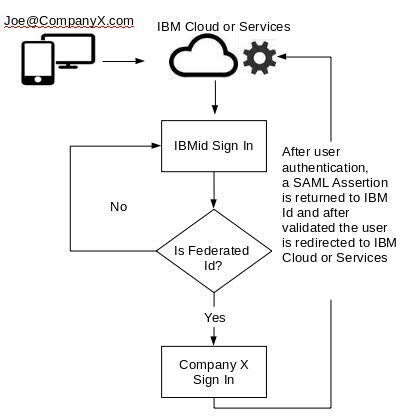
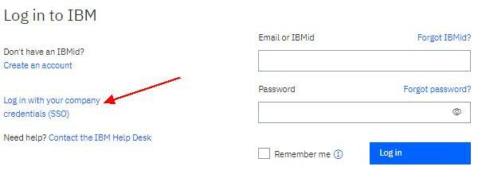
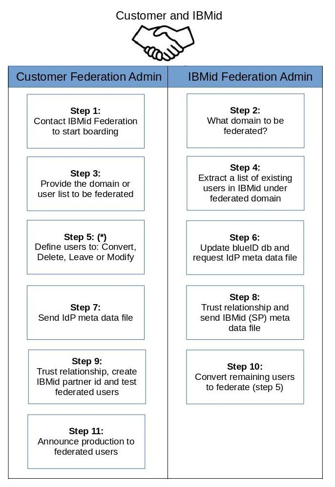

import Globals from 'gatsby-theme-carbon/src/templates/Globals';

<PageDescription>

</PageDescription>

## Introduction

As a federated user that uses a corporate or enterprise single sign-on ID, you can log in to IBM Cloud® from the command-line interface (CLI) by using either a one-time passcode or an API key.
 
IBMid has added support for IBM customers and partners to incorporate IBMid authentication to their organizations identity provider.  This allows the organizations identity provider to handle all the users leveraging IBM web applications and cloud services.  As a result, Company X can use their own login page and security controls to secure  access to IBM Cloud Apps or IBM Services.  

IBM leverages the Security Assertion Markup Language 2.0 (SAML 2.0) for this capability.  SAML 2.0 is a standard version for exchanging authentication data between security domains.  It is an XML-based protocol that uses a security token containing assertions to pass information between the organizations "Identity Provider", and the IBM Rely Party (RP) - otherwise known as the Service Provider.
 
This section is intended to detail the steps required to onboard an IBM customer or partner to this new service, how they will perform ongoing lifecycle maintenance of such an arrangement, and how they will receive support for any issues that may arise with this federation setup. 

To begin this process, please send an email to:  ibmidfd@us.ibm.com and state that you'd like to federate your Company IdP with IBMId.  They will take it from there. 

 
## User experience
 
After an enterprise has federated with IBM, the user experience will be as follows:

A user (joe.CompanyX.com) opens an IBM Cloud application and must authenticate via the IBMid sign in page.

Old Sign in to IBM page

Note: Federated users used to click on "Log in with your company credential (SSO)" .

New Sign in to IBM page

 
 
Federated users, they enter their email address and click continue, at that point a lookup is made in the background of IBMid to verify if the email address/domain is associated with the users organization.

The user is then redirected to their organizations sign in experience.  After authenticating successfully via the steps required by their organization, the user is returned back to IBMid with a "SAML assertion" attached.   The IBMid system uses the email address in the "SAML assertion" to match them to an existing IBMid. Additionally, if an existing IBMid is not found then IBMid autoprovisions a new IBMid for the organizational user based on the username information provided by the organization in the SAML assertion.  Once this has been completed they are returned  to the originally requested IBM cloud service as a fully recognized and authenticated IBMid user.  

Remember me function is available and it will remember its user IBMid after click Continue. 

IBMid re-authentication for federated users: Federated users will not be automatically re-authenticated to IBMid via failover cookie after their sessions expire (default timeout is 30 minutes of inactivity and 1 hour total). Many federating companies have requested this feature to force a more frequent authentication. Once the IBM application or IBMid session time out occurs, any further authentication will be redirected back to your IdP for re-authentication. Whether user is required to authenticate with your IdP again is controlled by your IdP's session lifetime settings. 
If 'remember me' is enabled for the user, and your IdP has a longer lifetime than IBMid, user may not notice re-authentication to IBMid happening. Otherwise, user will have to re-authenticate with your IdP again. 

## On-boarding - overall steps

This process flow begins after an agreement has been made. 

Step 5(*) you can choose to federate a few sets of users for testing and later convert the entire domain.

Note: This is a straightforward boarding flow, and an interaction back and forth among steps 5 to 10 may happen.

 
## On-boarding - basic requirements
 
For an organization to be able to onboard the enterprise federation service associated with IBMid, they must have an IBM employee as a business sponsor that can confirm and own the IBM relationship with the customer/partner. 

Additionally, an organization must have an organizational "identity provider" which its users can be directed to by the IBMid system to authenticate through, and which supports the following baseline technical requirements:

The organizational Identity Provider must support SAML 2.0, and be able to support signed SAML assertions.
While Identity Provider initiated flows are allowed and supported, Service Provider initiated flows are highly preferred for the most optimal user experience.
The SAML "Nameid" returned by the organizations identity provider must be set to equal the valid email address for the organizational users email address and format:emailAddress
The following SAML Attributes must be provided in the SAML assertion, with these exact attribute names: firstName, lastName, country and emailAddress and these attributes must have NameFormat. These required SAML attributes will be mapped to OpenID Connect standard claim per OIDC specification, see table below.

| SAML Assertion attribute  | Comments              | OIDC ID Token Claim |
| ------------------------- | --------------------- | ------------------- |
| * emailAddress            | - required. Length 80 | email               |
| * lastName                | - required. Length 35 | family_name         |
| * firstName               | - required. Length 35 | given_name          |
| * country                 | - required. 2 CHARS   | address.country     |

| Format according to the list country.xml in the link below. |
| country.xml => https://ibm.box.com/v/IBMid-Federation-Guide-Country |

country attribute can not be excluded, and it must be always a required value. IBM operates globally and we must comply with laws around embargo’s countries. This is one of our ways to be on compliance. 

| Regexp for email validation 
must match regExp  "^[A-Za-z0-9!#=/%\\&_`{}~\\-.$?|\\^\\[\\]+\"']+@[A-Za-z0-9!#=/%\\&_`{}~\\-$?|\\^\\[\\]+\"']+(\\.[A-Za-z0-9!#=/%\\&_`{}~\\-$?|\\^\\[\\]+\"']+)+$"
must not match failRegExp  "(?i).*\\.(cu|ir|sd|sy)$" |

- The organizational Identity Provider must provide a metadata file which includes both signing and encryption certificates, if encryption certificate is missing we need to manually duplicate it from the signing cert, even if encryption is not going to be performed, and a copy of the signing certificate can be used for that purpose. Also the 'OrganizationDisplayName' will be used as 'Company' attribute for the user, it must be set properly. (see 5.3 below)

- Any other attributes provided by the organization in the SAML assertion will be sent through to the end IBM cloud service being used by the user, but will not be persisted in the IBMid system in any way.

- The following attributes "uid" and "groupid" will be ignored and removed from SAML assertion, please make sure your IdP does not use them. These attribute are not case sensitive.

- The federation will be first enable in IBM Pre-Production environment. Once the federation is working fine in Pre-Production it will move to IBM Production environment.

- Production time window change. 
Production environment is updated twice a week (Tuesday and Friday at 6am EST). In case of Identity Provider signing certificate change/update, please provide the new certificate along with IdP metadata file at least 1 week prior it expiration.

- CRL (Certificate Revocation List). In case your signing certificate has CRL, the url must be public so IBM server can reach them.

- CA issue certificates are required to have CRL (Certificate Revocation List).

- Self Signed certificate can not have Basic Constraints set to CA type.

- CRL validation
As part of IBM security standards we have a CRL (Certificate Revocation List) validation procedure running each 30 minutes. 

When a Federation certificate is revoked, that certificate is considered as untrustworthy by the Certificate Authority. Continue to allow your federation login with revoked certificate is a security risk. 

In case we receive its failure 4 consecutive times ( in a period of 2 hours) we will send you an alert notification about your CRL validation fail, in order to keep you aware that may be an issue with your current signing certificate CRL.
In case this issue continue for 12 hours, we will send you a second notification about this failure and your IdP can check if there is an issue with your signing certificate related to CRL.

 You can check if your signing certificate was revoked or even added by mistake.  As you own your signing certificate, you can:
option A) request IBM to disable your federation and this will impact all federated users preventing them to authenticate with your own company credentials when accessing any IBM product .
option B) you can decide to keep the way it is and assume the risk of using a signing certificate that has a CRL validation failure. 
option C) you can also keep using the current Signing certificate with CRL validation failure while providing a new certificate. Please send us the new certificate at least 5 business day before you deploy it in our IdP environment, so IBM can update your federation and not cause any outage or issue for your federated users.

NOTE: IBMid does not support userid or username change. In this case the federating organization must create a new IBMid account (auto-provision or manually registration) to match the organization email domain.

- Add new signing CA issued certificate prior expiration of current one.
IBMid Enterprise Federation send an email to the company contacts that we have in our list,  about 60 days prior their  Identity Provider  Certificate will expire. After this email we can exchange some information to coordinate the Signing certificate change.
To handle the Identity provider Certificate change, once you receive the notification about the expiration of the Signing Certificate, please send an email to IBMid Enterprise Federation team: ibmidfd@us.ibm.com
Check with your Identity Provider team if they could send us the certificate in advance, so we can validate the cert to be added as secondary. In this case, we will have both certificates in place as primary and secondary. 
In case is not possible to add the new certificate as secondary, we may need to receive the certificate and apply the change in the exact date and time when the Identity Provider will change it in their side. IBM Enterprise Federation team needs to receive the certificate 5 days in advance if possible. 

*IBM can add a second signing certificate and it is required its Subject DN matches the current one. In case the new certificate has a different Subject DN, we have to replace the old one by new one.

## On-boarding - detailed information required 
 
### Email domains to be associated with federation:

The organization adopting IBMid enterprise federation must provide a list of all email domains which organizational users may come to IBMid with.   

### Changes (as needed) to pre-existing IBMid users: 

IBM will use the email domains provided in 5.1 to give the onboarding organization a list of users in the provided domains that may already exist in the IBMid system.  The enterprise must then analyze this list of pre-existing IBMid users, and determine how to handle any pre-existing IBMid users.  Typically one of 4 choices will need to be made for each pre-existing user:

1 - Convert - If the pre-existing IBMid is still a valid organizational employee, then typically the organization will want IBM to convert the existing ID so that it will require federated authentication to be used.  
2 - Delete - If the pre-existing IBMid no longer matches a valid organizational employee, then IBM can delete the IBMid so that there are no IBMid users impersonating members of the organization that is onboarding. 
3 - Leave - Keep the original IBMid as is, as an unfederated IBMid user (the typical example of why this may be requested is to keep a few organizationals admins with access to IBMid service in a non federated fashion, so that they can test/verify that federation is/is not working at some point in time).
4 - Modify - If any of the attributes of the pre-existing user ID need to change (email, name, country, etc) to align with the current organizations values, then the IBMid can be modified to align at time of on-boarding. 

NOTE: There are older IBMids where the "username" does not equal an email address, but the contact email associated with the ID may still match the organizational email domain.  In such a case the federating organization may ask iBM to modify the IBMid username to match the email address, so that the ID can be used in a federated fashion.   This would come with a potentially negative impact that some IBM cloud apps use the email address as identifier for the user - and thus changing the username may affect the access rights of the IBMid.

### Organization name to be displayed to user during authentication

The IBMid interface, when seeing a federated user, informs the user that they are going to be sent to their organization to authenticate.  This user experience/sample login screen is shown in section 2 above in this document.   The organization must give IBM a name that is used to display to the user, which must be limited to 30 characters.  

The name that will be used must be supplied in the IDP SAML metadata provided by the federating organization to IBM, within the organization section.  The "OrganizationDisplayName" is what must contain the maximum 30 character name that the organization wishes to be displayed to users, as well as the organization name that will be saved into the users IBMid record.  
 
Example:
 
<md:Organization>
<md:OrganizationName xml:lang="en">IBM</md:OrganizationName>
<md:OrganizationDisplayName xml:lang="en">IBM w3id</md:OrganizationDisplayName>
<md:OrganizationURL xml:lang="en"/>
</md:Organization>
 
OrganizationDisplayName must exist in SAML metadata, and it must be less than 30 characters. 

NOTE: This "organization" section in SAML metadata is part of the SAML industry spec for metadata, but is considered optional.  As such it may have to be manually added to the metadata that is generated by the organizations IDP.  

### The organizations’s Identity Provider (IdP) metadata:
The organization must then provide IBM with the SAML metadata for its organization identity provider.   This can be provided either via a URL to download the metadata, or sent in XML file format directly to IBMid federation on-boarding contact. 

Once the federating organization provides its SAML metadata, and the email domain information required above, IBM will respond with IBMid service provider SAML metadata.

## Ongoing - Lifecycle management
 
After the initial setup and on-boarding of an organizational federation, there are several common changes and updates that may be needed to an organizations federation setup.     
 
### Updating SAML partnership details

If anything changes on the organizations identity provider side that may require an update to the SAML partnership, for example if the signing certificate used by the organizations identity provider changes, then the organizational admins will need to provide IBM with an updated SAML metadata file.   

Similarly, if anything changes on the IBMid (e.g. service provider) side of the SAML partnership, then IBM will provide the organizational admins with a new SAML metadata file for IBMid.  

### Updating federated users

As of the initial release of this enterprise federation capability, IBMid core identity attributes (name, email, company name, & country) are only synchronized with the organization at time of onboarding and/or ID creation.  Existing IBMid users in the organizations domain can have their IBMid information updated as part of onboarding, and new IBMid users in the organization are automatically created (e.g. just in time provisioning) based on the information provided by the organization in the SAML assertion. 

If any of the core user identity information (name, email, company name, & country) changes after initial onboarding or new user auto-proviosining, then the IBMid team must be contacted to request bulk updates to core identity user data.  

IBM will dynamically update the federated users IBMid information each time the user authenticates, by looking for changes to this information in the users SAML metadata. This feature is on the IBMid backlog to implement.

NOTE: Some IBM.com applications may use the user email address for authorization and access control. Please be aware that recycling users may end up with existing authorization and access from these applications.

### Off-boarding federated users

If a federated user leaves an organization that is federated with IBMid, the organization authentication will remain in control of that user.   If the user cannot authenticate through their organizational Identity Provider, they will no longer be able to use their IBMid.   If an organization wishes to still remove the user from the IBMid identity system, they can request that an individual user or groups of users part of their organizational domain be removed from IBMid by contacting the lifecycle support contact included in support section below. 

NOTE: removal of an IBMid user today does not immediately disconnect existing application sessions or invalidate their identity tokens.  The length of application sessions will vary by IBM app/service, and can be in some cases upwards of 14 days.  IBMid access tokens can be refreshed, as long as the users session remains active, for up to 7 days.

### Removing a federation setup 

If an organization wishes to remove its federation relationship with IBMid, they should contact the lifecycle support contact included in the support section below.   An offboarding organization will have the choice of removing all IBMids associated with their organization, or converting all these IBMids to non federated IBMid users.    

NOTE:  If converting users to non-federated, it would mean that all the organizational users would be required to go through a forgot password flow on their first time use after federation is removed to generate a local IBMid password/security credential. 

## On-going - Support
 
Organizational admins whom wish to perform one of the lifecycle management activities described in Section 6 of this document should contact: ibmidfd@us.ibm.com

Organizational admins whom believe there is a systematic issue (e.g. outage) with the organizational federation setup with IBMid should contact IBMid operations team via email.   The email address to open a ticket is:  security_sso_operations@wwpdl.vnet.ibm.com   This email address is monitored 24x7. 

End users experiencing issues with their ID, including a federated IBMid, should contact normal IBMid support at: https://www.ibm.com/account/profile/us?page=reghelpdesk

## General Errors

Error message: Contact your company administrator
How to troubleshoot: Ask the user to send its SAML response assertion.
How to fix the problem:
Check the NameId and emailAddress value being sent by IdP (Identity Provider), probably it is sending an email address that is not listed in federation domain. 
In case the email address is correct, then contact IBMid Federation team and request to add this user or email domain to federation.

Error message: Token exchange failed. The given SAML assertion is not valid yet.
Why this error happen? This is an know issue between TFIM and ADFS. ADFS send its SAML assertion by millisecond and TFIM (IBM) check it by second, so this may cause an failure in case their internet connection is faster than usual.
How to fix the problem:
1) Make sure your ADFS/IdP server has the correct clock time.
2) This is a work around and will allow this particular user to access after see this error right away.
Ask the user to press F5 in the Browser and you will see it will allow the user to proceed its authentication.
3) In case of ADFS, you will have to add "skew" parameter, so add a range validation time of its SAML response assertion.

## Resources

- [IBMid Enterprise Federation adoption guide for reference](https://ibm.box.com/v/IBMid-Federation-Guide)
- [IBMid Data Processing information](https://ibm.box.com/v/IBMidFedPartnerDataProcessing)