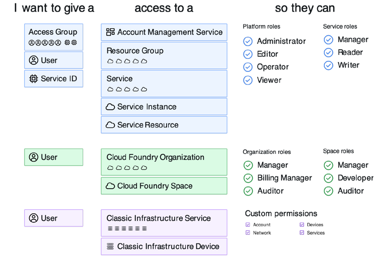

import Globals from 'gatsby-theme-carbon/src/templates/Globals';

<PageDescription>

</PageDescription>

## Introduction

IAM enables you to securely authenticate users for platform services and control access to resources consistently across IBM Cloud. A set of IBM Cloud services are enabled to use IBM Cloud IAM for access control, and are organized into resource groups within your account so you can give users quick and easy access to more than one resource at a time. 

- You can use IBM Cloud IAM access policies to assign users and service IDs access to the resources within your account. 

- You can group users and service IDs into an access group to easily give all entities within the group the same level of access.

IBM Cloud supports two types of infrastructure: Classic infrastructure and Virtual Private Cloud (VPC) infrastructure. Classic infrastructure is an existing Infrastructure-as-a-Service (IaaS)
platform whereas VPC infrastructure is the new IaaS platform that is based on software-defined networking. This publication addresses the application of IBM Cloud IAM to resources deployed
on the IBM Cloud classic infrastructure. To consume infrastructure service (as in Infrastructure as a Service), only the classic infrastructure permissions are required. For example, to self-deploy Red Hat OpenShift Container Platform on baremental or on VMware Software Defined Data Center (SDDC) within
the classic infrastructure, a user will only need the classic infrastructure permissions.

To consume platform service (as in Platform as a Service), three types of permissions are required:
- classic infrastructure permissions, 
- platform management permissions
- service access permissions. 

For example, to deploy a Red Hat OpenShift Container Platform as a managed service on the classic infrastructure, a user will need the following permissions:
- Classic infrastructure permissions. This enables the provisioning of master nodes, infrastructure nodes, worker nodes, network, and storage for persistent volume.
- Platform management permissions. This enables a cluster administrator to create a cluster, remove a cluster, update user access policies, restart or reload worker nodes, create webhook, and so forth.
- Service access permissions. This allows a user with manager role read/write access to all resources in in a namespace or every namespace, access the OpenShift dashboard, review cluster metrics, and so forth.

The classic infrastructure permission is assigned to a user while the platform and service permissions can be assigned to a user and/or a group. IBM Cloud refers to the platform and service permissions as Identity Access Management (IAM) enabled permissions.

## resources

- [IAM Overview](https://cloud.ibm.com/docs/account?topic=account-iamoverview)
- [IAM Resources / Access Group](https://cloudnativetoolkit.dev/toolkit-resources/resource-mgmt)