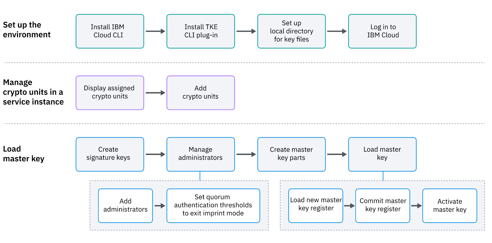
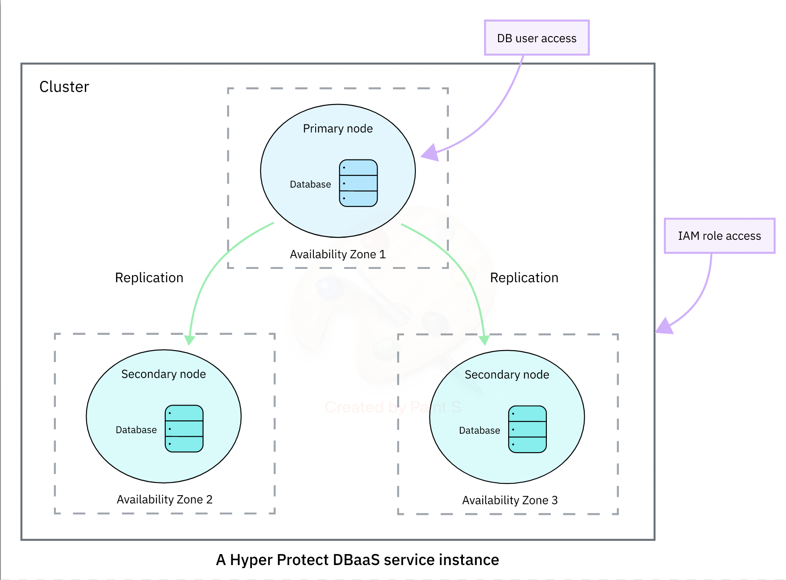
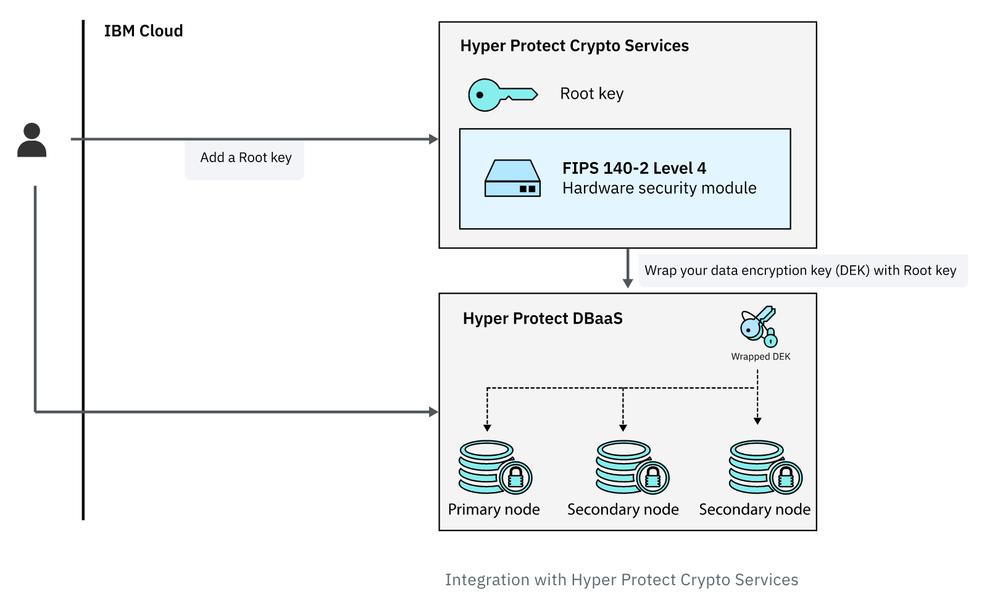
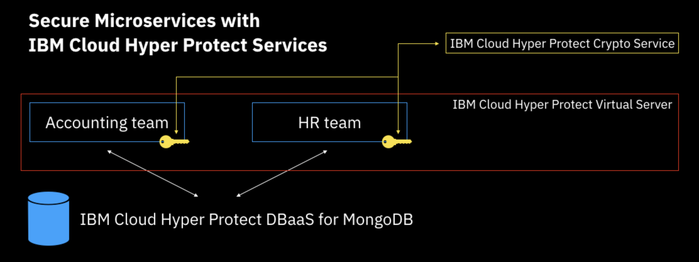

import Globals from 'gatsby-theme-carbon/src/templates/Globals';

<PageDescription>

</PageDescription>

## **Overview**

IBM Cloud® Hyper Protect Crypto Services (Hyper Protect Crypto Services for short) is a dedicated key management service and hardware security module (HSM)
based on IBM Cloud. With this service, you can take the ownership of the cloud HSM to fully manage your encryption keys and to perform cryptographic operations. Hyper Protect Crypto Services is also the only service in the cloud industry that is built on FIPS 140-2 Level 4-certified hardware

## **Hyper Protect Crypto Services**

Hyper Protect Crypto Services integrates with Key Protect application programming interface (API) to generate and manage keys. The Keep Your Own Key (KYOK) function is also enabled to provide access to cloud-based cryptographic HSMs. You can access the network addressable HSMs by making standard PKCS #11 API calls or Enterprise PKCS #11 over gRPC (GREP11) API calls to perform cryptographic operations.

You can provision Hyper protect Crypto Services using IBM cloud catelog or using terraform script mentioned below:
[Terraform module to provision Hyper protect Crypto service](https://github.com/cloud-native-toolkit/terraform-ibm-hpcs)

## **Post install steps**

Once a Hyper Protect Crypto Service has been provisioned, it must be initialized before it can be used. Currently, the initialization process must be performed manually. The following steps must be followed to complete the initialization 

## Key Ceremony

## Here are the steps to initialize(Key ceremony) of HPCS

## Install TKE CLI plun-in
### ibmcloud plugin install tke

Set the environment variable CLOUDTKEFILES on your workstation to specify the directory where you want to save the master key part files and signature key files. The signature keys are used to sign TKE administrative commands.

On the Linux® operating system or MacOS, add the following line to the .bash_profile file:

### export CLOUDTKEFILES=[local-directory]

## To display the service instances and crypto units in the target resource group under the current user account, use the following command:
### ibmcloud tke cryptounits

API endpoint:     https://cloud.ibm.com
Region:           us-south
User:             john.smith@in.abc.com
Account:          Cloud-Native Squad (0f0adc9ace07413f96e2214f4bc0c40b)
Resource group:   appdev-cloud-native

SERVICE INSTANCE: 4dd3b774-ddce-4b20-bb12-fd01d84fb92f
CRYPTO UNIT NUM   SELECTED   TYPE          LOCATION   
1                 false      OPERATIONAL   [us-south].[AZ2-CS5].[02].[06]   
2                 false      OPERATIONAL   [us-south].[AZ3-CS9].[01].[15]   
3                 false      RECOVERY      [us-south].[AZ3-CS9].[01].[14]   
4                 false      RECOVERY      [us-east].[AZ1-CS1].[01].[07]   

Note: all operational crypto units in a service instance must be configured the same.
Use 'ibmcloud tke cryptounit-compare' to check how crypto units are configured.

## To add extra crypto units to the selected crypto unit list, use the following command:
### ibmcloud tke cryptounit-add

API endpoint:     https://cloud.ibm.com
Region:           us-south
User:             john.smith@in.abc.com
Account:          Cloud-Native Squad (0f0adc9ace07413f96e2214f4bc0c40b)
Resource group:   appdev-cloud-native

SERVICE INSTANCE: 4dd3b774-ddce-4b20-bb12-fd01d84fb92f
CRYPTO UNIT NUM   SELECTED   TYPE          LOCATION   
1                 false      OPERATIONAL   [us-south].[AZ2-CS5].[02].[06]   
2                 false      OPERATIONAL   [us-south].[AZ3-CS9].[01].[15]   
3                 false      RECOVERY      [us-south].[AZ3-CS9].[01].[14]   
4                 false      RECOVERY      [us-east].[AZ1-CS1].[01].[07]   

Note: all operational crypto units in a service instance must be configured the same.
Use 'ibmcloud tke cryptounit-compare' to check how crypto units are configured.

Enter a list of CRYPTO UNIT NUM to add, separated by spaces:
> 1 2
OK

API endpoint:     https://cloud.ibm.com
Region:           us-south
User:             john.smith@in.abc.com
Account:          Cloud-Native Squad (0f0adc9ace07413f96e2214f4bc0c40b)
Resource group:   appdev-cloud-native

SERVICE INSTANCE: 4dd3b774-ddce-4b20-bb12-fd01d84fb92f
CRYPTO UNIT NUM   SELECTED   TYPE          LOCATION   
1                 true       OPERATIONAL   [us-south].[AZ2-CS5].[02].[06]   
2                 true       OPERATIONAL   [us-south].[AZ3-CS9].[01].[15]   
3                 false      RECOVERY      [us-south].[AZ3-CS9].[01].[14]   
4                 false      RECOVERY      [us-east].[AZ1-CS1].[01].[07]   

Note: all operational crypto units in a service instance must be configured the same.
Use 'ibmcloud tke cryptounit-compare' to check how crypto units are configured.

## To add extra crypto units to the selected crypto unit list, use the following command:
### ibmcloud tke cryptounit-add

API endpoint:     https://cloud.ibm.com
Region:           us-south
User:             john.smith@in.abc.com
Account:          Cloud-Native Squad (0f0adc9ace07413f96e2214f4bc0c40b)
Resource group:   appdev-cloud-native

SERVICE INSTANCE: 4dd3b774-ddce-4b20-bb12-fd01d84fb92f
CRYPTO UNIT NUM   SELECTED   TYPE          LOCATION   
1                 true       OPERATIONAL   [us-south].[AZ2-CS5].[02].[06]   
2                 true       OPERATIONAL   [us-south].[AZ3-CS9].[01].[15]   
3                 false      RECOVERY      [us-south].[AZ3-CS9].[01].[14]   
4                 false      RECOVERY      [us-east].[AZ1-CS1].[01].[07]   

Note: all operational crypto units in a service instance must be configured the same.
Use 'ibmcloud tke cryptounit-compare' to check how crypto units are configured.

Enter a list of CRYPTO UNIT NUM to add, separated by spaces:
> 3 4
OK

API endpoint:     https://cloud.ibm.com
Region:           us-south
User:             john.smith@in.abc.com
Account:          Cloud-Native Squad (0f0adc9ace07413f96e2214f4bc0c40b)
Resource group:   appdev-cloud-native

SERVICE INSTANCE: 4dd3b774-ddce-4b20-bb12-fd01d84fb92f
CRYPTO UNIT NUM   SELECTED   TYPE          LOCATION   
1                 true       OPERATIONAL   [us-south].[AZ2-CS5].[02].[06]   
2                 true       OPERATIONAL   [us-south].[AZ3-CS9].[01].[15]   
3                 true       RECOVERY      [us-south].[AZ3-CS9].[01].[14]   
4                 true       RECOVERY      [us-east].[AZ1-CS1].[01].[07]   

Note: all operational crypto units in a service instance must be configured the same.
Use 'ibmcloud tke cryptounit-compare' to check how crypto units are configured.

## You can compare the configuration settings of the selected crypto units with the following command:
### ibmcloud tke cryptounit-compare

SIGNATURE THRESHOLDS
SERVICE INSTANCE: 4dd3b774-ddce-4b20-bb12-fd01d84fb92f
CRYPTO UNIT NUM   SIGNATURE THRESHOLD   REVOCATION THRESHOLD   
1                 0                     0   
2                 0                     0   

==> Crypto units with a signature threshold of 0 are in IMPRINT MODE. <==

CRYPTO UNIT ADMINISTRATORS
SERVICE INSTANCE: 4dd3b774-ddce-4b20-bb12-fd01d84fb92f
CRYPTO UNIT NUM   ADMIN NAME          SUBJECT KEY IDENTIFIER   
1                 No administrators      
2                 No administrators      

NEW MASTER KEY REGISTER
SERVICE INSTANCE: 4dd3b774-ddce-4b20-bb12-fd01d84fb92f
CRYPTO UNIT NUM   STATUS   VERIFICATION PATTERN   
1                 Empty    00000000000000000000000000000000   
                           00000000000000000000000000000000   
2                 Empty    00000000000000000000000000000000   
                           00000000000000000000000000000000   

CURRENT MASTER KEY REGISTER
SERVICE INSTANCE: 4dd3b774-ddce-4b20-bb12-fd01d84fb92f
CRYPTO UNIT NUM   STATUS   VERIFICATION PATTERN   
1                 Empty    00000000000000000000000000000000   
                           00000000000000000000000000000000   
2                 Empty    00000000000000000000000000000000   
                           00000000000000000000000000000000   

CONTROL POINTS
SERVICE INSTANCE: 4dd3b774-ddce-4b20-bb12-fd01d84fb92f
CRYPTO UNIT NUM   XCP_CPB_ALG_EC_25519   XCP_CPB_BTC   XCP_CPB_ECDSA_OTHER   
1                 Set                    Set           Set   
2                 Set                    Not Set       Not Set   

==> WARNING: Crypto units are configured differently. <==

## To display the existing signature keys on the workstation, use the following command:
### ibmcloud tke sigkeys

No files containing a signature key were found.

To create a file containing a signature key, use the 'ibmcloud tke sigkey-add' command.
## To create and save a new signature key on the workstation, use the following command:
### ibmcloud tke sigkey-add

Enter an administrator name to be associated with the signature key:
> john smith
Enter a password to protect the signature key:
> 
Re-enter the password to confirm:
> 
OK
A signature key was created.
The available signature keys on this workstation are:

KEYNUM   DESCRIPTION   SUBJECT KEY IDENTIFIER   
1        john smith    754adadbd731a5344c2e606b51993c...   

No KEYNUM are selected as current signature keys.

## To select the administrators to sign future commands, use the command:
### ibmcloud tke sigkey-sel

KEYNUM   DESCRIPTION   SUBJECT KEY IDENTIFIER   
1        john smith    754adadbd731a5344c2e606b51993c...   

No KEYNUM are selected as current signature keys.

Enter the KEYNUM values to select as current signature keys, separated by spaces:
> 1
Enter the password for KEYNUM 1:
> 
OK
KEYNUM 1 has been made the current signature key.
❯ ibmcloud tke cryptounit-admins

No crypto unit administrators for service instance 4dd3b774-ddce-4b20-bb12-fd01d84fb92f
## To display the existing administrators for a crypto unit, use the following command:
### ibmcloud tke cryptounit-admins

No crypto unit administrators for service instance 4dd3b774-ddce-4b20-bb12-fd01d84fb92f
## To add an administrator, use the following command:
### ibmcloud tke cryptounit-admin-add

KEYNUM   DESCRIPTION   SUBJECT KEY IDENTIFIER   
1        john smith    754adadbd731a5344c2e606b51993c...   

KEYNUM 1 is selected as the current signature key.

Enter the KEYNUM of the administrator signature key you wish to load:
> 1
Enter the password for the administrator signature key file:
> 
OK
The crypto unit administrator was added to the selected crypto units.
## Set quorum authentication thresholds,After you add one or more crypto unit administrators, exit imprint mode by using the command: 
### ibmcloud tke cryptounit-thrhld-set

Enter the new signature threshold value:
> 1

Enter the new revocation signature threshold value:
> 1
Enter the password for the signature key identified by:
john smith (754adadbd731a5344c2e606b51993c...)
> 
OK
New signature threshold values have been set in the selected crypto units.

SIGNATURE THRESHOLDS
SERVICE INSTANCE: 4dd3b774-ddce-4b20-bb12-fd01d84fb92f
CRYPTO UNIT NUM   SIGNATURE THRESHOLD   REVOCATION THRESHOLD   
1                 1                     1   
2                 1                     1   

==> Crypto units with a signature threshold of 0 are in IMPRINT MODE. <==
## To display the existing master key parts on the workstation, use the following command:
### ibmcloud tke mks

No files containing an EP11 master key part were found.
## To create and save a random master key part on the workstation, use the command:
### ibmcloud tke mk-add –random

Enter a description for the key part:
> First key
Enter a password to protect the key part:
> 
Re-enter the password to confirm:
> 
OK
A key part was created.
The available EP11 master key parts on this workstation are:

KEYNUM   DESCRIPTION   VERIFICATION PATTERN   
1        First key     34c73048e81a08b69243dae23e8943bb   
                       8874261d58bca67c4d308071ff2b6462
## To create and save a second random master key part on the workstation:
### ibmcloud tke mk-add –random

Enter a description for the key part:
> second key
Enter a password to protect the key part:
> 
Re-enter the password to confirm:
> 
OK
A key part was created.
The available EP11 master key parts on this workstation are:

KEYNUM   DESCRIPTION   VERIFICATION PATTERN   
1        First key     34c73048e81a08b69243dae23e8943bb   
                       8874261d58bca67c4d308071ff2b6462   
2        second key    ce7b7d2198de8f46195667e725b593fc   
                       cfbc10e9c211d9bf80b358c2513ac18c

## To load the new master key register, use the following command:
### ibmcloud tke cryptounit-mk-load

KEYNUM   DESCRIPTION   VERIFICATION PATTERN   
1        First key     34c73048e81a08b69243dae23e8943bb   
                       8874261d58bca67c4d308071ff2b6462   
2        second key    ce7b7d2198de8f46195667e725b593fc   
                       cfbc10e9c211d9bf80b358c2513ac18c   

Enter the KEYNUM values of the master key parts you wish to load.
2 or 3 values must be specified, separated by spaces.
> 1 2
Enter the password for the signature key identified by:
john smith (754adadbd731a5344c2e606b51993c...)
> 
Enter the password for key file 1
> 
Enter the password for key file 2
> 
OK
The new master key register has been loaded in the selected crypto units.

NEW MASTER KEY REGISTER
SERVICE INSTANCE: 4dd3b774-ddce-4b20-bb12-fd01d84fb92f
CRYPTO UNIT NUM   STATUS             VERIFICATION PATTERN   
1                 Full Uncommitted   7a6ba030d18a0bc1c80abd5931bff8e3   
                                     10154b88430968ee534ad01413dda886   
2                 Full Uncommitted   7a6ba030d18a0bc1c80abd5931bff8e3   
                                     10154b88430968ee534ad01413dda886  

## To commit the new master key register, use the following command:
### ibmcloud tke cryptounit-mk-commit

Enter the password for the signature key identified by:
john smith (754adadbd731a5344c2e606b51993c...)
> 
OK
The new master key register has been committed in the selected crypto units.

NEW MASTER KEY REGISTER
SERVICE INSTANCE: 4dd3b774-ddce-4b20-bb12-fd01d84fb92f
CRYPTO UNIT NUM   STATUS           VERIFICATION PATTERN   
1                 Full Committed   7a6ba030d18a0bc1c80abd5931bff8e3   
                                   10154b88430968ee534ad01413dda886   
2                 Full Committed   7a6ba030d18a0bc1c80abd5931bff8e3   
                                   10154b88430968ee534ad01413dda886

## Activate the master key by moving the master key to the current master key register with the following command:
### ibmcloud tke cryptounit-mk-setimm

Warning!  Any key storage associated with the targeted service instance must be prepared to accept the new master key value before running this command.  Otherwise, key storage may become unusable.
Do you want to continue?
Answer [y/N]:
> y
Enter the password for the signature key identified by:
john smith (754adadbd731a5344c2e606b51993c...)
> 
OK
Set immediate completed successfully in the selected crypto units.

NEW MASTER KEY REGISTER
SERVICE INSTANCE: 4dd3b774-ddce-4b20-bb12-fd01d84fb92f
CRYPTO UNIT NUM   STATUS   VERIFICATION PATTERN   
1                 Empty    00000000000000000000000000000000   
                           00000000000000000000000000000000   
2                 Empty    00000000000000000000000000000000   
                           00000000000000000000000000000000   

CURRENT MASTER KEY REGISTER
SERVICE INSTANCE: 4dd3b774-ddce-4b20-bb12-fd01d84fb92f
CRYPTO UNIT NUM   STATUS   VERIFICATION PATTERN   
1                 Valid    7a6ba030d18a0bc1c80abd5931bff8e3   
                           10154b88430968ee534ad01413dda886   
2                 Valid    7a6ba030d18a0bc1c80abd5931bff8e3   
                           10154b88430968ee534ad01413dda886

Please refer https://cloud.ibm.com/docs/hs-crypto?topic=hs-crypto-initialize-hsm for more detail:

## **Hyper Protect DBaaS**

IBM Cloud® Hyper Protect DBaaS provides tamper-proof, enterprise cloud database environments with high availability for workloads with sensitive data. It offers a flexible platform that allows you to easily provision and manage your database of choice (MongoDB and PostgreSQL), without data security concerns.
Built on IBM LinuxONE technology, Hyper Protect DBaaS for MongoDB helps you to alleviate data security and compliance concerns with built-in encryption and tamper protection for data at rest and in flight. You can deploy your workloads with sensitive data and build compliant applications without having to be a security expert.
Hyper Protect DBaaS for MongoDB provides a reliable environment that allows you to become more agile in application development. You can quickly get started and move your mission-critical data to the highly available and managed database clusters, saving time and costs on operations. You can also flexibly adjust the amount of resources to meet your requirements.

You can provision Hyper protect DBaaS for MongoDB using IBM cloud catelog or using terraform script mentioned below:
[Terraform module to provision Hyper protect DBaaS for MongoDB](https://github.com/cloud-native-toolkit/terraform-ibm-hpdbaas-mongodb)

## Hyper protect DBAAS service integration with Hyper protect crypto service

## **Hyper Protect Virtual Servers**

IBM Cloud Hyper Protect Virtual Servers grant you complete authority over your Linux-based virtual servers for workloads that contain sensitive data and business IP. They offer a confidential computing environment, addressing your top security concerns for peace of mind when building applications in the cloud and helping you with the following issues:

- Memory protection through a trusted execution environment
- Data-at-rest and data-in-flight encryption
- Prevention of unauthorized access

You can provision Hyper protect Virtual Servers using IBM cloud catelog or using terraform script mentioned below:
[Terraform module to provision Hyper protect Virtual Servers](https://github.com/cloud-native-toolkit/terraform-ibm-vpc-vsi)

## **Deploy application on Hyper Protect Virtual Server**

This Code Pattern is a node.js application that allows for the creation of keys, one for each "team" or "service. It uses that key to encrypt some customer data, ahead of being stored in the database. In this way, it demonstrates the above example, while showing how to use the Key Protect RESTful API provided by an instance of IBM Cloud Hyper Protect Crypto Services. IBM Cloud Hyper Protect DBaaS for MongoDB is used as the database as it provides a standard MongoDB managed service, encrypted to anyone outside of the organisation with legitimate access to it. The application runs in a Docker container, for example on a Mac or Linux laptop, or following the directions below, on IBM Cloud Hyper Protect Virtual Servers, for runtime protection in the public cloud.

When you have completed this code pattern, you will understand how to:

- Build and run a Docker container
- Get environment variables in a node.js app, from Docker
- Create an IBM Cloud IAM API key
- Drive the IBM Cloud Key Protect REST API, offered by IBM Cloud Hyper Protect Crypto Services

[Deploy application on Hyper Protect Virtual Server](https://github.com/yogendrasri/secured-microservices-writing-to-a-consolidated-database)

### **Resources**
- [Hyper Protect crypto services](https://cloud.ibm.com/docs/hs-crypto?topic=hs-crypto-get-started)
- [Hyper Protect DBaaS for MongoDB](https://cloud.ibm.com/docs/hyper-protect-dbaas-for-mongodb?topic=hyper-protect-dbaas-for-mongodb-gettingstarted)
- [yper Protect Virtual Servers](https://cloud.ibm.com/docs/hp-virtual-servers?topic=hp-virtual-servers-getting-started)

