import Globals from 'gatsby-theme-carbon/src/templates/Globals';

<PageDescription>


</PageDescription>

## **Overview**

IBM Cloud® Hyper Protect Crypto Services (HPCS) is a dedicated key management service and hardware security module (HSM)
based on IBM Cloud. With this service, you can take the ownership of the cloud HSM to fully manage your encryption keys and to perform cryptographic operations. Hyper Protect Crypto Services is also the only service in the cloud industry that is built on FIPS 140-2 Level 4-certified hardware.


## **Hyper Protect Crypto Services**

Hyper Protect Crypto Services integrates with Key Protect application programming interface (API) to generate and manage keys. The Keep Your Own Key (KYOK) function is also enabled to provide access to cloud-based cryptographic HSMs. You can access the network addressable HSMs by making standard PKCS #11 API calls or Enterprise PKCS #11 over gRPC (GREP11) API calls to perform cryptographic operations.

You can provision Hyper protect Crypto Services using IBM cloud catalog or using terraform script:

<Tabs>

<Tab label="Provision HPCS using IBM cloud" open="true">

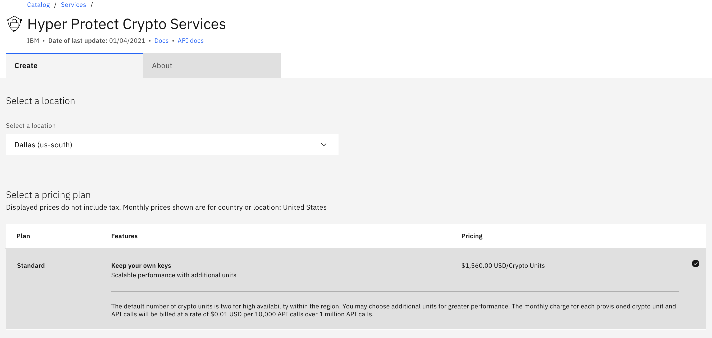
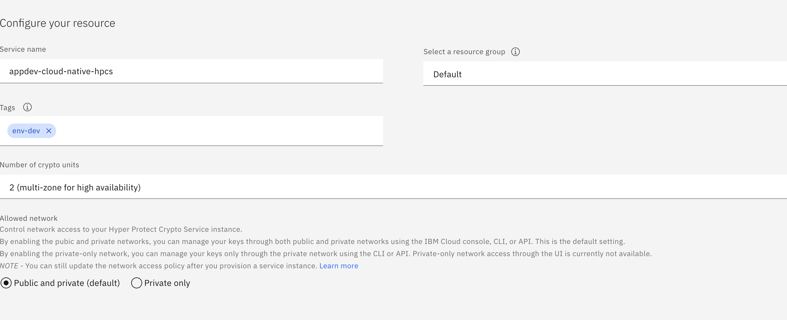

For more details please refer https://cloud.ibm.com/docs/hs-crypto?topic=hs-crypto-provision
</Tab>

<Tab label="Provision HPCS using terraform script" open="true">

[Terraform module to provision Hyper protect Crypto service](https://github.com/cloud-native-toolkit/terraform-ibm-hpcs)

```
git clone https://github.com/cloud-native-toolkit/terraform-ibm-hpcs.git
cd terraform-ibm-hpcs
```

```
docker run -it --rm -v ${PWD}:/terraform quay.io/ibmgaragecloud/cli-tools:v0.12.0-lite
```

```
cd /terraform
terraform init
```

```
terraform plan
```

```
terraform apply
```
</Tab>
</Tabs>

## **Post install steps**

Once a Hyper Protect Crypto Service (HPCS) has been provisioned, it must be initialized before it can be used. Currently, the initialization process must be performed manually. 
There are three ways to initialize HPCS:

1) Use Smart card - For the highest level of security, choose this option. It uses smart cards to store signature keys and master key parts. Signature keys and master key parts never appear in the clear outside the smart card.

2) Use recovery crypto unit - If one or more recovery crypto units are allocated for your service instance, you can choose this option. A random master key value is automatically generated in a recovery crypto unit and never appears in the clear outside of the HSMs.

3) Use key part files - Initialize your service instance by using master key parts that you create and store in files on your local workstation. In this case, the workstation key files serve as a backup copy of your master key value.

We are explaining method 2 in this tutorial. The following steps must be followed to complete the initialization: 

### **Key Ceremony**

### Prerequisites 

### Install TKE CLI plugin
```
ibmcloud plugin install tke
```

Set the environment variable CLOUDTKEFILES on your workstation to specify the directory where you want to save the master key part files and signature key files. The signature keys are used to sign TKE administrative commands.

On the Linux® operating system or MacOS, add the following line to the .bash_profile file:
```
export CLOUDTKEFILES=[local-directory]
```

Login to IBM Cloud

```
ibmcloud login  --apikey <apikey> -a cloud.ibm.com -r region -g <resource group>
```

### Initializing HPCS using recovery crypto unit

```
ibmcloud tke auto-init
```
Output
```
A common set of administrators will be loaded in all crypto units assigned to the service instance, the signature thresholds will be set the same, and a random master key value will be generated in one crypto unit and exported to the other crypto units.

Press enter to continue or Ctrl-c to exit.
> 


ENTER SIGNATURE THRESHOLD VALUES

Enter the number of signatures to be required on commands sent to the service instance.
This must be a number between 1 and 8.
To enforce dual control, this must be at least 2:
> 1

Enter the number of signatures to be required on commands to remove an administrator.
This must be a number between 1 and 8.
To enforce dual control, this must be at least 2:
> 1


ENTER NUMBER OF ADMINISTRATORS TO INSTALL

To initialize and maintain your crypto units, administrators must be installed.
Each administrator has an associated signature key.
Signature keys are stored in files protected by a password.
To use the signature key, you must supply the password.

To enforce dual control, each signature key file should be assigned to a different user and only that user should know the password.

You can install up to eight administrators in a crypto unit.
To set a signature threshold value of 1 and a revocation signature threshold of 1, you must install at least 1 administrator.

Enter the number of administrators you want to install:
> 1

No signature key files were found on this workstation.
One signature key file will be created.

Creating signature key file 1 of 1...

Enter an administrator name to be associated with the signature key:
> admin1
Enter a password to protect the signature key:
> 
Re-enter the password to confirm:
> 

Installing 1 of 1 administrators...
Setting signature thresholds...
Generating a random master key value...
Transferring the master key value to 1 of 3 crypto units...
Transferring the master key value to 2 of 3 crypto units...
Transferring the master key value to 3 of 3 crypto units...

OK
The selected service instance has been initialized.
To see what administrators are installed and what signature threshold and master key register values are set, use the 'ibmcloud tke cryptounit-compare' command.

```
### Verify initialization

```
ibmcloud tke cryptounit-compare
```
Output
```
SIGNATURE THRESHOLDS
SERVICE INSTANCE: 7ba22c61-5cca-4045-953a-39c27aa1af05
CRYPTO UNIT NUM   SIGNATURE THRESHOLD   REVOCATION THRESHOLD   
1                 1                     1   
2                 1                     1   
3*                1                     1   
4*                1                     1   

* Indicates a recovery crypto unit used only to hold a backup master key value.

==> Crypto units with a signature threshold of 0 are in IMPRINT MODE. <==


CRYPTO UNIT ADMINISTRATORS
SERVICE INSTANCE: 7ba22c61-5cca-4045-953a-39c27aa1af05
CRYPTO UNIT NUM   ADMIN NAME   SUBJECT KEY IDENTIFIER   
1                 admin1       d153cf349e9aeb41d0ce84d8fb43a5...   
2                 admin1       d153cf349e9aeb41d0ce84d8fb43a5...   
3*                admin1       d153cf349e9aeb41d0ce84d8fb43a5...   
4*                admin1       d153cf349e9aeb41d0ce84d8fb43a5...   

* Indicates a recovery crypto unit used only to hold a backup master key value.


NEW MASTER KEY REGISTER
SERVICE INSTANCE: 7ba22c61-5cca-4045-953a-39c27aa1af05
CRYPTO UNIT NUM   STATUS   VERIFICATION PATTERN   
1                 Empty    00000000000000000000000000000000   
                           00000000000000000000000000000000   
2                 Empty    00000000000000000000000000000000   
                           00000000000000000000000000000000   
3*                Empty    00000000000000000000000000000000   
                           00000000000000000000000000000000   
4*                Empty    00000000000000000000000000000000   
                           00000000000000000000000000000000   


CURRENT MASTER KEY REGISTER
SERVICE INSTANCE: 7ba22c61-5cca-4045-953a-39c27aa1af05
CRYPTO UNIT NUM   STATUS   VERIFICATION PATTERN   
1                 Valid    730ebf29e88df393ba3a0bdf491f3fe2   
                           a107734db4221d7e0ad795b902abdd49   
2                 Valid    730ebf29e88df393ba3a0bdf491f3fe2   
                           a107734db4221d7e0ad795b902abdd49   
3*                Valid    730ebf29e88df393ba3a0bdf491f3fe2   
                           a107734db4221d7e0ad795b902abdd49   
4*                Valid    730ebf29e88df393ba3a0bdf491f3fe2   
                           a107734db4221d7e0ad795b902abdd49   

* Indicates a recovery crypto unit used only to hold a backup master key value.


CONTROL POINTS
SERVICE INSTANCE: 7ba22c61-5cca-4045-953a-39c27aa1af05
CRYPTO UNIT NUM   XCP_CPB_ALG_EC_25519   XCP_CPB_BTC   XCP_CPB_ECDSA_OTHER   
1                 Set                    Set           Set   
2                 Set                    Set           Set   
3*                Set                    Set           Set   
4*                Set                    Set           Set   

* Indicates a recovery crypto unit used only to hold a backup master key value.

==> All crypto units are configured the same. <==

```

For more details refer recovery crypto unit https://cloud.ibm.com/docs/hs-crypto?topic=hs-crypto-initialize-hsm-recovery-crypto-unit

## **Create root or standard key**

1) From the IBM Cloud console open HPCS service, click Key management service keys > Add key.

2) Provide key type (Root or Standard).

3) Provide Key name.

4) When you finish filling out the key's details, click Create key to confirm.

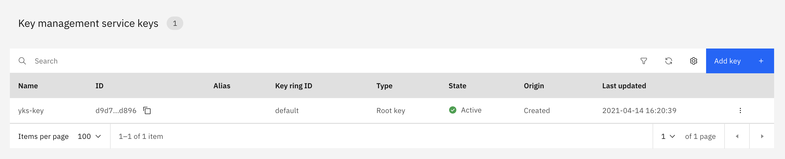

## **Hyper Protect DBaaS**

IBM Cloud® Hyper Protect DBaaS (HPDBaaS) provides tamper-proof, enterprise cloud database environments with high availability for workloads with sensitive data. It offers a flexible platform that allows you to easily provision and manage your database of choice (MongoDB and PostgreSQL), without data security concerns.
Built on IBM LinuxONE technology, Hyper Protect DBaaS for MongoDB helps you to alleviate data security and compliance concerns with built-in encryption and tamper protection for data at rest and in flight. You can deploy your workloads with sensitive data and build compliant applications without having to be a security expert.
Hyper Protect DBaaS for MongoDB provides a reliable environment that allows you to become more agile in application development. You can quickly get started and move your mission-critical data to the highly available and managed database clusters, saving time and costs on operations. You can also flexibly adjust the amount of resources to meet your requirements.

You can provision Hyper protect DBaaS for MongoDB using IBM cloud catalog or using terraform script mentioned below:

<Tabs>

<Tab label="Provision HPDBaaS for MongoDB using IBM cloud" open="true">

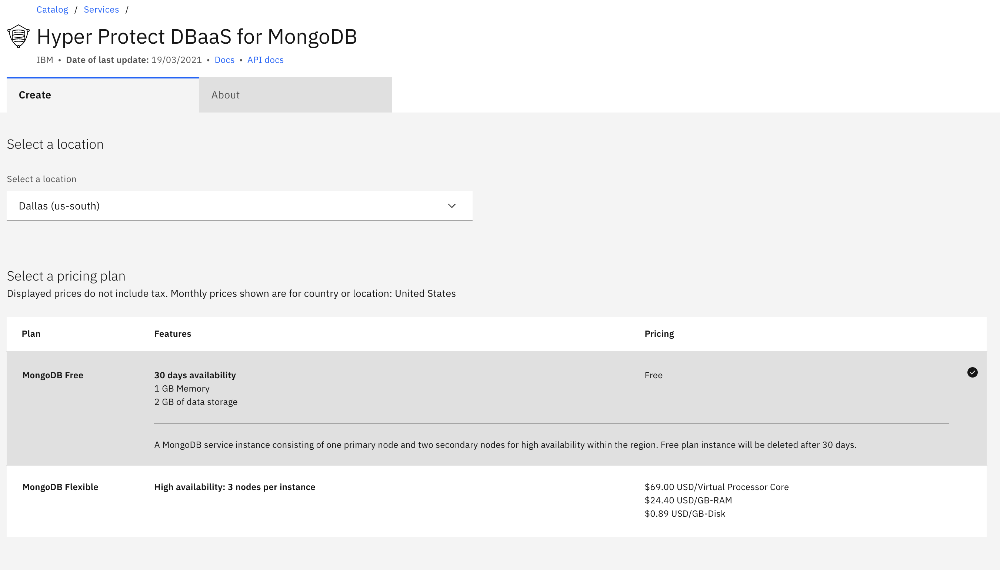
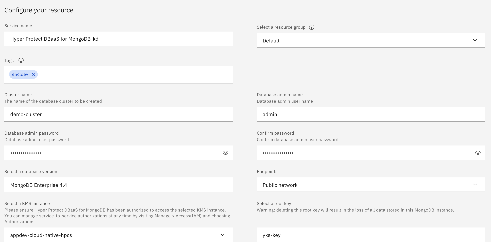

For more details please refer https://cloud.ibm.com/docs/hyper-protect-dbaas-for-mongodb?topic=hyper-protect-dbaas-for-mongodb-create-service

</Tab>

<Tab label="Provision HPDBaaS for MongoDB using terraform script" open="true">

[Terraform module to provision Hyper protect DBaaS for MongoDB](https://github.com/cloud-native-toolkit/terraform-ibm-hpdbaas-mongodb)

```
git clone https://github.com/cloud-native-toolkit/terraform-ibm-hpdbaas-mongodb.git
cd terraform-ibm-hpdbaas-mongodb
```

```
docker run -it --rm -v ${PWD}:/terraform quay.io/ibmgaragecloud/cli-tools:v0.12.0-lite
```

```
cd /terraform
terraform init
```

```
terraform plan
```

```
terraform apply
```

</Tab>
</Tabs>

## **Hyper Protect Virtual Servers**

IBM Cloud Hyper Protect Virtual Servers (HPVS) grant you complete authority over your Linux-based virtual servers for workloads that contain sensitive data and business IP. They offer a confidential computing environment, addressing your top security concerns for peace of mind when building applications in the cloud and helping you with the following issues:

- Memory protection through a trusted execution environment
- Data-at-rest and data-in-flight encryption
- Prevention of unauthorized access

You can provision Hyper protect Virtual Servers using IBM cloud catalog or using terraform script mentioned below:

<Tabs>

<Tab label="Provision  HPVS using IBM cloud" open="true">

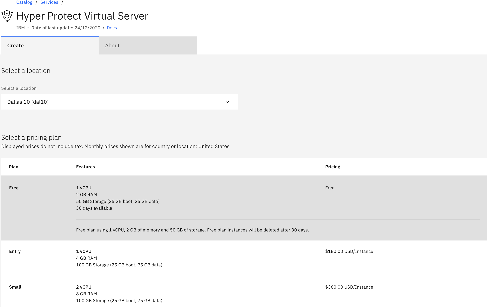
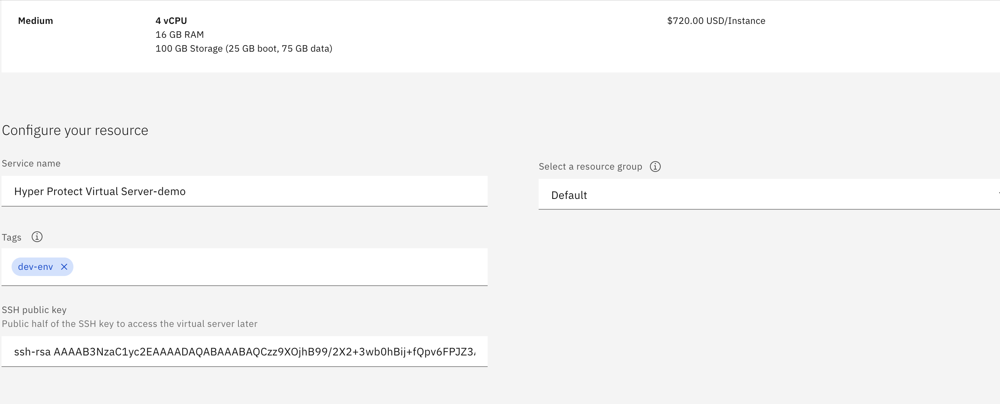

For more details please refer https://cloud.ibm.com/docs/hp-virtual-servers?topic=hp-virtual-servers-provision

</Tab>
<Tab label="Provision HPVS using terraform script" open="true">

[Terraform module to provision Hyper protect Virtual Servers](https://github.com/cloud-native-toolkit/terraform-ibm-vpc-vsi)

```
git clone https://github.com/cloud-native-toolkit/terraform-ibm-vpc-vsi.git
cd terraform-ibm-vpc-vsi
```

```
docker run -it --rm -v ${PWD}:/terraform quay.io/ibmgaragecloud/cli-tools:v0.12.0-lite
```

```
cd /terraform
terraform init
```

```
terraform plan
```

```
terraform apply
```
</Tab>
</Tabs>

## **Deploy application on Hyper Protect Virtual Server**

This Code Pattern is a node.js application that allows for the creation of keys, one for each "team" or "service. It uses that key to encrypt some customer data, ahead of being stored in the database. In this way, it demonstrates the above example, while showing how to use the Key Protect RESTful API provided by an instance of IBM Cloud Hyper Protect Crypto Services. IBM Cloud Hyper Protect DBaaS for MongoDB is used as the database as it provides a standard MongoDB managed service, encrypted to anyone outside of the organisation with legitimate access to it. The application runs in a Docker container, for example on a Mac or Linux laptop, or following the directions below, on IBM Cloud Hyper Protect Virtual Servers, for runtime protection in the public cloud.

When you have completed this code pattern, you will understand how to:

- Build and run a Docker container
- Get environment variables in a node.js app, from Docker
- Create an IBM Cloud IAM API key
- Drive the IBM Cloud Key Protect REST API, offered by IBM Cloud Hyper Protect Crypto Services

[Code pattern](https://developer.ibm.com/patterns/create-a-secured-microservices-and-deploy-it-to-a-consolidated-database/)

Git repo for the Application:
[Application code](https://github.com/yogendrasri/secured-microservices-writing-to-a-consolidated-database)

### Application output

The main page of application that explains how HPCS, HPDBaaS works along with application deployed on HPVS:  
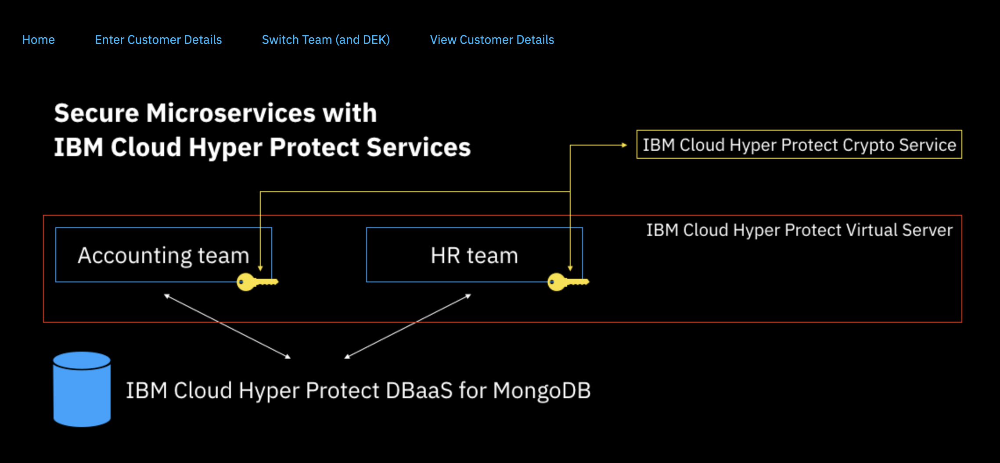

Create a new team, and associated key provided by Crypto Services(HPCS):
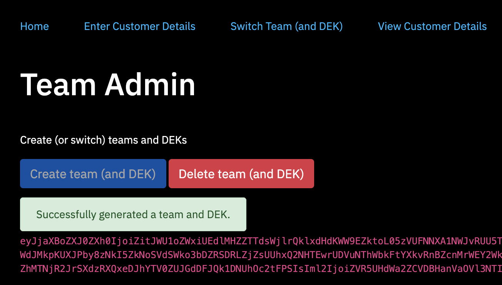

Fill the details and submit the form, user can use auto generated deatils as well:
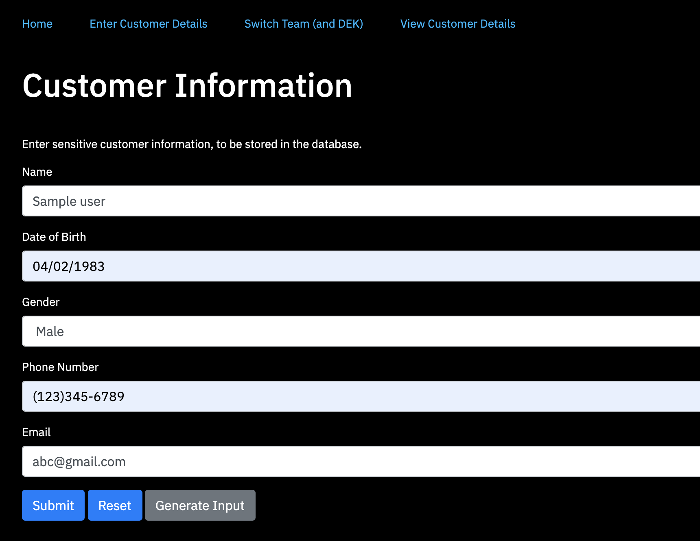

Conformation of Data stored in MongoDB:
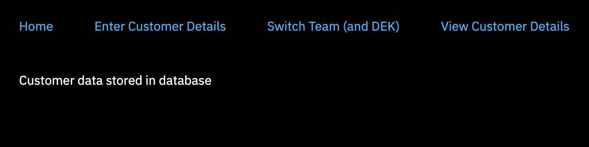

Retrieve the information from MongoDB, all the data stored is encrypted:
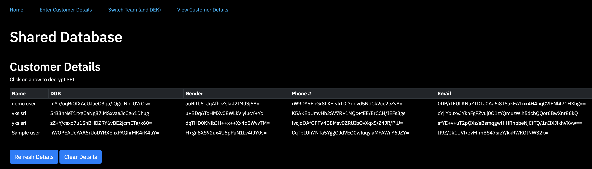

You can view encrpted data by selecting the row, provided user belongs to the same team: 
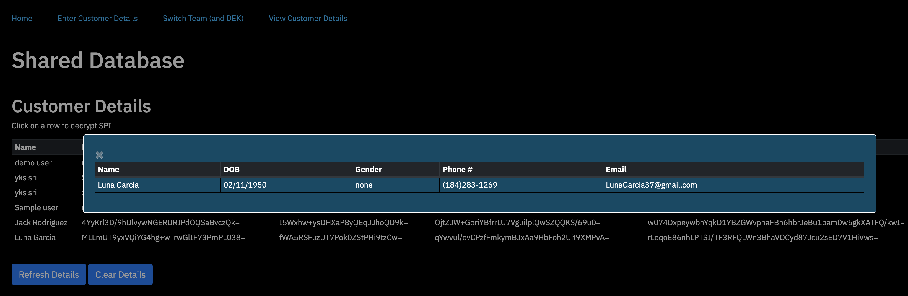

If user does not belongs to the same team data would be in ciphertext:
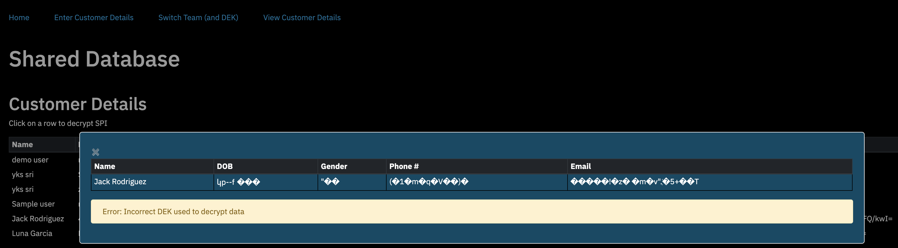


### **Resources**
- [Hyper Protect crypto services](https://cloud.ibm.com/docs/hs-crypto?topic=hs-crypto-get-started)
- [Hyper Protect DBaaS for MongoDB](https://cloud.ibm.com/docs/hyper-protect-dbaas-for-mongodb?topic=hyper-protect-dbaas-for-mongodb-gettingstarted)
- [Hyper Protect Virtual Servers](https://cloud.ibm.com/docs/hp-virtual-servers?topic=hp-virtual-servers-getting-started)
- [Application](https://developer.ibm.com/patterns/create-a-secured-microservices-and-deploy-it-to-a-consolidated-database/)
