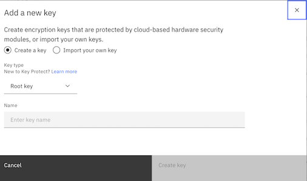
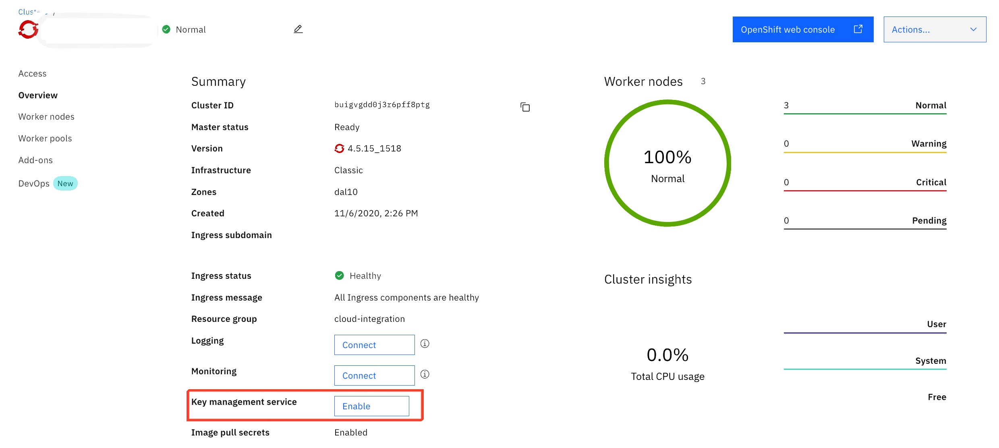
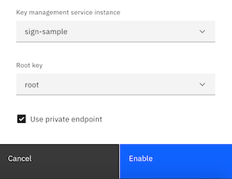

import Globals from 'gatsby-theme-carbon/src/templates/Globals';

<PageDescription>

</PageDescription>

## **Overview**

Protecting the sensitive information in the Red Hat OpenShift on IBM Cloud cluster to ensure data integrity and to prevent the data from being exposed to unauthorized users using IBM Key Protect.

The sensitive data at different levels in the cluster, will require appropriate protection.

- Cluster-level: Cluster configuration data is stored in the etcd component of the OpenShift master. Data in etcd is stored on the local disk of the OpenShift master and is backed up to IBM Cloud Object Storage. Data is encrypted during transit to IBM Cloud Object Storage and at rest. To enable encryption for the etcd data on the local disk of your OpenShift master is by enabling a key management service provider (IBM Key Protect) for the cluster.

- App-level: When the application is deployed, do not store confidential information, such as credentials or keys, in the YAML configuration file, configmaps, or scripts. Instead, use Kubernetes secrets, such as an imagePullSecret for registry credentials. This helps to encrypt data in Kubernetes secrets to prevent unauthorized users from accessing sensitive app information.

IBM Key Protect for IBM Cloud helps in provision encrypted keys for apps across IBM Cloud services. This provides the benefit of securing the keys by FIPS 140-2 Level 3 certified cloud-based hardware security modules (HSMs) that protect against the theft of information. The Key Protect interface simplifies the management of multiple encryption services. This service provides the ability to manage and sort encryption keys in one centralized location, or can separate keys by project and house them in different IBM Cloud spaces.

## **Install**

Steps to set up the key management service integration with roks.

- Setup the IBM key protect service
- Setup the root key
- Configure the root key to the roks cluster

### **Setup IBM Key Protect Service**

- Login to IBM Cloud
- Access the IBM Cloud catalog
- Filter/Search for the Key Protect service (part of the security category)
- select the service(Key Protect) and navigate to the create page
- Provide the input parameters and click create button to provision the IBM Key Protect Service 

### **Setup the root key**

- Access the provisioned Key Protect instance
- Access the 'Manage 'Keys' tab in the left nav
- Now click on the 'Add Key' button
- you have a choice to create a new key or import your own key option. create a 'root key', for the cluster to be secured.

**Note:**  Ensure you don't delete this root key, after you have encrypted the cluster

### **Enable KMS to the roks cluster**

Follow the below user interface approach to enable the kMS for the cluster

- Access the roks cluster that is provisioned 
- Navigate to the Dashboard on the cluster
- As part of the dashboard, you should be able to see the "Key management service" and along side the Enable button, as depicted below

- Click on the "Key management service" Enable button to enable the KMS for the cluster
- Now select the Key management service that you have provisioned and the root key from the drop down options appear in the pop up screen
- Click on the Enable option to enable the KMS for the cluster 

**Note** Ensure the root key should not be deleted from the IBM Key Protect, once the root key is activated to the cluster

**Note** 
you can also enable the KMS using CLI based approach for the cluster as per the below reference:
- [Setting up KMS for roks using CLI](https://cloud.ibm.com/docs/openshift?topic=openshift-encryption)

