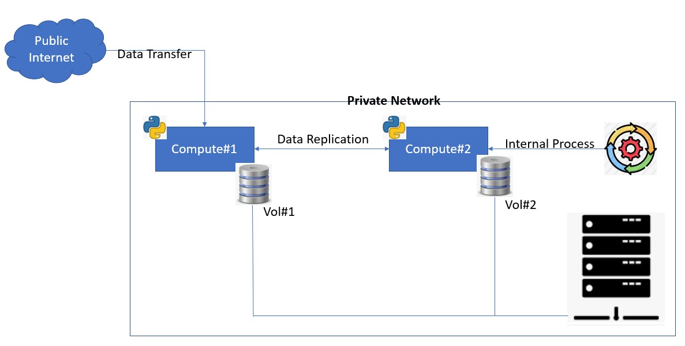

import Globals from 'gatsby-theme-carbon/src/templates/Globals';

<PageDescription>

</PageDescription>

# Reference Architecture
 

The current scenario discusses real-time replication between two computes, however this can be customized to work with multiple machines. The solution is tested on RHEL8 machine on IBM Cloud's VPC based network.

The private network can be either cloud-based network or on-prem data center network. Data can come from public Internet or generated by internal processes and stored on local disks or SAN volumes. This data can be replicated in real-time or scheduled for later replication depending on Individual requirements. The solution makes use of paramiko framework available in Python, the details of which are mentioned in below sections.  

The python replication service runs as systemd service on RHEL and starts automatically when OS is restarted. Any time data is loaded into landing zone, this service replicates it to other computes it is configured for. This service needs to be installed and confirmed on all participating peer machines for cross replication. This service will not replicate data which is currently downloading, in RHEL it has a **.filepart** extension and wait for it to completely download before action on it. The additional extensions (if any) can be added in the service code. 

This also talks about performance measurement for data transfer between two machines.

# Parmiko
Paramiko primarily supports POSIX platforms with standard OpenSSH implementations, and is most frequently tested on Linux and OS X. Windows is supported as well, though it may not be as straightforward. Details can be found in below git-hub link:

https://github.com/paramiko/paramiko

--------------------
# Meeting the Pre-requisites
dnf install python3  
pip3 install schedule    
pip3 install setuptools-rust  
pip3 install wheel  
pip3 install PyNaCl  
pip3 install bcrypt  
dnf install redhat-rpm-config gcc libffi-devel python3-devel openssl-devel cargo  
pip3 install paramiko  
pip install loguru  
## Make Pre-requisite directories
mkdir /upload  
chmod 777 /upload  
mkdir /archive  
chmod 777 /archive  

## Service Setup
a) Copy schedule_test_every_two_min.py in /opt or directory of your choice (make sure to modify service file in this case).  
b) Copy python-scheduler.service in /etc/systemd/system directory.  
c) Run systemctl daemon-reload
d) Run systemd-analyze verify python-scheduler.service to ensure that file is correct. If it is correct it should not return any output.  
e) Run systemctl enable python-scheduler.service to enable service to start automatically on system restart.  
f) Run systemctl start python-scheduler.service  
g) Run systemctl status python-scheduler.service to check the status of service.  

## SSH Session Timeout
The ClientAliveInterval parameter specifies the time in seconds that the server will wait before sending a null packet to the client system to keep the connection alive.

On the other hand, the ClientAliveCountMax parameter defines the number of client alive messages which are sent without getting any messages from the client. If this limit is reached while the messages are being sent, the sshd daemon will drop the session, effectively terminating the ssh session.

Timeout value = ClientAliveInterval * ClientAliveCountMax

Example:  
ClientAliveInterval  1200  
ClientAliveCountMax 3  

The Timeout value will be 1200 seconds * 3 = 3600 seconds. 
This is an equivalent of 1 hour, which implies that your ssh session will remain alive for idle time of 1 hour without dropping.

Alternatively, you can achieve the same result by specifying the ClientAliveInterval parameter alone.

ClientAliveInterval  3600

Once done, reload the OpenSSH daemon for the changes to come into effect.

## Performance Measurement
dnf install https://dl.fedoraproject.org/pub/epel/epel-release-latest-8.noarch.rpm  
dnf install nload  
nload -m  

# nload commands
  
# Where  

# Example Scenario - File is externally uploaded to virtual server ftom WinSCP and this will is replicated to second virtual server through python code
# Step1 - Uploading File 

After file transfer is started one can verify download speed as below  
  

One the upload is complete to first virtual server, python scheduler will replicate the data to second virtual server as shown below, one can not both outbound transfer rate on first server and inbound rate on second server  -  

The schedule will not initiate transfer during downloading process  

  

# Running Scheduler as Systemd Service
Copy python-scheduler.service in /etc/systemd/system directory.
  

### Note: Entry Environment=PYTHONUNBUFFERED=1 in systemd service file ensures that the logging is not buffered and is real time. The logging is generated in /var/log/messages file

## Reference:
https://cryptography.io/en/3.4.5/installation.html  
http://www.paramiko.org/installing.html#cryptography  
https://www.programcreek.com/python/example/4561/paramiko.SSHClient  
https://www.cyberciti.biz/faq/how-to-test-the-network-speedthroughput-between-two-linux-servers/  
https://www.cyberciti.biz/faq/linux-unix-test-internet-connection-download-upload-speed/  
https://phoenixnap.com/kb/linux-network-speed-test  
https://www.cyberciti.biz/faq/linux-unix-test-internet-connection-download-upload-speed/ 
