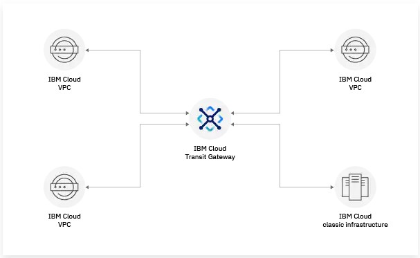
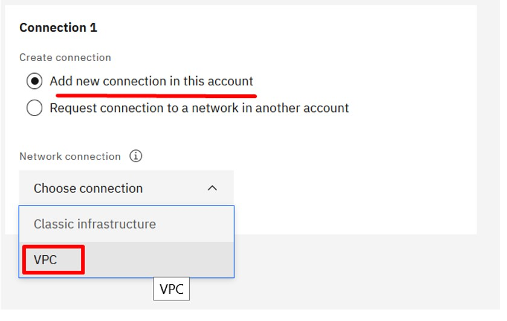
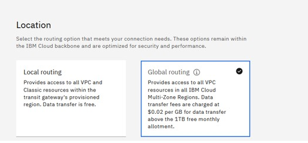
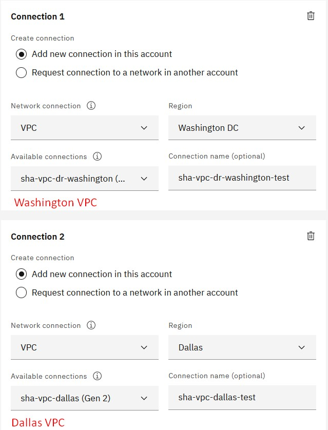
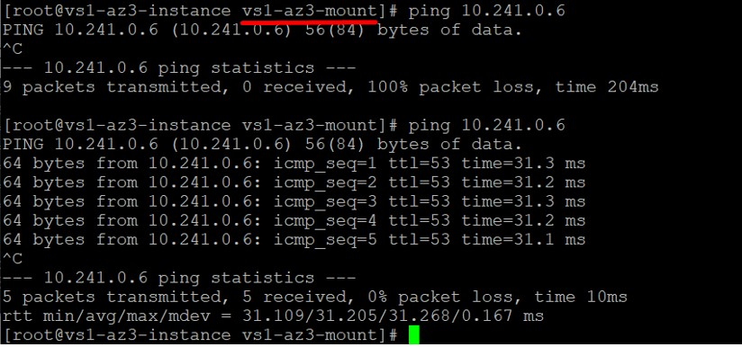
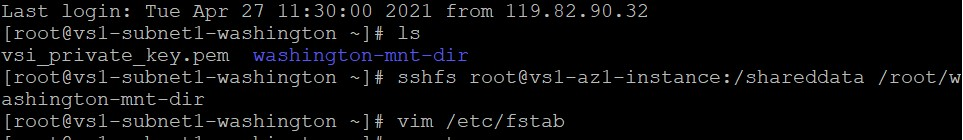
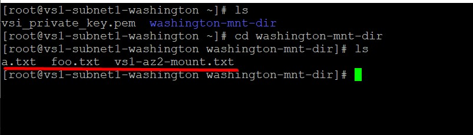

import Globals from 'gatsby-theme-carbon/src/templates/Globals';

<PageDescription>

</PageDescription>

## Introduction
This article show cases cross VPC sharing of volumes which might be useful in DR kind of scenarios

## Architecture
The solution has DC and DR located in two regions Dallas and Washington DC within Virtual Private Clouds (VPC) that are connected to each other through a transit gateway. The shared block storage is hosted on virtual server hosted in zone Dallas1 and mounted through SSHFS on virtual server in Dallas2 zone and Washington1 zone in DR site .

## Transit Gateway
IBM Cloud® Transit Gateway is used to interconnect IBM Cloud classic and Virtual Private Cloud (VPC) infrastructures worldwide, keeping traffic within the IBM Cloud private network. With IBM Cloud Transit Gateway, organizations can define and control communication between resources on the IBM Cloud network, providing dynamic scalability, high availability, and private, in-transit data between IBM Cloud data centers. Transit gateways are commonly implemented to support hybrid workloads, frequent data transfers, private workloads, or to ease administration of the IBM Cloud environment. One can configure several types of connections with IBM Cloud Transit Gateway:

    1. Connect VPCs in the same region (local routing)
    2. Connect VPCs in different regions (global routing)
    3. Connect VPCs to your IBM Cloud classic infrastructure

We will be leveraging the capability of VPC Interconnect across regions to connect DC and DR through transit gateway.

From cost perspective Transit Gateway is charged above 1TB data transfer monthly. Refer below link for details on pricing:

https://cloud.ibm.com/docs/transit-gateway?topic=transit-gateway-tg-pricing

Transit needs to be created in one of the region say Dallas or Washington.

Select “VPC” as both source and destination networks are VPC.

For cross region routing “Global Routing” needs to be enabled.

Add Connections

To configure gateway one would need to hook VPC from both the ends which in our case is Dallas and Washington.

## Test Connectivity between Virtual Machines from Dallas VPC and Washington VPC

Ping Washington server from Dallas VPC availability zone 3

Repeat the test with Virtual servers located in other zones. We are now ready to proceed further for mounting. Follow the steps mentioned in previous article to miunt the remote volume to local directory as shown below.

Make entry in **/etc/fstab**

Check whether files are available:

## References
a) https://medium.com/@moreal70/how-to-integrate-securely-multiple-vpcs-on-ibm-cloud-1835438d5941

b) https://cloud.ibm.com/docs/transit-gateway?topic=transit-gateway-about

c) https://www.ibm.com/cloud/blog/announcements/ibm-cloud-transit-gateway

