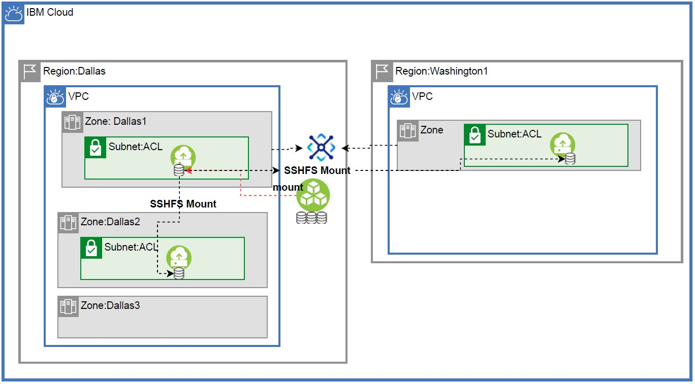

import Globals from 'gatsby-theme-carbon/src/templates/Globals';

<PageDescription>

</PageDescription>

## Introduction
This article show cases cross VPC sharing of volumes which might be useful in DR kind of scenarios

## Architecture
The solution has DC and DR located in two regions Dallas and Washington DC within Virtual Private Clouds (VPC) that are connected to each other through a transit gateway. The shared block storage is hosted on virtual server hosted in zone Dallas1 and mounted through SSHFS on virtual server in Dallas2 zone and Washington1 zone in DR site .

