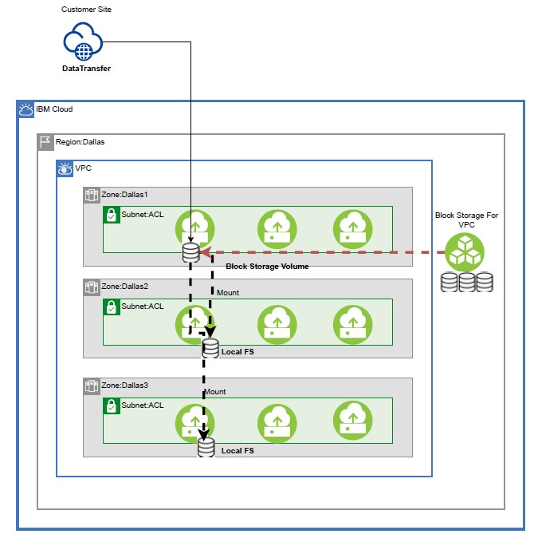
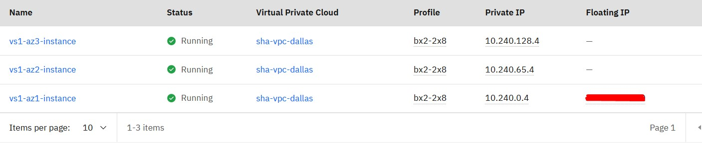
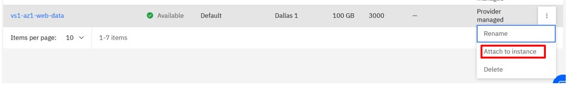
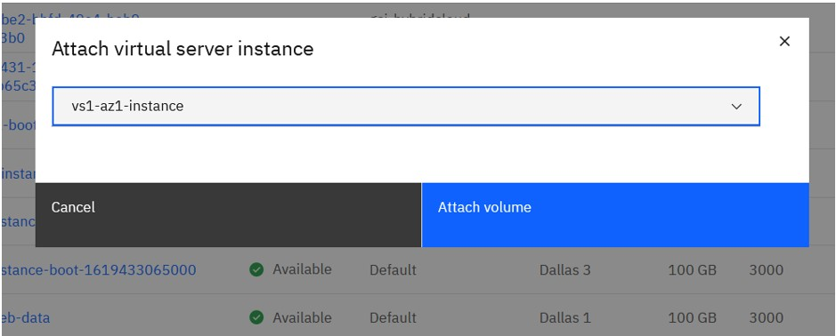
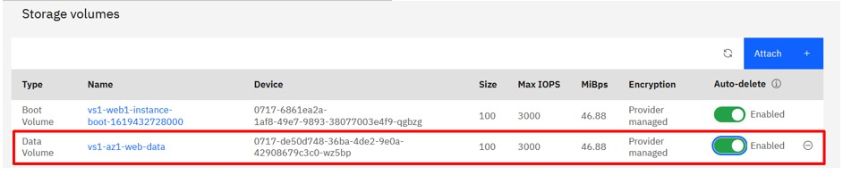
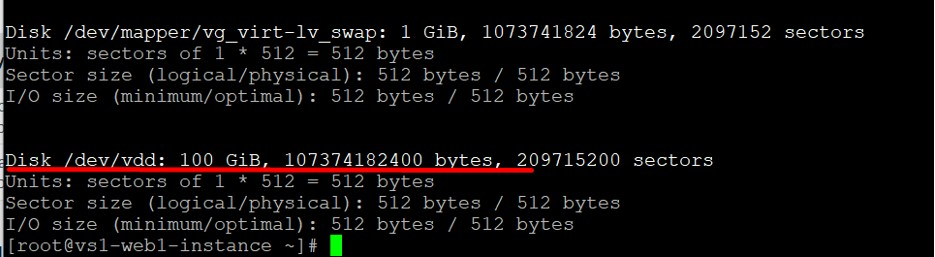
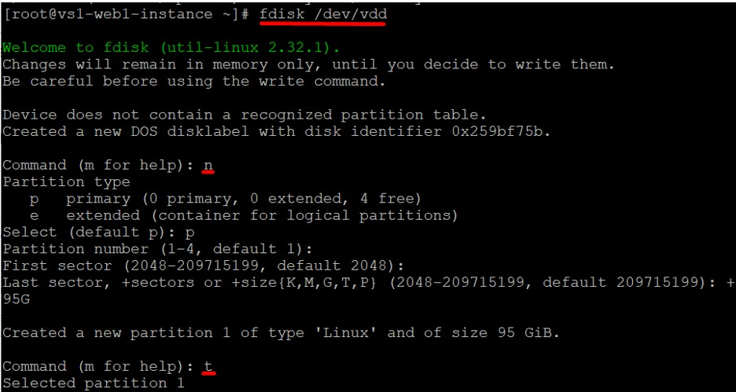
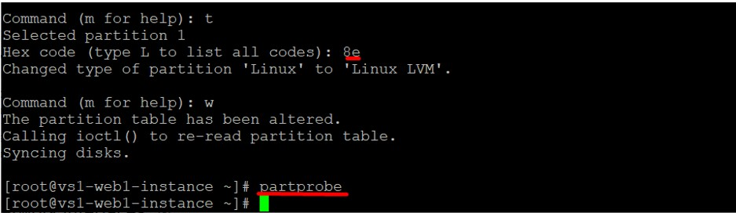
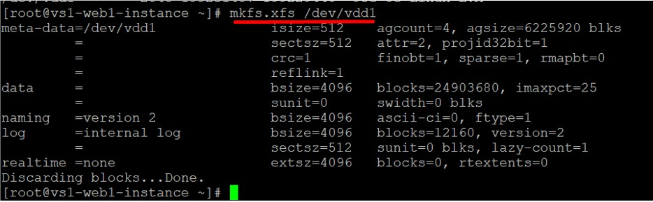

import Globals from 'gatsby-theme-carbon/src/templates/Globals';

<PageDescription>

</PageDescription>

## Introduction
There might be situations where customer scenario would require sharing of tiered block storage volumes of varied IOPS to be shared across computes in different availability zones. This article leverages SSHFS to overcome this limitation using a very basic service of SSH which is availabile across operating systems flavours. This recipe is specific to IBM Cloud VPC network construct.

Note: There currently is not NFS offering in VPC, but one can setup NFS servers and clients and manage them. In this article we are using sshfs instead of NFS to share the volume from one VSI to other VSIs in different regions.

## Architecture
This recipe is based on Implementing below architecture where in block storage for VPC is mounted on virtual server based out of Dallas 1 zone. This volume is then mounted on virtual servers in zones – Dallas2 and Dallas3. So whatever data is written to Dallas1 volume is replicated to Dallas2 and Dallas3. I will take virtual server hosted in Dallas1 data center as primary server or master, where as servers hosted on Dallas2 and Dallas3 as secondary servers or Slaves.

## Pre-requisites
To Implement this scenario one would need to establish passwordless authentication between secondary servers and primary server or master as shown in below diagram. IBM Cloud VPC comes with private key authentication mechanism by default and one can’t establish passwordless authentication that. Hence one would need to change SSH configuration from private key authentication to password based authentication. Install fuse-sshfs library on secondary servers by running below command :

Reboot the machine once after installing fuse-sshfs as many times it throws below error during mounting:

## “Transport endpoint is not connected“

 or one can manually download the latest verion:

wget https://github.com/libfuse/sshfs/releases/download/sshfs-3.5.2/sshfs-3.5.2.tar.xz

The details of virtual Instances are mapped across availability zones as below:

## Attach Block Storage Volume to Primary Server

Verify in Instance that volume is attached.

## Create Volume on Attached Storage

Verify that disk is mounted in OS

Create Volume that we will mount on other two Instances spread across zones.

Set xfs file system on the partition.

