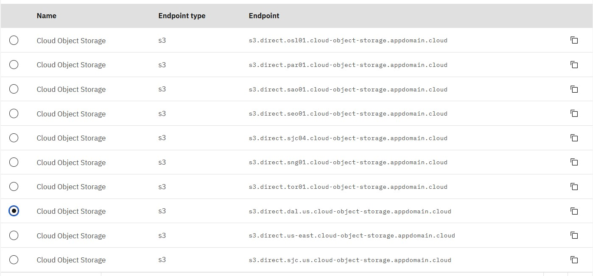

import Globals from 'gatsby-theme-carbon/src/templates/Globals';

<PageDescription>

</PageDescription>

## Introduction
IBM Cloud® Virtual Private Endpoints (VPE) for VPC enables you to connect to supported IBM Cloud services from your VPC network by using the IP addresses of your choosing, allocated from a subnet within your VPC.

VPE is an evolution of the private connectivity to IBM Cloud services. VPEs are virtual IP interfaces that are bound to an endpoint gateway created on a per service, or service instance, basis (depending on the service operation model). The endpoint gateway is a virtualized function that scales horizontally, is redundant and highly available, and spans all availability zones of your VPC. Endpoint gateways enable communications from virtual server instances within your VPC and IBM Cloud® service on the private backbone. VPE for VPC gives you the experience of controlling all the private addressing within your cloud.

For more details refer: https://cloud.ibm.com/docs/vpc?topic=vpc-about-vpe

In this recipe I will start with a reference architecture start which I will Implement to conform to certain use case.

## Use Cases
In this use case I will be sharing the data across availability zones in VPC and DR site using IBM Cloud object storage where in DC is located in Dallas region and DR is located in Washington region. I will mount cloud object storage bucket across regions and within region to actively share the data.

## VPC - DC and DR Architecture

## DC Implementation Architecture in IBM Cloud Console

## DR Implementation Architecture in IBM Cloud Console

## Adding VPE Gateway 

IBM Cloud® Virtual Private Endpoint (VPE) for IBM Cloud™ Virtual Private Cloud provides connection points to IBM services on the IBM private network from your VPC network. VPE has multiple benefits like:

    1. Public connectivity is not required and has no public data egress charges.
    2. Reaches IBM Cloud assets through a private service provider.
    3. A VPE lives in your network address space, extending your private and multicloud into the IBM Cloud.
    4. You can apply security through Network Access Control Lists (NACLs).
    5. The endpoint IP deploys in a customer-defined, virtual network.
    6. Includes platform integration to VPC – Identity and Access Management (IAM), network ACLs, and tagging.
    7. Access to new endpoints is achieved through the UI, CLI, and API.
    8. You can map a new endpoint to an existing service, as well as map to a shared endpoint.
    9 Integrates with DNS Services.

 

The COS bucket is already set up in US region as multi-region and to share bucket across compute instances in DC and DR. I will not cover the details of configuring COS in this article. To mount these buckets in compute instances across regions over the private network, we have to setup VPE. For this one would need to be aware of end-point URL of COS bucket.

## Step1

## Step2

## Step3

## Step4

## Step5

This will create VPE for our DR site pointing to COS as shown below:

Similar VPE is created for DC Site. As you can see in below screen shot this VPE is linked to two subnets in primary VPC so that bucket can be shared across Instances in these two subnets.

VPE uses direct end-points as shown in the above screen shot. This service endpoint can be verified from the bucket Instance. Lets browse through the COS bucket Instance that I have created and understand on how to get the service end-point of the bucket to be used with VPE.

Since I have created Cross region COS, I will select the region where my bucket is located which is US in current scenario.

Since in the scenario DC is in Dallas and DR is Washington, select and copy direct end-point URL for both and keep it for reference

## Architecture after VPE is Created
After the VPE is created, we will have a direct private end-point for COS bucket. We are now going to mount this bucket on POSIX file system dirctory in Linux as shown below. The below architetcure depicts accessibility of bucket through VPE.
   -- Not Working

## Mounting Bucket in Virtual Servers on DC and DR Sites
Now we have reached the final step of the article where I will be mounting the bucket into Virtual servers in DC spanned across subnets and DR witin one subnet. Before we start with mounting few pre-requisite libraries would need to be Installed.

  

 

Once these are Installed we need to create a credential file in home directory with credentials in the format as below:

 

 

The ACCESS_KEY_ID key and SECRET_ACCESS_KEY_ID can be found in bucket configuration.

 

Run chmod 600 .passwd-s3fs command on the file, else one would get a permission error on runing mount command.

 

Create a directory where you would like to mount bucket which in my case is “/mycosbucket”. One can create this directory through mkdir command.

After the above steps run the command to mount the bucket on POSIX directory.

**s3fs my-bucket-4566 /mycosbucket -o passwd_file=~/.passwd-s3fs -o url=https://s3.direct.dal.us.cloud-object-storage.appdomain.cloud**

and browse the mounted directory to verify its content:

 

Repeat the above and below steps for other VSI’s in consideration.

## Mounting Bucket permanently 
To make mount permanent even after VSI reboot, enter below entry in /etc/fstab directory.

**my-bucket-4566 /mycosbucket fuse.s3fs _netdev,allow_other,use_path_request_style,url=https://s3.direct.dal.us.cloud-object-storage.appdomain.cloud 0 0**

 

Reboot the machine to verify persistence of the mounted bucket. Finally the architecture would look like as below.

## Testing the Configuration
Now we have mounted COS bucket in DC on VSI across availability zones and in DR VPC in single AZ, lets verify whether files are shared across consistently or not.
 

This shows data is synchronized across zones and regions which are participating in DC and DR in our solution.
