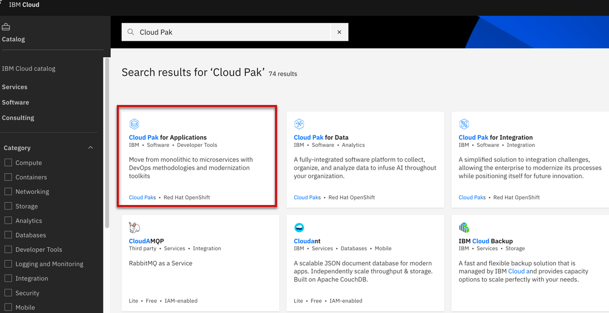
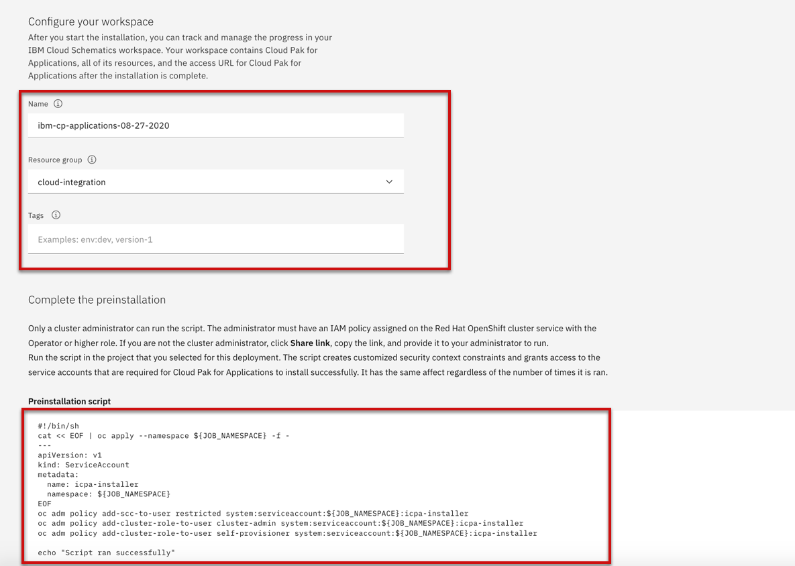
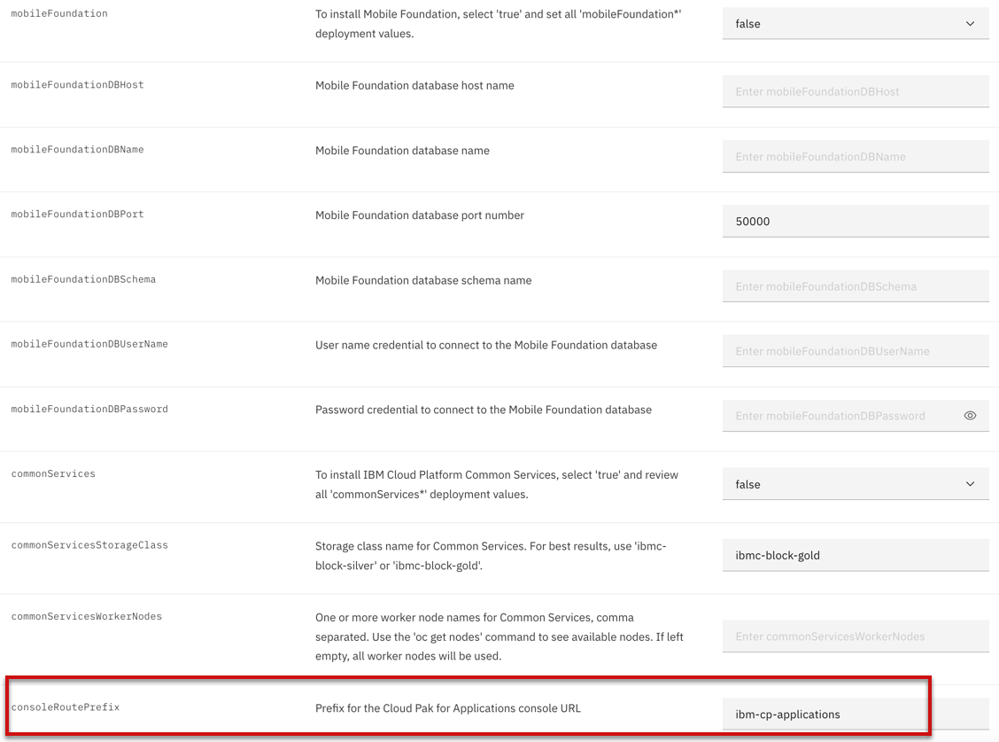
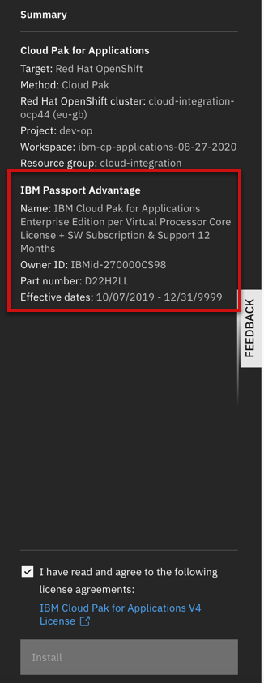

import Globals from 'gatsby-theme-carbon/src/templates/Globals';

<PageDescription>

</PageDescription>

## Introduction

IBM Cloud Pak for Applications is an enterprise-ready, containerized software solution for modernizing existing applications and developing new cloud-native apps that run on Red Hat OpenShift.

## Single Install Click from IBM Catalog

Get a Red Hat OpenShift cluster and configure it for use with the Cloud Pak. If you do not have a cluster, create one and then return to the Cloud Pak for Applications page.

### Assign a license
The license purchased through IBM Passport Advantage appears in the list of available entitlements Click an entitlement block to select it. Click Assign.

### Search Cloud Pak Software

Select the catalog and search for IBM Cloud Pak for application software as shown in the diagram

### Configure your installation environment

Select the Red Hat OpenShift cluster as well as Cloud Pak for Application version where you want to install

### Configure your workspace & Complete the pre-installation

Select the resource group where you want to track and manage resources as well as execute the Preinstallation script. The script creates customized security context constraints and grants access to the service accounts that are required for Cloud Pak for Applications to install successfully. 

### Set the deployment values

Set the consoleRoutePrefix parameter. This value is used as the subdomain in the URL for the Cloud Pak for Applications landing page. 

### Install the Cloud Pak

Ensure that an entitlement is assigned. If not, you must get an entitlement.

Confirm your agreement to the Third-Party Service Agreements by checking the box. Then, click Install.

## Additional options to install Cloud Pak for Application

Refer to Cloud Pak Install guide for different options - https://cloudpak8s.io/apps/cp4a_installation/