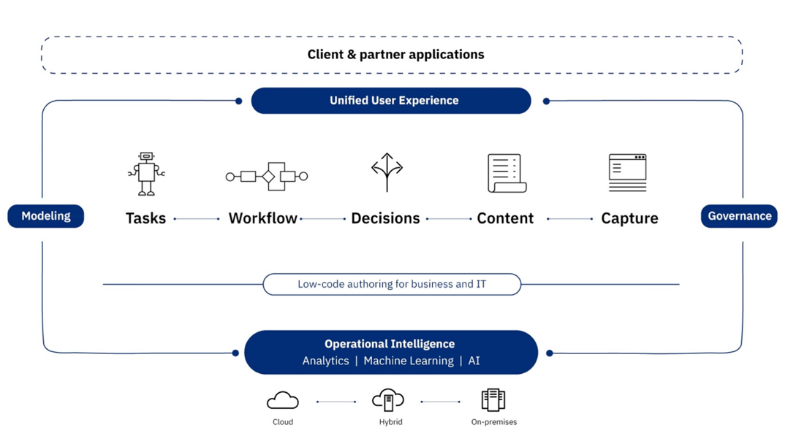

import Globals from 'gatsby-theme-carbon/src/templates/Globals';

<PageDescription>

</PageDescription>

## Automation overview

Digital business automation (DBA) allows an organization to improve its operations by streamlining the way people participate in business processes and workflows, automate repeatable decisions, and provide business users with the ability to edit and change the business logic involved in these business processes. DBA projects also aim to make documents easy to store and retrieve, digitize document content, such as with optical character recognition (OCR), and automate data entries with software robots, also referred to as robotic process automation.

The IBM Cloud Pak for Automation offers a software platform to develop, deploy, run and manage your digital business automation projects, using the capabilities shown in the following digram: 

Refer here for step by step instructions to install Automation - https://cloudpak8s.io/automation/pre-requisites/