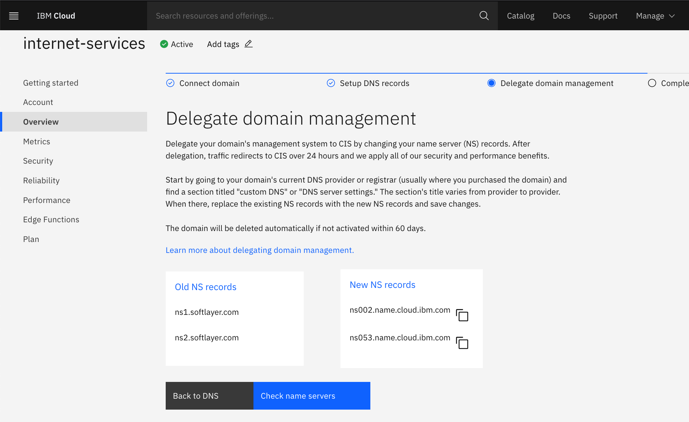
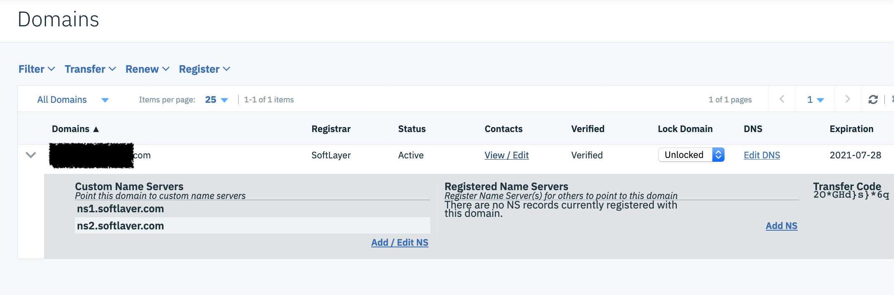

import Globals from 'gatsby-theme-carbon/src/templates/Globals';

<PageDescription>

</PageDescription>

## **Automation overview**

Digital business automation (DBA) allows an organization to improve its operations by streamlining the way people participate in business processes and workflows, automate repeatable decisions, and provide business users with the ability to edit and change the business logic involved in these business processes. DBA projects also aim to make documents easy to store and retrieve, digitize document content, such as with optical character recognition (OCR), and automate data entries with software robots, also referred to as robotic process automation.

The IBM Cloud Pak for Automation offers a software platform to develop, deploy, run and manage your digital business automation projects, using the capabilities shown in the following digram: 

## **Receipe Overview**

The intent of this recipe is to provide a simplified set to steps, to set up an instance for PoC or Demos with least effort. Viewer is advised to refer to the original Enterprise install steps once before going ahead with these steps.
Ingredients


1. IBM ROKS Openshift cluster v4.3  (  6 worker nodes with 8 cores x 16 GB RAM )

2. A RHEL 7.x VM ( 4 cores x 16 GB RAM) for  DB2, IBM security Directory server and NFS file share.

3. Cloud Pak for Automation v20.0.1

4. DB2 v11.1

5. IBM Security Directory Server v6.4

6. workstation with oc, kubectl, git  installed for executing the steps during install.

## **Step-by-step**

### **1. Provision Openshift Cluster**

Provision an Openshift cluster v4.3 with 6 worker nodes having 8 cores x 16 GB RAM , on IBM Cloud. If it’s provisioned by someone else, the person following the instructions, should have Admin access to the cluster.  

### **2.Provision 1 or more VMs for shared services. ( 1 would suffice)**

Some of the install instructions related to DB2 and TDS (Tivoli Directory Server , which is now called – IBM Security Directory server )   require use of RPM so one of the supported linux distros is recommended. Steps have been tested with RHEL 7.x.  ( 4 cores x 16 GB RAM) . 4 x 8 should also suffice.

### **3. Clone the github repository for helper scripts**

1.The original (official)  documentation can be found in Knowledge Center. It refers to github repo:  https://github.com/icp4a/cert-kubernetes/tree/20.0.2 for helper scripts.

2. Some additional helper scripts (with some assumptions for Enterprise installs for dev environments ) have been added in this fork of the official project here:  https://github.com/sachinjha/cert-kubernetes/tree/20.0.2

3. Going through the knowledge Center link above is recommended to understand the overall install plan. In knowledge Center, refer to “Enterprise Install” options and anything that applies to “ROKS” ( Redhat Openshift Kubernetes Service , on IBM Cloud ) , as that is our environment.  Instructions which apply to “OCP” but are not supported on ROKS are not applicable. Look for correspoding options for ROKS.
     
### **4.Setup NFS services**
1. The storage capacity in default disk attached to VMs may not be sufficient. (Default is 25GB and max is 100GB). It’s recommended to add an additional disk (File Storage – 750 GB or more)  from IBM cloud console and use that for NFS.
        
2. Once you have added disk run – ‘fdisk -l’ to view the disks attached. See image below for example. here /dev/xvdc is the additional device.

3. 

4. Run folowing commands to create filesystem and mount the disk.
    - mkfs.ext4 /dev/xvdc
    - mkdir /opt/nfs2
    - mount /dev/xvdc /opt/nfs2
        
5. Follow the steps [here](https://linuxconfig.org/quick-nfs-server-configuration-on-redhat-7-linux) for setting up NFS service on RHEL

6. Perform following steps to configure the folders required for ICP4Auto components and for updating /etc/exports for NFS
    1. copy files ( configure-nfs.sh  and nfs-exports-configuration.txt)  under this link , in the git project to NFS server.
    
    2. configure-nfs.sh will create all the folders with required permissions for components which need NFS based storage.
    
    3. nfs-exports-configuration.txt  has the place holders for /etc/exports.
    
    4. Replace the W*Public and W*Private  in nfs-exports-configuration.tx with Public and Private IPs of 4 worker nodes. 
   
    5. chmod +x configure-nfs.sh
   
    6. ./configure-nfs.sh
   
    7. Verify that  nfs status is green and  /etc/exports is updated with configuration
 
### **5. Setup other shared Services - LDAP and DB2**


####  LDAP and DB2 installation:
1. Follow the steps on this page for installing DB2 and LDAP.  Instructions are for Linux only. Read the complete instructions for the section before proceeding to perform the steps. Some troubleshooting steps for DB2 install can be found [here](https://github.com/sachinjha/cert-kubernetes/tree/20.0.2/shared-services/db2.md).    
2. Run the following commands after Create Instance Step in SDS setup, before starting the server. In case you have started it, you can stop it, using the  commands given in the link, peform the steps below and then start it again.


```sh
# Configure a database for a directory server instance.
./idscfgdb -I dsinst1 -a dsinst1 -w <your-password> -t dsinst1 -l /home/dsinst1

# Set the administration DN and administrative password for an instance
./idsdnpw -I dsinst1 –u cn=root –p <your-password>

# Add suffix
./idscfgsuf -I dsinst1 -s o=IBM,c=US
```

Use the LDIF file [referenced here](https://cloudpak8s.io/automation/shared-services/#import-ldap-users-and-groups) to add some default users to LDAP.

Note: One can change the suffix to suit their org and country for e.g. o=ABC,c=IN but make sure to update the references in LDIF file given in the above link,  before importing it into LDAP and also in the CR yaml (icp4acluster) used for installing the components.

 

#### 2nd instance of LDAP ( TDS )
2nd instance of LDAP ( TDS ) is  required for BAN and FNCM if you want external users to access. Steps to create 2nd instance are [here](https://github.com/sachinjha/cert-kubernetes/blob/20.0.1/shared-services/tds%20ext%20ldap%20creation.sh).


#### Security Groups for LDAP and DB server 
Make sure the security group attached to the VM allows inbound on port:  22(ssh),  50000 (db2) , 389 (ldap) , 390 ( ext ldap) , 2049( nfs)   and outbound on ports :  53  (dns) , 443 ( https) , 80 ( http) )

### **6. Identify the suffix for Openshift routes and secure routes**

**Use the following option if routes with self signed certificates are not a problem.**

1. Get public IP of loadbalancer using any of the methods given in the image below.
    
2. 

3. Use a suffix like  publicIP.nip.io

4. For example, in this case ,  suffix can be “169.44.184.38.nip.io”  and a sample hostname for UMS service, can be “ums.169.44.184.38.nip.io”
     
**In case there is a need to create secure routes with certificates signed by known CAs then follow the steps below: ( This hasn’t been completely tested for all components )**
        
1. ***Update on 31st Aug 2020- secure routes not getting created as expected, with Let’s Encrypt intermediate_cert, so one may choose the above option, or stop at 7 and use the registered domain, allowing operator to generate the certificates.***
2. In IBM Cloud ->Classic Infrastruction -> Services -> Domain Registration, register a domain  ( e.g. automation.org.xyz.com )  
3. Create an instance of  "IBM Internet services", on IBM cloud  and update the custom name servers in “Domain Registration”  to the name servers given in “IBM Internet Services” setup page.
4. 
5. 

6. Updation of records might take 24 hrs to reflect in "internet services"
7. In "internet services" Create a wildcard subdomain  A record  * which maps to the above loadbalancer IP. e.g. *.cp-automation -> < public IP found above >
8. Create an instance of "certificate manager" and select wild card subdomain as CN for certificates.
9. For Example : Generate an SSL certificate with wild card subdomain ( *.cp-automation.org.xyz.com ) 
10.Let's encrypt certificate should give you key, cert and Intermediate Cert ( which is authorized to issue certs, and can be used as CA) . We will use this to create a secret which will act as the root-ca-secret and will be referred in the Cloud Pak for Automation Custom resource file

### **7. Next steps - Follow Knowledge Center**

Simplified steps are given below i.e. Step 8 onwards  but its important to understand the process as documented in the  Knowledge Center .

1. On ROKS, you need to install cluster manually. 

3. Look at Preparing to install Containers for components of interest.

    Foundation pattern is a prerequisite for any other pattern, so start with that and then add different patterns to the custom resource file as required.

4. Deploy custom resource after manually updating the sections for different components with values that need to be configured.

### **8. Create DB2 databases required for different components**

Steps for components which are not of interest can be skipped. UMS should be done as UMS is required for all other components.

Execute all the scripts as user db2inst1. On the DB server, ensure that db2 is in PATH  by running command below and then follow the instructions below for each of the components:
```     
su db2inst1
./home/db2inst1/sqllib/db2profile
```
     
1. **UMS**
    - copy [file](https://github.com/sachinjha/cert-kubernetes/blob/20.0.2/UMS/configuration/create-db.sh) or contents of the file and execute them on DB server.
    
2. **BACA**
    - copy [DB2](https://github.com/sachinjha/cert-kubernetes/tree/20.0.2/ACA/configuration-ha/DB2) folder to DB server.
    - Execute the scripts CreateBaseDB.sh  and AddTenant.sh.
    - See [log](https://github.com/sachinjha/cert-kubernetes/tree/20.0.1/ACA/configuration-ha/db-creation-logs) files for sample values that can be used. ( mostly defaults )
        ( bacaadmin is a user created in LDAP when the LDIF file is imported. If you change users, use it accordingly when executing the script)

3. **ODM**
    - copy [file](https://github.com/sachinjha/cert-kubernetes/blob/20.0.2/ODM/configuration/create-db.sh) or contents of the file and execute them on DB server.
     
4. **ICN**
    
    - copy [file](https://github.com/sachinjha/cert-kubernetes/blob/20.0.2/BAN/configuration/create-db.sql)   or contents of the file and execute them on DB server

    ```
    db2 -tvf create-db.sql
    ```

5. **FNCM**
    - copy [DB2](https://github.com/sachinjha/cert-kubernetes/tree/20.0.2/FNCM/configuration/DB2) folder to DB server.
    - Execute the scripts
        
    ```
    ./create-gcd.sh 
    ./create-os.sh
    ```

6. **APPENG**

    - copy [file](https://github.com/sachinjha/cert-kubernetes/blob/20.0.2/BAS/configuration/appenng-db2.sql) or contents of the file and execute them on DB server

    ```
    db2 -tvf appeng-db2.sql
    ```        
    
7. **BAStudio**

    - copy [db2](https://github.com/sachinjha/cert-kubernetes/tree/20.0.2/BAS/configuration/db2) folder to DB server.
    - Use db2 command to execute the .sql files

    ```
    db2 -tvmf bastudio.sql
    db2 -tvmf appengine.sql
    ```

8.  **BAW ( on containers)**
        
    - copy file to DB server.
    - Use db2 command to execute the .sql files
            
            
    ```
    db2 -tvmf  create-db.sql
    ```

    - Use the create-os.sh script from FNCM (in step 5) and create 2 Object storage dbs  DOSDB and TOSDB.  Just the db names are different, rest of the values in the script file should be same.

      


### **9.Install Operator**

1.
    ```
    oc new-project automation.
    ```
2. If you use a different name for the project, you may have to edit multiple files in the next step, where namespaces may be hard coded.

3. On ROKS, you need to install cluster manually.  Before creating the operator, look at the

    a) [link for preparing Storage](https://www.ibm.com/support/knowledgecenter/SSYHZ8_20.0.x/com.ibm.dba.install/op_topics/tsk_prep_operator.html?_ga=2.20303472.936333667.1604297352-1372577732.1601029870) for Operator.  Create storage classes using the sample files given in the project and use one of them for operator-shared-pvc. For e.g. cp4a-file-retain-bronze-gid. Ignore step 6 and 7 at this stage.

    b)  [Getting access to container images](https://developer.ibm.com/recipes/tutorials/access%20to%20container%20images): You can use entitled registry. When creating the secret set docker-username=cp

4. Now create the common service and Operator using the steps given here. If you are going to configure BAI and going to configure IBM Eventstreams for that then execute the create common services script with argument “bai” e.g.
    
    ```
    ./deploy_CS3.4.sh bai
    ```

5. Now [Install operator](https://www.ibm.com/support/knowledgecenter/SSYHZ8_20.0.x/com.ibm.dba.install/op_topics/tsk_setup_cluster_manually.html?_ga=2.218958161.936333667.1604297352-1372577732.1601029870)
6. Copy jdbc jars  to operator pod by following steps [6 and 7 here](https://www.ibm.com/support/knowledgecenter/SSYHZ8_20.0.x/com.ibm.dba.install/op_topics/tsk_prep_operator.html?_ga=2.20303472.936333667.1604297352-1372577732.1601029870).


###  **10.Create secrets , Rolebindings, PVs and PVCs for different components. **

After updating the component related files, do not forget to tun the script “create_preequisites.sh” to apply the changes .

PWD = Root folder of cert_kubernetes project.

1.UMS
    - Update the value of keys – oauthDBPassword and tsDBPassword in UMS/configuration/secrets.yaml with password for db2inst1 set during step 5.
    - Update the values of keys externalLdapPassword,  ldapPassword and lc_ldap_bind_password to values set during LDAP installation in step 5 in UMS/configuration/ldap-bind-secret.sh
2.BACA
    - Update the (file)[https://github.com/sachinjha/cert-kubernetes/blob/20.0.2/ACA/configuration-ha/security/aca-basedb-secret.sh] with db2 password configured in step 5.
3.ODM
    - Update the (file)[https://github.com/sachinjha/cert-kubernetes/blob/20.0.2/ODM/configuration/create-db.sh] with db2 password configured in step 5.
    - If configuring integration with UMS, update (file)[https://github.com/sachinjha/cert-kubernetes/blob/20.0.2/ODM/configuration/security/sample-websecurity-OIDC-ums.xml] with different username or ldap group and Suffix if the default values are not suitable.
4.BAS 
    - ( Includes Resource Registry and App Engine) Update BAS/configuration/db2/secret.yaml by replacing values of “dbPassword” and “AE_DATABASE_PWD” with password set for db2inst1 in Step 5.
5.BAI
    - Update BAI/configuration/bai-psp.yaml and replace CR_NAME with actual custom resource name.
    - update create-prerequisites.sh and modify icp4adeploy-bai-psp-sa  in “BAI” section according to CR_NAME if it’s different from icp4adeploy.
6.BAN
    - Update the values of navigatorDBPassword, ldapPassword , externalLdapPassword in BAN/configuration/ban-secret.sh
7.FNCM
    - Update the values of gcdDBPassword, osDBPassword , ldapPassword in FNCM/configuration/ibm-fncm-secret.sh
    - Update the value of <NFS SERVER> in FNCM/configuration/volumes_cmis.yaml,  graphql_volume.yaml and volumes_cpe.yaml  with with NFS server IP configured in step 4
8.App Engine:
    - Update the values of AE_DATABASE_PWD in BAS/configuration/secret.yaml with DB2 password
9.BAW on containers: 
    - Update the values of db2 passowrd in the file : BAW/configuration/encryption-key-secret.yaml

 

 ```
cd scripts.  # change to scripts folder.
./create-prerequisites.sh
```

### **11. Install Kafka ( if installing Business Automation Insights (BAI) )**

Follow the instructions [here](https://www.ibm.com/support/knowledgecenter/en/SSYHZ8_20.0.x/com.ibm.dba.install/op_topics/tsk_preparing_baik8s_kafka_install.html?_ga=2.8252794.936333667.1604297352-1372577732.1601029870). for different kafka options including IBM Eventstreams.  I have configured IBM Eventstreams v10 using the instructions given in the link above.    

### **12. Update the Custom resource YAML **


- See [this](https://www.ibm.com/support/knowledgecenter/en/SSYHZ8_20.0.x/com.ibm.dba.install/op_topics/con_capab_ent.html?_ga=2.14983550.936333667.1604297352-1372577732.1601029870) page for understanding patterns and their dependencies. 
- For any pattern, the minimum required configuration parameters can be found in "descriptors/patterns/ibm_cp4a_cr_enterprise_< capability >.yaml"  and
- For any pattern,  fully customizable list of  parameters can be found in  "descriptors/patterns/ibm_cp4a_cr_enterprise_FC_< capability >.yaml"
- If only specific capabilities are being installed, the required parameters for that capability can be identified by looking at the capability specific yaml file described described in 2 and 3.
- If installing multiple capabilities, the parameters need to be combined to one yaml file and the sample file referred below is an example of that.
- Create a copy of descriptors/patterns/ibm_cp4a_cr_enterprise_sample.yaml and make the below updates in the copy.
- Remove configuration for applications which are not of interest. ( for e.g. ca_configuration is for ACA, bastudio_configuration is for BAStudio and so on. )
- Update fields below for different components ( by replacing values in < > with actual values)
- Make sure datasource_configuration is uncommented for the component being installed.

 

1.Shared Configuration:

    shared_configuration.sc_deployment_patterns:  <as per the components being installed >
    shared_configuration.sc_optional_components: <as per the components being installed >
    shared_configuration.sc_deployment_hostname_suffix: "cp-automation.<registered-domain or <public ip of loadbalancer>.nip.io>"
    shared_configuration.kafka_configuration.bootstrap_servers:  <eventstreams bootstrap server route>:443

2.LDAP Configuration

    ldap_configuration.lc_ldap_server : <server configured in step 5>
    ldap_configuration.lc_ldap_group_base_dn : <if base DN was modified during LDAP setup>

3.UMS Configuration

    datasource_configuration.dc_ums_datasource.dc_ums_oauth_host: <server configured in step 5>
    datasource_configuration.dc_ums_teamserver_host.dc_ums_oauth_host: <server configured in step 5>

        
4.CA Configuration

    datasource_configuration.dc_ca_datasource.database_servername: <server configured in step 5

5.BAStudio

    bastudio_configuration.database.host: <server configured in step 5>
    playback_server.database.host: <server configured in step 5

6.ODM

    datasource_configuration.dc_odm_datasource.database_servername: <server configured in step 5>

7.Filenet

    datasource_configuration.dc_gcd_datasource.database_servername: <server configured in step 5>
    datasource_configuration.dc_os_datasources.database_servername: <server configured in step 5>
    #verify_configuration and initialize_configuration sections are configured with default userids, tablespace and database names
    #If you are using different from default then update accordingly.

8.BAN ( ICN)

    datasource_configuration.dc_icn_datasource.database_servername: <server configured in step 5>

9.BAW 

    baw_configuration.hostname: baw1.<hostname_suffix>
    baw_configuration.database.server_name : <db server ip>
    baw_configuration.database.database_name: <db name>
    pfs_configuration.hostname:pfs.<hostname_suffix>
    datasource_configuration.dc_os_datasources.database_servername: <db server for  DOS db>
    datasource_configuration.dc_os_datasources.database_servername: <db server for TOS db>

10.BAI ( has some isssues in v20.0.2 on ROKS )

### **13. Install components**

    ```
    oc apply -f descriptors/ibm_cp4a_cr_enterprise_sample.yaml
    ```

**Check Operator Logs:**

    oc logs -f operator-pod -c operator

**check Ansible Logs** ( Updated after one round of operator reconcilliation for all components is complete ..varies from 8 – 25 mins ) :

    oc logs -f operator-pod -c ansible
   
### **14. Post install steps **

Check out the [Knowledge Center](https://www.ibm.com/support/knowledgecenter/en/SSYHZ8_20.0.x/com.ibm.dba.install/op_topics/tsk_deploy_postdeployk8s.html?_ga=2.214745823.936333667.1604297352-1372577732.1601029870) for post install steps for different components

Use the command “oc get routes” to get routes for all the installed components. Given below are some of the component URLs.

 

1.**UMS Login:**

    https://ums.< HOSTNAME_SUFFIX >/ums/ umsadmin/password

2.**BACA:**

- See the steps documented here. for details. High level steps outlined below.
- First hit the backend url ( required for every browser for the first time) ( not required if using routes secured by well known CA) : https://backend.<HOSTNAME_SUFFIX>
- Hit frontend URL : https://frontend.< HOSTNAME_SUFFIX >?tid=t4900&ont=default ( t4900 = tenant ID set during CATenant DB creation. and default = ontology name set during CATenant DB creation).

3.**BAStuido Login:**

    https://bas.<HOSTNAME_SUFFIX>/BAStudio umsadmin/password

4.**ODM Login:**

- https://decisionserverconsole.odm.icp4adeploy.< HOSTNAME_SUFFIX >
- https://decisioncenter.odm.icp4adeploy.<HOSTNAME_SUFFIX>
- For userId check file ODM/configuration/security/sample-webSecurity-OIDC-ums.xml. ( default is orgAdmin)

5.**BAI: **

Read throug the steps [here](https://www.ibm.com/support/knowledgecenter/en/SSYHZ8_20.0.x/com.ibm.dba.install/op_topics/tsk_post_bai_deploy.html?_ga=2.217819230.936333667.1604297352-1372577732.1601029870). for understanding how to make Kibana and Elastic search accessible outside the cluster.

6.**FNCM:**

- https://cpe-automation.<HOSTNAME_SUFFIX>/P8CE/Health ceadmin/passw0rd
- Check that there are no X symbols, which would mean something couldn’t be created.

7.**Navigator:*

- https://navigator.<HOSTNAME_SUFFIX>/navigator ceadmin/passw0rd
- Check that you can see the “ICN desktop” in the list of desktops ( created by initialization script)
- https://navigator.<HOSTNAME_SUFFIX>/navigator?desktop=demo

### ** Troubleshooting  **


**ODM Issues** 

icp4adeploy-default-deny network policy prevents egress from ODM pods to UMS pods so add a policy manually to allow that.

```
oc edit networkpolicy icp4adeploy-odm-dc-network-policy -o yaml
```
Update the spec portion of  yaml with following content to allow egress

```
    spec:
      egress:
      – {}
      ingress:
        ports:
        – port: 9453
          protocol: TCP
      podSelector:
        matchLabels:
          run: icp4adeploy-odm-decisioncenter
      policyTypes:
      – Egress
      – Ingress
```

In case there is an error about unknown Client_ID when the browser redirects to UMS,  the CLIENT_ID registration wasn’t successful, which Can be confirmed by looking at the icp4adeploy-odm-oidc-job-registration-* pod logs. 

In this case, manually register the ODM client to UMS.

Download the postman file here, replace < HOSTNAME_SUFFIX > with the value for your environment.  Confirm that the redirect_uris match with the URIs shown in the icp4adeploy-odm-oidc-job-registration-* pod logs.

** Troubleshooting BAI - TBD**

**If operator pod hangs**

sometimes, the operator logs show no update for a long time e.g. 20 mins. In that case one can delete the operator pod and see if that fixes the issue

 

oc delete < operator pod > -n automation.
