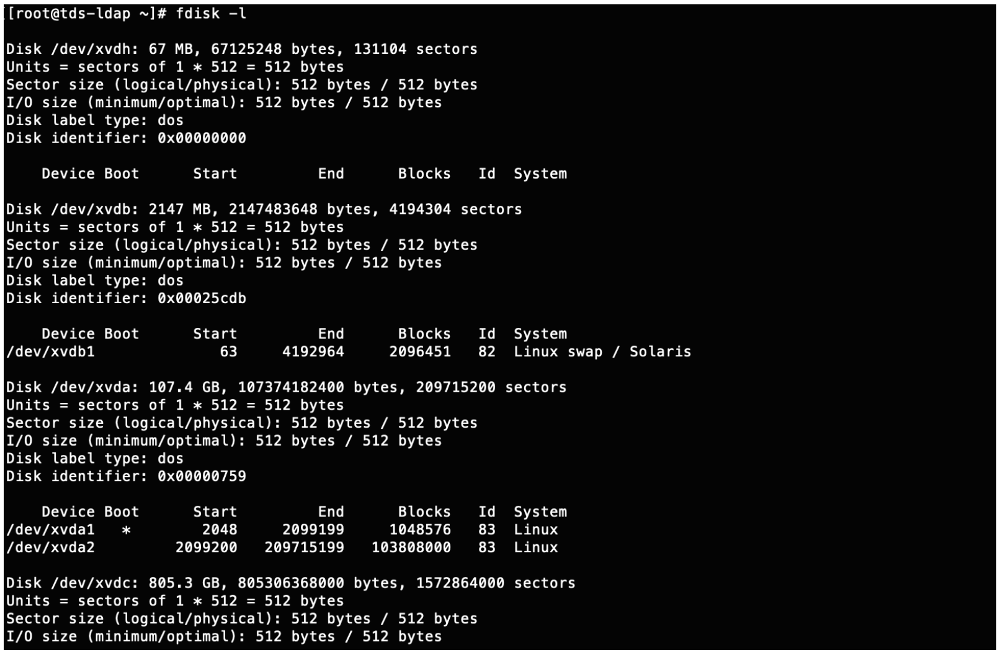

import Globals from 'gatsby-theme-carbon/src/templates/Globals';

<PageDescription>

</PageDescription>

## **Automation overview**

Digital business automation (DBA) allows an organization to improve its operations by streamlining the way people participate in business processes and workflows, automate repeatable decisions, and provide business users with the ability to edit and change the business logic involved in these business processes. DBA projects also aim to make documents easy to store and retrieve, digitize document content, such as with optical character recognition (OCR), and automate data entries with software robots, also referred to as robotic process automation.

The IBM Cloud Pak for Automation offers a software platform to develop, deploy, run and manage your digital business automation projects, using the capabilities shown in the following digram: 

## **Receipe Overview**

The intent of this recipe is to provide a simplified set to steps, to set up an instance for PoC or Demos with least effort. Viewer is advised to refer to the original Enterprise install steps once before going ahead with these steps.
Ingredients

1. IBM ROKS Openshift cluster v3.11  (  5 worker nodes with 8 cores x 32 GB RAM )

2. A RHEL 7.x VM ( 4 cores x 16 GB RAM) for  DB2, IBM security Directory server and NFS file share.

3. Cloud Pak for Automation v20.0.1

4. DB2 v11.1

5. IBM Security Directory Server v6.4

6. workstation with oc, kubectl, git  installed for executing the steps during install.

## **Step-by-step**

### **1. Provision Openshift Cluster**

Provision an Openshift cluster v3.11 with 4 worker nodes having 8 cores x 32 GB RAM , on IBM Cloud. If it’s provisioned by someone else, the person following the instructions, should have Admin access to the cluster.
   
### **2.Provision 1 or more VMs for shared services. ( 1 would suffice)**

Some of the install instructions related to DB2 and TDS (Tivoli Directory Server , which is now called – IBM Security Directory server )   require use of RPM so one of the supported linux distros is recommended. Steps have been tested with RHEL 7.x.  ( 4 cores x 16 GB RAM) . 4 x 8 should also suffice.

### **3. Clone the github repository for helper scripts**

1.The original (official)  documentation can be found here:  https://github.com/icp4a/cert-kubernetes/tree/20.0.1

2. Some additional helper scripts (with some assumptions for Demo installs ) along with sample Custom Resource YAML file have been added in this fork of the official project here:  https://github.com/sachinjha/cert-kubernetes/tree/20.0.1

You can perform the steps below by cloning the 2nd repo but in case you run into issues, it may be good to check the original repository once for any updates due to bug fixes.

     
### **4.Setup NFS services**
1. The storage capacity in default disk attached to VMs may not be sufficient. (Default is 25GB and max is 100GB). It’s recommended to add an additional disk (File Storage – 750 GB or more)  from IBM cloud console and use that for NFS.
        
2. Once you have added disk run – ‘fdisk -l’ to view the disks attached. See image below for example. here /dev/xvdc is the additional device.

3. 

4. Run folowing commands to create filesystem and mount the disk.
    - mkfs.ext4 /dev/xvdc
    - mkdir /opt/nfs2
    - mount /dev/xvdc /opt/nfs2
        
5. Follow the steps [here](https://linuxconfig.org/quick-nfs-server-configuration-on-redhat-7-linux) for setting up NFS service on RHEL

6. Perform following steps to configure the folders required for ICP4Auto components and for updating /etc/exports for NFS
    1. copy files ( configure-nfs.sh  and nfs-exports-configuration.txt)  under this link , in the git project to NFS server.
    
    2. configure-nfs.sh will create all the folders with required permissions for components which need NFS based storage.
    
    3. nfs-exports-configuration.txt  has the place holders for /etc/exports.
    
    4. Replace the W*Public and W*Private  in nfs-exports-configuration.tx with Public and Private IPs of 4 worker nodes. 
   
    5. chmod +x configure-nfs.sh
   
    6. ./configure-nfs.sh
   
    7. Verify that  nfs status is green and  /etc/exports is updated with configuration
 
### **5. Setup other shared Services - LDAP and DB2**

Follow the steps on this [page](https://cloudpak8s.io/automation/shared-services/) for installing DB2 and LDAP and [helm](https://github.com/sachinjha/cert-kubernetes/blob/20.0.1/install-helm.md). **( instructions are for Linux only)**.

2nd instance of LDAP ( TDS ) is  required for BAN and FNCM if you want external users to access. Steps to create 2nd instance are [here](https://github.com/sachinjha/cert-kubernetes/blob/20.0.1/shared-services/tds%20ext%20ldap%20creation.sh).

helm is required for installing kafka, which is a prerequisiste for BAI. If not installing BAI, you may skip it.

Some troubleshooting options for DB2 install can be found [here](https://github.com/sachinjha/cert-kubernetes/blob/20.0.1/shared-services/db2.md).

### **6. Identify the suffix for Openshift routes and secure routes**

Use the following option if routes with self signed certificates are not a problem.

1. Get public IP of loadbalancer using any of the methods given in the image below.
    
2. [IBM Cloud openshift routes](images/Automation-Routes.png)

3. Use a suffix like  publicIP.nip.io

4. For example, in this case ,  suffix can be “169.44.184.38.nip.io”  and a sample hostname for UMS service, can be “ums.169.44.184.38.nip.io”
     
In case there is a need to create secure routes with certificates signed by known CAs then follow the steps below: ( This hasn’t been completely tested for all components )
        
1. Register a domain  ( e.g. automation.org.xyz.com )   ( “Internet services”, on IBM cloud can be used )
2. Create a wildcard subdomain  A record   *  which maps to the above loadbalancer IP.
3. Generate an SSL certificate with wild card subdomain ( *.automation.org.xyz.com )  ( “Certificate manager” on IBM cloud can be used )   (Certs issued by Let’s encrypt or any well known CA will do ) .
4. Use this pair of certificate and key, whereever applicable in the instructions below.

### **7. Create DB2 databases required for different components**

Steps for components which are not of interest can be skipped. UMS should be done as UMS is required for all other components.

Execute all the scripts as user db2inst1. On the DB server, ensure that db2 is in PATH  by running command below and then follow the instructions below for each of the components:

    ```     
    $ su db2inst1
    $ ./home/db2inst1/sqllib/db2profile
    ```
     
1. **UMS**
    1. copy [file](https://github.com/sachinjha/cert-kubernetes/blob/20.0.1/UMS/configuration/create-db.sh) or contents of the file and execute them on DB server.
    
2. **BACA**
    1. copy [DB2](https://github.com/sachinjha/cert-kubernetes/tree/20.0.1/ACA/configuration-ha/DB2) folder to DB server.
    2. Execute the scripts CreateBaseDB.sh  and AddTenant.sh.
    3. See [log](https://github.com/sachinjha/cert-kubernetes/tree/20.0.1/ACA/configuration-ha/db-creation-logs) files for sample values that can be used. ( mostly defaults )
        ( bacaadmin is a user created in LDAP when the LDIF file is imported. If you change users, use it accordingly when executing the script)

3. **ODM**
    1. Update default passwords in ODM/configuration/security/sample-webSecurity-basic-registry.xml if you don’t want to use defaults.

     
4. **BAS** 
    1. copy [db2](https://github.com/sachinjha/cert-kubernetes/tree/20.0.1/BAS/configuration/db2) folder to DB server.
    2. Execute the .sql files   
        $  db2 -tvmf bastudio.sql
        $  db2 -tvmg appengine.sql
    3. Compare output with [logfiles](https://github.com/sachinjha/cert-kubernetes/blob/20.0.1/BAS/configuration/db-creation-logs/db-creation.logs) in case of doubts.
    
5. **BAN**

    1. copy [DB2](https://github.com/sachinjha/cert-kubernetes/tree/20.0.1/BAN/configuration/DB2) folder to DB server.

    2. Execute the script

    ```
    $ ./createICNDB.sh -n ICNDB -s ICNDB -t ICNDB -u db2inst1 -a ceadmin
    ```

    ( ceadmin  is a user created in LDAP when the LDIF file is imported. If you change users, use it accordingly when executing the script)
    

6. **FNCM**
    1. copy [DB2](https://github.com/sachinjha/cert-kubernetes/tree/20.0.1/FNCM/configuration/DB2) folder to DB server.
    2. Execute the scripts
        1. $ ./create-gcd.sh 
        2. $ ./create-os.sh
    
7. **IAWS**

    1. copy [DB2](https://github.com/sachinjha/cert-kubernetes/tree/20.0.1/IAWS/configuration/DB2) folder to DB server.
    2.Execute the sql files
        $ db2 -tvmf create-db.sql

8.  **APP Engine:**
    1. copy [DB2](https://github.com/sachinjha/cert-kubernetes/tree/20.0.1/AAE/configuration/DB2) folder to DB server.
    2. Execute the sql files
        1. $ db2 -tvmf appengine.sql

### **8. Install Operator**
1.$ oc new-project automation.   

2. if you use a different name for the project, you may have to edit multiple files in the next step, where namespaces may be hard coded.

3. Follow the instruction given [here](https://github.com/sachinjha/cert-kubernetes/blob/20.0.1/platform/roks/install.md). See notes below before executing the steps.

4. Notes on the instructions in step 3.
    
  1. Use Option 1 in Step 1.
  2. Step 1.8 will not return any images (
  3. Step 2 is not required at the moment.
  4. Step 3.5 can be ignored – jdbc folder exists under scripts folder in the github project  
  5. Step 4.1
    
    ```
    1. $ ./scripts/deployOperator.sh -i cp.icr.io/cp/cp4a/icp4a-operator:20.0.1 -p ‘admin.registrykey’ -a accept
    ```

  6. Step 4.3
    1. podname=$(oc get pod | grep ibm-cp4a-operator | awk ‘{print $1}’)
    2. NAMESPACE=automation
    3. kubectl cp ./scripts/jdbc $NAMESPACE/$podname:/opt/ansible/share -c ansible
    4. Verify successful copy – 
    
    ```
    1. $ oc rsh $podname ls /opt/ansible/share -c ansible
    ```

  7. Step 5 onwards. Nothing needs to be done at this stage. Read it for understanding, if installing for the first time
    
### 9. Create secrets , Rolebindings, PVs and PVCs for different components.

PWD = Root folder of cert_kubernetes project.
    
1.**UMS**
1.Update the value of keys – oauthDBPassword and tsDBPassword in UMS/configuration/secrets.yaml with password for db2inst1 set during step 5.
2. $ oc apply -f UMS/UMS/configuration/secrets.yaml
3. Update the values of keys externalLdapPassword,  ldapPassword and lc_ldap_bind_password to values set during LDAP installation in step 5.
4.Execute ldap-bind-secret.sh 
    1. $ UMS/configuration/ldap-bind-secret.sh
    
2.**BACA**
1. Update the file ACA/configuration/label-nodes.sh  and replace worker node placeholders with actual worker nodes IPs
2. Update the namespace value in ACA/ha-configuration/security/create-rolebinding-npol.sh  if not deploying under “automation” namespace.
3. Update **NFS-SERVER** in ACA/configuration/volumes.yaml with NFS server IP configured in step 4.
    
3.**ODM**
1.No customizations required.
    
4.**BAS** ( Includes Resource Registry and App Engine)
    1.Update BAS/configuration/db2/secret.yaml by replacing values of “dbPassword” and “AE_DATABASE_PWD” with password set for db2inst1 in Step 5.
    2.If you are configuring secure routes (discussed in step 6) only then peform the steps below, else ignore.
        1. copy key and certificate to file BAS/configuration/tls.key and BAS/configuration/tls.crt respectively
        2. Uncomment the OPTIONAL section related to secure routes for BAS in scripts/create-prerequisites.sh
    
5.**BAI**
    1. Update BAI/configuration/bai-psp.yaml and replace CR_NAME with actual custom resource name.
    
6.**ADW**
    1. If you are configuring secure routes (discussed in step 6) then peform the steps below with key and certificate issued by well known CA, else use [openssl to generate self-signed cert.( only step 2 is to be referred in the link)](https://www.ibm.com/support/knowledgecenter/SSMNED_5.0.0/com.ibm.apic.cmc.doc/task_apionprem_gernerate_self_signed_openSSL.html)
    2. copy key and certificate to file ADW/configuration/tls.key and   ADW/configuration/tls.crt respectively
    3. Update server.key and server.crt in ADW/configuration/adw-secret.yaml  with base64 encoded values
    4. set server.key to –   $cat ADW/configuration/tls/tls.key | base64
    5. set server.crt to  –   $cat ADW/configuration/tls/tls.crt | base64
    
7.**BAN**
    1. Update the values of navigatorDBPassword, ldapPassword , externalLdapPassword in BAN/configuration/ban-secret.sh
    2. Update the value of **NFS-SERVER** in BAN/configuration/volumes.yaml with with NFS server IP configured in step 4
    
8.**FNCM**
    1. Update the values of gcdDBPassword, osDBPassword , ldapPassword in FNCM/configuration/ibm-fncm-secret.sh
    2. Update the value of **NFS SERVER** in FNCM/configuration/volumes_cmis.yaml,  graphql_volume.yaml and volumes_cpe.yaml  with with NFS server IP configured in step 4
    
9.**App Engine:**
    1. Update the values of AE_DATABASE_PWD in AAE/configuration/secrets.yaml with DB2 password
    
10.**IAWS**
    1. Update the value of password under ibm-baw-wfs-server-db-secret in IAWS/configuration/secrets.yaml with db2 password.

   ```
    $ cd scripts.  # change to scripts folder.
    $ ./create-prerequisites.sh
   ```
### 10. Install Kafka ( if installing Business Automation Insights (BAI) )

Steps to install Kafka can be found [here](https://pages.github.ibm.com/CASE/cloudpak-onboard-residency/automation/install-bai/#install-kafka).
     
### 11. Update the Custom resource YAML

1. Create a copy of descriptors/ibm_cp4a_cr_sample.yaml and make the below updates in the copy.
2. Remove configuration for applications which are not of interest. ( for e.g.  ca_configuration is for ACA, bastudio_configuration is for BAStudio and so on. Remove or comment out components which are not of interest.   ) .
3. Update fields below for different components ( by replacing values in with actual values)
4. Make sure shared_configuration, ldap_configuration are uncommented.
5. Make sure datasource_configuration is uncommented for the component being installed.

**COMMON:**
1. shared_configuration.sc_deployment_hostname_suffix = HOSTNAME_SUFFIX  # identified in step 6.
ldap_configuration.lc_ldap_server = TDS Server IP #from step 5.

**UMS:**
datasource_configuration.dc_ums_datasource.dc_ums_oauth_host = DB2 Server IP #from step 5.
datasource_configuration.dc_ums_datasource.dc_ums_teamserver_host = DB2 Server IP #from step 5.
ums_configuration.hostname = ums.HOSTNAME SUFFIX  # identified in step 4 in this section.

**ACA:**
datasource_configuration.dc_ca_datasource.database_servername = DB2 Server IP #from step 5.
ca_configuration.frontend_external_hostname= ca-frontend.HOSTNAME SUFFIX
ca_configuration.backend_external_hostname= ca-backend.HOSTNAME SUFFIX

**ODM :**
None  required for typical install with default UserId/Passwords.

**BAS :**
bastudio_configuration.hostname =  bastudio.HOSTNAME SUFFIX
bastudio_configuration.database.host = DB2 Server IP # from step 5.
bastudio_configuration.playback_server.hostname = playback.HOSTNAME SUFFIX
bastudio_configuration.playback_server.database.host = DB2 Server IP # from step 5.
resource_registry_configuration.hostname = resource-registry.HOSTNAME SUFFIX
#only if creating secure routes with custom certificate issued by well know CA add the value below.
#secret is generated by configuration done in Stpep 9.
resource_registry_configuration.external_tls_secret: ibm-dba-bas-external-tls-secret  

**BAI:**
No changes required. All urls are internal. 

**ADW:**
adw_configuration.registry.endpoint = https://resource-registry.HOSTNAME SUFFIX/v3beta
adw_configuration.designer.externalUrl = https://adw-designer.HOSTNAME SUFFIX
adw_configuration.runtime.externalUrl = https://adw-runtime.HOSTNAME SUFFIX
adw_configuration.management.externalUrl = https://adw-management.HOSTNAME SUFFIX
adw_configuration.baiElasticsearch.kibanaUrl = https://kibana-route-automation.HOSTNAME_SUFFIX/app/kibana
adw_configuration.oidc.endpoint = https://ums.HOSTNAME_SUFFIX/oidc/endpoint/ums

**BAN**
datasource_configuration.dc_icn_datasource.database_servername = DB2 Server IP #from step 5.
navigator_configuration.hostname = navigator.HOSTNAME_SUFFIX

**FNCM**
datasource_configuration.dc_os_datasources.database_servername = DB2 Server IP #from step 5.
datasource_configuration.dc_gcd_datasource.database_servername = DB2 Server IP #from step 5.
datasource_configuration.dc_os_datasources.database_servername = DB2 Server IP #from step 5.
ecm_configuration.cpe.hostname = cpe-{{ meta.namespace }}.HOSTNAME_SUFFIX
ecm_configuration.cmis.hostname = cmis-{{ meta.namespace }}.HOSTNAME_SUFFIX
ecm_configuration.graphql.hostname = graphql-{{ meta.namespace }}.HOSTNAME_SUFFIX

**AAE**
application_engine_configuration.[x].database.host = DB2 Server IP #from step 5.

**IAWS**
iaws_configuration.iaws_server.hostname = workstream.HOSTNAME_SUFFIX
iaws_configuration.iaws_server.database.server_name = DB2 Server IP #from step 5

### 12. Install components

$ oc apply -f descriptors/ibm_cp4a_cr_sample.yaml

**Check Operator Logs:**

oc logs -f operator-pod -c operator

**check Ansible Logs** ( Updated after one round of operator reconcilliation for all components is complete ..varies from 8 – 25 mins ) :

oc logs -f operator-pod -c ansible
   
### 13. Post install steps

1. **UMS Login**
    https://ums.HOSTNAME_SUFFIX/ums/     umsadmin/password
        
2. **BACA**
    1. See the steps documented here.  for details.  High level steps outlined below.
    2. First hit the backend url ( required for every browser for the first time)  ( not required if using  routes secured by well known CA) : https://ca-backend.HOSTNAME_SUFFIX     
    3. Hit frontend URL : https://ca-frontend.HOSTNAME_SUFFIX?tid=t4900&ont=default    ( t4900 = tenant ID set  during CATenant DB creation. and default = ontology name set during CATenant DB creation).
    
3. **BAS Login**
     https://bastudio.HOSTNAME_SUFFIX/BAStudio    umsadmin/password
    
4. **ODM login**
    https://demo-template-odm-dc-route-automation.HOSTNAME_SUFFIX  
    https://demo-template-odm-ds-console-route-automation.HOSTNAME_SUFFIX
    For userId/password check file ODM/configuration/security/sample-webSecurity-basic-registry.xml.
    
5. **BAI**
    Read throug the steps here. for understanding how to make Kibana and Elastic search accessible outside the cluster.
    Network policy to allow default namespace to access kibana /elastic search already exists. Only route needs to be created.
    Elasticsearch route is required for debug purspose only.
    Kibana route should be created using the hostname configured in adw_configuration. See command below.
    oc create route passthrough –namespace=automation –service=demo-template-ibm-dba-ek-kibana kibana –hostname=kibana-route-automation.HOSTNAME_SUFFIX
    
6. **ADW**
    https://adw-designer.HOSTNAME_SUFFIX/app    umsadmin/password
    
7. **FNCM**
    1. https://cpe-automation.HOSTNAME_SUFFIX/P8CE/Health   ceadmin/passw0rd
        1. Check  that there are no X symbols, which would mean something couldn’t be created.
        2. If Object storage doesn’t get created, create it manually by going to https://cpe-automation.HOSTNAME_SUFFIX/acce
        3. schema is db2inst1. db name is OS1DB. select the db connection from drop down.
        4. If db connection is not found, check operator logs (ansible container) for what went wrong.
        5. Check the extensions to be added [here](https://pages.github.ibm.com/CASE/cloudpak-onboard-residency/automation/install-ecm/#post-install-tasks). You can skip this step and let the next reconcillition of operator install  the extensions.
        6. Once the object store is created, let the next run of operator complete the other configuration in initialization_configuration and verification_configuration.
    
8. **Navigator:**
    1. https://navigator.HOSTNAME_SUFFIX/navigator   ceadmin/passw0rd
    2. Check that you can see the “ICN desktop” in the list of desktops   ( created by initialization script)
    3. https://navigator.HOSTNAME_SUFFIX/navigator?desktop=demo 

### 14. Troubleshooting and ReInstall tips for different components.
1. **BACA**
    1. Error from server (NotFound): error when creating “./aca-scc.yaml”: the server could not find the requested resource
        - Use oc  instead of kubectl when applying aca-scc.yaml
    2. Operator logs stuck at Run Post setup for Mongo
        - Have patience – it may take an hour for the whole setup and during this time spbackend pod may get created multiple times.
    3. Warning Failed 68s (x4 over 2m39s) kubelet, 10.221.53.62 Failed to pull image “dba-etcd:20.0.1″: rpc error: code = Unknown
        - desc = Error reading manifest 20.0.1 in docker.io/library/dba-etcd: errors:
        - denied: requested access to the resource is denied
        - unauthorized: authentication required
            Add the section resource_registry_configuration: in custom resource file.  and apply the custom resource file.

2. If Operator logs do not update and appear to be stuck for a long time  at other places ( not mentioned above) ,  may be due to a bug in ansbile playbook.
    - Delete operator pod

3. **ADW**
    1. If pods are not coming up check pod events or job events or stateful events.
    2. If events do not show any errors and pod is crashing , check pod logs.
    3. Check adw-secret has all the required values as shown in sample and server.crt and server.key are updated for your installation.
    4. If pods are running but application is unreachable check if corresponding openshift service has Endpoints set to Pod IP.  If not delete the pod. When it is recreated, Endpoints should be set in service object.

4. **FNCM**
    1. If Object storage is not created as part of initialization configuration,  create it manually.  See Post Install section above

5. **UMS**
    1. umsadmin not able to login and UMS pod logs show this reason: The user registry operation could not be completed. More than one record exists for the umsadmin principal name in the configured user registries. 
    2. Saw this after installation of IAWS as it added this functional ID  ( Need to check once if it’s a bug or there was an error in configuration from my side. )
    3. Fix is to update the secret – ibm-dba-ums-basicregistry-secret-internal  and remove the entry for umsadmin from both the keys.

## Additional options to install Cloud Pak for Automation

Refer here for step by step instructions to install Automation - https://cloudpak8s.io/automation/pre-requisites/