import Globals from 'gatsby-theme-carbon/src/templates/Globals';

<PageDescription>

</PageDescription>

<AnchorLinks>
  <AnchorLink>Install Cloud Pak for Data 3.0.1 on IBM Managed Openshift 4.3 (ROKS)</AnchorLink>
  <AnchorLink>Sizing Openshift Cluster for Cloud Pak for Data 3.0.1</AnchorLink>
  <AnchorLink>Provision Openshift 4.3 Cluster on IBM Cloud</AnchorLink>
  <AnchorLink>Setting up Openshift Cluster for Cloud Pak for Data Installation</AnchorLink>
  <AnchorLink>Setting Portworx Storage</AnchorLink>
  <AnchorLink>Installing Control Plane</AnchorLink>
  <AnchorLink>Installing Data Virtualization</AnchorLink>
  <AnchorLink>Installing Watson Studio</AnchorLink>
  <AnchorLink>Installing Cognos Dashboards</AnchorLink>
  <AnchorLink>Installing Watson Knowledge Catalog</AnchorLink>
  <AnchorLink>Installing DataStage Enterprise</AnchorLink>
  <AnchorLink>Installing Regulatory Accelerator</AnchorLink>
  <AnchorLink>Installing DB2 Warehouse</AnchorLink>
  <AnchorLink>Installing Cognos Analytics</AnchorLink>
  <AnchorLink>Installing Watson Assistant</AnchorLink>
  <AnchorLink>Installing Watson Discovery</AnchorLink>
  <AnchorLink> Installing Watson Knowledge Studio</AnchorLink>
</AnchorLinks>

## Install Cloud Pak for Data 3.0.1 on IBM Managed Openshift 4.3

<AnchorLinks>
  <AnchorLink>Sizing Openshift Cluster for Cloud Pak for Data 3.0.1</AnchorLink>
  <AnchorLink>Provision Openshift 4.3 Cluster on IBM Cloud</AnchorLink>
  <AnchorLink>Setting up Openshift Cluster for Cloud Pak for Data Installation</AnchorLink>
  <AnchorLink>Setting Portworx Storage</AnchorLink>
  <AnchorLink>Download Installation files</AnchorLink>
  <AnchorLink>Installing Control Plane</AnchorLink>
  <AnchorLink>Installing Data Virtualization</AnchorLink>
  <AnchorLink>Installing Watson Studio</AnchorLink>
  <AnchorLink>Installing Watson Machine Learning</AnchorLink>
  <AnchorLink>Installing Watson Openscale</AnchorLink>
  <AnchorLink>Installing Cognos Dashboards</AnchorLink>
  <AnchorLink>Installing Watson Knowledge Catalog</AnchorLink>
  <AnchorLink>Installing DataStage Enterprise</AnchorLink>
  <AnchorLink>Installing Regulatory Accelerator</AnchorLink>
  <AnchorLink>Installing DB2 Warehouse</AnchorLink>
  <AnchorLink>Installing DB2 Advanced Edition</AnchorLink>
  <AnchorLink>Installing Cognos Analytics</AnchorLink>
  <AnchorLink>Installing Watson Assistant</AnchorLink>
  <AnchorLink>Installing Watson Discovery</AnchorLink>
  <AnchorLink>Installing Watson Knowledge Studio</AnchorLink>
</AnchorLinks>

### Sizing Openshift Cluster for Cloud Pak for Data 3.0.1

Sizing Worker Nodes based on Services that are to be installed. Refer : https://salesconfig.ibmcloudpack.com/sales/#/zen/configure
To do the sizing

Please note that if you want to install Watson AI services (Watson Assistant, Watson Discovery, Watson AIOps, Watson Language Translator, Watson Speech to Text, Watson Text to Speech) size them separately as they will need bare metal worker nodes and will not work on virtual server worker nodes.

### Provision Openshift 4.3 Cluster on IBM Cloud

**Note:** Make sure you have Administrator and Manager lever permission on the account where you are provisioning the cluster.

Provision Openshift 4.3 Cluster from IBM Cloud console. Select Virtual Server Worker nodes based on the above sizing calculations. If you are installing Watson AI services, we will add Bare metal worker nodes post the cluster creation.

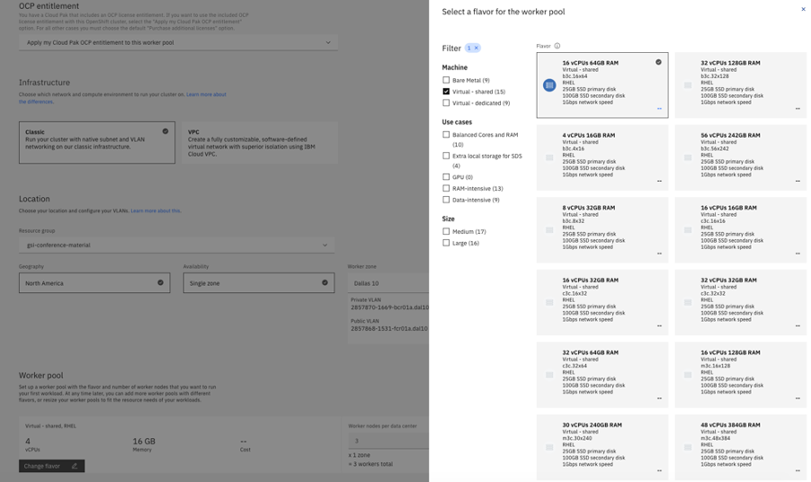

Once the cluster is created, create a new worker pool which will have bare metal servers required for Watson AI Services installation.

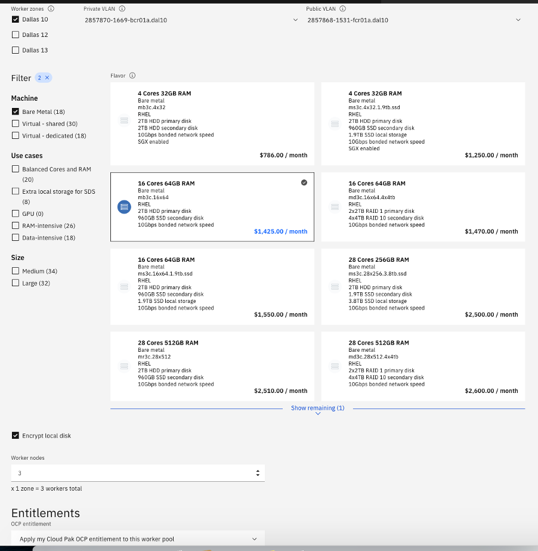

Once the cluster is ready, launch its console and on the right top corner, from copy login command, get the token to login to Openshift cluster remotely using cli
 
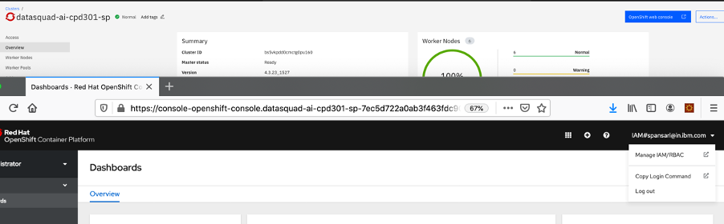

Make sure you have a system with Openshift and IBM Cloud cli installed.
https://cloud.ibm.com/docs/openshift?topic=openshift-openshift-cli#cli_oc
https://cloud.ibm.com/docs/cli/reference/bluemix_cli/download_cli.html

Execute oc login command obtained in above step from Openshift Web Console

### Setting up Openshift Cluster for Cloud Pak for Data Installation

1.	Create an external route of Openshift Image registry.
    Use token obtained in abive step to login from a system to OpenShift Cluster and run below commands to create an external route

    ```
    oc create route reencrypt --service=image-registry -n openshift-image-registry
    oc annotate route image-registry --overwrite haproxy.router.openshift.io/balance=source -n openshift-image-registry
    ```

2.	Resize image registry storage volume
    Default size of Openshift image registry will not be sufficient to load images if you are going to install multiple Services on Cloud Pak for Data. Hence it needs to be resized to 200GB. Run below commands to do it.

    ```
    ibmcloud login
    ```
    (login into Account where your Openshift Cluster is setup)
    ```
    registry_pv=`oc get pvc -n openshift-image-registry | grep "image-registry-storage" | awk '{print $3}'`
    volid=`oc describe pv $registry_pv -n openshift-image-registry | grep volumeId`
    IFS='='
    read -ra vol <<< "$volid"
    volume=${vol[1]}
    echo volume id is $volume
    ibmcloud sl file volume-modify $volume --new-size 200 --new-tier 10 –force
    ```

3.	Set kernel parameters (https://www.ibm.com/support/knowledgecenter/SSQNUZ_3.0.1/cpd/install/node-settings.html)
    Since we do not have ssh access to worker nodes on ROKS, we will use daemonset to perform kernel parameter settings. Create setkernelparameters.yaml file with below contents

    ```apiVersion: tuned.openshift.io/v1
    kind: Tuned
    metadata:
      name: cp4d-wkc-ipc
      namespace: openshift-cluster-node-tuning-operator
    spec:
      profile:
      - name: cp4d-wkc-ipc
        data: |
          [main]
          summary=Tune IPC Kernel parameters on OpenShift Worker Nodes running WKC Pods
          [sysctl]
          kernel.shmall = 33554432
          kernel.shmmax = 68719476736
          kernel.shmmni = 16384
          kernel.sem = 250 1024000 100 16384
          kernel.msgmax = 65536
          kernel.msgmnb = 65536
          kernel.msgmni = 32768
          vm.max_map_count = 262144
      recommend:
      - match:
        - label: node-role.kubernetes.io/worker
        priority: 10
        profile: cp4d-wkc-ipc
    ```

    Run below commands to do the changes

    ```
    oc project kube-system
    oc create -f setkernelparameters.yaml
    ```

4.	Change NFS mount settings
    If you are using IBM Cloud File Storage for PVC creation, we need to make sure pvcs are mounted with root permissions. 

    a.	Create a service account called norootsquash by running the following command:

    ```
    oc create -f - << EOF
    apiVersion: v1
    kind: ServiceAccount
    metadata:
      name: norootsquash
      namespace: kube-system
    EOF
    ```

    b.	Give the service account privileged security context constraints (SCC) by running the following command:

    ``` 
    oc adm policy add-scc-to-user privileged system:serviceaccount:kube-system:norootsquash
    ```

    c.	Create the daemonset by running the following command:

    ```
    oc create -f - << EOF
    apiVersion: apps/v1
    kind: DaemonSet
    metadata:
      name: norootsquash
      namespace: kube-system
      labels:
        tier: management
        app: norootsquash
    spec:
      selector:
        matchLabels:
          name: norootsquash
      template:
        metadata:
          labels:
            name: norootsquash
        spec:
          serviceAccountName: norootsquash
          initContainers:
            - resources:
                requests:
                  cpu: 0.1
              securityContext:
                privileged: true
              image: alpine:3.6
              name: unrootsquash
              command: ["chroot", "/host", "sh", "-c"]
              args:
                - >
                  grep "^Domain = slnfsv4.com" /etc/idmapd.conf;
                  if [ "\$?" -ne "0" ] ; then
                    sed -i 's/.*Domain =.*/Domain = slnfsv4.com/g' /etc/idmapd.conf;
                    nfsidmap -c;
                    rpc.idmapd
                  fi;
              volumeMounts:
                - name: host
                  mountPath: /host
          containers:
            - resources:
                requests:
                  cpu: 0.1
              image: alpine:3.6
              name: sleep
              command: ["/bin/sh", "-c"]
              args:
                - >
                  while true; do
                    sleep 100000;
                  done
          volumes:
            - hostPath:
                path: /
                type: Directory
              name: host
    EOF
    ```

### Setting Portworx Storage

Watson AI services (Watson Assistant, Watson Discovery, Watson Knowledge Studio, Watson Speech to Text and Watson text to Speech) install is currently supported only with Enterprise Portworx storage. Follow the steps mentioned below to set that up for ROKS. Make sure you are logged in to IBM Cloud and Openshift using CLI (ibmcloud and oc)
1.	Attach Block Storage to worker nodes (https://cloud.ibm.com/docs/containers?topic=containers-utilities#block_storage_attacher)

    a.	Install helm on your local system from where you are running the commands. (https://github.com/helm/helm/releases)

    b.	Run below command
    ```
    oc project kube-system
    ```
    c.  Below command should return 0 results
    ```
    oc get serviceaccount -n kube-system | grep tiller
    ```
    d.  Run below commands
    ```
    oc create serviceaccount tiller -n kube-system
    oc create clusterrolebinding tiller --clusterrole=cluster-admin --serviceaccount=kube-system:tiller -n kube-system
    oc get serviceaccount -n kube-system tiller
    helm init --service-account tiller
    oc get pods -n kube-system -l app=helm
    helm repo add iks-charts https://icr.io/helm/iks-charts
    helm repo add ibm-charts https://raw.githubusercontent.com/IBM/charts/master/repo/stable
    helm repo add ibm-community https://raw.githubusercontent.com/IBM/charts/master/repo/community
    helm repo add entitled https://raw.githubusercontent.com/IBM/charts/master/repo/entitled
    helm repo update
    helm install iks-charts/ibm-block-storage-attacher --name block-attacher
    oc get pod -n kube-system -o wide | grep attacher
    oc get storageclasses | grep attacher
    mkdir cp4d
    cd cp4d
    git clone https://github.com/IBM/ibmcloud-storage-utilities.git
    cd ibmcloud-storage-utilities/block-storage-provisioner
    ```
    e.	vi yamlgen.yaml (provide the storage as you would need for your application, clustername and size of the block storage. Min 500 GB is required for Watson Assistant)
        Provide the storage details i.e your Openshift Cluster name and region where it is located.

    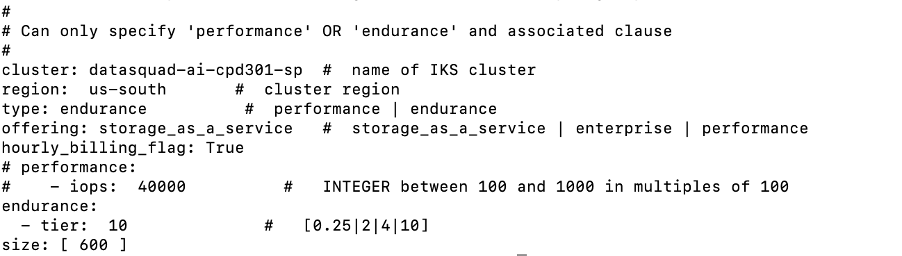

    f.	Create Classic Infrastructure Key

    - On IBM Cloud Console, from menu bar select Manage -> Access
    - Select API keys tab and from drop down select Classic Infrastructure API keys.
    - If one is already listed, click Actions menu (3 dots) > Details
    - Copy API username and API key

    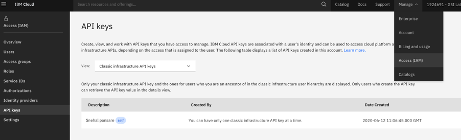 

    g.	export SL_USERNAME=infrastructure username obtained in above step

    h.	export SL_API_KEY=infrastructure API key obtained in above step

    i.	Edit Dockerfile and update first line to “FROM ubuntu:18.04”

    j.	Edit px_iks_utils.py (only if you have virtual server nodes as well as bare metal nodes, this is to avoid attaching block storage on virtual server nodes). Add below line on line number 83  : ``` if re.search('m[a-z]3c', w['machineType']): ``` It should like this 

    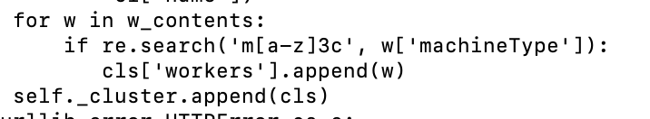 Add “import re” on the top below existing import statements.

    k.	Run below commands and check for annotation ibm.io/attachstatus: attached
    ```
    docker build -t mkpvyaml .
    docker run --rm -v `pwd`:/data -v ~/.bluemix:/config -e SL_API_KEY=$SL_API_KEY -e SL_USERNAME=$SL_USERNAME mkpvyaml
    oc apply -f pv-<cluster-name>.yaml
    oc describe pv <pvname created in above step>
    ```
        
    l.	Cordon nodes which are not bare metal server with below command. Execute below command for each non bare metal node.
    ```
    oc adm cordon <node-name>
    ```
    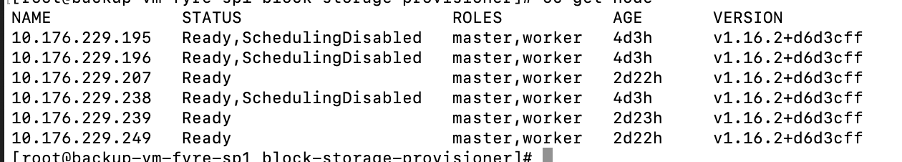

2.	To use internal portworx key-value database instead of etcd service, copy the imagepull secret from default to kube-system namespace.
    ```
    oc get secrets -n default | grep icr
    oc get secret -n default all-icr-io -o yaml | sed 's/default/kube-system/g' | oc -n kube-system create -f -
    oc patch -n kube-system serviceaccount/default --type='json' -p='[{"op":"add","path":"/imagePullSecrets/-","value":{"name”:”all-icr-io"}}]'
    ```

3.	From IBM Cloud Catalog, provision “Portworx Enterprise” service. Select same region as your Openshift Cluster. Select Enterprise plan from Pricing Plan. In IBM Cloud API Key, mention same key which was used to create block storage in above steps.  Select “Portworx KVDB” from Portworx metadata key-value store dropdown.

    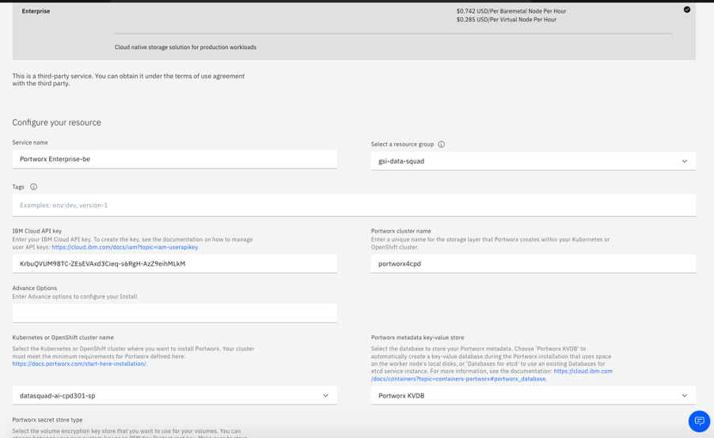

4.	Check if portworx pods are created and up successfully.
    ```
    oc get pods -n kube-system | grep 'portworx\|stork'
    ```

5.	Login to one of the portworx pods and list the status of your Portworx cluster
    ```
    PX_POD=$(oc get pods -l name=portworx -n kube-system -o jsonpath='{.items[0].metadata.name}')
    oc exec $PX_POD -n kube-system -- /opt/pwx/bin/pxctl status
    ```

    Non-bare metal server worker nodes will be listed with No StorageNode.

    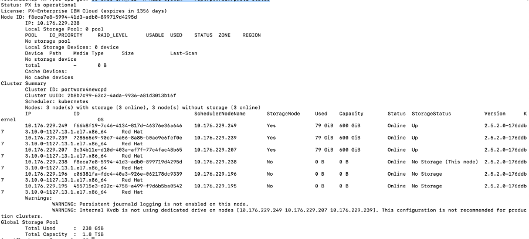

### Download Installation files

1.	Download installation files from: https://github.com/IBM/cpd-cli/releases
2.	Copy the downloaded tar file to a system where you have setup oc cli
3.	Extract the contents of the tar file
4.	Obtain your Entitlement key from : https://myibm.ibm.com/products-services/containerlibrary by logging in with you IBM ID connected with Partner World
5.	Edit  repo.yaml which can be found in the extracted contents of the tar file. Specify username as cp and apiKey as Entitlement Key obtained in above step.

**Note :** If you are installing multiple services on your cluster, you must run the installations one at a time and wait until the installation completes before installing another service. You cannot run the installations in parallel.

### Installing Control Plane

1.	Login to your Redhat Openshift Cluster
    ```
    oc login –token=<obtained from Openshift Web Console> --server=<obtained from Openshift Web Console>
    ```
2.	Make sure you are in a directory where Installation tar is extracted
3.	See what changes need to be made to the cluster, by running the appropriate cpd adm command for your environment:
    ```
    bin/cpd-Operating_System adm --repo repo.yaml --assembly lite --namespace <project-name>
    ```

    Operating_System :  Matching OS with the system from which you are running commands. For Linux, specify linux. For Mac OS, specify darwin.
    project-name :  Give any name where you will install Cloud Pak for Data Control Plane. For example:  cpd301. Use the same name in all next commands.

4.	Apply changes to your cluster which you saw in above step
    ```
    bin/cpd-Operating_System adm --repo repo.yaml --assembly lite --namespace <project-name> --apply
    ```
5.	Run the following command to grant cpd-admin-role to the project administration user:
    ```
    oc adm policy add-role-to-user cpd-admin-role <project_admin> --role-namespace=<project-name> -n <project-name>
    ```

    project-admin : The user name of the project administrator who will install the Cloud Pak for Data control plane.
    project-name :  Give any name where you will install Cloud Pak for Data Control Plane.

6.	Run the following command to install Control Plane
    ```
    bin/cpd-Operating_System --repo repo.yaml --assembly lite --namespace <project-name> --transfer-image-to $(oc get route -n openshift-image-registry |tail -1|awk '{print $2}')/<project-name> --target-registry-username $(oc whoami) --target-registry-password $(oc whoami -t) --insecure-skip-tls-verify --cluster-pull-prefix image-registry.openshift-image-registry.svc:5000/<project-name> --storageclass ibmc-file-gold-gid
    ```

7.	To verify that the installation completed successfully, run the following command:
    ```
    bin/cpd-Operating_System status --assembly lite --namespace <project-name>
    ```
8.	At the end of the installation, an URL will be printed which is a Cloud Pak for Data web console URL. You can verify it by logging in with admin/password

### Installing Data Virtualization

1.	Login to your Redhat Openshift Cluster
    ```
    oc login –token=<obtained from Openshift Web Console> --server=<obtained from Openshift Web Console>
    ```
2.	Make sure you are in a directory where Installation tar is extracted
3.	See what changes need to be made to the cluster, by running the appropriate cpd adm command for your environment:
    ```
    bin/cpd-Operating_System adm --repo repo.yaml --assembly dv --namespace <project-name>
    ```
    Operating_System :  Matching OS with the system from which you are running commands. For Linux, specify linux. For Mac OS, specify darwin.
    project-name :  Give project name where you have installed Cloud Pak for Data Control Plane. Use the same name in all next commands.

4.	Apply changes to your cluster which you saw in above step
    ```
    bin/cpd-Operating_System adm --repo repo.yaml --assembly dv --namespace <project-name> --apply
    ```
5.	Run the following command to install Data Virtualization
    ```
    bin/cpd-Operating_System --repo repo.yaml --assembly dv --namespace <project-name> --transfer-image-to $(oc get route -n openshift-image-registry |tail -1|awk '{print $2}')/<project-name> --target-registry-username $(oc whoami) --target-registry-password $(oc whoami -t) --insecure-skip-tls-verify --cluster-pull-prefix image-registry.openshift-image-registry.svc:5000/<project-name> --storageclass ibmc-file-gold-gid
    ```
6.	To verify that the installation completed successfully, run the following command:
    ```
    bin/cpd-Operating_System status --assembly dv --namespace <project-name>
    ```
    At the end of the installation, an URL will be printed which is a Cloud Pak for Data web console URL. You can verify it by loggin in with admin/password
7.	Login to Cloud Pak for Data Web Console. Click the Services icon from the top right corner of the user interface
8.	From the list of services, locate the Data Virtualization service under the Data sources category. Click the action menu and select Provision instance. 
9.	Check the “You must check this box if you updated the kernel semaphore parameter” box
10.	Specify the resources that you want to allocate to the Data Virtualization worker nodes in the Nodes section
    a.	Specify the number of Data Virtualization worker nodes to allocate to the service. Recommended: One worker node is sufficient for most workloads.
    b.	Specify the number of cores to allocate to each worker node. 16 cores is recommended
    c.	Specify the amount of memory to allocate to each worker node. 64 GB is recommended.

    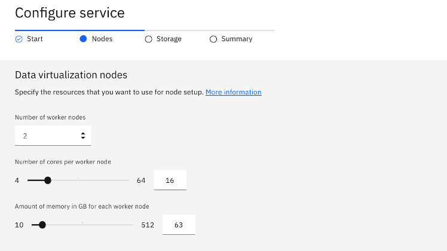

11.	In Storage Section, Select Persistent Storage class as “ibmc-file-gold-gid”. You can change the amount of storage based on your requirements. Select Cache Storage class as “ibmc-file-gold-gid”. You can change the amount of cache storage based on your requirements.

    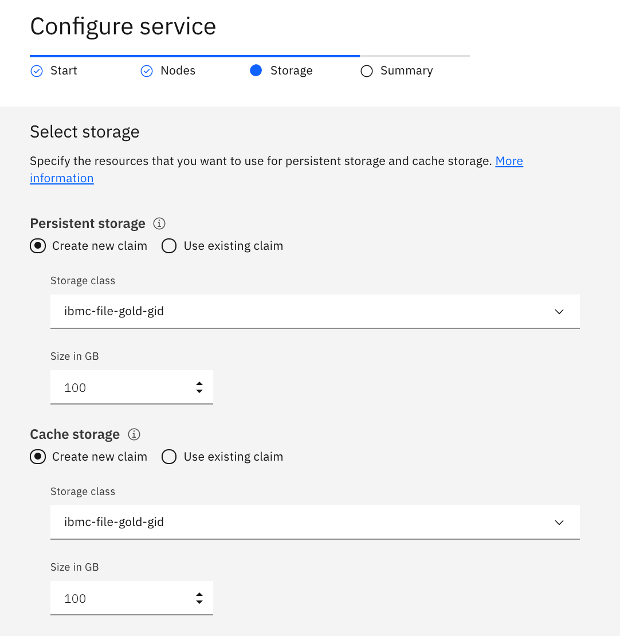

12.	Click Next
13.	Verify the summary and click on Provision. It will take 10-15 mins to provision.

### Installing Watson Studio

1.	Login to your Redhat Openshift Cluster
    ```
    oc login –token=<obtained from Openshift Web Console> --server=<obtained from Openshift Web Console>
    ```
2.	Make sure you are in a directory where Installation tar is extracted
3.	See what changes need to be made to the cluster, by running the appropriate cpd adm command for your environment:
    ```
    bin/cpd-Operating_System adm --repo repo.yaml --assembly wsl --namespace <project-name>
    ```
    Operating_System :  Matching OS with the system from which you are running commands. For Linux, specify linux. For Mac OS, specify darwin.
    project-name :  Give project name where you have installed Cloud Pak for Data Control Plane. Use the same name in all next commands.

4.	Apply changes to your cluster which you saw in above step
    ```
    bin/cpd-Operating_System adm --repo repo.yaml --assembly wsl --namespace <project-name> --apply
    ```
5.	Run the following command to install Watson Studio
    ```
    bin/cpd-Operating_System --repo repo.yaml --assembly wsl --namespace <project-name> --transfer-image-to $(oc get route -n openshift-image-registry |tail -1|awk '{print $2}')/<project-name> --target-registry-username $(oc whoami) --target-registry-password $(oc whoami -t) --insecure-skip-tls-verify --cluster-pull-prefix image-registry.openshift-image-registry.svc:5000/<project-name> --storageclass ibmc-file-gold-gid
    ```

6.	To verify that the installation completed successfully, run the following command:
    ```
    bin/cpd-Operating_System status --assembly wsl --namespace <project-name>
    ```
7.	At the end of the installation, an URL will be printed which is a Cloud Pak for Data web console URL. You can verify it by logging in with admin/password

### Installing Watson Machine Learning

1.	Login to your Redhat Openshift Cluster
    ```
    oc login –token=<obtained from Openshift Web Console> --server=<obtained from Openshift Web Console>
    ```
2.	Make sure you are in a directory where Installation tar is extracted
3.	See what changes need to be made to the cluster, by running the appropriate cpd adm command for your environment:
    ```
    bin/cpd-Operating_System adm --repo repo.yaml --assembly wml --namespace <project-name>
    ```
    Operating_System :  Matching OS with the system from which you are running commands. For Linux, specify linux. For Mac OS, specify darwin.
    project-name :  Give project name where you have installed Cloud Pak for Data Control Plane. Use the same name in all next commands.

4.	Apply changes to your cluster which you saw in above step
    ```
    bin/cpd-Operating_System adm --repo repo.yaml --assembly wml --namespace <project-name> --apply
    ```
5.	Run the following command to install Watson Machine Learning
    ```
    bin/cpd-Operating_System --repo repo.yaml --assembly wml --namespace <project-name> --transfer-image-to $(oc get route -n openshift-image-registry |tail -1|awk '{print $2}')/<project-name> --target-registry-username $(oc whoami) --target-registry-password $(oc whoami -t) --insecure-skip-tls-verify --cluster-pull-prefix image-registry.openshift-image-registry.svc:5000/<project-name> --storageclass ibmc-file-gold-gid
    ```
6.	To verify that the installation completed successfully, run the following command:
    ```
    bin/cpd-Operating_System status --assembly wml --namespace <project-name>
    ```
7.	At the end of the installation, an URL will be printed which is a Cloud Pak for Data web console URL. You can verify it by logging in with admin/password

### Installing Watson Openscale

1.	Login to your Redhat Openshift Cluster
    ```
    oc login –token=<obtained from Openshift Web Console> --server=<obtained from Openshift Web Console>
    ```
2.	Make sure you are in a directory where Installation tar is extracted
3.	See what changes need to be made to the cluster, by running the appropriate cpd adm command for your environment:
    ```
    bin/cpd-Operating_System adm --repo repo.yaml --assembly aiopenscale --namespace <project-name>
    ```
    Operating_System :  Matching OS with the system from which you are running commands. For Linux, specify linux. For Mac OS, specify darwin.
    project-name :  Give project name where you have installed Cloud Pak for Data Control Plane. Use the same name in all next commands.

4.	Apply changes to your cluster which you saw in above step
    ```
    bin/cpd-Operating_System adm --repo repo.yaml --assembly aiopenscale --namespace <project-name> --apply
    ```
5.	Run the following command to install Watson Openscale
    ```
    bin/cpd-Operating_System --repo repo.yaml --assembly aiopenscale --namespace <project-name> --transfer-image-to $(oc get route -n openshift-image-registry |tail -1|awk '{print $2}')/<project-name> --target-registry-username $(oc whoami) --target-registry-password $(oc whoami -t) --insecure-skip-tls-verify --cluster-pull-prefix image-registry.openshift-image-registry.svc:5000/<project-name> --storageclass ibmc-file-gold-gid
    ```
6.	To verify that the installation completed successfully, run the following command:
    ```
    bin/cpd-Operating_System status --assembly aiopenscale --namespace <project-name>
    ```
7.	At the end of the installation, an URL will be printed which is a Cloud Pak for Data web console URL. You can verify it by logging in with admin/password

### Installing Cognos Dashboards

1.	Login to your Redhat Openshift Cluster
    ```
    oc login –token=<obtained from Openshift Web Console> --server=<obtained from Openshift Web Console>
    ```
2.	Make sure you are in a directory where Installation tar is extracted
3.	See what changes need to be made to the cluster, by running the appropriate cpd adm command for your environment:
    ```
    bin/cpd-Operating_System adm --repo repo.yaml --assembly cde --namespace <project-name>
    ```

    Operating_System :  Matching OS with the system from which you are running commands. For Linux, specify linux. For Mac OS, specify darwin.
    project-name :  Give project name where you have installed Cloud Pak for Data Control Plane. Use the same name in all next commands.

4.	Apply changes to your cluster which you saw in above step
    ```
    bin/cpd-Operating_System adm --repo repo.yaml --assembly cde --namespace <project-name> --apply
    ```
5.	Run the following command to install Cognos Dashboards
    ```
    bin/cpd-Operating_System --repo repo.yaml --assembly cde --namespace <project-name> --transfer-image-to $(oc get route -n openshift-image-registry |tail -1|awk '{print $2}')/<project-name> --target-registry-username $(oc whoami) --target-registry-password $(oc whoami -t) --insecure-skip-tls-verify --cluster-pull-prefix image-registry.openshift-image-registry.svc:5000/<project-name> --storageclass ibmc-file-gold-gid
    ```
6.	To verify that the installation completed successfully, run the following command:
    ```
    bin/cpd-Operating_System status --assembly cde --namespace <project-name>
    ```
7.	At the end of the installation, an URL will be printed which is a Cloud Pak for Data web console URL. You can verify it by logging in with admin/password

### Installing Watson Knowledge Catalog

1.	Login to your Redhat Openshift Cluster
    ```
    oc login –token=<obtained from Openshift Web Console> --server=<obtained from Openshift Web Console>
    ```
2.	Make sure you are in a directory where Installation tar is extracted
3.	See what changes need to be made to the cluster, by running the appropriate cpd adm command for your environment:
    ```
    bin/cpd-Operating_System adm --repo repo.yaml --assembly wkc --namespace <project-name>
    ```

    Operating_System :  Matching OS with the system from which you are running commands. For Linux, specify linux. For Mac OS, specify darwin.
    project-name :  Give project name where you have installed Cloud Pak for Data Control Plane. Use the same name in all next commands.

4.	Apply changes to your cluster which you saw in above step
    ```
    bin/cpd-Operating_System adm --repo repo.yaml --assembly wkc --namespace <project-name> --apply
    ```
5.	Run the following command to install Watson Knowledge Catalog
    ```
    bin/cpd-Operating_System --repo repo.yaml --assembly wkc --namespace <project-name> --transfer-image-to $(oc get route -n openshift-image-registry |tail -1|awk '{print $2}')/<project-name> --target-registry-username $(oc whoami) --target-registry-password $(oc whoami -t) --insecure-skip-tls-verify --cluster-pull-prefix image-registry.openshift-image-registry.svc:5000/<project-name> --storageclass ibmc-file-gold-gid
    ```
6.	To verify that the installation completed successfully, run the following command:
    ```
    bin/cpd-Operating_System status --assembly wkc --namespace <project-name>
    ```
7.	At the end of the installation, an URL will be printed which is a Cloud Pak for Data web console URL. You can verify it by logging in with admin/password

### Installing DataStage Enterprise

1.	Login to your Redhat Openshift Cluster
    ```
    oc login –token=<obtained from Openshift Web Console> --server=<obtained from Openshift Web Console>
    ```
2.	Make sure you are in a directory where Installation tar is extracted
3.	See what changes need to be made to the cluster, by running the appropriate cpd adm command for your environment:
    ```
    bin/cpd-Operating_System adm --repo repo.yaml --assembly ds-ent --namespace <project-name>
    ```

    Operating_System :  Matching OS with the system from which you are running commands. For Linux, specify linux. For Mac OS, specify darwin.
    project-name :  Give project name where you have installed Cloud Pak for Data Control Plane. Use the same name in all next commands.

4.	Apply changes to your cluster which you saw in above step
    ```
    bin/cpd-Operating_System adm --repo repo.yaml --assembly ds-ent --namespace <project-name> --apply
    ```
5.	Run the following command to install DataStage Enterprise
    ```
    bin/cpd-Operating_System --repo repo.yaml --assembly ds-ent --namespace <project-name> --transfer-image-to $(oc get route -n openshift-image-registry |tail -1|awk '{print $2}')/<project-name> --target-registry-username $(oc whoami) --target-registry-password $(oc whoami -t) --insecure-skip-tls-verify --cluster-pull-prefix image-registry.openshift-image-registry.svc:5000/<project-name> --storageclass ibmc-file-gold-gid
    ```
6.	To verify that the installation completed successfully, run the following command:
    ```
    bin/cpd-Operating_System status --assembly ds-ent --namespace <project-name>
    ```
7.	At the end of the installation, an URL will be printed which is a Cloud Pak for Data web console URL. You can verify it by logging in with admin/password

### Installing Regulatory Accelerator

1.	Login to your Redhat Openshift Cluster
    ```
    oc login –token=<obtained from Openshift Web Console> --server=<obtained from Openshift Web Console>
    ```
2.	Make sure you are in a directory where Installation tar is extracted
3.	See what changes need to be made to the cluster, by running the appropriate cpd adm command for your environment:
    ```
    bin/cpd-Operating_System adm --repo repo.yaml --assembly iira --namespace <project-name>
    ```
    Operating_System :  Matching OS with the system from which you are running commands. For Linux, specify linux. For Mac OS, specify darwin.
    project-name :  Give project name where you have installed Cloud Pak for Data Control Plane. Use the same name in all next commands.

4.	Apply changes to your cluster which you saw in above step
    ```
    bin/cpd-Operating_System adm --repo repo.yaml --assembly iira --namespace <project-name> --apply
    ```
5.	Run the following command to install Regulatory Accelerator
    ```
    bin/cpd-Operating_System --repo repo.yaml --assembly iira --namespace <project-name> --transfer-image-to $(oc get route -n openshift-image-registry |tail -1|awk '{print $2}')/<project-name> --target-registry-username $(oc whoami) --target-registry-password $(oc whoami -t) --insecure-skip-tls-verify --cluster-pull-prefix image-registry.openshift-image-registry.svc:5000/<project-name> --storageclass ibmc-file-gold-gid
    ```
6.	To verify that the installation completed successfully, run the following command:
    ```
    bin/cpd-Operating_System status --assembly iira --namespace <project-name>
    ```
7.	At the end of the installation, an URL will be printed which is a Cloud Pak for Data web console URL. You can verify it by logging in with admin/password

### Installing DB2 Warehouse

1.	Login to your Redhat Openshift Cluster
    ```
    oc login –token=<obtained from Openshift Web Console> --server=<obtained from Openshift Web Console>
    ```
2.	Make sure you are in a directory where Installation tar is extracted
3.	See what changes need to be made to the cluster, by running the appropriate cpd adm command for your environment:
    ```
    bin/cpd-Operating_System adm --repo repo.yaml --assembly db2wh --namespace <project-name>
    ```
    Operating_System :  Matching OS with the system from which you are running commands. For Linux, specify linux. For Mac OS, specify darwin.
    project-name :  Give project name where you have installed Cloud Pak for Data Control Plane. Use the same name in all next commands.

4.	Apply changes to your cluster which you saw in above step
    ```
    bin/cpd-Operating_System adm --repo repo.yaml --assembly db2wh --namespace <project-name> --apply
    ```
5.	If you want to run database on a dedicated compute nodes, follow the steps at : https://www.ibm.com/support/producthub/icpdata/docs/content/SSQNUZ_current/cpd/svc/dbs/db2w-dednodes.html to label nodes
6.	Run the following command to install DB2 Warehouse
    ```
    bin/cpd-Operating_System --repo repo.yaml --assembly db2wh --namespace <project-name> --transfer-image-to $(oc get route -n openshift-image-registry |tail -1|awk '{print $2}')/<project-name> --target-registry-username $(oc whoami) --target-registry-password $(oc whoami -t) --insecure-skip-tls-verify --cluster-pull-prefix image-registry.openshift-image-registry.svc:5000/<project-name> --storageclass ibmc-file-gold-gid
    ```
7.	To verify that the installation completed successfully, run the following command:
    ```
    bin/cpd-Operating_System status --assembly db2wh --namespace <project-name>
    ```
8.	At the end of the installation, an URL will be printed which is a Cloud Pak for Data web console URL. You can verify it by logging in with admin/password
9.	From navigation on the left side, select Collect -> My data
10.	Open the Databases tab, which is only visible after you install the database service.
11.	Click Create a database.
12.	Select the database type and version. Click Next.
13.	In the Configure area, specify the number of nodes, memory per node, and CPU per node. An error message will be displayed if adequate resources are not found
14.	If you are using a dedicated node, click Deploy database on dedicated nodes and enter the node label in the Value for node label box that you mentioned in Step 5 above

    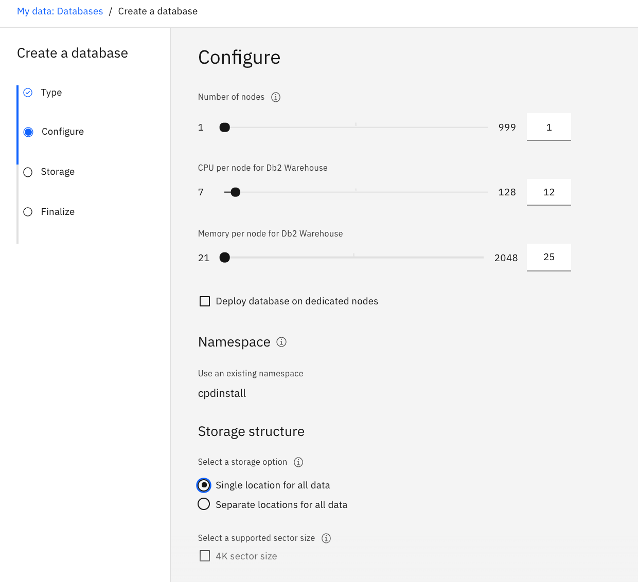

15.	For database storage, you can choose to keep your system data and user data together in a single location or put them in separate locations. System data contains the information that is used by Db2 Warehouse to manage and configure the database. User data is the main database data. If you choose Separate locations for all data, you must specify a storage volume type, a name, and a size for both storage locations.
16.	Select Storage class “ibmc-file-gold-gid” and specify size for the System, User and Backup storage

    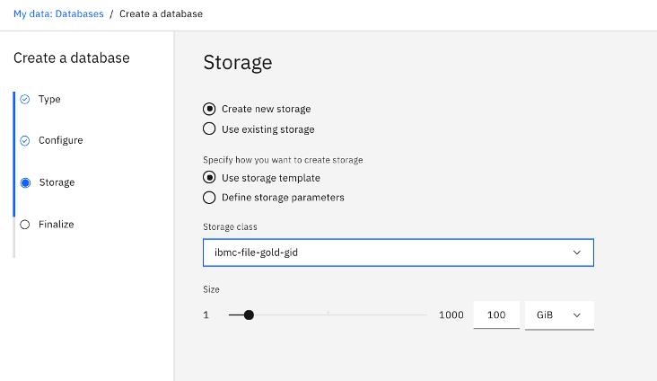

17.	Click Next
18.	Ensure that the summary is correct and click Create.
19.	You might have to wait 5 to 40 minutes, based on the number of worker nodes and amount of memory that were allocated to the deployment.The database is ready when it shows up as Available on the Databases tab.


### Installing DB2 Advanced Edition

1.	Login to your Redhat Openshift Cluster
    ```
    oc login –token=<obtained from Openshift Web Console> --server=<obtained from Openshift Web Console>
    ```
2.	Make sure you are in a directory where Installation tar is extracted
3.	See what changes need to be made to the cluster, by running the appropriate cpd adm command for your environment:
    ```
    bin/cpd-Operating_System adm --repo repo.yaml --assembly db2oltp --namespace <project-name>
    ```
    Operating_System :  Matching OS with the system from which you are running commands. For Linux, specify linux. For Mac OS, specify darwin.
    project-name :  Give project name where you have installed Cloud Pak for Data Control Plane. Use the same name in all next commands.

4.	Apply changes to your cluster which you saw in above step
    ```
    bin/cpd-Operating_System adm --repo repo.yaml --assembly db2oltp --namespace <project-name> --apply
    ```
5.	If you want to run database on a dedicated compute nodes, follow the steps at : https://www.ibm.com/support/producthub/icpdata/docs/content/SSQNUZ_current/cpd/svc/dbs/aese-dednodes.html to label nodes
6.	Run the following command to install DB2 Advanced Edition
    ```
    bin/cpd-Operating_System --repo repo.yaml --assembly db2oltp --namespace <project-name> --transfer-image-to $(oc get route -n openshift-image-registry |tail -1|awk '{print $2}')/<project-name> --target-registry-username $(oc whoami) --target-registry-password $(oc whoami -t) --insecure-skip-tls-verify --cluster-pull-prefix image-registry.openshift-image-registry.svc:5000/<project-name> --storageclass ibmc-file-gold-gid
    ```
7.	To verify that the installation completed successfully, run the following command:
    ```
    bin/cpd-Operating_System status --assembly db2oltp --namespace <project-name>
    ```
8.	At the end of the installation, an URL will be printed which is a Cloud Pak for Data web console URL. You can verify it by logging in with admin/password
9.	From navigation on the left side, select Collect -> My data
10.	Open the Databases tab, which is only visible after you install the database service.
11.	Click Create a database.
12.	Select the database type and version. Click Next.
13.	In the Configure area, specify the number of nodes, memory per node, and CPU per node. An error message will be displayed if adequate resources are not found
14.	If you are using a dedicated node, click Deploy database on dedicated nodes and enter the node label in the Value for node label box that you mentioned in Step 5 above

    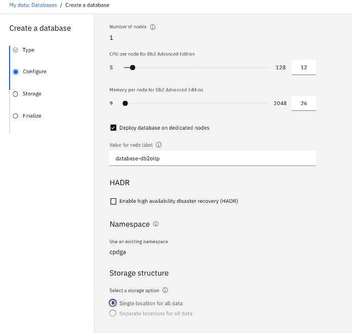

15.	For database storage, you can choose to keep your system data and user data together in a single location or put them in separate locations. System data contains the information that is used by Db2 to manage and configure the database. User data is the main database data. If you choose Separate locations for all data, you must specify a storage volume type, a name, and a size for both storage locations.
16.	Select Storage class “ibmc-file-gold-gid” and specify size for the System, User and Backup storage

    

17.	Click Next
18.	Ensure that the summary is correct and click Create.
19.	You might have to wait 5 to 40 minutes, based on the number of worker nodes and amount of memory that were allocated to the deployment. The database is ready when it shows up as Available on the Databases tab.

### Installing Cognos Analytics

1.	Login to your Redhat Openshift Cluster
    ```
    oc login –token=<obtained from Openshift Web Console> --server=<obtained from Openshift Web Console>
    ```
2.	Make sure you are in a directory where Installation tar is extracted
3.	See what changes need to be made to the cluster, by running the appropriate cpd adm command for your environment:
    ```
    bin/cpd-Operating_System adm --repo repo.yaml --assembly ca --namespace <project-name>
    ```
    Operating_System :  Matching OS with the system from which you are running commands. For Linux, specify linux. For Mac OS, specify darwin.
    project-name :  Give project name where you have installed Cloud Pak for Data Control Plane. Use the same name in all next commands.

4.	Apply changes to your cluster which you saw in above step
    ```
    bin/cpd-Operating_System adm --repo repo.yaml --assembly ca --namespace <project-name> --apply
    ```
5.	Run the following command to install Cognos Analytics
    ```
    bin/cpd-Operating_System --repo repo.yaml --assembly ca --namespace <project-name> --transfer-image-to $(oc get route -n openshift-image-registry |tail -1|awk '{print $2}')/<project-name> --target-registry-username $(oc whoami) --target-registry-password $(oc whoami -t) --insecure-skip-tls-verify --cluster-pull-prefix image-registry.openshift-image-registry.svc:5000/<project-name> --storageclass ibmc-file-gold-gid
    ```
6.	To verify that the installation completed successfully, run the following command:
    ```
    bin/cpd-Operating_System status --assembly ca --namespace <project-name>
    ```
7.	At the end of the installation, an URL will be printed which is a Cloud Pak for Data web console URL. You can verify it by logging in with admin/password
8.	To configure database for content store for Cognos Analytics

    a.	You need to have DB2 Advanced Edition installed prior to provisioning Cognos Analytics instance

    b.	In IBM Cloud Pak for Data, click My instances, and open the details for the provisioned IBM Db2 Advanced Edition instance.

    c.	Collect the following details:

    - Database name
    - Deployment id
    - Username
    - Password
    - JDBC Connection URL

    

    d.	Run below command in terminal
    ```
    export NAMESPACE=<Namespace of your CPD Installation>
    export DB2USERNAME=<USERNAME>
    export DB2PASSWORD=<PASSWORD>
    export DB2DEPLOYMENTID=<DEPLOYMENTID>
    export CMD="env DB2USERNAME=$DB2USERNAME DB2PASSWORD=$DB2PASSWORD  bash"
    oc  exec -ti $DB2DEPLOYMENTID-db2u-0 -n $NAMESPACE -- $CMD
    ```

    e.	From DB2 container , run below commands
    ```
    cd /mnt/blumeta0/home/db2inst1/sqllib
    . ./db2profile   
    db2 CONNECT to BLUDB user $DB2USERNAME using  $DB2PASSWORD 
    db2 UPDATE DATABASE CONFIGURATION USING APPLHEAPSZ 1024 DEFERRED; 
    db2 UPDATE DATABASE CONFIGURATION USING LOCKTIMEOUT 240 DEFERRED;
    db2 CREATE BUFFERPOOL CMDB_08KBP IMMEDIATE SIZE 1000 PAGESIZE 8K;
    db2 CREATE BUFFERPOOL CMDB_32KBP IMMEDIATE SIZE 1000 PAGESIZE 32K;
    db2 CREATE SYSTEM TEMPORARY TABLESPACE TSN_SYS_CMDB IN DATABASE PARTITION GROUP IBMTEMPGROUP PAGESIZE 32K BUFFERPOOL CMDB_32KBP;
    db2 CREATE USER TEMPORARY TABLESPACE TSN_USR_CMDB IN DATABASE PARTITION GROUP IBMDEFAULTGROUP PAGESIZE 8K BUFFERPOOL CMDB_08KBP;
    db2 CREATE REGULAR TABLESPACE TSN_REG_CMDB IN DATABASE PARTITION GROUP IBMDEFAULTGROUP PAGESIZE 8K BUFFERPOOL CMDB_08KBP; 
    db2 DROP TABLESPACE USERSPACE1;
    db2 CREATE SCHEMA db2COGNOS AUTHORIZATION $DB2USERNAME;
    db2 ALTER BUFFERPOOL ibmdefaultbp size 49800

    exit
    ```

    f.	Create a connection to DB2 instance created

    - Log in to the Cloud Pak for Data web client.
    - From the menu, select Connections.
    - Click Add connection.
    - Enter a name and a description for the connection.
    - Select Db2 for the Connection type.
    - On the New connection page, enter the following information from step 2 in this task.
        - Host (Collected from step d above)
        - Port (Collected from step d above)
        - Database name
        - Username
        - Password
    - To test the connection, click Test connection on the New connection page.
    - Click Create. The connection is saved.

    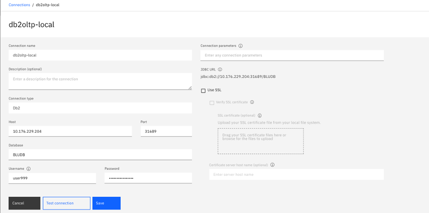

9.	Provision an instance of Cognos Analytics

    a.	Log in to Cloud Pak for Data as an administrator.

    b.	From the toolbar, click the Services icon

    c.	Find the Cognos Analytics service and ensure that it is Available.

    d.	From the action menu, select Provision instance.
    
    e.	Select a Shared Volume Storage class ibmc-file-gold-gid.

    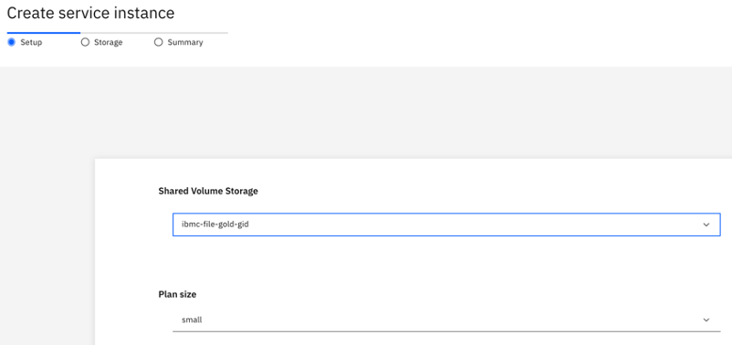
                
    f.	Select the plan size for the instance.

    g.	Select the connection that you previously defined.

    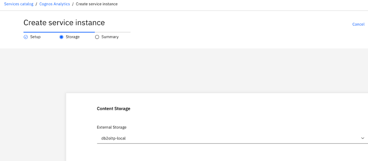

    h.	Click Next.

    i.	Review the summary and click Create. It will take approximately 30 min to provision an instance

    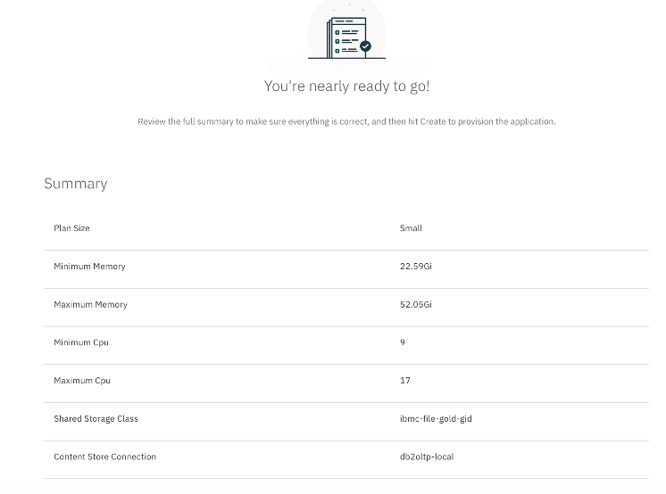

### Installing Watson Assistant

1.	Login to your Redhat Openshift Cluster
    ```
    oc login –token=<obtained from Openshift Web Console> --server=<obtained from Openshift Web Console>
    ```
2.	Make sure you are in a directory where Installation tar is extracted
3.	Cordon all non-bare metal server nodes
    ```
    oc adm cordon <node-name>
    ```
4.	Create a wa-repo.yaml file with below contents. Replace {entitlement-key} with your Entitlement key
    ```
    registry:
        - url: cp.icr.io/cp/cpd
        username: "cp"
        apikey: {entitlement-key}
        namespace: ""
        name: base-registry
        - url: cp.icr.io
        username: "cp"
        apikey: {entitlement-key}
        namespace: "cp/watson-assistant"
        name: wa-registry
    fileservers:
        - url: https://raw.github.com/IBM/cloud-pak/master/repo/cpd3
    ```
5.	Create a Portworx storage class named “portworx-assistant”. Run below snippet
    ```
    cat <<EOF | oc create -f -
    apiVersion: storage.k8s.io/v1
    kind: StorageClass
    metadata:
        name: portworx-assistant
    parameters:
        repl: "3"
        priority_io: "high"
        io_profile: "db"
        block_size: "64k"
    allowVolumeExpansion: true
    provisioner: kubernetes.io/portworx-volume
    reclaimPolicy: Retain
    volumeBindingMode: Immediate
    EOF
    ```
6.	Run the following command to bind the restricted SecurityContextConstraint to the Cloud Pak for Data namespace in which you will install the service:
    ```
    oc adm policy add-scc-to-group restricted system:serviceaccounts:{namespace}
    ```
    where {namespace} is the namespace in which Cloud Pak for Data is installed.
7.	Add the cluster namespace label to your service namespace.
    ```
	oc label --overwrite namespace {namespace} ns={namespace}
	oc project {namespace}
    ```
    {namespace} – project name where Cloud Pak for data is installed and Watson Assistant is to be installed
8.	From the namespace where the Cloud Pak for Data cluster is installed, get the name of the secret for pulling images from the internal Docker registry.
    ```
    oc get secrets | grep default-dockercfg
    ```
    Make a note of the secret. You will add it as the value for the global.image.pullSecret setting in the override file that you create in the next step. For example:
    ```
    global:
        image:
        pullSecret: "default-dockercfg-gqfb4"
        ```
9.	Create an override file as below where you can change configuration settings of Watson Assistant deployment. Make sure you update pullSecret from the above step. For more information : https://www.ibm.com/support/producthub/icpdata/docs/content/SSQNUZ_current/cpd/svc/watson/assistant-override.html
    ```
    global:
        # On uninstall do not preserve the datastores
        keep: false

        # The storage class used for datastores
        storageClassName: "portworx-assistant"

        # Choose between "Development" and "Production"
        deploymentType: "Development"

        # The name of the secret for pulling images.
        # The value for "global.image.pullSecret" below does not need to be changed for Development
        # installations where pods will pull docker images directly from the Entitled Docker Registry.
        # For Production installations where docker images will be pulled locally to the Openshift
        # Docker Registry, "global.image.pullSecret" will need to be set to the value obtained by
        # running oc get secrets | grep default-dockercfg in the namespace where IBM Cloud
        # Pak for Data is installed.
  
        image:
        pullSecret: "default-dockercfg-l8fgp"

        # global.languages.[language] - Specifies whether [language] should be installed or not.
        languages:
        english: true
        german:  false
        arabic: false
        spanish: false
        french: false
        italian: false
        japanese: false
        korean: false
        portuguese: false
        czech: false
        dutch: false
        chineseTraditional: false
        chineseSimplified: false

    # the storageclass used for postgres backup
    postgres:
        backup:
        dataPVC:
            storageClassName: portworx-assistant

    # use "2.5.0.0" for CP4D 2.5.0 (carbon 9) and "3.0.0.0" for CP4D 3.0.0 and 3.0.1 (carbon 10)
    ingress:
        wcnAddon:
        addon:
            platformVersion: "3.0.0.0"
    ```

10.	Run the following command to install Watson Assistant
    ```
    bin/cpd-Operating_System --repo wa-repo.yaml --assembly ibm-watson-assistant --version 1.4.2 --namespace <project-name> --transfer-image-to $(oc get route -n openshift-image-registry |tail -1|awk '{print $2}')/<project-name> --target-registry-username $(oc whoami) --target-registry-password $(oc whoami -t) --insecure-skip-tls-verify --cluster-pull-prefix image-registry.openshift-image-registry.svc:5000/<project-name> --storageclass portworx-assistant --override overrides.yaml
    ```
11.	To verify that the installation completed successfully, run the following command:
    ```
    bin/cpd-Operating_System status --assembly ibm-watson-assistant --namespace <project-name>
    ```
12.	Provision an instance of Watson Assistant
    a.	Log in to Cloud Pak for Data as an administrator.
    b.	From the toolbar, click the Services icon
    c.	Find the Watson Assistant service and ensure that it is Available.
    d.	From the action menu, select Provision instance.
    e.	Give Instance name and Click on Create.

13. Uncordon all non-bare metal server nodes
    ```
    oc adm cordon <node-name>
    ```

### Installing Watson Discovery

1.	Login to your Redhat Openshift Cluster
    ```
    oc login –token=<obtained from Openshift Web Console> --server=<obtained from Openshift Web Console>
    ```
2.	Make sure you are in a directory where Installation tar is extracted
3.	Make sure you did Kernel Parameters settings mentioned in “Setting up Openshift Cluster for Cloud Pak for Data Installation” Step 3
4.	Cordon all non-bare metal server nodes
    ```
    oc adm cordon <node-name>
    ```
5.	Create a wd-repo.yaml file with below contents. Replace {entitlement-key} with your Entitlement key
    ```
    registry:
        - url: cp.icr.io/cp/cpd
        username: "cp"
        apikey: {entitlement-key}
        namespace: ""
        name: base-registry
        - url: cp.icr.io/cp/watson-discovery
        username: "cp"
        apikey: {entitlement-key}
        name: watson-discovery-registry
    fileservers:
        - url: https://raw.github.com/IBM/cloud-pak/master/repo/cpd3
    ```
6.	Create Portworx storage class named “portworx-db-gp3”. Run below snippet
    ``` 
    cat <<EOF | oc create -f -
    apiVersion: storage.k8s.io/v1
    kind: StorageClass
    metadata:
        name: portworx-db-gp3
    parameters:
        io_profile: "db_remote"
        repl: "3"
    allowVolumeExpansion: true
    provisioner: kubernetes.io/portworx-volume
    reclaimPolicy: Retain
    volumeBindingMode: Immediate
    EOF
    ```
7.	From the namespace where the Cloud Pak for Data cluster is installed, get the name of the secret for pulling images from the internal Docker registry.
    ```
    oc get secrets | grep default-dockercfg
    ```
    Make a note of the secret. You will add it as the value for the global.image.pullSecret setting in the override file that you create in the next step. For example:
    ```
    global:
        image:
        pullSecret: "default-dockercfg-gqfb4"
    ```
8.	Create an override file wd-override.yaml as below where you can change configuration settings of Watson Discovery deployment. Make sure you update pullSecret from the above step. For more information : https://www.ibm.com/support/producthub/icpdata/docs/content/SSQNUZ_current/cpd/svc/watson/discovery-override.html
    ```
    global:
        deploymentType: "Development"
        contentIntelligence:
        enabled: true
        image:
        # minio/postgresql/rabbitmq
        pullSecret: "your-default-dockercfg-secret"
        # etcd
        imagePullSecret: "<pull-secret>"
    core:
        ingestion:
        mount:
            storageClassName: "portworx-db-gp3"
    elastic:
        persistence:
        storageClassName: "portworx-db-gp3"
    crust:
        networkPolicy: 
        create: false
    mantle: 
        networkPolicy:
        create: false 
    networkPolicy:
        create: false
    ```

9.  See what changes need to be made to the cluster, by running the appropriate cpd adm command for your environment:
    ```
    bin/cpd-Operating_System adm --repo repo.yaml --assembly watson-discovery --namespace <project-name>
    ```
    Operating_System :  Matching OS with the system from which you are running commands. For Linux, specify linux. For Mac OS, specify darwin.
    project-name :  Give project name where you have installed Cloud Pak for Data Control Plane. Use the same name in all next commands.

10.	Apply changes to your cluster which you saw in above step
    ```
    bin/cpd-Operating_System adm --repo repo.yaml --assembly watson-discovery --namespace <project-name> --apply
    ```
11.	Run the following command to install Watson Discovery
    ```
    bin/cpd-Operating_System --repo wd-repo.yaml --assembly watson-discovery --namespace <project-name> --transfer-image-to $(oc get route -n openshift-image-registry |tail -1|awk '{print $2}')/<project-name> --target-registry-username $(oc whoami) --target-registry-password $(oc whoami -t) --insecure-skip-tls-verify --cluster-pull-prefix image-registry.openshift-image-registry.svc:5000/<project-name> --storageclass ibmc-file-gold-gid --override wd-override.yaml
    ```
12.	To verify that the installation completed successfully, run the following command:
    ```
    bin/cpd-Operating_System status --assembly watson-discovery --namespace <project-name>
    ```
13.	Provision an instance of Watson Discovery
    a.	Log in to Cloud Pak for Data as an administrator.
    b.	From the toolbar, click the Services icon
    c.	Find the Watson Discovery service and ensure that it is Available.
    d.	From the action menu, select Provision instance.
    e.	Give Instance name and Click on Create.

14.	Uncordon all non-bare metal server nodes
    ```
    oc adm uncordon <node-name>
    ```

### Installing Watson Knowledge Studio

1.	Login to your Redhat Openshift Cluster
    ```
    oc login –token=<obtained from Openshift Web Console> --server=<obtained from Openshift Web Console>
    ```
2.	Make sure you are in a directory where Installation tar is extracted
3.	Create a wks-repo.yaml file with below contents. Replace {entitlement-key} with your Entitlement key
    ```
    registry:
        - url: cp.icr.io/cp/cpd
        username: "cp"
        apikey: {entitlement-key}
        namespace: ""
        name: base-registry
        - url: cp.icr.io/cp/knowledge-studio
        username: "cp"
        apikey: {entitlement-key}
        name: wks-registry
    fileservers:
        - url: https://raw.github.com/IBM/cloud-pak/master/repo/cpd3
    ```

4.	See what changes need to be made to the cluster, by running the appropriate cpd adm command for your environment:
    ```
    bin/cpd-Operating_System adm --repo wks-repo.yaml --assembly watson-ks --namespace <project-name>
    ```
    Operating_System :  Matching OS with the system from which you are running commands. For Linux, specify linux. For Mac OS, specify darwin.
    project-name :  Give project name where you have installed Cloud Pak for Data Control Plane. Use the same name in all next commands.

5.	Apply changes to your cluster which you saw in above step
    ```
    bin/cpd-Operating_System adm --repo wks-repo.yaml --assembly watson-ks --namespace <project-name> --apply
    ```
6.	Run the following command to install Watson Knowledge Studio
    ```
    bin/cpd-Operating_System --repo wks-repo.yaml --assembly watson-ks --namespace <project-name> --transfer-image-to $(oc get route -n openshift-image-registry |tail -1|awk '{print $2}')/<project-name> --target-registry-username $(oc whoami) --target-registry-password $(oc whoami -t) --insecure-skip-tls-verify --cluster-pull-prefix image-registry.openshift-image-registry.svc:5000/<project-name> --storageclass ibmc-file-gold-gid
    ```
7.	To verify that the installation completed successfully, run the following command:
    ```
    bin/cpd-Operating_System status --assembly watson-ks --namespace <project-name>
    ```
8.	Provision an instance of Watson Knowledge Studio

    a.	Log in to Cloud Pak for Data as an administrator.

    b.	From the toolbar, click the Services icon

    c.	Find the Watson Knowledge Studio service and ensure that it is Available.

    d.	From the action menu, select Provision instance.

    e.	Give Instance name and Click on Create.
