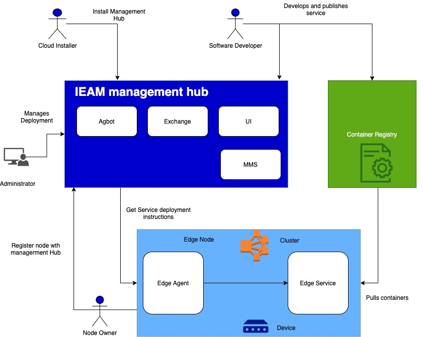

import Globals from 'gatsby-theme-carbon/src/templates/Globals';

<PageDescription>

</PageDescription>

## Overview

IBM Edge Application Manager (IEAM) provides you with edge computing features to help you manage and deploy workloads from a management hub cluster to remote instances of OpenShift Container Platform or other Kubernetes-based clusters.

## Install

The following diagram depicts the high-level topology for a typical edge computing setup:

### Install Management Hub

Installation and configuration of the management hub must be done before moving on to the IBM Edge Application Manager (IEAM) node tasks.

For more information about installing the required software for IBM Edge Management Hub, see:

- [Management hub installation overview](https://www.ibm.com/support/knowledgecenter/SSFKVV_4.1/hub/hub.html)

### Install Edge Nodes

Edge computing places enterprise applications closer to where the data is created, and where actions need to be taken. 

For more information about installing the required software for IBM Edge Application Manager for nodes, see:

- [Edge devices](https://www.ibm.com/support/knowledgecenter/SSFKVV_4.1/devices/installing/edge_devices.html)
- [Edge clusters](https://www.ibm.com/support/knowledgecenter/SSFKVV_4.1/devices/installing/edge_clusters.html)

### Best Practices

- [Best practices for developing edge services](https://www.ibm.com/support/knowledgecenter/SSFKVV_4.1/devices/developing/best_practices.html)

### FAQs

- [Most frequently asked questions (FAQs) about IBM Edge Application Manager](https://www.ibm.com/support/knowledgecenter/SSFKVV_4.1/devices/getting_started/faq.html)
