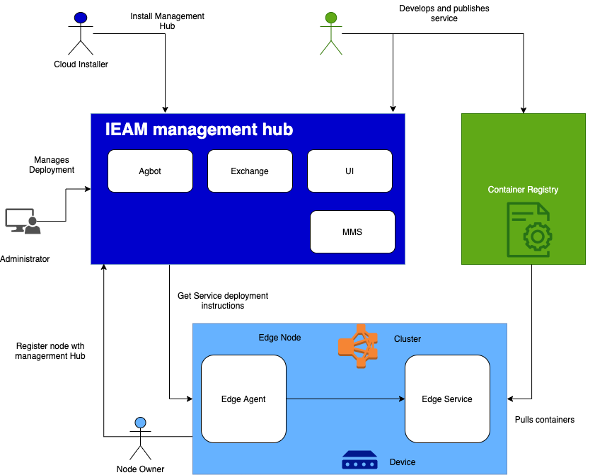
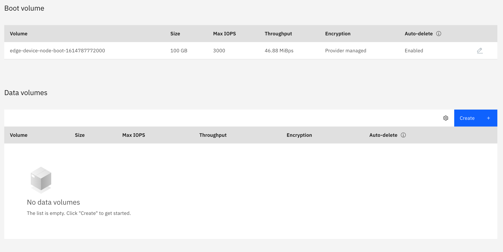
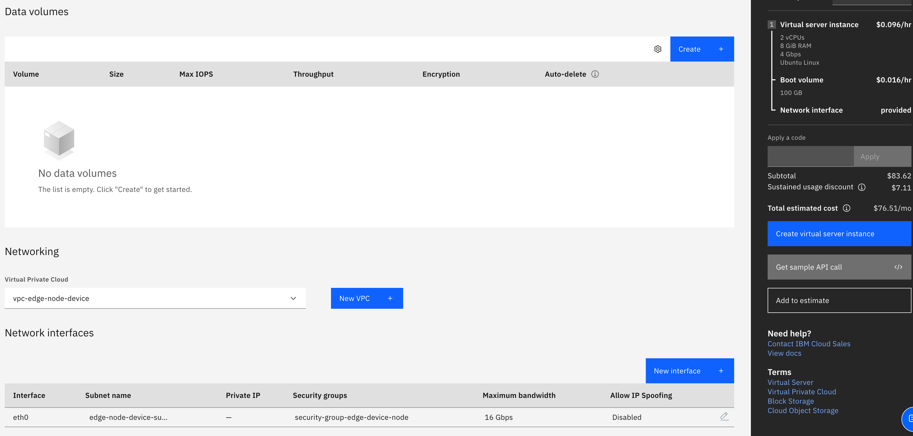
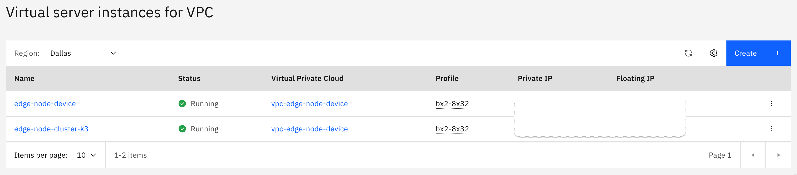

import Globals from 'gatsby-theme-carbon/src/templates/Globals';

<PageDescription>

</PageDescription>

## **Overview**

The deployment of IEAM includes the management hub that runs in an instance of OpenShift Container Platform installed in your data center. The management hub is where the management of all of your remote edge nodes (edge devices and edge clusters) occurs.

The following diagram depicts the high-level topology for a typical edge computing setup:

### **Install Edge Nodes**

Edge computing places enterprise applications closer to where the data is created, and where actions need to be taken. For more information about installing the required software for IBM Edge Application Manager for nodes, see:

- [Edge devices](https://www.ibm.com/support/knowledgecenter/SSFKVV_4.2/installing/edge_devices.html)
- [Edge clusters](https://www.ibm.com/support/knowledgecenter/SSFKVV_4.2/installing/edge_clusters.html)

## **1.  Install a lightweight k3s cluster or edge on a VPC Node**

### **(A) Create a VPC vpc-edge**

Use IBM Cloud Virtual Private Cloud to create your own space in IBM Cloud. A virtual private cloud (VPC) is a secure, isolated virtual network that combines the security of a private cloud with the availability and scalability of IBM's public cloud.

You can create and configure an IBM Cloud™ Virtual Private Cloud (VPC) by using the IBM Cloud console.

#### **1. Create VPC Instances**

- Create a generation 2 virtual server instance. 
- Create a VPC and subnet to define the network. When you create your subnet, attach a public gateway if you want to allow all resources in the subnet to communicate with the public internet.

#### **2. Create Subnet**

- To limit the subnet's inbound and outbound traffic, you can configure an access control list (ACL). By default, all traffic is allowed.

#### **3. Reserve IP**

- If you want your instance to be reachable from the internet, reserve and associate a floating IP address.

#### **4. Next Steps**

You are ready to connect to your instance. 

### **(B) Create a edge-node1 virtual machine (virtual server) within the VPC**

IBM Cloud Virtual Servers for Virtual Private Cloud give you access to all of the benefits of IBM Cloud VPC, including network isolation, security, and flexibility.

- You can create IBM Cloud™ Virtual Servers for Virtual Private Cloud from the Virtual server instances page in IBM Cloud console.

#### **1. Creating Virtual Server (VSI) instance**

In IBM Cloud console External link icon, navigate to Menu icon Menu icon > VPC Infrastructure > Compute > Virtual server instances.

Click New instance and enter the following information as shown in the diagram:

#### **2. Stock Images**

When you provision IBM Cloud Virtual Servers for Virtual Private Cloud, you can select from the supported stock images or a custom image that you import from IBM Cloud Object Storage. The image that you select determines the operating system that is provisioned for your instance. 

#### **3. Reserving a floating IP address**

You can reserve and associate a floating IP address to your instance so you can connect to it from an internet location.

#### **4. Next Steps**

You are ready to connect to your instance. 

### **(C) Login with the ssh key**

- If you need to give others access to vm for others, add public key to the authorized_keys in the vm.

### **(D) Install Agent on Edge Node Device or Cluster

- Follow instructions to install the Edge Device automated agent [installation and registration](https://www.ibm.com/support/knowledgecenter/SSFKVV_4.2/installing/automated_install.html)

- Follow instructions to install the Edge Cluster automated agent [installation and registration](https://www.ibm.com/support/knowledgecenter/SSFKVV_4.2/installing/edge_cluster_agent.html)

