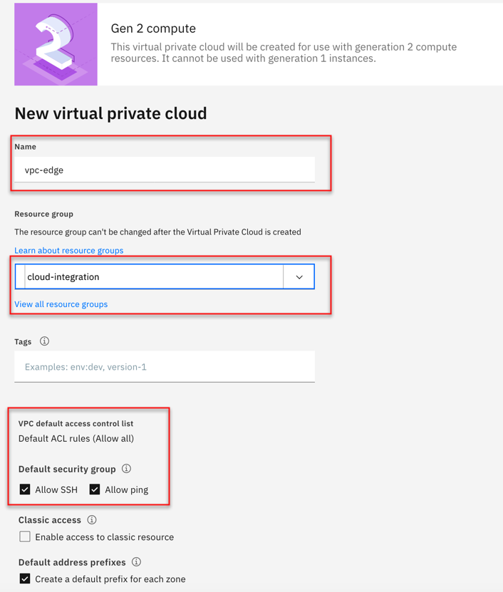
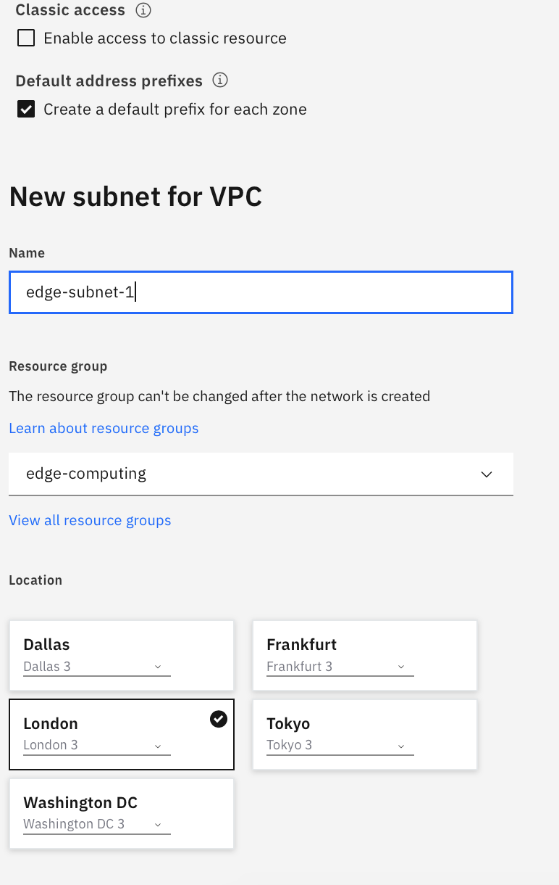
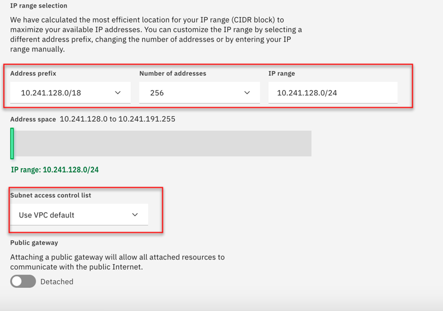
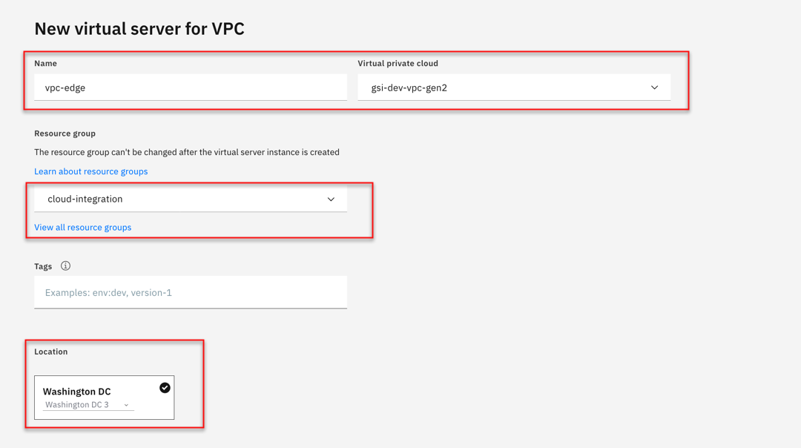
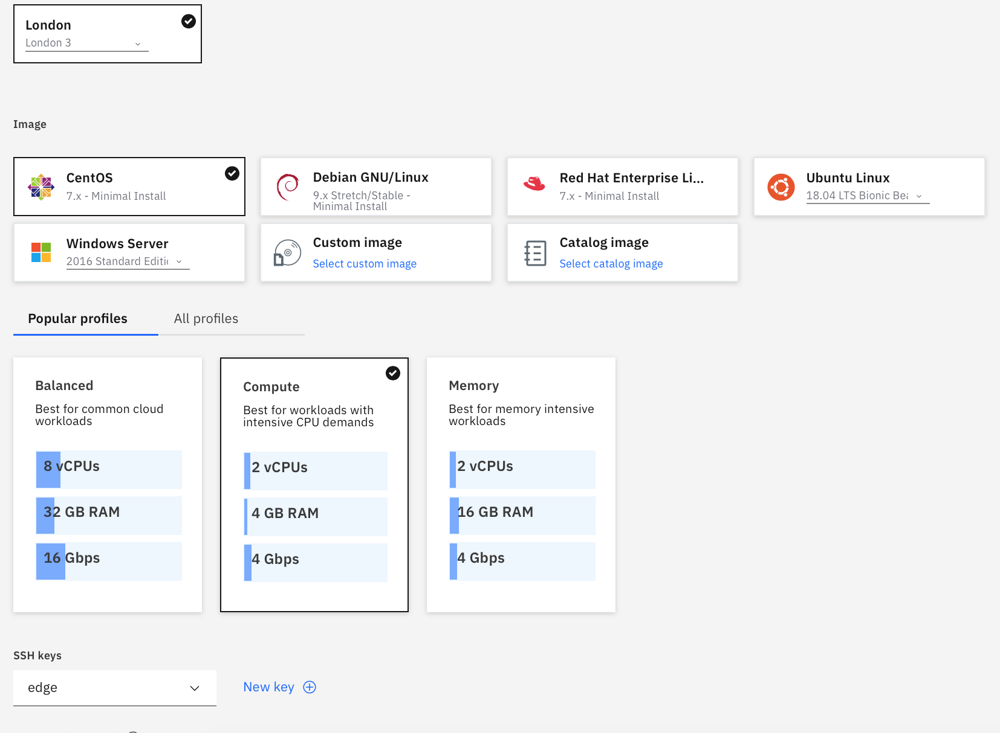
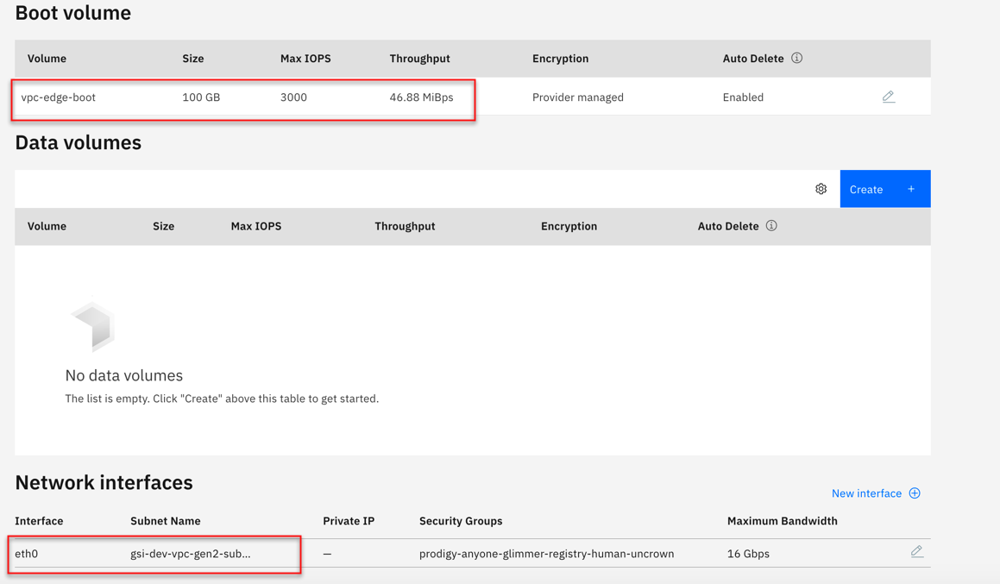

import Globals from 'gatsby-theme-carbon/src/templates/Globals';

<PageDescription>

</PageDescription>

## Overview

The certified lightweight Kubernetes distribution built for IoT & Edge computing

## 1.  Install a lightweight k3s cluster on a VPC Node

### (A) Create a VPC vpc-edge:

Use IBM Cloud Virtual Private Cloud to create your own space in IBM Cloud. A virtual private cloud (VPC) is a secure, isolated virtual network that combines the security of a private cloud with the availability and scalability of IBM's public cloud.

You can create and configure an IBM Cloud™ Virtual Private Cloud (VPC) by using the IBM Cloud console.

#### 1. Create VPC Instances

- Create a generation 2 virtual server instance. 
- Create a VPC and subnet to define the network. When you create your subnet, attach a public gateway if you want to allow all resources in the subnet to communicate with the public internet.




#### 2. Create Subnet

- To limit the subnet's inbound and outbound traffic, you can configure an access control list (ACL). By default, all traffic is allowed.




#### 3. Reserve IP

- If you want your instance to be reachable from the internet, reserve and associate a floating IP address.



#### 4. Next Steps

You are ready to connect to your instance. 

### (B) Create a edge-node1 virtual machine (virtual server) within the VPC:

IBM Cloud Virtual Servers for Virtual Private Cloud give you access to all of the benefits of IBM Cloud VPC, including network isolation, security, and flexibility.

- You can create IBM Cloud™ Virtual Servers for Virtual Private Cloud from the Virtual server instances page in IBM Cloud console.

#### 1. Creating Virtual Server (VS) instance

In IBM Cloud console External link icon, navigate to Menu icon Menu icon > VPC Infrastructure > Compute > Virtual server instances.

Click New instance and enter the following information as shown in the diagram:



#### 2. Stock Images

When you provision IBM Cloud Virtual Servers for Virtual Private Cloud, you can select from the supported stock images or a custom image that you import from IBM Cloud Object Storage. The image that you select determines the operating system that is provisioned for your instance. 



#### 3. Reserving a floating IP address

You can reserve and associate a floating IP address to your instance so you can connect to it from an internet location.



#### 4. Next Steps

You are ready to connect to your instance. 

### (C) Login with the ssh key. 

- If you need to give others access to vm for others, add public key to the authorized_keys in the vm.

## 2. Install k3s:

```
curl -sfL https://get.k3s.io | sh -
```
Execute kubectl get nodes to verify if k3s is running.

### Installing agent on k3s:
https://www.ibm.com/support/knowledgecenter/SSFKVV_4.1/devices/installing/preparing_edge_cluster.html

## 3. Install a edge node with just docker

 - 1.  Create a VM on VPC (Refer to procedure above)
 - 2.  Install docker on ubuntu vm

```
apt-get update
apt-get install docker.io
```

```
systemctl restart docker
```

 - 3. Check to see if docker is running
```
docker images
```

### Installing agent on docker:
https://www.ibm.com/support/knowledgecenter/SSFKVV_4.1/devices/installing/registration.html