import Globals from 'gatsby-theme-carbon/src/templates/Globals';

<PageDescription>
</PageDescription>
<Tabs>
<Tab label="Install CP4I on Amazon Web Services" open="true">

## **Recipe Overview**

Recipe describes the procedure to install IBM Cloud Pak for Integration v2020.3.1 with OCP 4.5.20 on AWS using Installer Provisioned Infrastructure (IPI) method. If you are looking for a simplified one-click installation procedure, consider [AWS Quick start for CP4I](https://community.ibm.com/community/user/middleware/blogs/matt-roberts1/2020/11/12/aws-quickstart).

Here are a few basic differences between IPI and AWS quickstart methods.
1. IPI provides full flexibility to users to configure the OpenShift cluster. While AWS quickstart requires only the essential configuration parameters to keep the installation experience simple.
2. IPI lets you choose the OpenShift version, while AWS quickstart is only available with OCP v4.4.22 at the moment. For this recipe, we have chosen OCP v4.5.20.
3. IPI lets CP4I worker nodes to double up as OpenShift Container storage cluster nodes, while AWS Quickstart requires you to provision separate storage worker nodes. Although latter is a best practice it is not necessary for POCs or demo environments.
4. With IPI only the OpenShift cluster is installed. This lets the user manually configure the CP4I installation. 


### **Ingredients**

   1. AWS account
   2. Red Hat pull secret
   3. IBM software entitlement key to install Cloud Pak for Integration
   4. DNS Domain
   5. Linux server to initiate installation (bastion node)
   6. CLI tools - oc-cli

## **Step-by-step**

### **1.  Setting up pre-requisites on AWS **
   Before you begin, you must have an account with [Amazon Web Services](https://aws.amazon.com). Sign up for an account if you do not have one already. If you are using an enterprise account, ask your AWS administrator to grant you appropriate access. 

   **1.1  [Configuring a public hosted zone](https://docs.aws.amazon.com/Route53/latest/DeveloperGuide/CreatingHostedZone.html):**
      
   In order to successfully install your OpenShift cluster and access it post installation, you need DNS resolution and name lookup for external connections to the cluster. To do this on Amazon Web Services (AWS) account, you must have a dedicated public hosted zone in your Route53 service.  This is a critical step as the OpenShift installer tries to connect to OpenShift cluster using the DNS names that are created dynamically. Installation will fail if the hostnames are not resolved automatically. Refer to [instructions](https://docs.aws.amazon.com/Route53/latest/DeveloperGuide/CreatingHostedZone.html) to create new public hosted zone on Route53 console. For more information on this topic refer to [OpenShift documentation](https://docs.openshift.com/container-platform/4.5/installing/installing_aws/installing-aws-account.html#installation-aws-route53_installing-aws-account).
   
   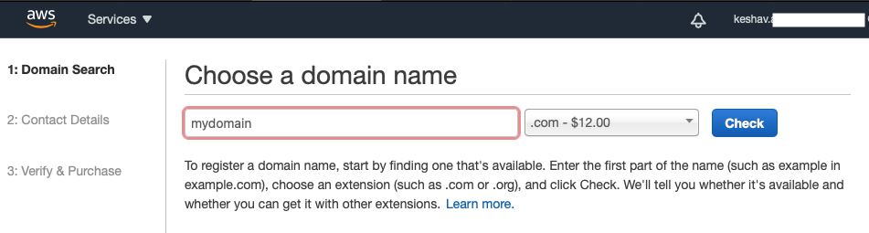

   **1.2  [Configure an IAM user](https://docs.openshift.com/container-platform/4.5/installing/installing_aws/installing-aws-account.html#installation-aws-iam-user_installing-aws-account):**

   In order to provision an OpenShift cluster, you need to create a user with programmatic access and administrator privileges. Refer to [instructions](https://docs.aws.amazon.com/IAM/latest/UserGuide/id_users_create.html) to create it. Make a note of the **Access key ID** and **Secret access key** created. If you do not have access to perform this task, you may want to reach out to your enterprise AWS admin.
   
   **1.3  [Set AWS Account limits](https://docs.openshift.com/container-platform/4.5/installing/installing_aws/installing-aws-account.html#installation-aws-limits_installing-aws-account):**

   Installing an OpenShift cluster involves provisioning several AWS components. Ensure adequate [account limits ](https://docs.openshift.com/container-platform/4.5/installing/installing_aws/installing-aws-account.html#installation-aws-limits_installing-aws-account) are set in order to provision a cluster of the required size.
   
   
### **2.  Download Red Hat pull secret, OCP installer and cli tools**
   
   **2.1  Red Hat pull secret**
   
   To perform the OpenShift installation you would require a Red Hat pull secret. You can download it from the Red Hat website. You will need to register if you do not have a login already.
   
   https://cloud.redhat.com/openshift/install/aws/installer-provisioned
   
   ______________________________________________________________________________________________________________
   
   ______________________________________________________________________________________________________________
   
   **2.2  Download installation files**

   CP4I v2020.3.1 requires OCP v4.4.13+ or v4.5.x. For this installation, we chose OpenShift v4.5.20.  For prerequisties, refer to the Knowledge Center’s [System Requirements](https://www.ibm.com/support/knowledgecenter/en/SSGT7J_20.3/install/sysreqs.html) page.
   
   Download the required installer and client version from following site.

   https://mirror.openshift.com/pub/openshift-v4/x86_64/clients/ocp/
   
   Here are the commands we've executed to download and prep for the installation on my MacOS bastion node. You can choose to install from a workstation/VM of your choice – ubuntu, mac or windows using linux shell. 
   
   ```
   mkdir ocp-4.5.20
   cd ocp-4.5.20
   wget https://mirror.openshift.com/pub/openshift-v4/x86_64/clients/ocp/4.5.20/openshift-client-linux-4.5.20.tar.gz
   wget https://mirror.openshift.com/pub/openshift-v4/x86_64/clients/ocp/4.5.20/openshift-install-linux-4.5.20.tar.gz
   tar -xvf openshift-install-linux-4.5.20.tar.gz
   tar -xvf openshift-client-linux-4.5.20.tar.gz
   sudo mv kubectl /usr/local/bin/kubectl
   sudo mv oc /usr/local/bin/oc
   ```
   Verify if OpenShift installer, oc and kubectl tools are in place. 
   ```
   oc version --client
   kubectl version --client
   ```
   ______________________________________________________________________________________________________________
   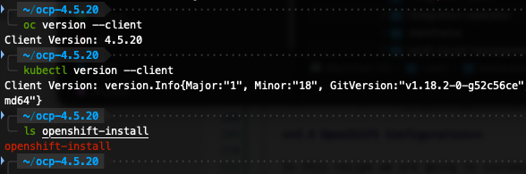
   ______________________________________________________________________________________________________________

### **3.  Installing OpenShift with installer**

   Generate ssh private keys and adding to the agent. This is required to debug installation and disaster recovery of the cluster. Refer to section 1.4.3 in the link for more information.
   
   **3.1  Create an ssh key:**
   ```
   ssh-keygen -t rsa -b 4096 -N '' \
       -f ~/.ssh/ocp_id_rsa
   ```
   
   **3.2  Start ssh agent and add ssh private key to it**
   ```
   eval "$(ssh-agent -s)"
   ssh-add ~/.ssh/ocp_id_rsa
   ```
   
   **3.3  OpenShift Configuration**

   In this recipe we are going to customize the installation to add the following configuration. 
   
   – 3 Master Nodes with 8 CPU and 32 GB RAM

   – 3 Worker Nodes with 32 CPU and 128 GB RAM
   
   This should be adequate to install all CP4I capabilites, runtimes and add-ons for demo purposes. For this recipe, the worker nodes also double up as OpenShift Container Storage worker nodes, hence we've chosen large worker nodes. However, it is recommended to setup 3 additional worker nodes for OCS. You may choose to adjust the # of worker nodes to add or reduce capacity. Refer to the [cloudpak8s.io](https://cloudpak8s.io/integration/cp4i-requirements/) for deployment best practices.
   
   **3.4  Create the install-config.yaml file**
   
   On the bastion node, run the following command. You will be prompted to enter the **AWS Access key ID** and **Secret access key**.
   
   ```
   ./openshift-install create install-config --dir=<installation_directory> --log-level=debug
   ```
   Upon completion, *install-config.yaml* file is created inside the installation direction specified.
   ______________________________________________________________________________________________________________
   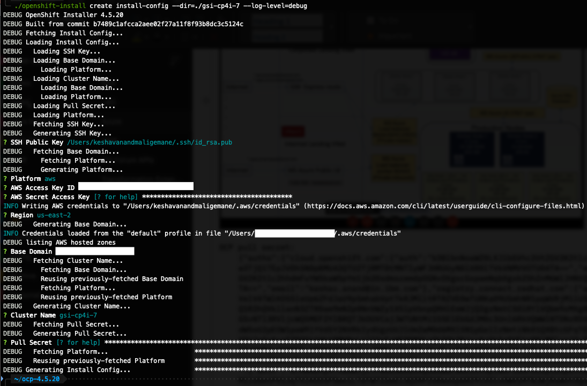
   ______________________________________________________________________________________________________________

   **3.5  Customize the install-config.yaml file**

   Edit the install-config.yaml file to include the VM `type`, `Cluster name`, `replicas`, `region`, `zones` and `baseDomain`.To find out the type of VM sizes available in the region, refer to the following AWS documentation.
   
   https://aws.amazon.com/ec2/instance-types/
   ______________________________________________________________________________________________________________
   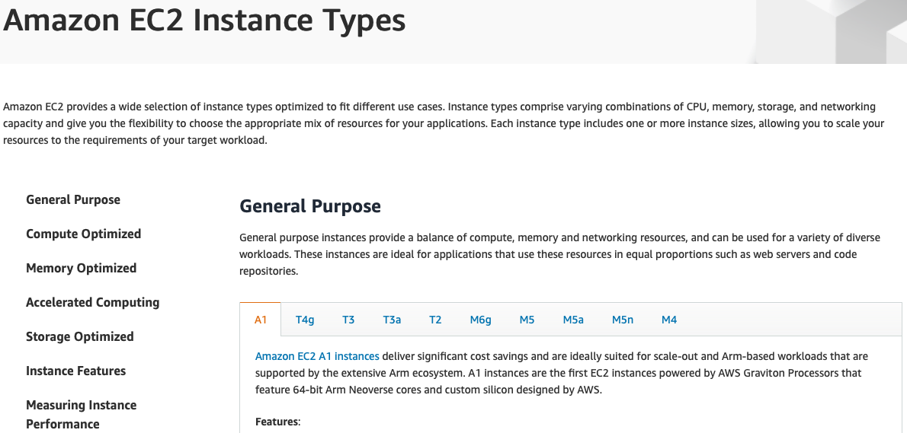
   ______________________________________________________________________________________________________________

   Make a note of the VM sizes you wish to use for your Master and Worker nodes and **exit** the page. For this recipe, we've have chosen *m5.8xlarge* for the Worker nodes and *m5.2xlarge* for the Master nodes.
   
   **NOTE:** Be sure to add zones in the yaml only if the AWS zones support it, else the installation is likely to fail. To see all regions and the zone availability check the AWS [regions](https://aws.amazon.com/about-aws/global-infrastructure/regions_az/) website.
   
   https://aws.amazon.com/about-aws/global-infrastructure/regions_az/
   
   Here is a sample install-config.yaml. For more on customization on of install-config.yaml refer to the following [Red Hat documentation](https://docs.openshift.com/container-platform/4.5/installing/installing_aws/installing-aws-customizations.html#installation-aws-config-yaml_installing-aws-customizations).
   
   ```
   apiVersion: v1
   baseDomain: yourdomain.com
   compute:
   - architecture: amd64
     hyperthreading: Enabled
     name: worker
     platform:
       aws:
         rootVolume:
           iops: 2000
           size: 1024
           type: io1
         type: m5.8xlarge
         zones:
         - us-east-2a
         - us-east-2b
         - us-east-2c
     replicas: 3
   controlPlane:
     architecture: amd64
     hyperthreading: Enabled
     name: master
     platform:
       aws:
         zones:
         - us-east-2a
         - us-east-2b
         - us-east-2c
         rootVolume:
           iops: 4000
           size: 500
           type: io1
         type: m5.2xlarge
     replicas: 3
   metadata:
     creationTimestamp: null
     name: gsi-cp4i-7
   networking:
     clusterNetwork:
     - cidr: 10.128.0.0/14
       hostPrefix: 23
     machineNetwork:
     - cidr: 10.0.0.0/16
     networkType: OpenShiftSDN
     serviceNetwork:
     - 172.30.0.0/16
   platform:
     aws:
       region: us-east-2
   publish: External
   pullSecret: <Red Hat pull secret goes here>
   sshKey: |
     <sshkey goes here>   
   ```
   
   **3.6  Run the installation program**
   
   Use the install-config.yaml file to create the OpenShift cluster.
   
   ```
   ./openshift-install create cluster ---dir=<installation_directory> --log-level=debug
   ```
   
   You may be prompted to enter the **AWS Access key ID** and **Secret access key**.
   ______________________________________________________________________________________________________________
   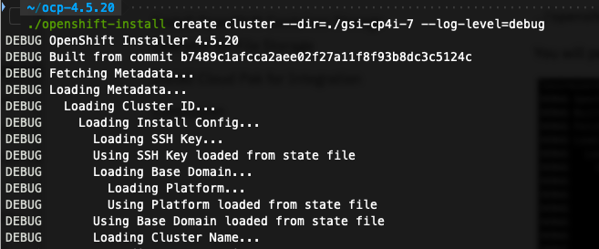
   ______________________________________________________________________________________________________________

   If you are re-running an install, the **AWS Access key ID** and **Secret access key** are picked up from ~/.aws/credentials
   
   When the installation completes, note down the webconsole URL and kubeadmin credentials. This may take upto an hour to complete.

   ______________________________________________________________________________________________________________
   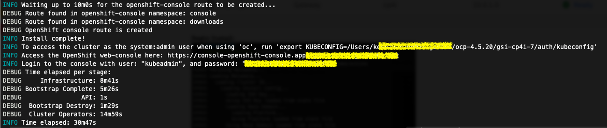
   ______________________________________________________________________________________________________________
   
   You can now launch the web-console in browser and use the kubeadmin credentials to login.
   ______________________________________________________________________________________________________________
   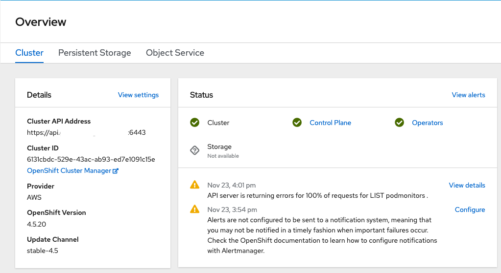
   ______________________________________________________________________________________________________________

   You can also see the master and worker nodes running on AWS EC2 console.
   ______________________________________________________________________________________________________________
   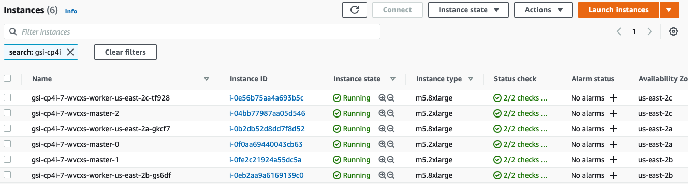
   ______________________________________________________________________________________________________________

### **4.  Install OpenShift Container Storage Operator for File Storage**   
    
   **OpenShift Container Storage** must be installed for provisioning a CP4I compatible file storage on AWS which abstracts all platform specifics. It is important to note OCS is a **licensed** offering from Red Hat.
   
   Follow the OCS installation procedure described in [Red Hat documentation](https://access.redhat.com/documentation/en-us/red_hat_openshift_container_storage/4.5/html/deploying_openshift_container_storage_using_amazon_web_services/index)
   
   While installing the OCS operator, be sure to choose “stable 4.5” update stream. 
   
   The instructions walk you through installation of the OCS operator and creating an instance of a storage cluster.
   ______________________________________________________________________
   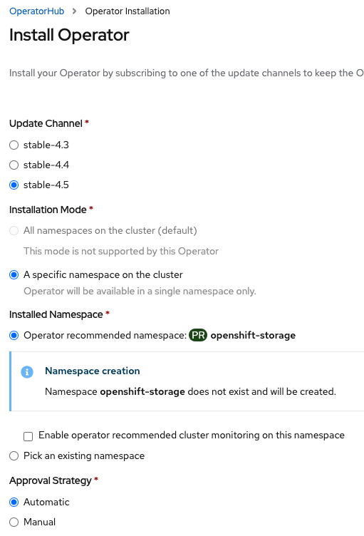
   ______________________________________________________________________
   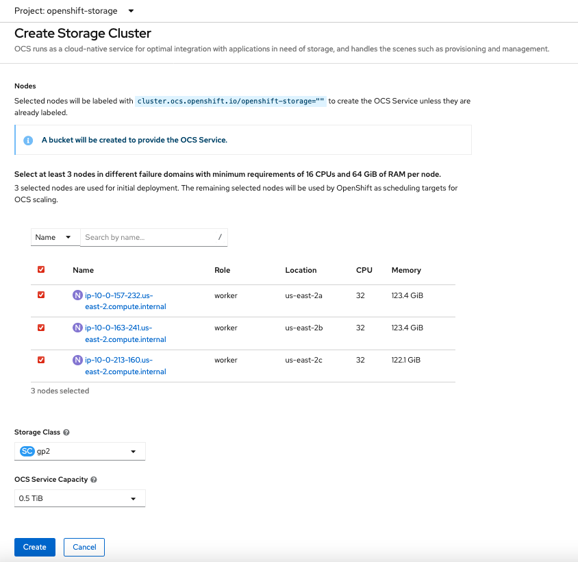
   ______________________________________________________________________

   After you have created an OCS instance. You should see the following storage classes.

   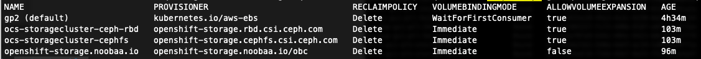
   
   You can now install CP4I Capabilites and Runtimes using the following storage classes.
   
   **Block storage**  – `gp2` (AWS default storage class) or `ocs-storagecluster-ceph-rbd` (OCS block storage)
   
   **File storage**   –  `ocs-storagecluster-cephfs` (OCS block storage)

### **5.  Install Cloud Pak for Integration**
   Refer to the CP4I installation runbook and Knowledge center for instructions of the common services, the platform navigator and other capabilities and runtimes.
   
   https://ibm-gsi-ecosystem.github.io/ibm-enterprise-runbooks/install/integration-operator
   
   https://www.ibm.com/support/knowledgecenter/en/SSGT7J_20.3/install/install.html
   
   **5.1  Known issues with Common services installation**
   
   While installing the common services, several pods may be stuck in "CreateContainerConfigError" or "Init" state.
   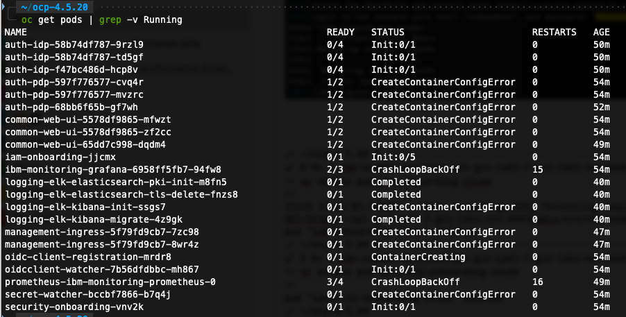
 
   To resolve this issue, restart the iam-onboarding job in ibm-common-services namespace. Follow instructions listed in the knowledge center.
   https://www.ibm.com/support/knowledgecenter/SSHKN6/iam/3.x.x/troubleshoot/iam_pods.html
   
   **PVC bound:**
   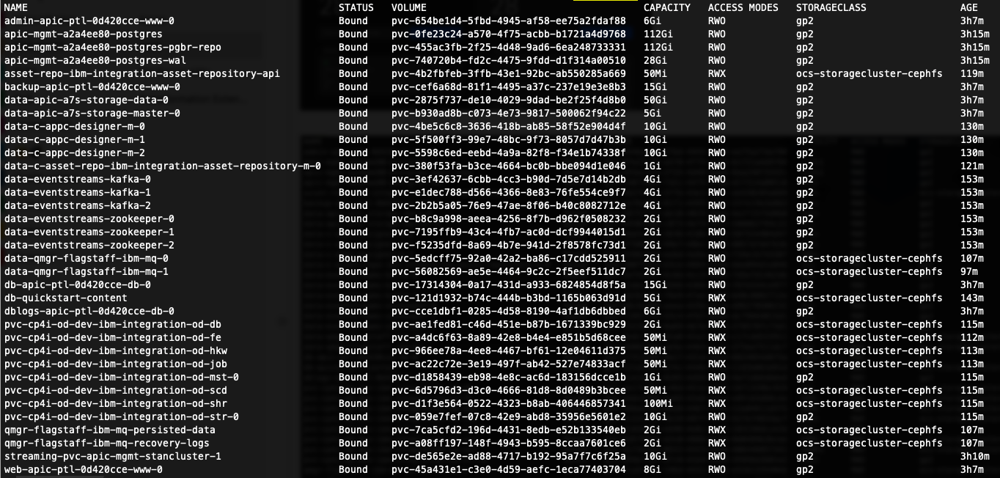
   
   **Capabilities installed:**
   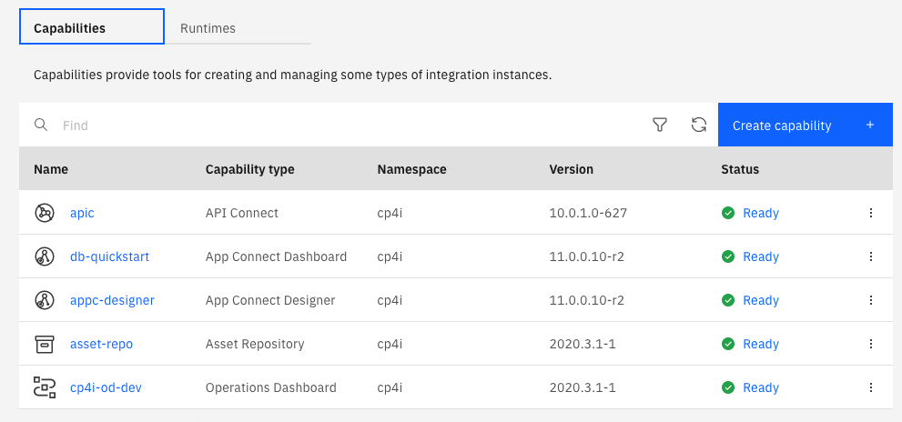
   
   **Installed Runtimes:**
   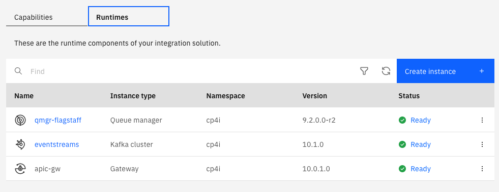


### **6.  Conclusion**

   Here is a quick summary of what we’ve covered in this recipe.
   1. Prepped an AWS account for OpenShift installation.
   2. Setup a bastion node with required tools to initiate OpenShift installation.
   3. Created a install-config.yaml to perform a customized install of an OCP cluster.
   4. Installed OCP cluster v4.5.20.
   5. Installed OpenShift Container Storage for creating cephfs storage class to be used by CP4I.
   6. Installed Cloud Pak for Integration v2020.3.1.
   7. Installed Common services, Operations Dashboard, API Connect, App Connect, MQ, Asset Repository and Event Streams.

</Tab>

<Tab label="References">

**IBM**
   - https://community.ibm.com/community/user/middleware/blogs/matt-roberts1/2020/11/12/aws-quickstart
   - https://www.ibm.com/support/knowledgecenter/en/SSGT7J_20.3/install/sysreqs.html
   - https://ibm-gsi-ecosystem.github.io/ibm-enterprise-runbooks/install/integration-operator
   - https://www.ibm.com/support/knowledgecenter/en/SSGT7J_20.3/install/install.html
    ______________________________________________________________________________________________________________


**Amazon Web Services**
   - https://docs.aws.amazon.com/Route53/latest/DeveloperGuide/CreatingHostedZone.html
   - https://docs.aws.amazon.com/IAM/latest/UserGuide/id_users_create.html
    ______________________________________________________________________________________________________________
 
**Red Hat OpenShift**
   - https://docs.openshift.com/container-platform/4.5/installing/installing_aws/installing-aws-account.html#installation-aws-route53_installing-aws-account
   - https://docs.openshift.com/container-platform/4.5/installing/installing_aws/installing-aws-account.html#installation-aws-iam-user_installing-aws-account
   - https://docs.openshift.com/container-platform/4.5/installing/installing_aws/installing-aws-account.html#installation-aws-limits_installing-aws-account
   - https://access.redhat.com/documentation/en-us/red_hat_openshift_container_storage/4.5/html/deploying_openshift_container_storage_using_amazon_web_services/index

</Tab>
</Tabs>
