import Globals from 'gatsby-theme-carbon/src/templates/Globals';

<PageDescription>

CP4I - Azure

</PageDescription>

## **Receipe Overview**

Recipe describes the procedure to install IBM Cloud Pak for Integration v2020.2.1 with OCP 4.4.17 on Microsoft Azure using Installer provisioned Infrastructure (IPI) method.


### **Ingredients**

   1. Azure account subscription
   2. RedHat pull secret
   3. IBM software entitlement key to install Cloud Pak for Integration
   4. DNS Domain
   5. Linux server to initiate installation (bastion node)
   6. CLI tools - az-cli, oc-cli

## **Step-by-step**

### **1. Configure an Azure account**
   Before you begin, ensure you have an active subscription with [Azure cloud](https://portal.azure.com/). Next, create a Resource Group, since every resource created on Azure needs to be associated with a resource group. Follow the [instructions](https://docs.microsoft.com/en-us/learn/modules/control-and-organize-with-azure-resource-manager/2-principles-of-resource-groups) to create a resource group with a logical name of your choice.

   **Configure an Azure account:**
   
   Follow the RedHat documentation to [configure an Azure account](https://docs.openshift.com/container-platform/4.4/installing/installing_azure/installing-azure-account.html) before you begin to install OpenShift.
   
   **1.1 [Set Azure Account limits](https://docs.openshift.com/container-platform/4.4/installing/installing_azure/installing-azure-account.html#installation-azure-limits_installing-azure-account):**
      
   Verify the default limits of your Azure account as this may prevent you from provisioning an OCP cluster of a required size. Follow the steps in the link to increase   your Azure account limits.
   
   **1.2 [Configuring a public DNS zone in Azure](https://docs.openshift.com/container-platform/4.4/installing/installing_azure/installing-azure-account.html#installation-azure-network-config_installing-azure-account):**
      
   Configure a [DNS Zone](https://docs.openshift.com/container-platform/4.4/installing/installing_azure/installing-azure-account.l#installation-azure-network-config_installing-azure-account) and ensure you [delegate](https://docs.microsoft.com/en-us/azure/dns/-delegate-domain-azure-dns#delegate-the-domain) it to registrar. You can use Azure App service Domain or external internet domain registrar like GoDaddy. This is   critical step as the OpenShift installer tries to connect to OpenShift cluster using the DNS names that are created dynamically. Installation will fail if the     hostnames are not resolved automatically.
   
   For this receipe I have chosen to create an App Service Domain on Azure.
   
   ______________________________________________________________________
   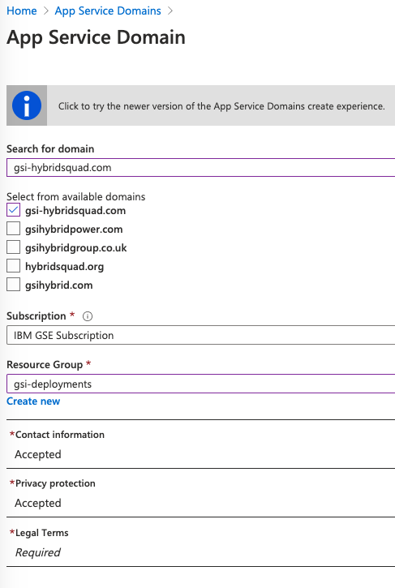
   
   ______________________________________________________________________
   
   **Snippet illustrating creation of DNS Zone.**
      
   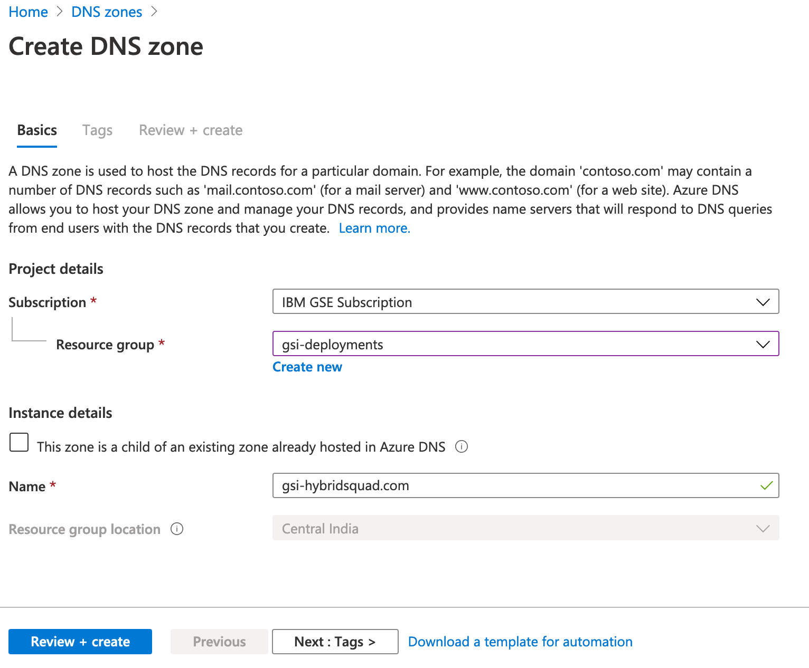
   ______________________________________________________________________
   
   **1.3 Azure account role: User Access Administrator**
   
   Go to All services> Subscriptions> < Your Subscription > Access Control (IAM) > View my Access
   
   You should have *User Access Administrator* role assigned to proceed with installation.
   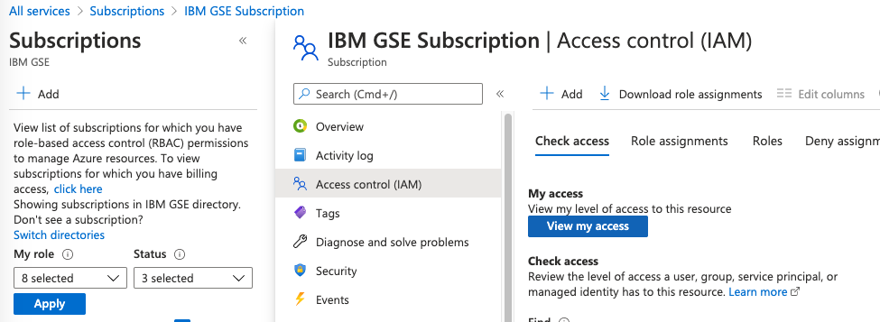
   
   **1.4 Install Azure cli tool**
   
   – Login to the Linux workstation(bastion node) where you intend to launch the OpenShift installer. Follow the instructions to install Azure cli. 
   – Also install jq json processor package.
   
   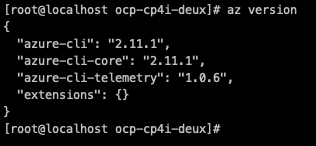
   
   **1.5 Create a Service Principal**
   
   You may *skip* this step if your Azure account admin has already created one for you to use.
   
   The installer provisions resources using Azure Resource Manager, this requires you to create a Service Principal. Follow the [instructions](https://access.redhatcom/documentation/en-us/openshift_container_platform/4.4/html/installing_on_azure/installing-on-azure?_ga=2.251984905.1894172416.1603114441-164786860.1603114441#installation-azure-service-principal_installing-azure-account) to complete this task. 
   
   Make a note the service principal that was created in this step. You will need it for the installation.
   
### **2. Download RedHat pull secret, OCP installer and cli tools**
   
   **2.1 Red Hat pull secret**
   
   To perform the OpenShift installation you would require a RedHat pull secret. You can download it from the following website. You will need to register if you do not have a    login already.
   
   https://cloud.redhat.com/openshift/install/azure/installer-provisioned
   
   ______________________________________________________________________________________________________________
   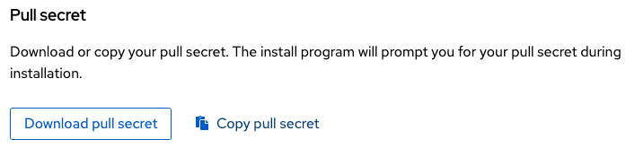
   ______________________________________________________________________________________________________________
   
   **2.2 Download installation files**

   For this installation, I chose a specific version of OCP (v 4.4.17). CP4I v2020.2.1 requires OCP v4.4.13 or later. For prerequisties, refer to the Knowledge Center’s    [System Requirements](https://www.ibm.com/support/knowledgecenter/en/SSGT7J_20.2/install/sysreqs.html?_ga=2.252106761.1894172416.1603114441-164786860.1603114441) page.
   
   Download the required installer and client version from following site.
   https://mirror.openshift.com/pub/openshift-v4/x86_64/clients/ocp/
   
   Here are the commands I executed to download and prep for the installation on my CentOS bastion node. You can choose to install from a workstation/VM of your choice –    ubuntu, mac or windows using linux shell. 
   
   ```
   mkdir ocp_install
   cd ocp_install
   wget https://mirror.openshift.com/pub/openshift-v4/x86_64/clients/ocp/4.4.17/openshift-install-linux-4.4.17.tar.gz
   wget https://mirror.openshift.com/pub/openshift-v4/x86_64/clients/ocp/4.4.17/openshift-client-linux-4.4.17.tar.gz
   tar -xvf openshift-install-linux-4.4.17.tar.gz
   tar -xvf openshift-client-linux-4.4.17.tar.gz
   sudo mv kubectl /usr/bin/kubectl
   sudo mv oc /usr/bin/oc
   ```
   Verify if OpenShift installer, oc and kubectl tools are in place. 
   ```
   oc version
   kubectl version
   ```
   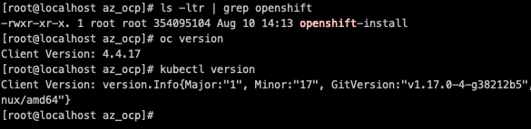

### **3. Installing OpenShift with installer**

   Generate ssh private keys and adding to the agent
   
   This is required to debug installation and disaster recovery of the cluster. Refer to section 1.4.3 in the link for more information.
   
   **3.1 Create an ssh key:**
   ```
   ssh-keygen -t rsa -b 4096 -N '' \
       -f ~/.ssh/ocp_id_rsa
   ```
   
   **3.2 Start ssh agent and add ssh private key to it**
   ```
   eval "$(ssh-agent -s)"
   ssh-add ~/.ssh/ocp_id_rsa
   ```
   **3.3 Ensure you are logged into Azure cloud**

   Issue the following commands to login. Set the correct subscription id before you proceed with installation.
   ```
   az login                                             // Displays all subscriptions upon successful login     
   az account set --subscription <subscription id>      // Set the subscription id to be used for installation
   az account show --output table                       // Shows the tenant id and subscription is use
   ```
   
   
   **3.4 OpenShift Configuration**

   In this recipe we are going to customize the installation to add the following configuration. 
   
   – 3 Master Nodes with 8 CPU and 32 GB RAM

   – 3 Worker Nodes with 16 CPU and 64 GB RAM
   
   This should be adequate to install most CP4I capabilites and runtimes on CP4I for demo purposes. You may choose to adjust the # of worker nodes to add or reduce capacity.Refer to the [cloudpak8s.io](https://cloudpak8s.io/integration/cp4i-requirements/) for deployment best practices.
   
   **3.5 Create the install-config.yaml file**
   
   On the bastion node, run the following command. You will be prompted to enter the azure subscription id, tenant id, service principal id and service principal secret.
   
   ```
   ./openshift-install create install-config --dir=<installation_directory> --log-level=debug
   ```
   Upon completion, *install-config.yaml* file is created inside the installation direction specified.
   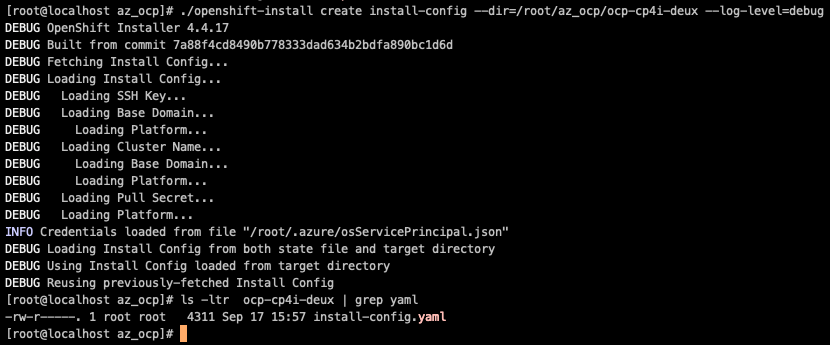
   
   **3.6 Customize the install-config.yaml file**

   Edit the install-config.yaml file to include the VM *images*, *Cluster name*, *replicas*, *region*, *zones*, *baseDomain* and *baseDomainResourceGroupName*.
   
   To find out the type of VM sizes available in the region, go to the following link and click on **Select Size**.
   
   https://portal.azure.com/?quickstart=True#create/Microsoft.VirtualMachine
   
   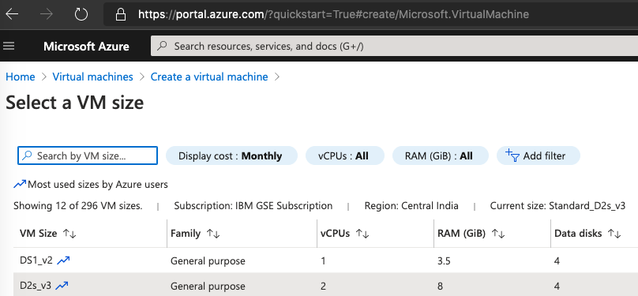
   
   Make a note of the VM sizes you wish to use for your Master and Worker nodes and **exit** the page. For this recipe, I have chosen *Standard_D16s_v3* for the Worker nodes and *Standard_D8s_v3* for the Master nodes.
   
   **NOTE:** Be sure to add zones in the yaml only if the Azure geographis region supports it, else the installation is likely to fail. To see all regions and the zone    availability check the Azure geographies website.
   
   https://azure.microsoft.com/en-in/global-infrastructure/geographies/
   
   Here is a sample install-config.yaml. For more on customization on of install-config.yaml refer to section 1.3.5.2 the following [RedHat documentation](https://access.redhat.com/documentation/en-us/openshift_container_platform/4.4/html/installing_on_azure/installing-on-azure?_ga=2.221559832.1894172416.1603114441-164786860.1603114441#installation-initializing_installing-azure-customizations).
   
   ```
   apiVersion: v1
   baseDomain: gsi-hybridsquad.com
   compute:
   - architecture: amd64
     hyperthreading: Enabled
     name: worker
     platform: 
       azure:
         type: Standard_D16s_v3
         osDisk:
           diskSizeGB: 1024
         zones:
         - "1"
         - "2"
         - "3"
     replicas: 3
   controlPlane:
     architecture: amd64
     hyperthreading: Enabled
     name: master
     platform:
       azure:
         osDisk:
           diskSizeGB: 1024
         type: Standard_D8s_v3
     replicas: 3
   metadata:
     creationTimestamp: null
     name: gsi-ocp-cp4i
   networking:
     clusterNetwork:
     - cidr: 10.128.0.0/14
       hostPrefix: 23
     machineNetwork:
     - cidr: 10.0.0.0/16
     networkType: OpenShiftSDN
     serviceNetwork:
     - 172.30.0.0/16
   platform:
     azure:
     region: centralus
     baseDomainResourceGroupName: gsi-deployments
   publish: External
   pullSecret: '<RedHat OpenShift Pull Secret goes here>'
   sshKey: |
     <ssh key goes here>
   ```
   
   **3.7 Run the installation program**
   
   Use the install-config.yaml file to create the OpenShift cluster.
   
   ```
   ./openshift-install create cluster ---dir=<installation_directory> --log-level=debug
   ```
   
   You will prompted to enter the Azure subscription id, tenant id, principal client id and its secret.
   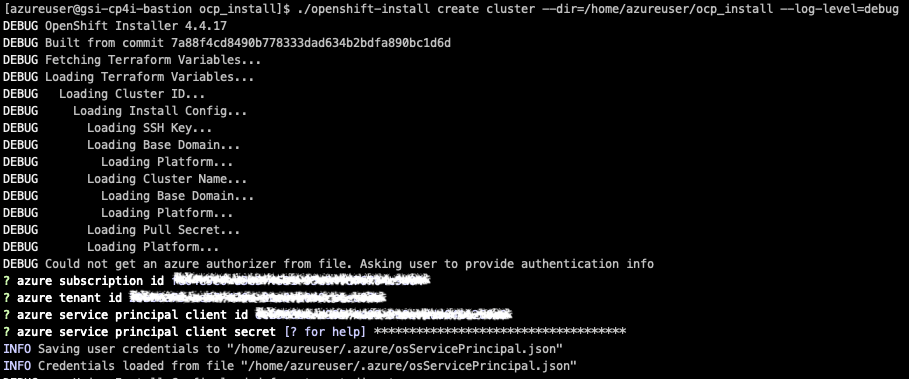
   
   If you are re-running an install, service principal and other credentials are picked up from ~/.azure/osServicePrincipal.json
   
   When the installation completes, note down the webconsole URL and kubeadmin credentials. This may take upto an hour to complete.
   
   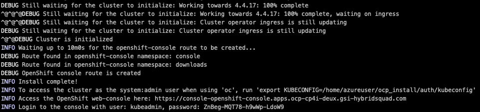
   
   You can now launch the web-console in browser and use the kubeadmin credentials to login.
   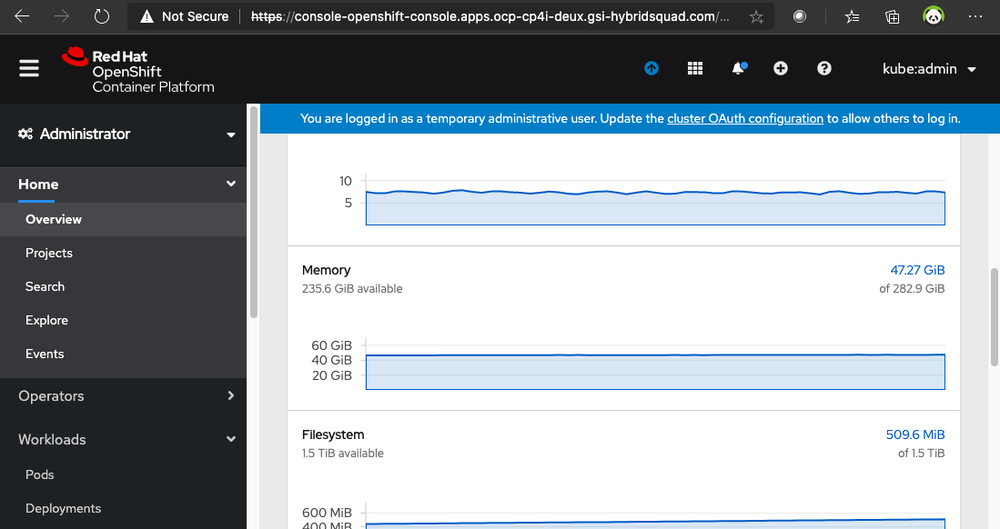

### **4. Install OpenShift Container Storage Operator for File Storage**

   **4.1 Known issues using Azure file storage**

   Azure provides Azure File storage for provisioning File based storage class. However certain CP4I components do not work well with Azure file storage.
   
   *App Connect Dashboard* installation fails with the following error.
   
   ```
   oc logs app-connect-dashboard-dash-59948f98cd-n5shm -c content-server-init
   mkdir: cannot create directory '/mnt/data/content': Permission denied
   ```
   
   Azure files are not supported for MQ Multi instance queue manager installation on CP4I.
   https://www.ibm.com/support/pages/testing-statement-ibm-mq-multi-instance-queue-manager-file-systems
   
    
   **OpenShift Container Storage** can be used in place of Azure file as it is proven to work and abstracts all the platform specifics. It is important to note OCS is a    **licensed** offering from RedHat.
   
   Follow the OCS installation procedure described in [RedHat documentation](https://access.redhat.com/documentation/en-us/red_hat_openshift_container_storage/4.4/html/deploying_openshift_container_storage/deploying-openshift-container-storage-on-openshift-container-platform_rhocs?_ga=2.25148730.1894172416.1603114441-164786860.1603114441)
   
   While installing the OCS operator, be sure to choose “stable 4.4” update stream. At the time of this installation, the OCS operator version was v4.4.2.
   
   The instructions walk you through installation of the OCS operator and creating an instance of a storage cluster.
   ______________________________________________________________________
   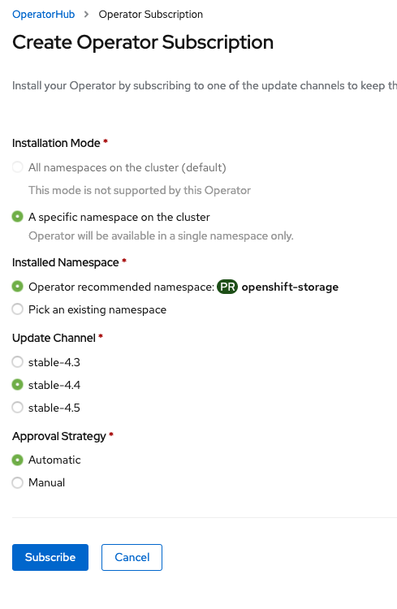
   
   ______________________________________________________________________
   
    
   
   After you have created an OCS instance. You should see the following storage classes.

   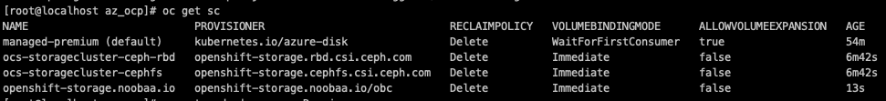
   
   You can now install CP4I Capabilites and Runtimes using the following storage classes.
   
   **Block storage**  – managed-premium (default installed by OCP)

   **File storage**   –  ocs-storagecluster-cephfs

### **5. Install Cloud Pak for Integration**
   Refer to the CP4I playbook and Knowledge center for instructions of the common services, the platform navigator and other capabilities and runtimes.
   
   https://cloudpak8s.io/integration/cp4i-install-latest/
   
   https://www.ibm.com/support/knowledgecenter/en/SSGT7J_20.2/install/install.html
   
   
   **PVC bound:**
   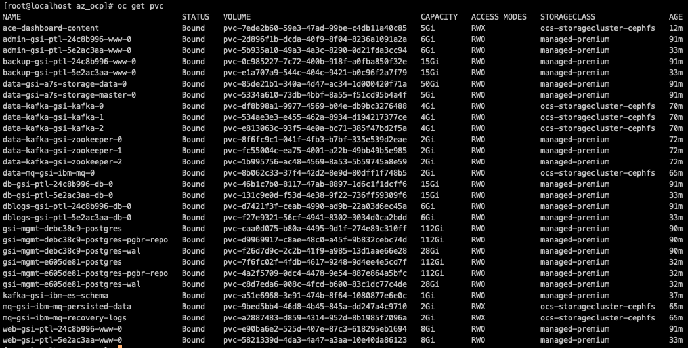
   
   **Capabilities installed:**
   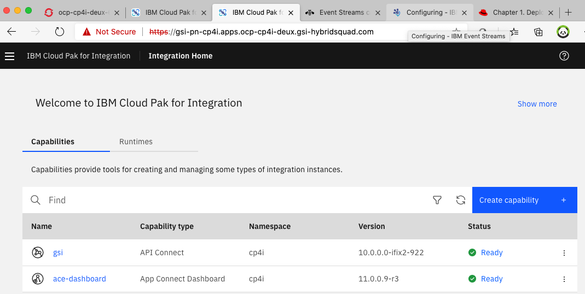
   
   **Installed Runtimes:**
   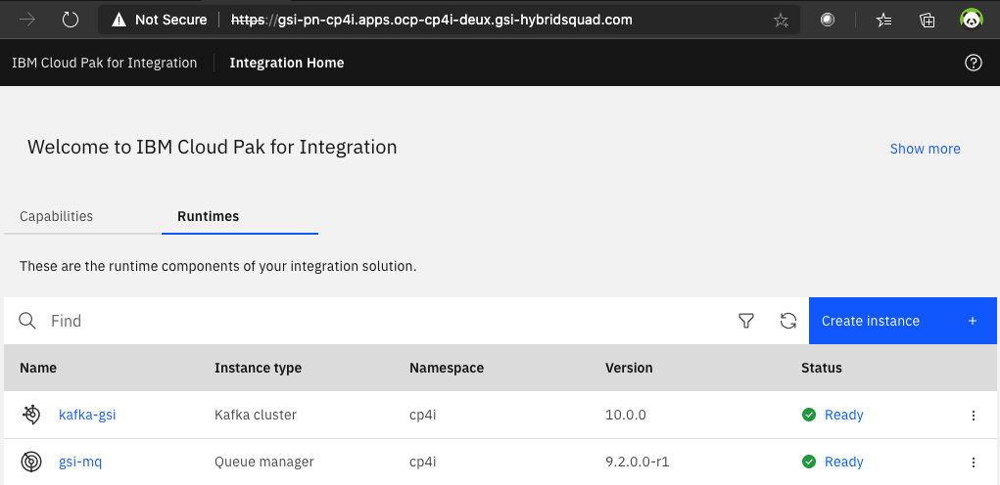


### **6. Conclusion**

   Here is a quick summary of what we’ve covered in this recipe.
   1. Prepped an Azure account for OpenShift installation.
   2. Setup a bastion node with required tools to initiate OpenShift installation.
   3. Created a install-config.yaml to perform a customized install of an OCP cluster.
   4. Installed OCP cluster v4.4.17.
   5. Installed Cloud Pak for Integration v2020.2.1.
   6. Installed OpenShift Container Storage for creating cephfs storage class to be used by CP4I.
   7. Installed API Connect, App Connect, MQ and Event Streams.

   
### **7. References**

   https://access.redhat.com/documentation/en-us/openshift_container_platform/4.4/html/installing_on_azure/installing-on-azure
   
   https://access.redhat.com/documentation/en-us/red_hat_openshift_container_storage/4.2/html/deploying_openshift_container_storage/deploying-openshift-container-storage
   
   https://www.youtube.com/watch?v=c4UbHQ3nR-8
   
   https://www.ibm.com/support/knowledgecenter/en/SSGT7J_20.2/install/install.html
   
   https://cloudpak8s.io/playbook/
   
   https://docs.microsoft.com/en-us/azure/?product=featured