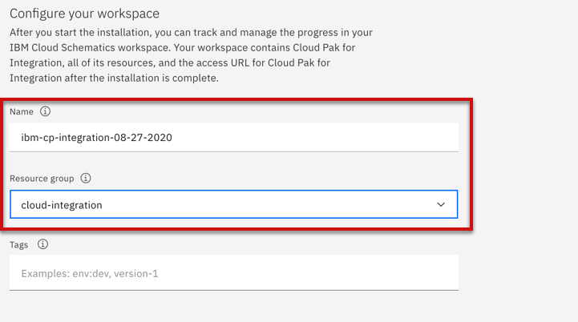
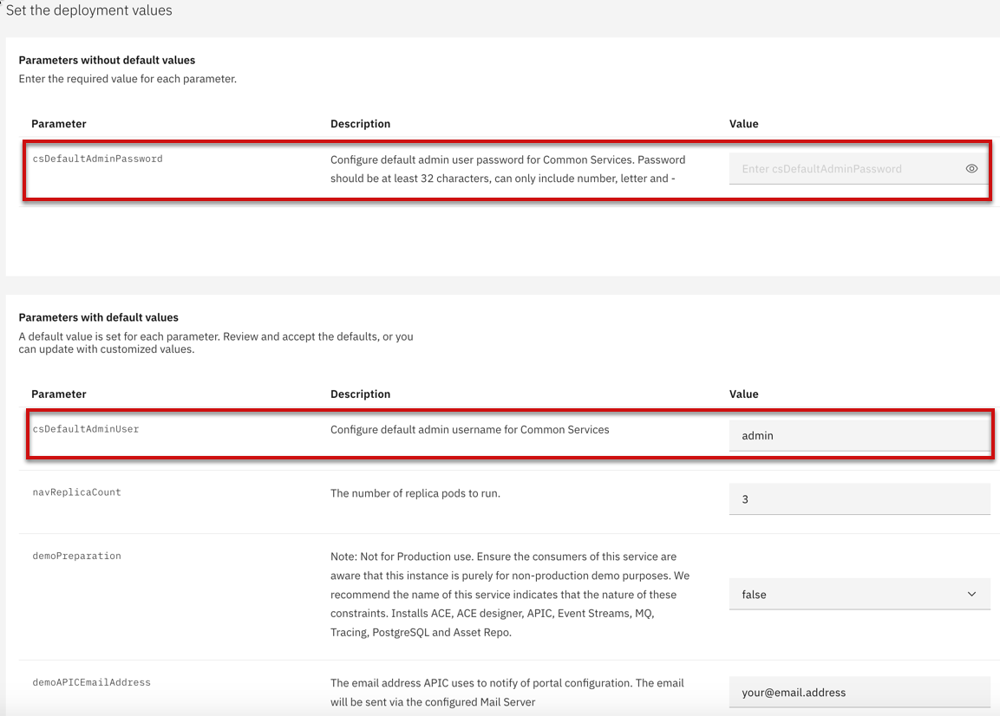

import Globals from 'gatsby-theme-carbon/src/templates/Globals';

<PageDescription>

</PageDescription>

## Overview

The IBM Cloud Pak for Integration is the industry’s most complete hybrid integration platform (HIP). Access all of the integration capabilities that your team needs to balance traditional and modern styles of integration. Enact the appropriate governance to provide the right level of access to each team member. Use any of the the capabilities independently delivered via a modern DevOps process and tooling or together, through a single interface with a single login and dashboard.

## Single Install Click from IBM Catalog

Get a Red Hat OpenShift cluster and configure it for use with the Cloud Pak. If you do not have a cluster, create one and then return to the Cloud Pak for Integration page.

### Assign a license
The license purchased through IBM Passport Advantage appears in the list of available entitlements Click an entitlement block to select it. Click Assign.

### Search Cloud Pak Software

Select the catalog and search for IBM Cloud Pak for integration software as shown in the diagram

### Configure your installation environment

Select the Red Hat OpenShift cluster as well as Cloud Pak for Application version where you want to install

### Configure your workspace

Enter a name for the workspace as well as select the Resource group where you store the resources.

### Set the deployment values

Set the value csDefaultAdminPassword which is NOT default value.

### Install the Cloud Pak

Ensure that an entitlement is assigned. If not, you must get an entitlement.

Confirm your agreement to the Third-Party Service Agreements by checking the box. Then, click Install.

### Next steps
Once the installation completes, click Offering Dashboard to open the Platform Navigator.

## Additional options to install Cloud Pak for Integration

Refer here for step by step instructions to install Integration - https://cloudpak8s.io/integration/cp4i-install-latest/