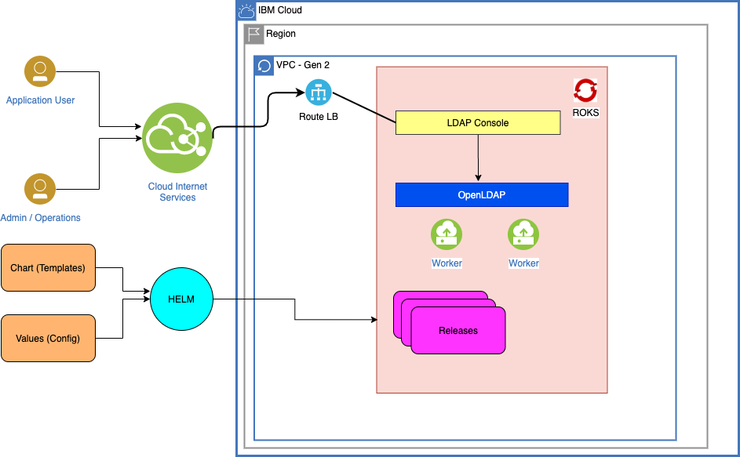
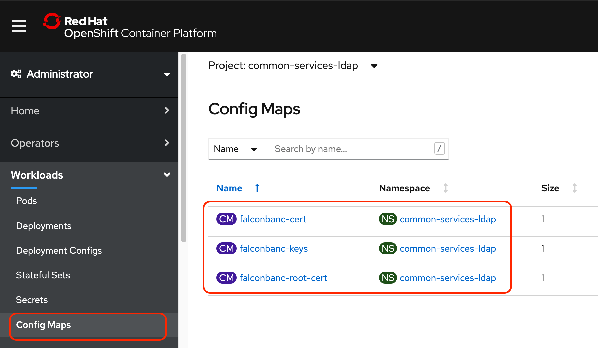

import Globals from 'gatsby-theme-carbon/src/templates/Globals';

<PageDescription>

</PageDescription>

## Common Services Cloud Helm charts

A collection of helm charts used by and/or provided for the FSS Cloud - Falcon Banc development

This GitHub repository also serves as a Helm repository, hosting the helm charts via GitHub pages. The url for the Helm repository is https://github.com/ibm-gsi-ecosystem/common-svs-charts

## Helm

Helm is a package manager. Package managers automate the process of installing, configuring, upgrading, and removing computer programs. Examples include the Red Hat Package Manager (RPM), Homebrew, and Windows PackageManagement.

An application in OpenShift typically consists of at least two resource types: a deployment resource, which describes a set of pods to be deployed together, and a services resource, which defines endpoints for accessing the APIs in those pods. The application can also include ConfigMaps, Secrets, Routes and Ingress.



## Helm Install 

### Helm Install on Local

[Installing Helm] (https://helm.sh/docs/intro/install/#helm)

### Helm Install - Charts

You can install Helm Charts

```
helm install <NAME> <CHART FOLDER>/ --values <CHART FOLDER>/values.yaml
```

### Helm Install - OpenLDAP Server

LDAP was originally a protocol, Lightweight Directory Access Protocol, and is now a directory service specification in its own right, including all kinds of schemas and extras.

OpenLDAP is an open-source implementation of LDAP, both server and client.

Here is the script to install the OpenLDAP Server via Helm Chart

```
helm install openldap openldap/ --values openldap/values.yaml
```

**Note:** Restart the pod if it crashloopback

### Helm Install - LDAPConsole (phpLDAPadmin)

phpLDAPadmin (also known as PLA) is a web-based LDAP client. It provides easy, anywhere-accessible, multi-language administration for your LDAP server.

Its hierarchical tree-viewer and advanced search functionality make it intuitive to browse and administer your LDAP directory. Since it is a web application, this LDAP browser works on many platforms, making your LDAP server easily manageable from any location.

**Note:** rename folder "console" to "ldapconsole" as some reason github repo is not showing contents if i keep "ldapconsole"

#### Certificates - Config Map

There are several options [Secret, IBM Storage , Cloud Object Storage, Certificate Manager etc] to load the certificate which is available in OpenShift. 

For the ldap, create 3 Config maps and load the certificates on each correspondingly as shown below:-



- **falconbanc-cert**
    Create the child named "falcon_banc.pem" under the data section and load the FalconBanc.pem contents

- **falconbanc-keys**
    Create the child named "falcon_banc.key" under the data section and load the FalconBanc.key content

- **falconbanc-root-cert**
    Create the child named "letsencryptauthorityx3-root.pem" under the data section and load the letsencryptauthorityx3-root.pem contents

Here is the script to install the LDAPConsole (phpLDAPadmin) via Helm Chart

```
helm install ldapconsole ldapconsole/  --set LDAP.host=<Host IPAddress> --values ldapconsole/values.yaml
```

**Note:** Restart the pod if it crashloopback

