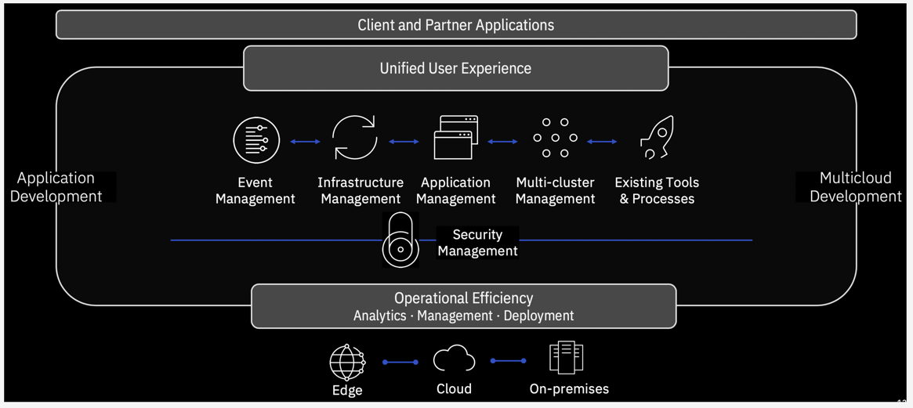

import Globals from 'gatsby-theme-carbon/src/templates/Globals';

<PageDescription>

</PageDescription>

## Overview

The IBM Cloud Pak for Multicloud Management, running on Red Hat® OpenShift®, provides consistent visibility, governance and automation from on premises to the edge. Enterprises gain capabilities such as multicluster management, event management, application management and infrastructure management. Enterprises can leverage this IBM Cloud Pak to help increase operational efficiency that is driven by intelligent data analysis and predictive golden signals, and gain built-in support for their compliance management.

The IBM Cloud Pak for Multicloud Management includes IBM Multicloud Manager, IBM Cloud Automation Manager, and IBM Cloud App Management, which includes IBM Cloud Event Management. With IBM Cloud Pak for Multicloud Management, you get more application and cluster visibility across the enterprise to any public or private cloud. You can improve automation by simplifying your IT and application operations management with increased flexibility and cost savings, and intelligent data analysis driven by predictive signals.

You can also take advantage of the governance, as with this IBM Cloud Pak for Multicloud Management, you can manage your multicloud environments with a consistent set of configuration and security policies across all applications and clusters.

Refer here for step by step instructions to MCM - https://cloudpak8s.io/mcm/cp4mcm_mcm_install/