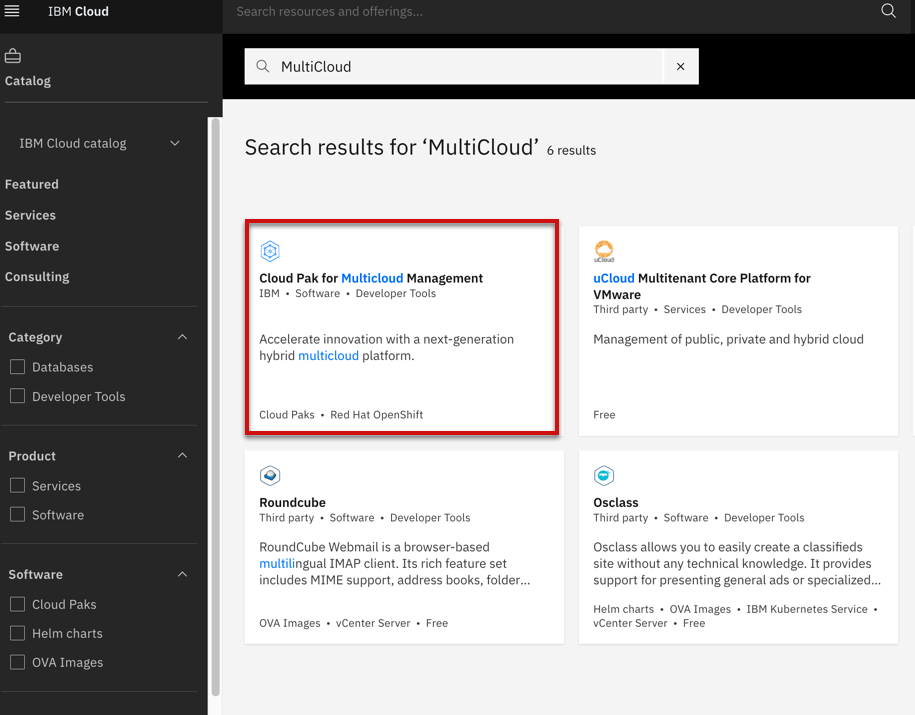
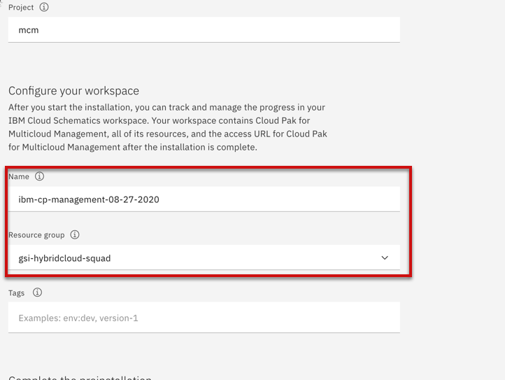
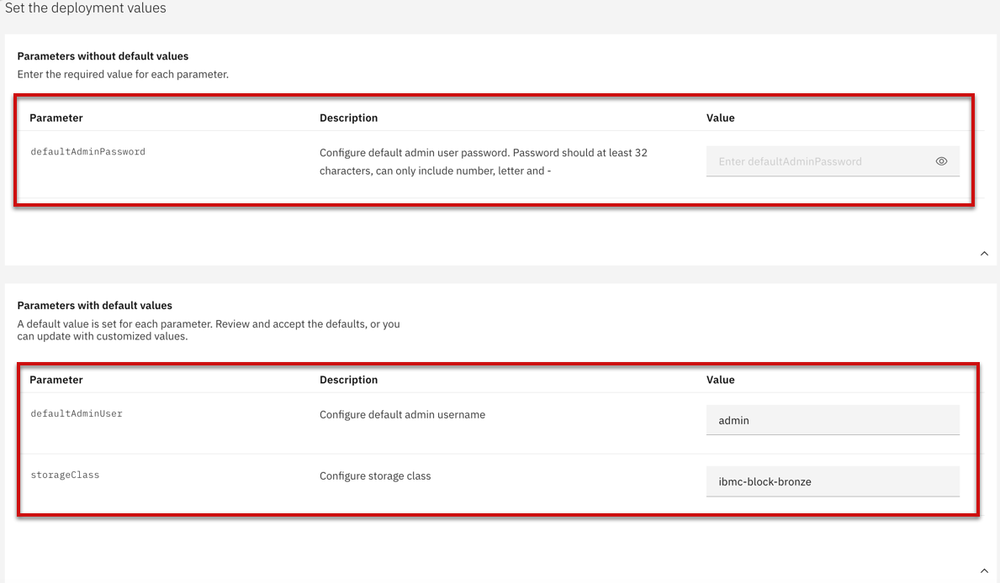
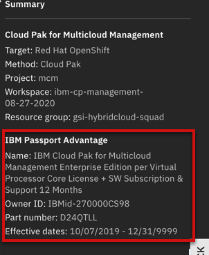

import Globals from 'gatsby-theme-carbon/src/templates/Globals';

<PageDescription>

</PageDescription>

## Overview

The IBM Cloud Pak for Multicloud Management, running on Red Hat® OpenShift, provides consistent visibility, governance and automation from on premises to the edge.

The IBM Cloud Pak for Multicloud Management includes IBM Multicloud Manager, IBM Cloud Automation Manager, and IBM Cloud App Management, which includes IBM Cloud Event Management. With IBM Cloud Pak for Multicloud Management, you get more application and cluster visibility across the enterprise to any public or private cloud. You can improve automation by simplifying your IT and application operations management with increased flexibility and cost savings, and intelligent data analysis driven by predictive signals.

## Single Install Click from IBM Catalog

Get a Red Hat OpenShift cluster and configure it for use with the Cloud Pak. If you do not have a cluster, create one and then return to the Cloud Pak for Integration page.

### Assign a license
The license purchased through IBM Passport Advantage appears in the list of available entitlements Click an entitlement block to select it. Click Assign.

### Search Cloud Pak Software

Select the catalog and search for IBM Cloud Pak for Multicloud software as shown in the diagram

### Configure your installation environment

Select the Red Hat OpenShift cluster as well as Cloud Pak for MCM version where you want to install

### Configure your workspace & Complete the pre-installation

Select the resource group where you want to track and manage resources 

Click Run script to run the pre-installation check. Confirm that the script completes successfully.

### Set the deployment values

Override the default values by configuring the required deployment values for the OpenShift cluster that you have installed:

### Install the Cloud Pak

Ensure that an entitlement is assigned. If not, you must get an entitlement.

Confirm your agreement to the Third-Party Service Agreements by checking the box. Then, click Install.

## Additional options to install Cloud Pak for MCM

Refer here for step by step instructions to MCM - https://cloudpak8s.io/mcm/cp4mcm_mcm_install/