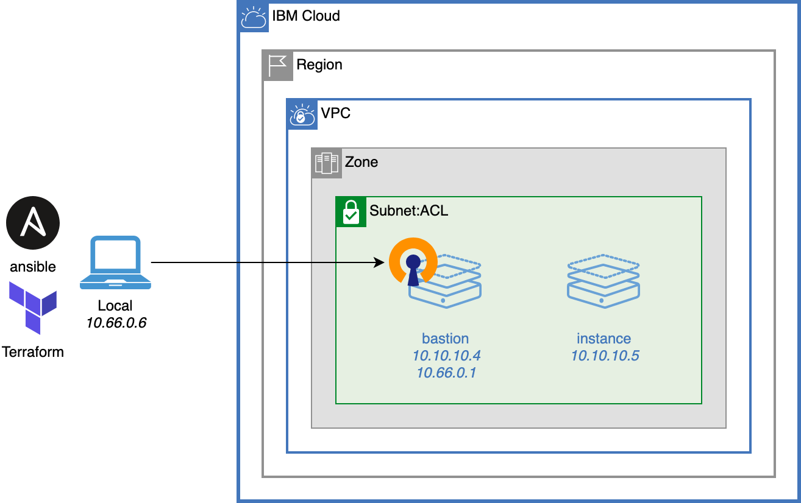

# Use OpenVPN to access virtual server instances running in a virtual private cloud

Virtual Private Cloud (VPC) come with an additional layer of security as your workload can be completely hidden from the public Internet. But there are times when you will want to get into this private network. A common practice is to use a bastion host to jump into your VPC from your local machine as example. Another option is to install a VPN software inside your VPC to extend the secure VPC network to your local network.

OpenVPN is a popular VPN software solution that can be easily installed on a server and offer a simple way to reach all the servers in your VPC from your local machine.

This repo shows how to deploy OpenVPN inside a VPC using Terraform and Ansible.

<table cellspacing="10" border="0">
  <tr>
    <td>
      
    </td>
    <td>
      
    </td>
  </tr>
</table>

## Deploy all resources

1. Copy `terraform.tfvars.template` to `terraform.tfvars`:
```sh
   cp terraform.tfvars.template terraform.tfvars
```
2. Edit `terraform.tfvars` to match your environment.

3. Use the [following Docker image](https://github.com/l2fprod/ibmcloud-ci) to run the deployment scripts. It has all required tools preinstalled.

* On Linux terminal:
```
   docker run -it --volume $PWD:/root/mnt/home --workdir /root/mnt/home l2fprod/ibmcloud-ci
```

* On Windows command prompt:
```
   docker run -it --volume %CD%:/root/mnt/home --workdir /root/mnt/home l2fprod/ibmcloud-ci
```

You can also try with your own environment. Prereqs are: tfswitch, terraform, ansible, ssh.

4. Run `tfswitch` to point to the right Terraform version for this solution:
```
   tfswitch
```

5. Deploy all resources:

```sh
   terraform init
   terraform apply
```

## Install OpenVPN on the bastion

1. Change to ansible directory:

```
   cd ansible
```

2. Install ansible dependencies
```
   ansible-galaxy install -r requirements.yml
```

3. To confirm ansible configuration, ping all hosts
```
   ansible all -m ping -i inventory -v
```

4. Install OpenVPN on the bastion
```
   ansible-playbook -i inventory playbook-openvpn.yml
```

## Connect to OpenVPN

To connect to the VPN, use _OpenVPN Connects_ with the configuration generated in `ansible/client-config/mymachine`:
- https://openvpn.net/client-connect-vpn-for-windows/
- https://openvpn.net/client-connect-vpn-for-mac-os/

or from a command line
```
   openvpn --setenv FORWARD_COMPATIBLE 1 --daemon --config ./client-config/mymachine/*-bastion.ovpn
```

To view routes on macOS, use `netstat -nr`. On Linux and Windows `netstat -ar`.

## Test the OpenVPN connection

From the Docker container, ping one VPC server instance directly from your local machine:
```
   ping $(terraform output -json | jq -r '.instance_ips.value[0]')
```

or a COS direct endpoint:
```
   ping s3.direct.us.cloud-object-storage.appdomain.cloud
```

or a service private endpoint:
```
   ping api.private.us-south.speech-to-text.watson.cloud.ibm.com
```

If you stop the VPN connection, all these ping would fail.

## Destroy all configuration

1. To destroy the environment, from the Docker container use:
```sh
   terraform destroy
```
