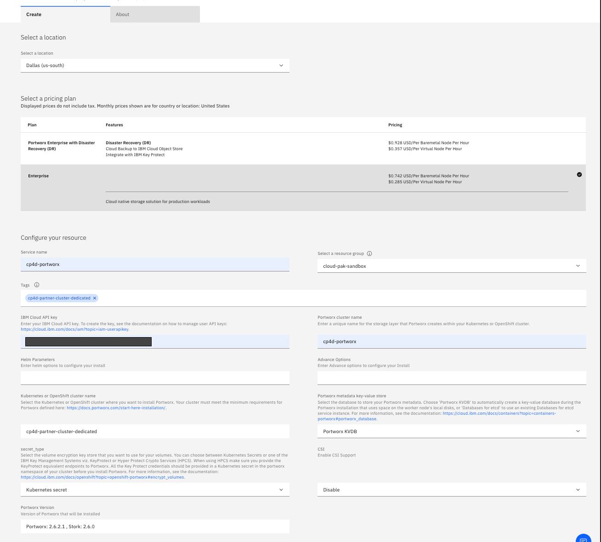

import Globals from 'gatsby-theme-carbon/src/templates/Globals';

<PageDescription>

</PageDescription>

## The following steps provide a fast path to manually complete the installation based on information from [Storing data with Portworx](https://cloud.ibm.com/docs/openshift?topic=openshift-portworx)

Ensure you have access to an OpenShift cluster with the correct size and number of workers. Portworx requires workers that are at least 16cpu/64GB.

For reference, full documentation on how to provision an OpenShift cluster is [here](https://cloud.ibm.com/docs/openshift?topic=openshift-getting-started#clusters_gs).

## 1. Log in to IBM Cloud CLI

From a terminal window, log in to IBM Cloud using the [cli](https://www.ibm.com/cloud/cli) and set the target `resource_group` to the group with your target OpenShift cluster.

    ibmcloud login -sso
    ibmcloud target -r us-south -g <resource_group>
    ibmcloud oc clusters
    ibmcloud oc cluster config -c <cluster_name> –-admin

## 2. Provision and Attach Block Storage

[Classic Infrastructure clusters](#classic-infrastructure)

[VPC clusters](#vpc)

### Classic Infrastructure

#### Provision classic block storage

For reference, full documentation on manually provisioning Block Storage is [here](https://cloud.ibm.com/docs/containers?topic=containers-utilities#manual_block).

Issue this command for each of the workers:

    ibmcloud sl block volume-order --storage-type endurance --size <size> --tier 10 --os-type LINUX -d <datacenter>

Get block volume details:

    ibmcloud sl block volume-list

Get worker details:

    ibmcloud oc workers --cluster $CLUSTER

For each worker, authorize the block storage:

    ibmcloud sl block access-authorize <volume_id> -p <node_private_ip>

For example:

    ibmcloud sl block access-authorize 214099980 -p 10.185.227.240
    ibmcloud sl block access-authorize 214100004 -p 10.185.227.238
    ibmcloud sl block access-authorize 214100042 -p 10.185.227.242
    ibmcloud sl block access-authorize 214100076 -p 10.185.227.248

#### Attach storage to classic worker nodes

a. Install or migrate to Helm version 3 on cluster

    For reference, instructions to install Helm v3 are [here](https://cloud.ibm.com/docs/openshift?topic=openshift-helm#install_v3).

b. Install IBM Cloud Block Storage Attacher Plug-in

    For reference, full documentation on IBM Cloud Block Storage Attacher Plug-in is [here](https://cloud.ibm.com/docs/openshift?topic=openshift-utilities#block_storage_attacher).

    Issue these commands:

       oc project kube-system
       helm repo update
       helm install block-attacher iks-charts/ibm-block-storage-attacher
       oc get pod -n kube-system -o wide | grep attacher
       oc get storageclasses | grep attacher

c. Attach newly created block storage to worker nodes

    For reference, full documentation on how to attach raw block storage to worker nodes is [here](https://cloud.ibm.com/docs/openshift?topic=openshift-utilities#attach_block).

    List storage volumes

        ibmcloud sl block volume-list

    Issue these two commands for each storage volume to get necessary information to create PVs below:

        ibmcloud sl block access-list <volume_id>
        ibmcloud sl block volume-detail <volume_id>

    Create a PV to attach each storage block to a worker:

       cat <<EOF | oc create -f -
       apiVersion: v1
       kind: PersistentVolume
       metadata:
       name: <pv_name>
       annotations:
         ibm.io/iqn: "<IQN_hostname>"
         ibm.io/username: "<username>"
         ibm.io/password: "<password>"
         ibm.io/targetip: "<targetIP>"
         ibm.io/lunid: "<lunID>"
         ibm.io/nodeip: "<private_worker_IP>"
         ibm.io/volID: "<volume_ID>"
       spec:
       capacity:
         storage: <size>
       accessModes:
         - ReadWriteOnce
       hostPath:
         path: /
       storageClassName: ibmc-block-attacher
       EOF

    For example:

       cat <<EOF | oc create -f -
       apiVersion: v1
       kind: PersistentVolume
       metadata:
       name: px-pv-240
       annotations:
         ibm.io/iqn: "iqn.2021-02.com.ibm:ibm02su2270065-i168011233"
         ibm.io/username: "IBM02SU2270065-I168011233"
         ibm.io/password: "xxxxxxxxxxxxx"
         ibm.io/targetip: "161.26.110.196"
         ibm.io/lunid: "0"
         ibm.io/nodeip: "10.185.227.240"
         ibm.io/volID: "214099980"
       spec:
       capacity:
         storage: 600Gi
       accessModes:
         - ReadWriteOnce
       hostPath:
         path: /
       storageClassName: ibmc-block-attacher
       EOF

    To list and describe pv:

       oc get pv
       oc describe pv <pv_name>

    If attached correctly, you will see `ibm.io/attachstatus: attached`

       Name:            px-pv-238
       Labels:          <none>
       Annotations:     ibm.io/attachstatus: attached
                        ibm.io/dm: /dev/dm-1
                        ibm.io/iqn: iqn.2021-02.com.ibm:ibm02su2270065-i168011229
                        ibm.io/lunid: 1
                        ibm.io/mpath: 3600a09803830566f4724516532536b52
                        ibm.io/nodeip: 10.185.227.238
                        ibm.io/password: eRdwGTYSBbCZh444
                        ibm.io/targetip: 161.26.110.204
                        ibm.io/username: IBM02SU2270065-I168011229
                        ibm.io/volID: 214100004
       Finalizers:      [kubernetes.io/pv-protection]
       StorageClass:    ibmc-block-attacher
       Status:          Available
       Claim:           
       Reclaim Policy:  Retain
       Access Modes:    RWO
       VolumeMode:      Filesystem
       Capacity:        600Gi
       Node Affinity:   <none>
       Message:         
       Source:
           Type:          HostPath (bare host directory volume)
           Path:          /
           HostPathType:  
       Events:            <none>

[Proceed to step 4](#4.-install-portworx-on-cluster)

### VPC

#### Provision VPC block storage

Create 1 VPC block storage volume for each worker (minimum of 3):

    ibmcloud is volume-create <volume-name> 10iops-tier <vpc zone> --capacity <size>

For example:

    ibmcloud is volume-create cpd-pwx-vol01 10iops-tier us-east-1 --capacity 200
    ibmcloud is volume-create cpd-pwx-vol02 10iops-tier us-east-1 --capacity 200
    ibmcloud is volume-create cpd-pwx-vol03 10iops-tier us-east-1 --capacity 200

#### Attach storage to VPC worker nodes

Retrieve IAM token, resource group and cluster.  Set environment variables to save typing in later commands.

    IAM_TOKEN=$(ibmcloud iam oauth-tokens --output json | jq -r '.iam_token')
    RESOURCE_GROUP=$(ibmcloud target --output json | jq -r '.resource_group.guid')
    CLUSTER=<clustername>

List storage volumes:

    ibmcloud sl block volume-list

Get worker details:

    ibmcloud oc workers --cluster $CLUSTER

Using the id of the desired worker node and the storage volume, use CLI command to attach:

    ibmcloud ks storage attachment create --cluster $CLUSTER --volume <volume_id> --worker <worker_id>

For Example:

    ibmcloud ks storage attachment create --cluster $CLUSTER --volume 214099980 --worker kube-c0mktgsd0b2lo0bik8q0-cp4dpartner-default-000001f6
    ibmcloud ks storage attachment create --cluster $CLUSTER --volume 214100004 --worker kube-c0mktgsd0b2lo0bik8q0-cp4dpartner-default-00000281
    ibmcloud ks storage attachment create --cluster $CLUSTER --volume 214100042 --worker kube-c0mktgsd0b2lo0bik8q0-cp4dpartner-default-00000314 

Verify attachments:

    curl -X GET "https://containers.cloud.ibm.com/v2/storage/getAttachments?cluster=$CLUSTER&worker=<worker_ID>" --header "X-Auth-Resource-Group-ID: $RESOURCE_GROUP" --header "Authorization: $IAM_TOKEN"

    curl -X GET "https://containers.cloud.ibm.com/v2/storage/getAttachments?cluster=$CLUSTER&worker=kube-bvc11mbw0n2a9mccenlg-timropwxvpc-default-000002a7" --header "X-Auth-Resource-Group-ID: $RESOURCE_GROUP" --header "Authorization: $IAM_TOKEN" {"volume_attachments":[{"id":"0757-1e3db03e-e9bb-44ba-b423-14570a3511e6","volume":{"name":"timro-pwx-vol01","id":"r014-aef666d3-5072-4900-a1b2-23a69cb3f96b"},"device":{"id":"0757-1e3db03e-e9bb-44ba-b423-14570a3511e6-8xbd9"},"name":"volume-attachment","status":"attached","type":"data"},{"id":"0757-6a52d8da-3192-4ac9-b78d-3fa3e402be4f","volume":{"name":"gab-wistful-stimulate-nutmeg","id":"r014-54a8d1d0-b679-4c7e-bec6-b91deb30e98f"},"device":{"id":"0757-6a52d8da-3192-4ac9-b78d-3fa3e402be4f-x5rql"},"name":"volume-attachment","status":"attached","type":"boot"}]}

## 4. Install Portworx on cluster

### Create an API Key

For reference, full documentation on how to create an API key is [here](https://cloud.ibm.com/docs/account?topic=account-userapikey)

IMPORTANT: Ensure user creating API Key has sufficient permissions to work with cluster. They must be assigned the `Editor` platform role and the `Manager` service access role for `IBM Cloud Kubernetes Service`. For more information, see [User access permissions](https://cloud.ibm.com/docs/containers?topic=containers-access_reference).

NOTE: Portworx won't install using a service id api key.

- Select "Manage" -> "Access (IAM)" from IBM Cloud Console top menu
- Select “API Keys” -> "Create"
- Save the value of this key

### Copy pull secrets

Copy from `default` namespace to `kube-system` and associate with service account  (to use KVDB)

    oc get secret all-icr-io -n default -o yaml | sed 's/default/kube-system/g' | oc create -n kube-system -f -
    oc patch -n kube-system serviceaccount/default --type='json' -p='[{"op":"add","path":"/imagePullSecrets/-","value":{"name":"all-icr-io"}}]'
    oc describe serviceaccount default -n kube-system

### Use Public Catalog to install Portworx Enterprise

For reference, full documentation on how to install Portworx Enterprise is [here](https://cloud.ibm.com/docs/openshift?topic=openshift-portworx#install_portworx)

For non-production scenario, skip encryption. Choose to use in-cluster KVDB for simplicity.

Open the [Portworx catalog tile](https://cloud.ibm.com/catalog/services/portworx-enterprise):

- Select Datacenter
- Choose Pricing plan. For non production scenario, Disaster Recovery isn't needed
- Enter a service name
- Select resource group
- Provide API key created in step 7 which will produce list of available clusters
- Choose the target cluster
- Under `tags` provide the cluster name. Do not provide any other tags.
- Enter a Portworx cluster name
- Select "portworx KVDB" in the pulldown for metadata key-value store
- Select "Kubernetes secret" as the secret_type

After the service shows as active in the IBM Cloud resource view, verify the deployment:

    kubectl get pods -n kube-system | grep 'portworx\|stork'

This should display something like the following:

    portworx-647c5                            1/1     Running     0          9m33s
    portworx-api-h7dnr                        1/1     Running     0          9m33s
    portworx-api-ndpxb                        1/1     Running     0          9m33s
    portworx-api-srnjk                        1/1     Running     0          9m33s
    portworx-gzgqc                            1/1     Running     0          9m33s
    portworx-pvc-controller-b8c88b4d7-6rnq6   1/1     Running     0          9m33s
    portworx-pvc-controller-b8c88b4d7-9bfxk   1/1     Running     0          9m33s
    portworx-pvc-controller-b8c88b4d7-nqqpr   1/1     Running     0          9m33s
    portworx-vxphk                            1/1     Running     0          9m33s
    stork-6f74dcf5fc-mxwxb                    1/1     Running     0          9m33s
    stork-6f74dcf5fc-svnrl                    1/1     Running     0          9m33s
    stork-6f74dcf5fc-z9qlc                    1/1     Running     0          9m33s
    stork-scheduler-7d755b5475-grzr2          1/1     Running     0          9m33s
    stork-scheduler-7d755b5475-nl25m          1/1     Running     0          9m33s
    stork-scheduler-7d755b5475-trhhb          1/1     Running     0          9m33s

Using one of the portworx pods, check the status of the storage cluster

    kubectl exec portworx-647c5 -it -n kube-system -- /opt/pwx/bin/pxctl status

This should produce output like:

    Status: PX is operational
    License: PX-Enterprise IBM Cloud (expires in 1201 days)
    Node ID: 5d65ce5b-1333-4b0c-b469-ccf7df1ce94a
      IP: 172.26.0.10 
      Local Storage Pool: 1 pool
      POOL    IO_PRIORITY  RAID_LEVEL  USABLE    USED     STATUS  ZONE      REGION
      0       LOW          raid0       400 GiB   18 GiB   Online  us-east-1 us-east
      Local Storage Devices: 1 device
      Device  Path      Media Type               Size     Last-Scan
      0:1     /dev/vdd  STORAGE_MEDIUM_MAGNETIC  400 GiB  18 Dec 20 04:43 UTC
      * Internal kvdb on this node is sharing this storage device /dev/vdd  to store its data.
      total   -         400 GiB
      Cache Devices:
        * No cache devices
    Cluster Summary
      Cluster ID: pwx-iaf
      Cluster UUID: 45fc03a8-7e82-497d-bc2a-0844dca1459f
      Scheduler: kubernetes
      Nodes: 3 node(s) with storage (3 online)
      IP           ID                                   SchedulerNodeName  StorageNode  Used    Capacity  Status  StorageStatus Version         Kernel                      OS
      172.26.0.9   f96e278c-fd06-42a8-9684-0d91bc0bde9c 172.26.0.9         Yes          18 GiB  400 GiB   Online  Up            2.6.1.6-3409af2 3.10.0-1160.6.1.el7.x86_64  Red Hat
      172.26.0.10  5d65ce5b-1333-4b0c-b469-ccf7df1ce94a 172.26.0.10        Yes          18 GiB  400 GiB   Online  Up (This node 2.6.1.6-3409af2 3.10.0-1160.6.1.el7.x86_64  Red Hat
      172.26.0.11  1b56ec6c-6dcd-4807-a9cd-cf1ae12e7635 172.26.0.11        Yes          18 GiB  400 GiB   Online  Up            2.6.1.6-3409af2 3.10.0-1160.6.1.el7.x86_64  Red Hat
      Warnings: 
          WARNING: Internal Kvdb is not using dedicated drive on nodes [172.26.0.11 172.26.0.9 172.26.0.10]. This configuration is not recommended for production clusters.
    Global Storage Pool
      Total Used      :  53 GiB
      Total Capacity  :  1.2 TiB

To review classificiation:

    kubectl exec -it <portworx_pod> -n kube-system -- /opt/pwx/bin/pxctl cluster provision-status

Test by creating a PVC - create a yaml file with a read-write-many claim:

    cat <<EOF | oc create -f -
    kind: PersistentVolumeClaim
    apiVersion: v1
    metadata:
      name: mypvc
    spec:
      accessModes:
      - ReadWriteMany
      resources:
        requests:
          storage: 10G
      storageClassName: portworx-shared-sc
    EOF

## 5. Create Portworx storage class definitions for Cloud Pak for Data

Cloud Pak for Data requires certain storage classes. To define them manually, go [here](https://www.ibm.com/support/producthub/icpdata/docs/content/SSQNUZ_latest/cpd/install/portworx-storage-classes.html) to see the definitions.

For example `portworx-shared-gp3` is defined by:

    cat <<EOF | oc create -f -
    apiVersion: storage.k8s.io/v1
    kind: StorageClass
    metadata:
      name: portworx-shared-gp3
    parameters:
      priority_io: high
      repl: "3"
      sharedv4: "true"
      io_profile: db_remote
      disable_io_profile_protection: "1"
    allowVolumeExpansion: true
    provisioner: kubernetes.io/portworx-volume
    reclaimPolicy: Retain
    volumeBindingMode: Immediate
    EOF

## Cleaning up and removing Portworx

Run in the cluster:

    curl -fsL https://install.portworx.com/px-wipe | bash

Remove the resource from the IBM Cloud Console with delete, then deprovision the OpenShift Cluster
