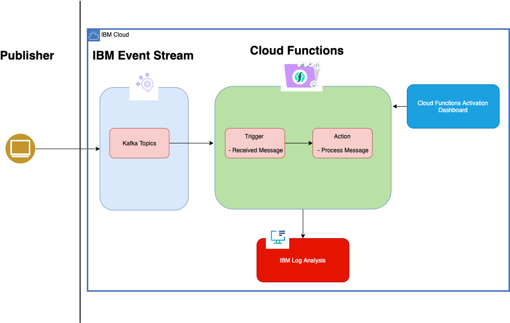
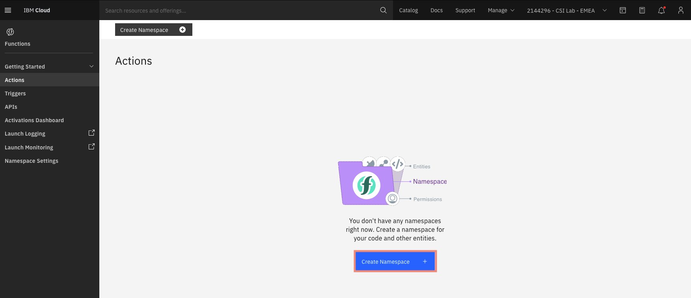
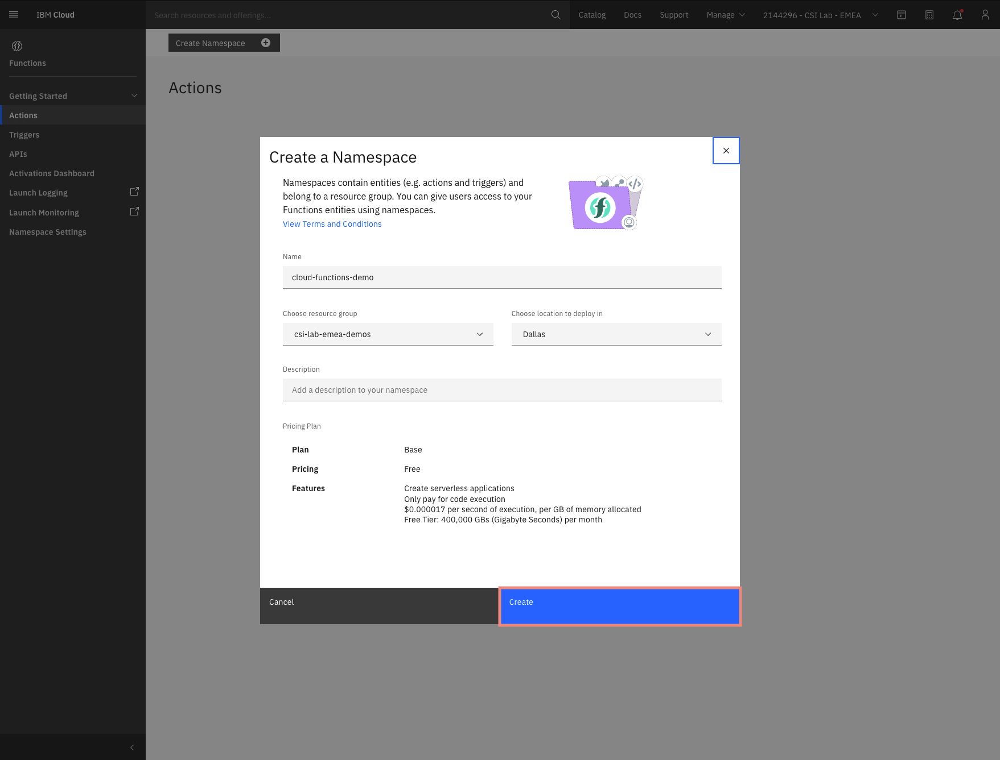

import Globals from 'gatsby-theme-carbon/src/templates/Globals';

<PageDescription>

</PageDescription>

## **Overview**

Simple tutorial for reading IBM Event Streams (using Kafka) messages with IBM 
Cloud Functions Python runtime.



<Tabs>

<Tab label="Using IAM" open="true">

## **Prerequisites**

 - An [IBM Cloud](https://cloud.ibm.com) account.

## **Create an IBM Cloud Functions Namespace**.

 - First, let's create our [IBM Cloud Functions namespace](https://cloud.ibm.com/functions/actions) in which we are going to work:
    
 - Give it a name, select a resource group and region, then click **Create**:
    

## **Create an IBM Cloud Functions Action**

Create an [IBM Cloud Functions Action](https://cloud.ibm.com/functions/actions) called `process-message`, that uses the **Python** runtime:

 - Create a new Action
    
 - Name it `process-message`, use default package, select **Python** runtime then click **Create**:
    
 - Put the following code inside the function:
    ```python
    def main(dict):
        messages = dict.get('messages')

        if messages is None or messages[0] is None:
            return { 'error': "Invalid arguments. Must include 'messages' JSON array" }
        try:
            val = messages[0]['value']
        except KeyError:
            return { 'error': "Invalid arguments. Must include 'messages' JSON array" }

        for i in range(0, len(messages)):
            msg = messages[i]
            print('Message received:', msg['value'])

        return { 'messages': messages }
    ```
    

## **Provision IBM Event Streams**

 - Provision an [IBM Event Streams](https://cloud.ibm.com/catalog/services/event-streams) instance. In this tutorial I'll call IBM Event Streams service instance `my-event-streams`:
    
 - Once your service is created, create a new topic called `hello-world`:
    
 - Create service credentials called `cloud-functions`:
    
 - Save the `kafka_brokers_sasl`, `apikey` and `kafka_admin_url` values from the new credentials for future steps.

## **Create a new Trigger for incoming messages on IBM Event Streams**

Create an [IBM Cloud Functions Trigger](https://cloud.ibm.com/functions/triggers) called `new-message-trigger`, that reacts to incoming Kafka messages on your `hello-world` topic of your `my-event-streams` IBM Event Streams instance:

 - Create the new trigger
    
 - Select `Trigger`
    
 - Select `Event Streams` trigger type:
    
 - Set `new-message-trigger` as the name, `my-event-streams` as Event Streams instance, `hello-world` as the topic to watch:
    
 - Bind your newly created trigger to your existing `process-message` action:
    
    

</Tab>

<Tab label="Using Cloud Foundry">

## **Prerequisites**

- An [IBM Cloud](https://cloud.ibm.com) account.
- [IBM Cloud CLI](https://cloud.ibm.com/docs/cli?topic=cli-getting-started).
- [IBM Cloud Functions CLI](https://cloud.ibm.com/functions/learn/cli).
- Cloud Foundry Organization (in this tutorial, I'll use `noe.samaille`).
- Cloud Foundry Space (in this tutorial, I'll use is `test`).

## **Log in to IBM Cloud using CLI**

- Log in locally to your IBM Cloud account using the CLI:
    ```
    ibmcloud login
    ```
- Select your region (in this example I'll create resources in the `us-south` region):
    ```
    ibmcloud target -r us-south
    ```
- Select your resource group (in this example I'll use `default`):
    ```
    ibmcloud target -g default
    ```
- Select your Cloud Foundry org and space (in this example I'll use `noe.samaille` org and `test` space):
    ```
    ibmcloud target --cf
    ```

## **Create an IBM Cloud Functions Action**

Create an [IBM Cloud Functions Action](https://cloud.ibm.com/functions/actions) called `process-message`, that uses the **Python** runtime:

 - Create a new Action
    
 - Name it `process-message`, use default package, select **Python** runtime then click **Create**:
    
 - Put the following code inside the function:
    ```python
    def main(dict):
        messages = dict.get('messages')

        if messages is None or messages[0] is None:
            return { 'error': "Invalid arguments. Must include 'messages' JSON array" }
        try:
            val = messages[0]['value']
        except KeyError:
            return { 'error': "Invalid arguments. Must include 'messages' JSON array" }

        for i in range(0, len(messages)):
            msg = messages[i]
            print('Message received:', msg['value'])

        return { 'messages': messages }
    ```
    

## **Provision IBM Event Streams**

 - Provision an [IBM Event Streams](https://cloud.ibm.com/catalog/services/event-streams) instance. In this tutorial I'll call IBM Event Streams service instance `my-event-streams`:
    
 - Once your service is created, create a new topic called `hello-world`:
    
 - Create service credentials called `cloud-functions`:
    
 - Save the `kafka_brokers_sasl`, `apikey` and `kafka_admin_url` values from the new credentials for future steps.

## **Binding the `/whisk.system/messaging` package to your Event Streams instance**

More information in the [documentation](https://cloud.ibm.com/docs/openwhisk?topic=openwhisk-pkg_event_streams#event_streams_binding):

- Create a `/whisk.system/messaging` package binding that is configured for your Event Streams account. In this example, the package name is `MyEventStreamBind`.
    ```sh
    ibmcloud fn package bind /whisk.system/messaging MyEventStreamBind
    ```
- Verify that the package binding exists.
    ```sh
    ibmcloud fn package list
    ```
- Get the name of the service instance that you want to bind to an action or package.
    ```sh
    ibmcloud resource service-instances
    ```
- Get the name of the credentials that are defined for the service instance you got in the previous step.
    ```sh
    ibmcloud resource service-keys --instance-name my-event-streams
    ```
- Bind the service to the package that you created in the first step. In the example, this package is called `MyEventStreamBind`.
    ```sh
    ibmcloud fn service bind messagehub MyEventStreamBind --instance my-event-streams --keyname cloud-functions
    ```
- Verify that the credentials are successfully bound.
    ```sh
    ibmcloud fn package get MyEventStreamBind parameters
    ```
- Create a trigger `new-message-trigger` that is fired when new messages are posted to your Event Streams topic.
    ```sh
    ibmcloud fn trigger create new-message-trigger -f /noe.samaille_test/MyEventStreamBind/MyEventStreamBind/messageHubFeed -p topic hello-world
    ```

## **Connect your action to the trigger**

 - On [IBM Cloud Functions Triggers](https://cloud.ibm.com/functions/triggers), click your newly created trigger `new-message-trigger`.
 - Bind your newly created trigger to your existing `process-message` action:
    
    

</Tab>
</Tabs>

## **Test it out**

Now let's try that our action is triggered by a new message on topic `hello-world`. Open a terminal for the next steps.

 - Clone event streams sample python client:
    ```sh
    git clone https://github.com/ibm-messaging/event-streams-samples
    cd event-streams-samples/kafka-python-console-sample
    ```
 - In `event-streams-samples/kafka-python-console-sample/app.py`, replace:
    ```python
    self.topic_name = 'kafka-python-console-sample-topic'
    ```
    With:
    ```python
    self.topic_name = 'hello-world'
    ```
 - Run producer (use the values you copied from your Event Streams credentials, check [how to set up environment config](https://github.com/ibm-messaging/event-streams-samples/blob/master/kafka-python-console-sample/docs/Local.md) for more information):
    ```sh
    export KAFKA_BROKERS=<KAFKA_BROKERS>
    export KAFKA_ADMIN_URL=<KAFKA_ADMIN_URL>
    export KAFKA_APIKEY=<KAFKA_APIKEY>
    python3 app.py $KAFKA_BROKERS $KAFKA_ADMIN_URL $KAFKA_APIKEY ../../certs.pem -producer
    ```
 - Open the [IBM Cloud Functions Activations Dashboard](https://cloud.ibm.com/functions/dashboard), you should see your action activated at each new message.
    
    - If you click on an activation hash, you should see the test messages in the function's output.
    - **NOTE**: The first activation takes more time and may handle several messages at once, since the action is cold. See the [Docs](https://cloud.ibm.com/docs/openwhisk?topic=openwhisk-about) for more information.

## **Enable logging with LogDNA**

 - Provision a new [IBM Log Analysis with LogDNA](https://cloud.ibm.com/catalog/services/logdna) instance. 
    
 - In [IBM Cloud Logging Dashboard](https://cloud.ibm.com/observe/logging), click **Configure platform logs**. 
    
 - Enable your LogDNA instance to handle platform logs. 
    

There you are, your LogDNA instance now retrieves logs from your IBM Cloud Functions activations!