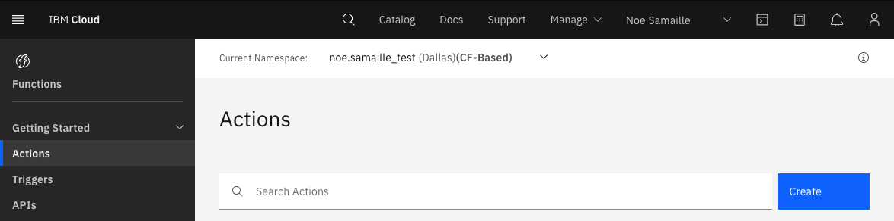
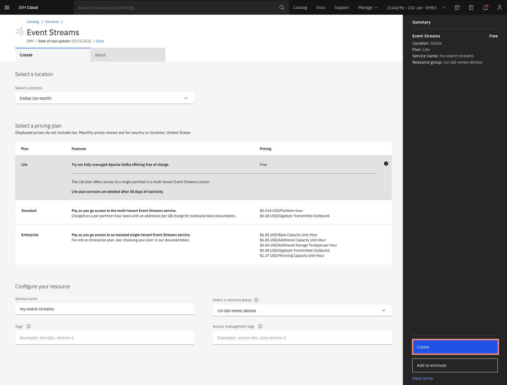
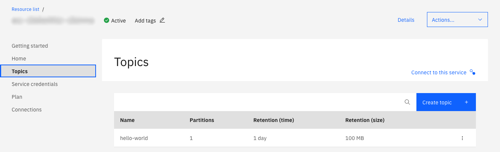
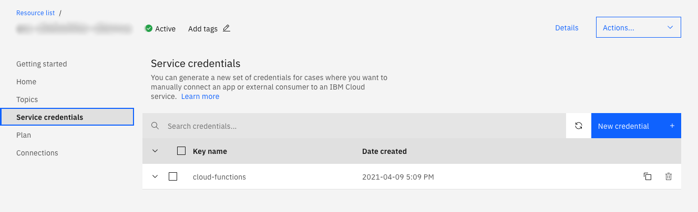

import Globals from 'gatsby-theme-carbon/src/templates/Globals';

<PageDescription>

Simple tutorial for reading IBM Event Streams (using Kafka) messages with IBM 
Cloud Functions Python runtime.

## Prerequisites

- An [IBM Cloud](https://cloud.ibm.com) account.
- [IBM Cloud CLI](https://cloud.ibm.com/docs/cli?topic=cli-getting-started).
- [IBM Cloud Functions CLI](https://cloud.ibm.com/functions/learn/cli).
- Cloud Foundry Organization (in this tutorial, I'll use `noe.samaille`).
- Cloud Foundry Space (in this tutorial, I'll use is `test`).

## Log in to IBM Cloud using CLI

- Log in locally to your IBM Cloud account using the CLI:
    ```
    ibmcloud login
    ```
- Select your region (in this example I'll create resources in the `us-south` region):
    ```
    ibmcloud target -r us-south
    ```
- Select your resource group (in this example I'll use `default`):
    ```
    ibmcloud target -g default
    ```
- Select your Cloud Foundry org and space (in this example I'll use `noe.samaille` org and `test` space):
    ```
    ibmcloud target --cf
    ```

## Create you action

Create an [IBM Cloud Functions Action](https://cloud.ibm.com/functions/actions) called `process-message`, that uses the **Python** runtime:



Click **Create** and put this sample code inside:
```python
def main(dict):
    messages = dict.get('messages')

    if messages is None or messages[0] is None:
        return { 'error': "Invalid arguments. Must include 'messages' JSON array" }
    try:
        val = messages[0]['value']
    except KeyError:
        return { 'error': "Invalid arguments. Must include 'messages' JSON array" }

    for i in range(0, len(messages)):
        msg = messages[i]
        print('Message received:', msg['value'])

    return { 'messages': messages }
```

## Provision IBM Event Streams

- Provision an [IBM Event Streams](https://cloud.ibm.com/catalog/services/event-streams) instance. In this tutorial I'll call IBM Event Streams service instance `my-event-streams`:



- Create a topic called `hello-world`:



- Create service credentials called `cloud-function`:



## Binding the `/whisk.system/messaging` package to your Event Streams instance

More information in the [documentation](https://cloud.ibm.com/docs/openwhisk?topic=openwhisk-pkg_event_streams#event_streams_binding):

- Create a `/whisk.system/messaging` package binding that is configured for your Event Streams account. In this example, the package name is `MyEventStreamBind`.
    ```sh
    ibmcloud fn package bind /whisk.system/messaging MyEventStreamBind
    ```
- Verify that the package binding exists.
    ```sh
    ibmcloud fn package list
    ```
- Get the name of the service instance that you want to bind to an action or package.
    ```sh
    ibmcloud resource service-instances
    ```
- Get the name of the credentials that are defined for the service instance you got in the previous step.
    ```sh
    ibmcloud resource service-keys --instance-name my-event-streams
    ```
- Bind the service to the package that you created in the first step. In the example, this package is called `MyEventStreamBind`.
    ```sh
    ibmcloud fn service bind messagehub MyEventStreamBind --instance my-event-streams --keyname cloud-functions
    ```
- Verify that the credentials are successfully bound.
    ```sh
    ibmcloud fn package get MyEventStreamBind parameters
    ```
- Create a trigger that is fired when new messages are posted to your Event Streams topic.
    ```sh
    ibmcloud fn trigger create MyMessageHubTrigger -f /noe.samaille_test/MyEventStreamBind/MyEventStreamBind/messageHubFeed -p topic hello-world
    ```
- Create a trigger that is fired when new messages are posted to your Event Streams topic.
    ```sh
    ibmcloud fn trigger create MyMessageHubTrigger -f /noe.samaille_test/MyEventStreamBind/MyEventStreamBind/messageHubFeed -p topic hello-world
    ```

## Connect your action to the trigger

On [IBM Cloud Functions Triggers](https://cloud.ibm.com/functions/triggers), click your newly created trigger `MyMessageHubTrigger`, then in **Connected Actions** click **Add** and select your existing `process-message` action.

## Test it out

Now let's try that our action is triggered by a new message on topic `hello-world`. Open 2 separate terminals for the next steps.

On **terminal 1**:
```sh
ibmcloud fn activation poll
```

On **terminal 2**:
- Clone event streams sample python client:
    ```sh
    git clone https://github.com/ibm-messaging/event-streams-samples
    cd event-streams-samples/kafka-python-console-sample
    ```
- In `event-streams-samples/kafka-python-console-sample/app.py`, replace:
    ```python
    self.topic_name = 'kafka-python-console-sample-topic'
    ```
    With:
    ```python
    self.topic_name = 'hello-world'
    ```
- Run producer (check [how to set up environment config](https://github.com/ibm-messaging/event-streams-samples/blob/master/kafka-python-console-sample/docs/Local.md)):
    ```sh
    export KAFKA_BROKERS=<KAFKA_BROKERS>
    export KAFKA_ADMIN_URL=<KAFKA_ADMIN_URL>
    export KAFKA_APIKEY=<KAFKA_APIKEY>
    python3 app.py $KAFKA_BROKERS $KAFKA_ADMIN_URL $KAFKA_APIKEY ../../certs.pem -producer
    ```

You should now see the activations logged on **terminal 1** window:

```sh
❯ ibmcloud fn activation poll
Enter Ctrl-c to exit.
Polling for activation logs
... output ommited ...
Activation: 'process-message' (bd0424b7a8a74a538424b7a8a74a530d)
[
    "2021-04-13T14:55:27.155459Z    stdout: Message received: This is a test message #0",
    "2021-04-13T14:55:27.155506Z    stdout: Message received: This is a test message #1",
    "2021-04-13T14:55:27.155511Z    stdout: Message received: This is a test message #2"
]
... output ommited ...
Activation: 'process-message' (e1e3c7533d70405ba3c7533d70b05b95)
[
    "2021-04-13T14:55:31.063744Z    stdout: Message received: This is a test message #4"
]
... output ommited ...
Activation: 'process-message' (76e9ac7d375e49c7a9ac7d375e69c729)
[
    "2021-04-13T14:55:33.050174Z    stdout: Message received: This is a test message #5"
]
... output ommited ...
```

</PageDescription>

## **Overview**

