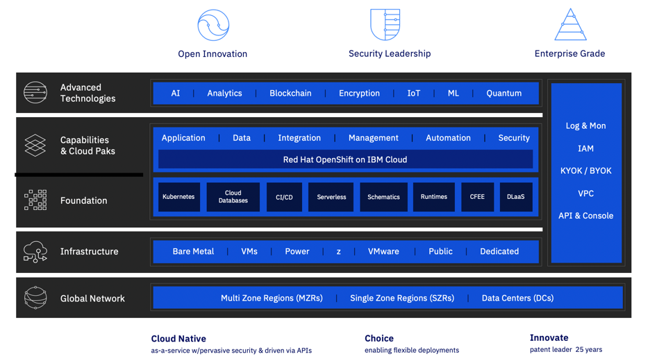

import VideoTile from 'gatsby-theme-carbon/src/templates/VideoTile';

## IBM Cloud Foundation Skills Series Videos

The following videos help enable you to get familiar with the foundation of the IBM Cloud Platform

The foundation series has been created by James Belton, IBM Cloud Adoption Leader.

To access the videos navigate the video sub category in the menu and you will see a video tile. Select the
tile and it will display the video you have selected to watch. The video is displayed in the same browser sessions, this
 makes it easy to navigate through a selection of videos. To remove the playing video click outside of the video area on the page and it will be removed from display.
